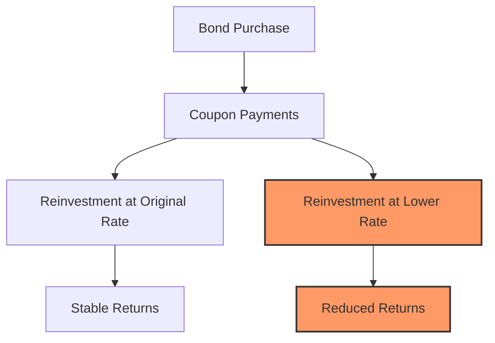

## 7.8 Reinvestment Risk

Reinvestment risk is a critical concept in the realm of fixed-income securities, particularly for investors who rely on the steady income stream provided by bonds. This section delves into the intricacies of reinvestment risk, its implications for bond yields and returns, and strategies to mitigate its impact, with a focus on the Canadian financial landscape.

### Understanding Reinvestment Risk

**Reinvestment Risk** is the risk that the cash flows received from an investment, such as coupon payments from a bond, will have to be reinvested at a lower interest rate than the rate at which the original investment was made. This risk is particularly pertinent in a declining interest rate environment, where the returns on reinvested funds may be significantly lower than anticipated.

#### Impact on Bond Yields and Returns

Reinvestment risk can have a profound impact on the overall yield and return of a bond investment. When interest rates fall, the coupons received from bonds may need to be reinvested at these lower rates, reducing the effective yield of the bond portfolio. This is especially relevant for long-term bonds, where the duration of reinvestment is extended, increasing the exposure to fluctuating interest rates.

Consider a Canadian investor holding a 10-year Government of Canada bond with a 4% coupon rate. If interest rates drop to 2% over the bond's life, the investor will have to reinvest the coupon payments at this lower rate, diminishing the overall return on the investment.

### How Changes in Interest Rates Affect Reinvestment

Interest rates play a pivotal role in determining the reinvestment rate of coupon payments. In a rising interest rate environment, reinvestment risk is minimized as investors can reinvest at higher rates, potentially increasing their returns. Conversely, in a falling interest rate environment, reinvestment risk becomes more pronounced as the reinvestment opportunities are limited to lower rates.

#### Example: Canadian Context

Let's illustrate this with a practical example involving a Canadian corporate bond. Suppose an investor holds a 5-year corporate bond with a 3% coupon rate. If the Bank of Canada decides to lower interest rates due to economic conditions, the investor might face a scenario where the reinvestment rate for the bond's coupon payments is only 1.5%. This reduction in reinvestment rate directly affects the bond's yield to maturity (YTM), potentially lowering the investor's expected returns.

### Strategies to Mitigate Reinvestment Risk

Investors can employ several strategies to mitigate reinvestment risk, ensuring that their bond portfolios remain resilient in varying interest rate environments.

#### 1. Laddering Strategy

A bond ladder involves purchasing bonds with staggered maturities. This strategy allows investors to reinvest maturing bonds at prevailing interest rates, thereby reducing the impact of reinvestment risk. For example, a Canadian investor might construct a bond ladder with maturities ranging from 1 to 10 years, ensuring that a portion of the portfolio matures each year and can be reinvested at current rates.

#### 2. Bullet Strategy

The bullet strategy involves concentrating bond maturities around a specific date, minimizing the need for reinvestment during periods of low interest rates. This approach is beneficial when an investor anticipates a rise in interest rates in the future. By timing the maturities, the investor can avoid reinvesting at lower rates.

#### 3. Barbell Strategy

The barbell strategy combines short-term and long-term bonds, allowing investors to benefit from higher yields on long-term bonds while maintaining liquidity with short-term bonds. This strategy provides flexibility in reinvestment, as short-term bonds mature more frequently and can be reinvested at prevailing rates.

#### 4. Use of Floating Rate Bonds

Floating rate bonds have coupon payments that adjust with changes in interest rates, thereby reducing reinvestment risk. These bonds are particularly useful in a rising interest rate environment, as the coupon payments increase with the rates, providing a natural hedge against reinvestment risk.

### Practical Example: Canadian Pension Funds

Canadian pension funds often employ these strategies to manage reinvestment risk effectively. For instance, the Canada Pension Plan Investment Board (CPPIB) might use a combination of laddering and barbell strategies to ensure that their bond portfolios are optimized for varying interest rate scenarios. By diversifying maturities and incorporating floating rate instruments, these funds can maintain stable returns despite fluctuations in interest rates.

### Visualizing Reinvestment Risk

Below is a diagram illustrating the impact of reinvestment risk on a bond portfolio over time, highlighting the difference between a stable interest rate environment and a declining interest rate environment.

### References and Further Exploration

For those interested in exploring reinvestment strategies further, the [Bank of Canada: Reinvestment Strategies](https://www.bankofcanada.ca/markets/reinvestment-strategies/) provides valuable insights into managing reinvestment risk. Additionally, the book *Fixed Income Securities* by Bruce Tuckman and Angel Serrat offers an in-depth analysis of fixed-income markets and strategies.

### Conclusion

Reinvestment risk is an inherent aspect of fixed-income investing, particularly in the context of bonds. By understanding its implications and employing strategic measures, investors can mitigate its impact and optimize their portfolios for varying interest rate environments. As the Canadian financial landscape continues to evolve, staying informed and adaptable remains crucial for achieving long-term investment success.

### **Ready to Test Your Knowledge?**

**Practice 10 Essential CSC Exam Questions to Master Your Certification**



### What is reinvestment risk?

- [x] The risk that future coupon payments will have to be reinvested at lower interest rates than the original bond.
- [ ] The risk of losing the principal amount invested in a bond.
- [ ] The risk of interest rates rising, causing bond prices to fall.
- [ ] The risk of a bond issuer defaulting on payments.

> **Explanation:** Reinvestment risk refers to the possibility that future coupon payments will need to be reinvested at lower rates, affecting overall returns.

### How does a falling interest rate environment affect reinvestment risk?

- [x] It increases reinvestment risk as coupon payments are reinvested at lower rates.
- [ ] It decreases reinvestment risk as coupon payments are reinvested at higher rates.
- [ ] It has no effect on reinvestment risk.
- [ ] It eliminates reinvestment risk entirely.

> **Explanation:** In a falling interest rate environment, reinvestment risk increases because the reinvestment opportunities are at lower rates than the original bond.

### Which strategy involves purchasing bonds with staggered maturities?

- [x] Laddering Strategy
- [ ] Bullet Strategy
- [ ] Barbell Strategy
- [ ] Floating Rate Bonds

> **Explanation:** The laddering strategy involves buying bonds with different maturities to spread out reinvestment over time.

### What is a key benefit of using floating rate bonds?

- [x] They adjust coupon payments with changes in interest rates, reducing reinvestment risk.
- [ ] They provide fixed returns regardless of interest rate changes.
- [ ] They eliminate the need for reinvestment.
- [ ] They offer the highest yields in all market conditions.

> **Explanation:** Floating rate bonds adjust their coupon payments with interest rate changes, providing a hedge against reinvestment risk.

### Which strategy combines short-term and long-term bonds?

- [x] Barbell Strategy
- [ ] Laddering Strategy
- [ ] Bullet Strategy
- [ ] Floating Rate Bonds

> **Explanation:** The barbell strategy uses a mix of short-term and long-term bonds to balance yield and liquidity.

### What happens to bond yields when interest rates fall?

- [x] Bond yields decrease as reinvestment rates are lower.
- [ ] Bond yields increase as reinvestment rates are higher.
- [ ] Bond yields remain unchanged.
- [ ] Bond yields become unpredictable.

> **Explanation:** When interest rates fall, reinvestment rates are lower, leading to decreased bond yields.

### How can a bullet strategy help in managing reinvestment risk?

- [x] By concentrating bond maturities around a specific date, minimizing reinvestment during low-rate periods.
- [ ] By spreading bond maturities evenly over time.
- [ ] By investing only in short-term bonds.
- [ ] By avoiding reinvestment altogether.

> **Explanation:** The bullet strategy minimizes reinvestment during low-rate periods by concentrating maturities around a specific date.

### What is the primary focus of a laddering strategy?

- [x] To stagger bond maturities and reduce reinvestment risk.
- [ ] To concentrate bond maturities at a single point in time.
- [ ] To invest exclusively in floating rate bonds.
- [ ] To maximize returns through high-risk investments.

> **Explanation:** Laddering staggers bond maturities to spread reinvestment over time, reducing risk.

### Why might Canadian pension funds use a barbell strategy?

- [x] To balance yield and liquidity by combining short-term and long-term bonds.
- [ ] To focus solely on short-term bonds for quick returns.
- [ ] To avoid reinvestment risk by holding only cash.
- [ ] To invest exclusively in equities.

> **Explanation:** The barbell strategy balances yield and liquidity, making it suitable for pension funds managing long-term liabilities.

### True or False: Reinvestment risk is eliminated in a rising interest rate environment.

- [ ] True
- [x] False

> **Explanation:** While reinvestment risk is reduced in a rising interest rate environment, it is not eliminated, as future rate changes are unpredictable.


