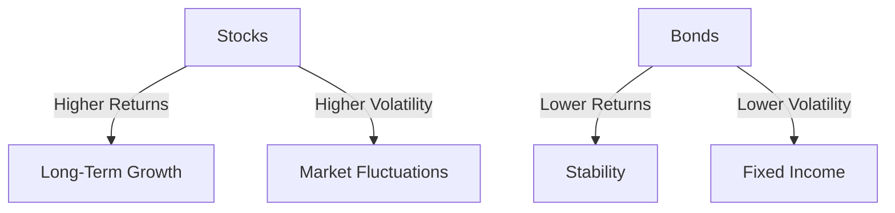

## 8.1 Introduction to Equity Securities

Equity securities are a cornerstone of modern investment strategies, offering investors a stake in the ownership of a company. This section delves into the intricacies of equity securities, focusing on common and preferred shares, their significance in investment portfolios, and their historical performance compared to other financial instruments like bonds. We will also explore the role of stock market indexes in tracking and analyzing market trends.

### Understanding Equity Securities

**Equity Securities** are financial instruments that signify ownership in a company. When you purchase equity securities, you are essentially buying a piece of the company, which entitles you to a share of its profits and, in some cases, voting rights in corporate decisions. Equity securities are broadly categorized into two types: common shares and preferred shares.

#### Common Shares

Common shares represent the most prevalent form of equity ownership in a company. Holders of common shares have voting rights, which allow them to influence corporate policy and decisions at annual general meetings. Additionally, common shareholders may receive dividends, which are distributions of a company's profits. However, these dividends are not guaranteed and can fluctuate based on the company's performance.

#### Preferred Shares

Preferred shares, on the other hand, offer a different set of benefits. While they typically do not provide voting rights, preferred shareholders receive dividends at a fixed rate and have a higher claim on assets than common shareholders in the event of liquidation. This makes preferred shares a hybrid between equity and fixed-income securities, appealing to investors seeking a steady income stream.

### The Importance of Equity Securities in Investment Portfolios

Equity securities play a vital role in diversifying investment portfolios. They provide the potential for capital appreciation and dividend income, which can enhance overall portfolio returns. By including a mix of common and preferred shares, investors can balance growth potential with income stability.

In the Canadian context, equity securities are integral to retirement savings plans such as Registered Retirement Savings Plans (RRSPs) and Tax-Free Savings Accounts (TFSAs). These instruments allow Canadians to invest in equities while benefiting from tax advantages, thereby maximizing their long-term savings potential.

### Historical Performance of Stocks vs. Bonds

Historically, stocks have outperformed bonds over the long term, offering higher returns but with greater volatility. This performance differential is due to the inherent risk associated with equity investments, as they are subject to market fluctuations and economic cycles.

Consider the following historical comparison:

This diagram illustrates the trade-off between the higher potential returns of stocks and the stability of bonds. Investors must weigh these factors when constructing their portfolios, considering their risk tolerance and investment horizon.

### The Role of Stock Market Indexes

Stock market indexes are essential tools for tracking the performance of equity markets. They provide a benchmark against which investors can measure the performance of their portfolios. In Canada, key indexes include the S&P/TSX Composite Index, which tracks the performance of the largest companies listed on the Toronto Stock Exchange.

Indexes serve several purposes:

- **Performance Benchmarking:** Investors use indexes to compare the performance of their portfolios against the broader market.
- **Market Analysis:** Analysts and economists use indexes to gauge market trends and economic health.
- **Investment Products:** Indexes form the basis for various investment products, such as index funds and exchange-traded funds (ETFs), which allow investors to gain diversified exposure to the market.

### Glossary

- **Equity Securities:** Financial instruments that represent ownership in a company.
- **Investment Portfolio:** A collection of investments held by an individual or institution.

### References and Further Exploration

For those interested in deepening their understanding of equity securities and their role in investment strategies, consider exploring the following resources:

- *Equity Asset Management* by Frank J. Fabozzi
- [InvestSmart - Canadian Securities Institute](https://www.csi.ca/en/learn)

These resources provide comprehensive insights into equity asset management and the Canadian securities landscape, offering valuable knowledge for both novice and experienced investors.

### **Ready to Test Your Knowledge?**

**Practice 10 Essential CSC Exam Questions to Master Your Certification**



### What are equity securities?

- [x] Financial instruments that represent ownership in a company.
- [ ] Financial instruments that represent debt in a company.
- [ ] Financial instruments that represent a loan to a company.
- [ ] Financial instruments that represent a lease agreement.

> **Explanation:** Equity securities represent ownership in a company, entitling the holder to a share of the company's profits and, in some cases, voting rights.

### Which of the following is a characteristic of common shares?

- [x] They typically come with voting rights.
- [ ] They guarantee a fixed dividend.
- [ ] They have a higher claim on assets than preferred shares.
- [ ] They are a form of debt security.

> **Explanation:** Common shares usually come with voting rights, allowing shareholders to influence corporate decisions.

### What is a key feature of preferred shares?

- [x] They provide a fixed dividend.
- [ ] They offer voting rights.
- [ ] They guarantee capital appreciation.
- [ ] They are exempt from market fluctuations.

> **Explanation:** Preferred shares typically provide a fixed dividend, making them appealing to investors seeking steady income.

### How do stocks generally compare to bonds in terms of historical performance?

- [x] Stocks have higher returns but greater volatility.
- [ ] Stocks have lower returns and lower volatility.
- [ ] Stocks have higher returns and lower volatility.
- [ ] Stocks have lower returns but greater volatility.

> **Explanation:** Historically, stocks have offered higher returns than bonds, but with greater volatility due to market fluctuations.

### What is the purpose of stock market indexes?

- [x] To track the performance of equity markets.
- [ ] To determine interest rates.
- [x] To provide benchmarks for portfolio performance.
- [ ] To regulate stock prices.

> **Explanation:** Stock market indexes track the performance of equity markets and provide benchmarks for evaluating portfolio performance.

### Which index is a key benchmark in the Canadian market?

- [x] S&P/TSX Composite Index
- [ ] Dow Jones Industrial Average
- [ ] NASDAQ Composite Index
- [ ] FTSE 100 Index

> **Explanation:** The S&P/TSX Composite Index is a key benchmark for the Canadian equity market, tracking the performance of the largest companies listed on the Toronto Stock Exchange.

### What is a benefit of including equity securities in an investment portfolio?

- [x] Potential for capital appreciation.
- [ ] Guaranteed returns.
- [x] Dividend income.
- [ ] Immunity from market risk.

> **Explanation:** Equity securities offer the potential for capital appreciation and dividend income, enhancing portfolio returns.

### What is a common use of stock market indexes?

- [x] Performance benchmarking.
- [ ] Setting corporate tax rates.
- [ ] Determining inflation rates.
- [ ] Issuing government bonds.

> **Explanation:** Stock market indexes are commonly used for performance benchmarking, allowing investors to compare their portfolio returns against the market.

### What is the relationship between risk and return in equity securities?

- [x] Higher risk is associated with higher potential returns.
- [ ] Higher risk is associated with lower potential returns.
- [ ] Lower risk is associated with higher potential returns.
- [ ] Risk and return are unrelated.

> **Explanation:** In equity securities, higher risk is typically associated with higher potential returns, reflecting the volatility of the market.

### True or False: Preferred shares usually come with voting rights.

- [ ] True
- [x] False

> **Explanation:** Preferred shares typically do not come with voting rights, unlike common shares, which often do.


