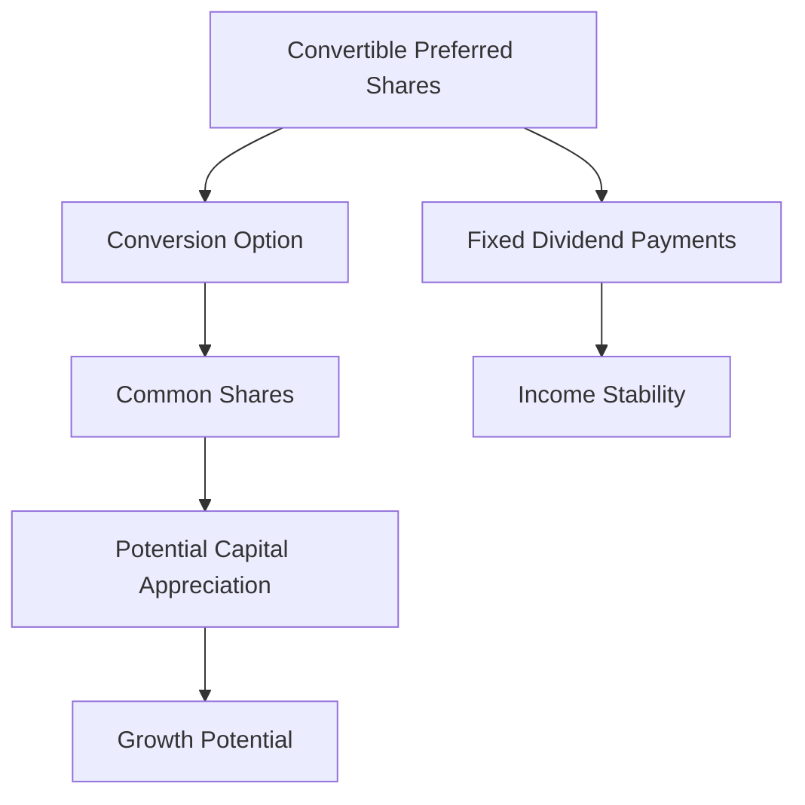

## 8.15 Convertible Preferred Shares

Convertible preferred shares are a unique financial instrument that combines features of both bonds and equity, offering a hybrid investment vehicle that can appeal to a wide range of investors. Understanding the intricacies of convertible preferred shares is essential for anyone involved in the Canadian financial markets, whether as an investor, financial advisor, or corporate issuer.

### Understanding Convertible Preferred Shares

**Convertible Preferred Shares** are a type of preferred stock that provides the holder with the option to convert their shares into a predetermined number of common shares, usually at a specified **conversion price**. This conversion feature adds a layer of flexibility and potential upside, making them an attractive option for investors seeking both income and growth potential.

#### Features of Convertible Preferred Shares

1. **Fixed Dividend Payments**: Like traditional preferred shares, convertible preferreds typically offer fixed dividend payments, providing a steady income stream similar to bonds.

2. **Conversion Option**: The key feature that distinguishes convertible preferred shares is the conversion option, allowing holders to convert their shares into common stock. This option can be exercised under specific conditions, often at the discretion of the shareholder.

3. **Conversion Price**: The conversion price is the predetermined price at which the preferred shares can be converted into common shares. This price is set at the time of issuance and plays a crucial role in determining the attractiveness of the conversion option.

4. **Priority in Liquidation**: Convertible preferred shareholders have a higher claim on assets than common shareholders in the event of liquidation, providing an additional layer of security.

### Advantages and Disadvantages

#### For Investors

**Advantages:**

- **Income and Growth Potential**: Investors benefit from fixed dividend payments and the potential for capital appreciation if the common stock price exceeds the conversion price.
- **Downside Protection**: The fixed income component offers some protection against market volatility, while the conversion option provides upside potential.
- **Priority in Liquidation**: Convertible preferred shares have a higher claim on assets than common shares, offering more security in the event of bankruptcy.

**Disadvantages:**

- **Limited Voting Rights**: Like most preferred shares, convertible preferreds typically do not carry voting rights, limiting investor influence over corporate decisions.
- **Interest Rate Sensitivity**: The fixed dividend payments make these shares sensitive to interest rate changes, potentially affecting their market value.
- **Conversion Risk**: If the common stock does not perform well, the conversion option may not be advantageous, limiting the potential for capital gains.

#### For Issuers

**Advantages:**

- **Attractive Financing Option**: Issuing convertible preferred shares can be an attractive way to raise capital without immediately diluting common equity.
- **Flexibility**: The conversion feature can make these shares more appealing to investors, potentially reducing the cost of capital.

**Disadvantages:**

- **Potential Dilution**: If many investors choose to convert their shares, it can lead to dilution of existing common shareholders.
- **Dividend Obligations**: Issuers are obligated to pay dividends on preferred shares, which can be a financial burden if the company faces cash flow challenges.

### Real-World Examples in the Canadian Market

Several Canadian companies have issued convertible preferred shares, providing practical examples of how these instruments function in the market. For instance, major Canadian banks like RBC and TD have utilized convertible preferred shares as part of their capital structure to balance debt and equity financing.

Consider a scenario where a Canadian energy company issues convertible preferred shares with a conversion price set at $50. If the company's common stock rises to $60, investors may choose to convert their preferred shares to capitalize on the stock's appreciation, thus benefiting from both the fixed dividends received and the capital gains from conversion.

### Practical Application and Strategy

Investors considering convertible preferred shares should evaluate the conversion price relative to the current and projected performance of the underlying common stock. Additionally, understanding the terms of conversion and the company's financial health is crucial for making informed investment decisions.

### Diagrams and Visuals

To better understand the conversion process and the relationship between convertible preferred shares and common stock, consider the following diagram:

### Best Practices and Common Pitfalls

**Best Practices:**

- **Thorough Analysis**: Conduct a comprehensive analysis of the issuing company's financial health and market conditions before investing.
- **Diversification**: Incorporate convertible preferred shares as part of a diversified portfolio to balance risk and return.

**Common Pitfalls:**

- **Ignoring Conversion Terms**: Failing to understand the conversion terms can lead to missed opportunities or unexpected outcomes.
- **Overlooking Market Conditions**: Market volatility and interest rate changes can significantly impact the value of convertible preferred shares.

### References and Further Reading

For more detailed information on convertible preferred shares, consider exploring the following resources:

- [Investopedia: Convertible Preferred Shares](https://www.investopedia.com/terms/c/convertiblepreferredshare.asp)
- [TMX Group - Convertible Preferred Shares](https://www.tmx.com/convertible-preferred-shares)

### Conclusion

Convertible preferred shares offer a unique blend of income and growth potential, making them a versatile tool for both investors and issuers. By understanding their features, advantages, and potential drawbacks, investors can make informed decisions that align with their financial goals and risk tolerance.

### **Ready to Test Your Knowledge?**

**Practice 10 Essential CSC Exam Questions to Master Your Certification**



### What are convertible preferred shares?

- [x] Preferred shares that can be converted into a specified number of common shares under certain conditions.
- [ ] Common shares that can be converted into preferred shares.
- [ ] Bonds that can be converted into preferred shares.
- [ ] Preferred shares that cannot be converted into any other type of shares.

> **Explanation:** Convertible preferred shares are a type of preferred stock that can be converted into a specified number of common shares under certain conditions.

### What is the conversion price?

- [x] The predetermined price at which convertible shares can be converted into common shares.
- [ ] The market price of the common shares at the time of conversion.
- [ ] The price at which preferred shares are initially issued.
- [ ] The price at which common shares are sold in the market.

> **Explanation:** The conversion price is the predetermined price at which convertible shares can be converted into common shares, set at the time of issuance.

### Which of the following is an advantage of convertible preferred shares for investors?

- [x] Income and growth potential.
- [ ] Unlimited voting rights.
- [ ] Guaranteed capital gains.
- [ ] Immunity to market volatility.

> **Explanation:** Convertible preferred shares offer income through fixed dividends and growth potential through the conversion option, but they do not provide voting rights or guaranteed capital gains.

### What is a potential disadvantage for issuers of convertible preferred shares?

- [x] Potential dilution of existing common shareholders.
- [ ] Increased voting rights for investors.
- [ ] Decreased flexibility in financing.
- [ ] Reduced dividend obligations.

> **Explanation:** If many investors convert their shares, it can lead to dilution of existing common shareholders.

### How do convertible preferred shares provide downside protection?

- [x] Through fixed dividend payments.
- [ ] By offering unlimited voting rights.
- [x] By having a higher claim on assets than common shares.
- [ ] By guaranteeing capital gains.

> **Explanation:** Convertible preferred shares provide downside protection through fixed dividend payments and a higher claim on assets than common shares.

### What should investors consider when evaluating convertible preferred shares?

- [x] The conversion price relative to the common stock's performance.
- [ ] The number of voting rights associated with the shares.
- [ ] The guaranteed capital gains.
- [ ] The issuer's dividend history.

> **Explanation:** Investors should evaluate the conversion price relative to the current and projected performance of the underlying common stock.

### Which Canadian financial institution is known for issuing convertible preferred shares?

- [x] RBC
- [ ] Amazon
- [x] TD
- [ ] Google

> **Explanation:** Major Canadian banks like RBC and TD have utilized convertible preferred shares as part of their capital structure.

### What is a common pitfall when investing in convertible preferred shares?

- [x] Ignoring conversion terms.
- [ ] Overanalyzing market conditions.
- [ ] Focusing solely on voting rights.
- [ ] Avoiding diversified portfolios.

> **Explanation:** Ignoring conversion terms can lead to missed opportunities or unexpected outcomes.

### What is a best practice for investing in convertible preferred shares?

- [x] Conducting a thorough analysis of the issuing company's financial health.
- [ ] Investing solely based on market trends.
- [ ] Ignoring the conversion price.
- [ ] Focusing only on dividend yield.

> **Explanation:** Conducting a thorough analysis of the issuing company's financial health and market conditions is a best practice.

### Convertible preferred shares offer both income and growth potential.

- [x] True
- [ ] False

> **Explanation:** Convertible preferred shares offer income through fixed dividends and growth potential through the conversion option.


