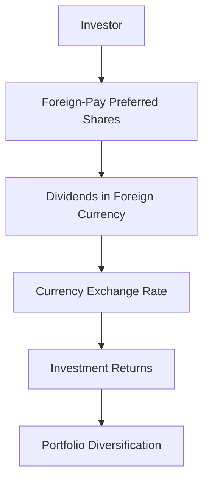

## 8.18 Foreign-Pay Preferred Shares

Foreign-pay preferred shares are a unique class of preferred shares that offer dividends paid in a foreign currency or are tied to foreign currency metrics. These financial instruments can provide Canadian investors with opportunities for enhanced returns and diversification, but they also introduce specific risks, particularly related to currency fluctuations. In this section, we will delve into the characteristics, advantages, and risks of foreign-pay preferred shares, and explore how they can be effectively utilized in a diversified investment portfolio.

### Understanding Foreign-Pay Preferred Shares

Foreign-pay preferred shares are similar to traditional preferred shares in that they represent a class of ownership in a corporation with a fixed dividend. However, the key distinction lies in the currency in which dividends are paid. For foreign-pay preferreds, dividends are either paid in a foreign currency or are linked to foreign currency exchange rates. This feature can be attractive to investors seeking exposure to foreign markets or currencies.

#### Advantages of Foreign-Pay Preferred Shares

1. **Currency Diversification**: By receiving dividends in a foreign currency, investors can gain exposure to currency movements, which can be beneficial if the foreign currency appreciates against the Canadian dollar.

2. **Potential for Higher Yields**: Foreign-pay preferred shares may offer higher yields compared to domestic preferred shares, especially in markets where interest rates are higher than in Canada.

3. **Access to Global Markets**: These shares provide Canadian investors with access to international markets, potentially offering opportunities for growth that are not available domestically.

4. **Inflation Hedge**: In some cases, foreign currencies may provide a hedge against inflation, particularly if the foreign economy is experiencing lower inflation rates than Canada.

### Currency Risk in Foreign-Pay Preferred Shares

While foreign-pay preferred shares offer several advantages, they also introduce currency risk, which is the risk of loss from fluctuations in exchange rates. This risk can impact the value of dividends received and the overall return on investment. 

#### Managing Currency Risk

1. **Hedging Strategies**: Investors can use hedging strategies, such as currency futures or options, to mitigate currency risk. These financial instruments allow investors to lock in exchange rates, reducing the impact of currency fluctuations.

2. **Diversification**: By diversifying investments across multiple currencies, investors can reduce the impact of adverse currency movements in any single currency.

3. **Monitoring Economic Indicators**: Keeping an eye on economic indicators and geopolitical events can help investors anticipate currency movements and adjust their portfolios accordingly.

### Foreign-Pay Preferred Shares for Portfolio Diversification

Incorporating foreign-pay preferred shares into a portfolio can enhance diversification, providing exposure to different economic environments and currency dynamics. This diversification can help reduce overall portfolio risk and improve potential returns.

#### Practical Example: Canadian Pension Funds

Canadian pension funds often utilize foreign-pay preferred shares as part of their investment strategy to achieve diversification. By investing in foreign markets, these funds can access a broader range of opportunities and potentially enhance returns while managing risk through careful currency management.

#### Case Study: Major Canadian Banks

Major Canadian banks, such as RBC and TD, may issue foreign-pay preferred shares to attract international investors and diversify their capital base. These shares can be an attractive option for investors seeking exposure to the financial sector in different currencies.

### Visualizing Currency Risk and Diversification

Below is a simple diagram illustrating the flow of dividends in foreign-pay preferred shares and the impact of currency risk on investment returns:

### Best Practices and Common Pitfalls

- **Best Practices**: Regularly review and adjust your portfolio to align with changing market conditions and currency dynamics. Consider professional advice for complex hedging strategies.

- **Common Pitfalls**: Ignoring currency risk can lead to significant losses. Over-concentration in a single currency or market can increase vulnerability to adverse movements.

### References and Additional Resources

For further exploration of foreign-pay preferred shares and related topics, consider the following resources:

- [Investopedia: Foreign-Pay Preferred Shares](https://www.investopedia.com/terms/f/foreign-paypreferred.asp)
- [TMX Group - Foreign Preferred Shares](https://www.tmx.com/)

These resources provide additional insights into the mechanics and strategies associated with foreign-pay preferred shares.

### Conclusion

Foreign-pay preferred shares offer Canadian investors a unique opportunity to diversify their portfolios and potentially enhance returns through exposure to foreign currencies and markets. However, they also introduce currency risk, which must be carefully managed. By understanding the advantages and risks, and employing effective strategies, investors can make informed decisions that align with their financial goals.

### **Ready to Test Your Knowledge?**

**Practice 10 Essential CSC Exam Questions to Master Your Certification**



### What are foreign-pay preferred shares?

- [x] Preferred shares with dividends paid in a foreign currency or tied to foreign currency metrics.
- [ ] Preferred shares with dividends paid in Canadian dollars.
- [ ] Common shares with dividends paid in a foreign currency.
- [ ] Bonds with interest paid in a foreign currency.

> **Explanation:** Foreign-pay preferred shares are defined as preferred shares with dividends paid in a foreign currency or tied to foreign currency metrics.

### What is currency risk?

- [x] The risk of loss from fluctuations in exchange rates.
- [ ] The risk of loss from stock market volatility.
- [ ] The risk of loss from interest rate changes.
- [ ] The risk of loss from inflation.

> **Explanation:** Currency risk refers to the risk of loss from fluctuations in exchange rates, which can affect the value of foreign-pay preferred shares.

### How can investors manage currency risk?

- [x] By using hedging strategies such as currency futures or options.
- [ ] By investing only in domestic securities.
- [ ] By ignoring economic indicators.
- [ ] By concentrating investments in a single currency.

> **Explanation:** Investors can manage currency risk by using hedging strategies like currency futures or options to lock in exchange rates.

### What is one advantage of foreign-pay preferred shares?

- [x] They offer potential for higher yields compared to domestic preferred shares.
- [ ] They eliminate currency risk.
- [ ] They guarantee higher returns than common shares.
- [ ] They are not subject to market fluctuations.

> **Explanation:** Foreign-pay preferred shares may offer higher yields compared to domestic preferred shares, especially in markets with higher interest rates.

### Which Canadian financial institutions might issue foreign-pay preferred shares?

- [x] Major Canadian banks like RBC and TD.
- [ ] Only small, local credit unions.
- [ ] Only international banks.
- [ ] Only government institutions.

> **Explanation:** Major Canadian banks, such as RBC and TD, may issue foreign-pay preferred shares to attract international investors.

### What is a common pitfall when investing in foreign-pay preferred shares?

- [x] Ignoring currency risk.
- [ ] Over-diversifying the portfolio.
- [ ] Investing in too many different currencies.
- [ ] Only investing in domestic markets.

> **Explanation:** A common pitfall is ignoring currency risk, which can lead to significant losses if not managed properly.

### How can foreign-pay preferred shares enhance portfolio diversification?

- [x] By providing exposure to different economic environments and currency dynamics.
- [ ] By concentrating investments in a single market.
- [ ] By eliminating all risks associated with foreign investments.
- [ ] By focusing solely on domestic markets.

> **Explanation:** Foreign-pay preferred shares enhance diversification by providing exposure to different economic environments and currency dynamics.

### What is a potential benefit of currency diversification?

- [x] It can reduce the impact of adverse currency movements in any single currency.
- [ ] It guarantees higher returns.
- [ ] It eliminates all investment risks.
- [ ] It focuses investments in one currency.

> **Explanation:** Currency diversification can reduce the impact of adverse currency movements in any single currency, thereby managing risk.

### True or False: Foreign-pay preferred shares are only beneficial for short-term investments.

- [ ] True
- [x] False

> **Explanation:** Foreign-pay preferred shares can be beneficial for both short-term and long-term investments, depending on the investor's strategy and risk management.

### True or False: Monitoring economic indicators can help manage currency risk.

- [x] True
- [ ] False

> **Explanation:** Monitoring economic indicators can help investors anticipate currency movements and adjust their portfolios accordingly to manage currency risk.


