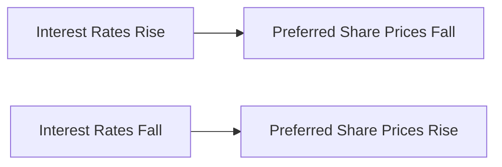

## 8.3.1 Features and Benefits of Preferred Shares

Preferred shares are a unique class of equity securities that offer a blend of features from both stocks and bonds. They are particularly appealing to investors seeking a stable income stream with some level of security. In this section, we will delve into the key features and benefits of preferred shares, providing a comprehensive understanding of their role in investment portfolios, particularly within the Canadian financial landscape.

### Fixed Dividend Payments

One of the most attractive features of preferred shares is their fixed dividend payments. Unlike common shares, which may offer variable dividends based on the company's profitability, preferred shares typically provide a predictable income stream. This makes them an appealing option for income-focused investors, such as retirees or conservative investors seeking steady cash flow.

**Example:** Consider a Canadian utility company, which issues preferred shares with a fixed dividend rate of 5% per annum. An investor holding 1,000 shares priced at $25 each would receive an annual dividend of $1,250, regardless of the company's earnings fluctuations.

### Priority in Dividends and Assets

Preferred shareholders enjoy a higher claim on dividends and assets than common shareholders. In the event of a company's liquidation, preferred shareholders are paid before common shareholders, although they are subordinate to debt holders. This priority provides an added layer of security, making preferred shares a safer investment compared to common shares.

**Case Study:** During the financial crisis of 2008, many companies faced liquidity issues. However, preferred shareholders of major Canadian banks like RBC and TD received their dividends even when common shareholders did not, highlighting the seniority of preferred shares in dividend distribution.

### Tax Advantages

In Canada, dividends received from preferred shares benefit from preferential tax treatment. The dividend tax credit allows Canadian investors to pay less tax on dividend income compared to interest income from bonds or GICs. This tax efficiency enhances the after-tax return on investment, making preferred shares an attractive option for taxable accounts.

**Practical Insight:** For an investor in a high tax bracket, the effective tax rate on dividend income can be significantly lower than on interest income, increasing the net yield of preferred shares.

### Limited Voting Rights

Preferred shares typically come with limited or no voting rights, which distinguishes them from common shares. However, if a company fails to pay dividends for a specified period, preferred shareholders may gain voting rights until the arrears are cleared. This feature reflects the hybrid nature of preferred shares, combining elements of both equity and debt.

**Glossary Term:** *Dividends in Arrears* refer to accumulated unpaid dividends on cumulative preferred shares. If dividends are not paid, they accumulate and must be paid out before any dividends can be distributed to common shareholders.

### No Maturity Date

Unlike bonds, most preferred shares do not have a set maturity date. This perpetual nature means they can provide a long-term income stream without the need for reinvestment upon maturity. However, some preferred shares may be callable, allowing the issuer to repurchase them after a certain period.

**Example:** A Canadian telecommunications company issues perpetual preferred shares, providing investors with ongoing dividends without the concern of reinvestment risk associated with bond maturities.

### Market Sensitivity

The market price of preferred shares is sensitive to changes in interest rates. When interest rates rise, the fixed dividend becomes less attractive, leading to a decline in the market price of preferred shares. Conversely, when interest rates fall, preferred shares become more attractive, and their prices tend to rise.

**Diagram: Interest Rate Impact on Preferred Shares**

**Glossary Term:** *Yield Basis* refers to the valuation of an investment based on its income return relative to its price. For preferred shares, this means assessing the dividend yield in comparison to prevailing interest rates.

### Conclusion

Preferred shares offer a unique blend of features that cater to investors seeking income stability, tax efficiency, and a degree of security. While they lack the growth potential and voting rights of common shares, their fixed dividends and priority in asset claims make them a valuable component of a diversified investment portfolio. Understanding the nuances of preferred shares, including their market sensitivity and tax advantages, can help investors make informed decisions aligned with their financial goals.

### Best Practices and Common Pitfalls

- **Best Practices:** Consider preferred shares as part of a balanced portfolio, particularly for income-focused strategies. Evaluate the creditworthiness of the issuer and the terms of the preferred shares, such as call provisions and cumulative dividends.
- **Common Pitfalls:** Avoid over-reliance on preferred shares for growth. Be mindful of interest rate risk and the potential impact on market prices. Ensure diversification across sectors and issuers to mitigate concentration risk.

### Additional Resources

- **Canadian Securities Administrators (CSA):** [www.securities-administrators.ca](https://www.securities-administrators.ca)
- **Investment Industry Regulatory Organization of Canada (IIROC):** [www.iiroc.ca](https://www.iiroc.ca)
- **Books:** "The Intelligent Investor" by Benjamin Graham for foundational investment principles.

## Quiz Time!



### What is one of the primary benefits of preferred shares?

- [x] Fixed dividend payments
- [ ] High growth potential
- [ ] Unlimited voting rights
- [ ] Guaranteed capital appreciation

> **Explanation:** Preferred shares offer fixed dividend payments, providing predictable income, unlike common shares which may offer variable dividends.

### In the event of a company's liquidation, who gets paid first?

- [ ] Common shareholders
- [x] Preferred shareholders
- [ ] Bondholders
- [ ] Employees

> **Explanation:** Preferred shareholders have priority over common shareholders in dividend distribution and asset claims during liquidation.

### How do preferred shares benefit from tax advantages in Canada?

- [x] Preferential tax treatment of dividends
- [ ] Tax-free capital gains
- [ ] No taxes on interest income
- [ ] Tax deductions on purchase

> **Explanation:** Dividends from preferred shares receive preferential tax treatment in Canada, reducing the effective tax rate compared to interest income.

### What typically happens to preferred shares if dividends are in arrears?

- [ ] They gain additional voting rights
- [x] They may gain voting rights until arrears are cleared
- [ ] They lose all rights
- [ ] They convert to common shares

> **Explanation:** Preferred shares may gain voting rights if dividends are in arrears, providing shareholders with a voice until the issue is resolved.

### Do preferred shares usually have a maturity date?

- [ ] Yes, like bonds
- [x] No, they are often perpetual
- [ ] Yes, but only if specified
- [ ] No, unless they are callable

> **Explanation:** Most preferred shares do not have a maturity date, offering a perpetual income stream, although some may be callable.

### How do interest rate changes affect preferred shares?

- [x] Rising rates decrease their market price
- [ ] Rising rates increase their market price
- [ ] Falling rates decrease their market price
- [ ] Interest rates have no effect

> **Explanation:** Rising interest rates make the fixed dividend of preferred shares less attractive, leading to a decrease in their market price.

### What is the term for accumulated unpaid dividends on cumulative preferred shares?

- [x] Dividends in Arrears
- [ ] Dividend Yield
- [ ] Dividend Credit
- [ ] Dividend Accumulation

> **Explanation:** Dividends in Arrears refer to accumulated unpaid dividends on cumulative preferred shares, which must be paid before common dividends.

### What is a key consideration when investing in preferred shares?

- [x] Interest rate risk
- [ ] Unlimited growth potential
- [ ] Guaranteed returns
- [ ] High liquidity

> **Explanation:** Interest rate risk is a key consideration, as changes in rates can significantly impact the market price of preferred shares.

### Which of the following is NOT a feature of preferred shares?

- [ ] Fixed dividends
- [x] High voting rights
- [ ] Priority in asset claims
- [ ] Tax advantages

> **Explanation:** Preferred shares typically have limited or no voting rights, unlike common shares which may offer voting privileges.

### True or False: Preferred shares are a type of debt security.

- [ ] True
- [x] False

> **Explanation:** Preferred shares are a type of equity security, although they share some characteristics with debt securities, such as fixed income.


