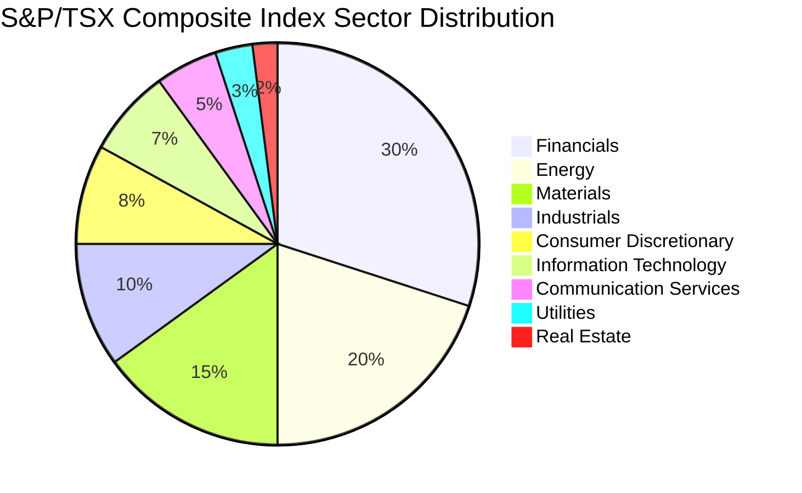

---

linkTitle: "8.4.1 The S&P/TSX Composite Index"
title: "The S&P/TSX Composite Index: Understanding Canada's Leading Equity Benchmark"
description: "Explore the S&P/TSX Composite Index, its composition, industry classification, historical performance, and significance for investors in the Canadian market."
categories:
- Canadian Finance
- Stock Market
- Investment Strategies
tags:
- S&P/TSX Composite Index
- Market Capitalization
- GICS
- Canadian Stocks
- Equity Benchmark
date: 2024-10-25
type: docs
nav_weight: 841000
---

## 8.4.1 The S&P/TSX Composite Index

The S&P/TSX Composite Index is the premier benchmark for Canadian equity markets, representing the performance of the largest companies listed on the Toronto Stock Exchange (TSX). As a critical tool for investors, it provides insights into the health and trends of the Canadian economy. This section delves into the components, industry classification, historical performance, and significance of the S&P/TSX Composite Index, offering a comprehensive understanding for finance professionals and students alike.

### Components and Weighting

The S&P/TSX Composite Index is composed based on market capitalization, which is the total market value of a company's outstanding shares. This method ensures that larger companies have a more significant impact on the index's movements. The index includes a diverse range of sectors, reflecting the broad spectrum of the Canadian economy.

#### Float-Adjustment Methodology

The float-adjustment methodology is crucial for enhancing the accuracy of the index. It adjusts the market capitalization of each company by excluding shares that are not available for public trading, such as those held by insiders or governments. This approach provides a more realistic representation of the market's investable portion, ensuring that the index reflects the true market dynamics.

### Industry Classification

The Global Industry Classification Standard (GICS) is employed to categorize stocks within the S&P/TSX Composite Index. GICS divides the market into 11 sectors, 24 industry groups, 69 industries, and 158 sub-industries. This classification helps investors understand the distribution of sectors within the index and their influence on its performance.

#### Sector Distribution

The S&P/TSX Composite Index is heavily weighted towards certain sectors, such as Financials, Energy, and Materials, which are pivotal to the Canadian economy. The Financials sector, including major banks like RBC and TD, often has the largest representation. Understanding sector distribution is vital for investors to assess the index's sensitivity to economic changes.

### Historical Performance

Analyzing the historical performance of the S&P/TSX Composite Index reveals its correlation with economic events. For instance, the index experienced significant fluctuations during the 2008 financial crisis and the COVID-19 pandemic. By studying these trends, investors can gain insights into how external factors impact the Canadian equity market.

### Criteria for Inclusion

To be included in the S&P/TSX Composite Index, a stock must meet specific eligibility requirements. These include minimum market capitalization, liquidity criteria, and a listing on the TSX. The index is reviewed quarterly to ensure it accurately represents the Canadian market, with adjustments made to include or exclude stocks based on these criteria.

### Significance for Investors

The S&P/TSX Composite Index serves as a benchmark for Canadian equity performance, providing a standard against which investors can measure their portfolios. It is widely used by mutual funds, pension funds, and individual investors to gauge market trends and make informed investment decisions. Understanding the index's composition and performance is essential for developing effective investment strategies.

### Glossary

- **GICS (Global Industry Classification Standard):** A system for categorizing companies into sectors based on their business activities.

### Practical Example: Canadian Pension Fund Strategy

Consider a Canadian pension fund that uses the S&P/TSX Composite Index as a benchmark for its equity investments. By analyzing the index's sector distribution, the fund can adjust its asset allocation to overweight sectors expected to outperform, such as Technology or Healthcare, while underweighting sectors facing headwinds, like Energy during periods of low oil prices.

### Diagram: S&P/TSX Composite Index Sector Distribution

### Best Practices and Common Pitfalls

**Best Practices:**
- Regularly review the index's sector composition to understand market trends.
- Use the index as a benchmark to evaluate portfolio performance.
- Consider the impact of economic events on the index when making investment decisions.

**Common Pitfalls:**
- Over-reliance on historical performance without considering future economic conditions.
- Ignoring the impact of sector weightings on index movements.
- Failing to adjust investment strategies based on changes in the index composition.

### Conclusion

The S&P/TSX Composite Index is a vital tool for understanding the Canadian equity market. By comprehending its components, industry classification, historical performance, and significance, investors can make informed decisions and develop robust investment strategies. As the Canadian economy evolves, the index will continue to serve as a critical benchmark for assessing market trends and opportunities.

## Quiz Time!



### What is the primary method used to compose the S&P/TSX Composite Index?

- [x] Market capitalization
- [ ] Revenue
- [ ] Earnings per share
- [ ] Dividend yield

> **Explanation:** The S&P/TSX Composite Index is composed based on market capitalization, reflecting the total market value of a company's outstanding shares.

### How does the float-adjustment methodology impact the S&P/TSX Composite Index?

- [x] It excludes shares not available for public trading.
- [ ] It includes all shares regardless of availability.
- [ ] It adjusts for currency fluctuations.
- [ ] It focuses on dividend-paying stocks.

> **Explanation:** The float-adjustment methodology excludes shares not available for public trading, providing a more accurate representation of the market's investable portion.

### Which classification system is used to categorize stocks within the S&P/TSX Composite Index?

- [x] GICS (Global Industry Classification Standard)
- [ ] NAICS (North American Industry Classification System)
- [ ] SIC (Standard Industrial Classification)
- [ ] ISIC (International Standard Industrial Classification)

> **Explanation:** The Global Industry Classification Standard (GICS) is used to categorize stocks within the S&P/TSX Composite Index.

### What sector often has the largest representation in the S&P/TSX Composite Index?

- [x] Financials
- [ ] Energy
- [ ] Materials
- [ ] Information Technology

> **Explanation:** The Financials sector, including major banks like RBC and TD, often has the largest representation in the S&P/TSX Composite Index.

### What is one of the eligibility requirements for a stock to be included in the S&P/TSX Composite Index?

- [x] Minimum market capitalization
- [ ] Maximum dividend yield
- [ ] Minimum revenue growth
- [ ] Maximum debt-to-equity ratio

> **Explanation:** One of the eligibility requirements for inclusion in the S&P/TSX Composite Index is meeting a minimum market capitalization.

### How often is the S&P/TSX Composite Index reviewed?

- [x] Quarterly
- [ ] Annually
- [ ] Monthly
- [ ] Biannually

> **Explanation:** The S&P/TSX Composite Index is reviewed quarterly to ensure it accurately represents the Canadian market.

### What is a common pitfall when using the S&P/TSX Composite Index as a benchmark?

- [x] Over-reliance on historical performance
- [ ] Regularly reviewing sector composition
- [ ] Adjusting investment strategies based on index changes
- [ ] Considering economic events

> **Explanation:** A common pitfall is over-reliance on historical performance without considering future economic conditions.

### Why is the S&P/TSX Composite Index significant for investors?

- [x] It serves as a benchmark for Canadian equity performance.
- [ ] It guarantees investment returns.
- [ ] It focuses solely on small-cap stocks.
- [ ] It excludes financial sector stocks.

> **Explanation:** The S&P/TSX Composite Index is significant for investors as it serves as a benchmark for Canadian equity performance.

### What is the impact of sector weightings on the S&P/TSX Composite Index?

- [x] They influence the index's movements.
- [ ] They have no impact on the index.
- [ ] They determine the index's dividend yield.
- [ ] They focus on international stocks.

> **Explanation:** Sector weightings influence the index's movements, affecting its sensitivity to economic changes.

### True or False: The S&P/TSX Composite Index includes all companies listed on the TSX.

- [ ] True
- [x] False

> **Explanation:** False. The S&P/TSX Composite Index includes only those companies that meet specific eligibility requirements, such as minimum market capitalization and liquidity criteria.



