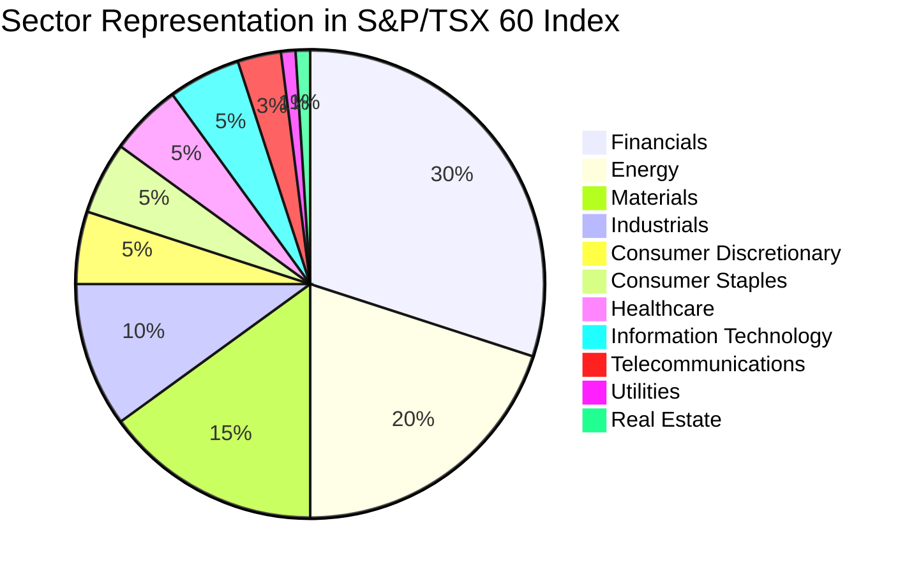

## 8.4.2 The S&P/TSX 60 Index

The S&P/TSX 60 Index is a vital component of the Canadian financial landscape, serving as a benchmark for the performance of the largest and most liquid companies listed on the Toronto Stock Exchange (TSX). This section delves into the intricacies of the S&P/TSX 60 Index, examining its composition, sector representation, performance tracking, and its role in investment strategies.

### Index Composition

The S&P/TSX 60 Index is composed of 60 of the largest companies by market capitalization listed on the TSX. The selection criteria focus on ensuring that the index represents a broad cross-section of the Canadian economy. Companies included in the index are chosen based on their market capitalization, liquidity, and sector representation. This selection process ensures that the index remains a reliable indicator of the Canadian equity market's overall health.

#### Criteria for Selection

1. **Market Capitalization:** Companies must be among the largest by market capitalization on the TSX. This ensures that the index reflects the most significant players in the Canadian market.
2. **Liquidity:** Companies must demonstrate sufficient trading volume to ensure that the index remains liquid and tradable.
3. **Sector Representation:** The index aims to cover a broad range of sectors, reflecting the diversity of the Canadian economy.

### Sector Representation

The S&P/TSX 60 Index is designed to provide a snapshot of the Canadian economy by including companies from various sectors. This diversity helps investors understand the broader market trends and economic conditions.

#### Sector Breakdown

The index includes companies from sectors such as financials, energy, materials, industrials, consumer discretionary, consumer staples, healthcare, information technology, telecommunications, utilities, and real estate. The financial sector often holds a significant weight due to the prominence of major Canadian banks like RBC and TD, while the energy sector reflects Canada's rich natural resources.

### Performance Tracking

The S&P/TSX 60 Index is a critical tool for tracking the performance of major Canadian corporations. It provides investors with a benchmark to measure the performance of their portfolios against the broader market.

#### How It Tracks Performance

The index is weighted by market capitalization, meaning that larger companies have a more significant impact on the index's performance. This weighting method ensures that the index accurately reflects the economic influence of its constituent companies.

### Investment Applications

The S&P/TSX 60 Index serves as a benchmark for various investment products and strategies. Investors use the index to gauge market performance and to create investment products such as exchange-traded funds (ETFs) and index funds.

#### Investment Products

- **ETFs:** Many ETFs track the S&P/TSX 60 Index, offering investors a way to invest in a diversified portfolio of Canadian equities.
- **Index Funds:** These funds aim to replicate the performance of the S&P/TSX 60 Index, providing a passive investment strategy.

#### Investment Strategies

Investors might use the S&P/TSX 60 Index to:
- **Benchmark Performance:** Compare the performance of their portfolios against the index.
- **Diversify Portfolios:** Gain exposure to a broad range of sectors within the Canadian market.
- **Implement Passive Strategies:** Use index-tracking products to achieve market returns with lower costs.

### Comparison with S&P/TSX Composite Index

While the S&P/TSX 60 Index focuses on the largest companies, the S&P/TSX Composite Index includes a broader range of companies, providing a more comprehensive view of the Canadian market.

#### Key Differences

- **Scope:** The S&P/TSX 60 Index includes 60 large-cap companies, while the S&P/TSX Composite Index includes over 200 companies of varying sizes.
- **Focus:** The S&P/TSX 60 Index emphasizes liquidity and market influence, whereas the Composite Index offers a broader market perspective.

### Glossary

- **Benchmark Index:** An index used as a standard against which the performance of a security or investment portfolio is measured.

### Conclusion

The S&P/TSX 60 Index is a cornerstone of the Canadian financial market, providing investors with a reliable benchmark for assessing the performance of major Canadian corporations. By understanding its composition, sector representation, and investment applications, investors can make informed decisions and effectively utilize the index in their investment strategies.

## Quiz Time!



### What is the primary criterion for selecting companies in the S&P/TSX 60 Index?

- [x] Market capitalization
- [ ] Dividend yield
- [ ] Earnings growth
- [ ] Revenue size

> **Explanation:** Companies are selected based on their market capitalization, ensuring the index reflects the largest players in the Canadian market.

### Which sector typically holds significant weight in the S&P/TSX 60 Index?

- [x] Financials
- [ ] Healthcare
- [ ] Utilities
- [ ] Real Estate

> **Explanation:** The financial sector often holds a significant weight due to the prominence of major Canadian banks.

### How is the S&P/TSX 60 Index weighted?

- [x] By market capitalization
- [ ] Equally weighted
- [ ] By dividend yield
- [ ] By revenue

> **Explanation:** The index is weighted by market capitalization, meaning larger companies have a more significant impact on its performance.

### What type of investment product commonly tracks the S&P/TSX 60 Index?

- [x] ETFs
- [ ] Hedge funds
- [ ] Mutual funds
- [ ] Bonds

> **Explanation:** Many ETFs track the S&P/TSX 60 Index, offering a diversified portfolio of Canadian equities.

### How does the S&P/TSX 60 Index differ from the S&P/TSX Composite Index?

- [x] It includes fewer companies
- [ ] It includes more companies
- [ ] It focuses on small-cap companies
- [ ] It excludes financials

> **Explanation:** The S&P/TSX 60 Index includes 60 large-cap companies, whereas the Composite Index includes over 200 companies.

### What is a common use of the S&P/TSX 60 Index for investors?

- [x] Benchmarking portfolio performance
- [ ] Predicting interest rates
- [ ] Determining tax liabilities
- [ ] Calculating inflation rates

> **Explanation:** Investors use the index to benchmark the performance of their portfolios against the broader market.

### Which of the following sectors is NOT typically represented in the S&P/TSX 60 Index?

- [ ] Financials
- [ ] Energy
- [ ] Materials
- [x] Agriculture

> **Explanation:** Agriculture is not typically a separate sector represented in the S&P/TSX 60 Index.

### What is the benefit of using the S&P/TSX 60 Index in investment strategies?

- [x] Diversification across major sectors
- [ ] Guaranteed returns
- [ ] Tax-free growth
- [ ] High-risk exposure

> **Explanation:** The index provides diversification across major sectors within the Canadian market.

### Which of the following is a characteristic of the S&P/TSX 60 Index?

- [x] It is a benchmark index
- [ ] It is a bond index
- [ ] It is a global index
- [ ] It is a small-cap index

> **Explanation:** The S&P/TSX 60 Index is a benchmark index used to measure the performance of major Canadian corporations.

### True or False: The S&P/TSX 60 Index includes companies from the telecommunications sector.

- [x] True
- [ ] False

> **Explanation:** The index includes companies from the telecommunications sector, reflecting the diversity of the Canadian economy.


