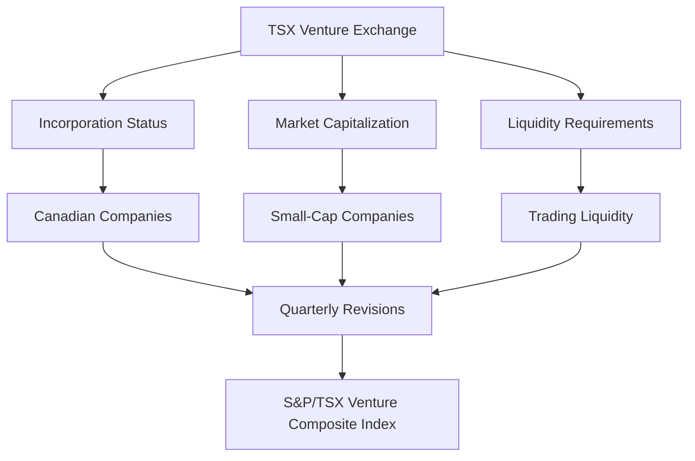

---

linkTitle: "8.4.3 The S&P/TSX Venture Composite Index"
title: "S&P/TSX Venture Composite Index: A Guide to Canada's Public Venture Capital Marketplace"
description: "Explore the S&P/TSX Venture Composite Index, its role in Canada's venture capital marketplace, inclusion criteria, quarterly revisions, and investment relevance."
categories:
- Finance
- Investment
- Canadian Markets
tags:
- S&P/TSX Venture Composite Index
- Venture Capital
- Canadian Securities
- Investment Strategies
- Market Analysis
date: 2024-10-25
type: docs
nav_weight: 843000
---

## 8.4.3 The S&P/TSX Venture Composite Index

The S&P/TSX Venture Composite Index is a crucial component of the Canadian financial landscape, representing the public venture capital marketplace. This index serves as a barometer for the performance of small-cap companies listed on the TSX Venture Exchange, providing insights into the health and trends of the venture capital sector in Canada. In this section, we will delve into the intricacies of the S&P/TSX Venture Composite Index, exploring its inclusion criteria, quarterly revisions, performance indicators, and investment relevance.

### Understanding the Venture Capital Marketplace

The venture capital marketplace is a dynamic sector focused on funding startups and early-stage companies with high growth potential. Unlike traditional markets, venture capital investments are characterized by higher risk and the potential for substantial returns. The S&P/TSX Venture Composite Index captures this essence by tracking the performance of companies listed on the TSX Venture Exchange, which is a platform for emerging companies to access capital and grow.

### Inclusion Criteria for the S&P/TSX Venture Composite Index

To be included in the S&P/TSX Venture Composite Index, companies must meet specific criteria that ensure they are representative of the venture capital sector. These criteria include:

- **Incorporation Status:** Companies must be incorporated in Canada or have a significant operational presence in the country. This ensures that the index reflects the Canadian venture capital landscape.
- **Market Capitalization:** Companies must meet a minimum market capitalization threshold. This requirement helps maintain the index's focus on small-cap and emerging companies, which are typical of the venture capital sector.
- **Liquidity Requirements:** Companies must demonstrate sufficient trading liquidity to ensure that their inclusion in the index is meaningful and that their stock can be traded without significant market impact.

### Quarterly Revisions: Keeping the Index Relevant

The S&P/TSX Venture Composite Index undergoes a quarterly review process to ensure it remains representative of the venture capital sector. During these reviews, companies are evaluated against the inclusion criteria, and adjustments are made as necessary. This process involves:

- **Addition of New Companies:** Emerging companies that meet the inclusion criteria may be added to the index, reflecting the dynamic nature of the venture capital marketplace.
- **Removal of Companies:** Companies that no longer meet the criteria, perhaps due to changes in market capitalization or liquidity, are removed from the index. This ensures that the index remains a relevant and accurate reflection of the sector.

### Performance Indicators: Insights into Venture-Listed Companies

The S&P/TSX Venture Composite Index serves as a performance indicator for venture-listed companies, offering insights into trends and shifts within the sector. Key performance indicators include:

- **Index Performance:** Tracking the overall performance of the index provides a snapshot of the health of the venture capital marketplace. A rising index suggests positive growth and investor confidence, while a declining index may indicate challenges within the sector.
- **Sector Trends:** By analyzing the performance of different sectors within the index, investors can identify emerging trends and opportunities. For example, a surge in technology stocks within the index may signal a growing interest in tech startups.

### Investment Relevance: Leveraging the Index

The S&P/TSX Venture Composite Index is not only a performance indicator but also a valuable tool for investors. It is used to create specialized investment funds, such as exchange-traded funds (ETFs) and mutual funds, that focus on venture capital opportunities. These funds offer investors exposure to the high-growth potential of the venture capital sector while diversifying risk across multiple companies.

#### Example: Canadian Pension Funds

Canadian pension funds, such as the Canada Pension Plan Investment Board (CPPIB), often use the S&P/TSX Venture Composite Index as a benchmark for their venture capital investments. By aligning their portfolios with the index, these funds can capitalize on the growth potential of emerging Canadian companies while managing risk through diversification.

### Practical Application: Analyzing a Portfolio

To apply the principles discussed, consider analyzing a hypothetical portfolio that includes investments in companies listed on the TSX Venture Exchange. Evaluate the portfolio's asset allocation, focusing on the balance between high-risk, high-reward venture capital investments and more stable, traditional assets. Assess the impact of Canadian tax laws, such as those related to Registered Retirement Savings Plans (RRSPs) and Tax-Free Savings Accounts (TFSAs), on investment returns.

### Diagram: Structure of the S&P/TSX Venture Composite Index

Below is a diagram illustrating the structure and components of the S&P/TSX Venture Composite Index:

### Best Practices and Common Challenges

When investing in the venture capital sector, consider the following best practices and challenges:

- **Diversification:** Diversify investments across multiple sectors and companies to mitigate risk.
- **Due Diligence:** Conduct thorough research on potential investments, focusing on company fundamentals and growth potential.
- **Volatility Management:** Be prepared for higher volatility compared to traditional markets, and adjust investment strategies accordingly.

### Conclusion

The S&P/TSX Venture Composite Index is a vital tool for understanding and navigating the Canadian venture capital marketplace. By tracking the performance of small-cap and emerging companies, the index provides valuable insights into sector trends and investment opportunities. Whether used as a benchmark for investment funds or as a guide for individual investors, the S&P/TSX Venture Composite Index plays a crucial role in the Canadian financial ecosystem.

## Quiz Time!



### What does the S&P/TSX Venture Composite Index represent?

- [x] The public venture capital marketplace in Canada
- [ ] The performance of large-cap Canadian companies
- [ ] The global venture capital market
- [ ] The Canadian bond market

> **Explanation:** The S&P/TSX Venture Composite Index represents the public venture capital marketplace in Canada, focusing on small-cap and emerging companies.

### What is a requirement for a company to be included in the S&P/TSX Venture Composite Index?

- [x] Must be incorporated in Canada or have a significant operational presence
- [ ] Must be a large-cap company
- [ ] Must be listed on the New York Stock Exchange
- [ ] Must have a minimum of 10 years of operation

> **Explanation:** Companies must be incorporated in Canada or have a significant operational presence to be included in the index.

### How often is the S&P/TSX Venture Composite Index reviewed?

- [x] Quarterly
- [ ] Annually
- [ ] Monthly
- [ ] Biannually

> **Explanation:** The index undergoes a quarterly review process to ensure it remains representative of the venture capital sector.

### What does a rising S&P/TSX Venture Composite Index indicate?

- [x] Positive growth and investor confidence in the venture capital sector
- [ ] A decline in the venture capital sector
- [ ] Stability in the bond market
- [ ] Increased interest rates

> **Explanation:** A rising index suggests positive growth and investor confidence in the venture capital sector.

### What type of companies does the S&P/TSX Venture Composite Index focus on?

- [x] Small-cap and emerging companies
- [ ] Large-cap companies
- [ ] Established multinational corporations
- [ ] Government-owned enterprises

> **Explanation:** The index focuses on small-cap and emerging companies typical of the venture capital sector.

### What is a common use of the S&P/TSX Venture Composite Index for investors?

- [x] Creating specialized investment funds like ETFs
- [ ] Tracking government bond performance
- [ ] Measuring inflation rates
- [ ] Analyzing currency exchange rates

> **Explanation:** The index is used to create specialized investment funds, such as ETFs, that focus on venture capital opportunities.

### What is a key performance indicator of the S&P/TSX Venture Composite Index?

- [x] Index performance trends
- [ ] Bond yield curves
- [ ] Currency exchange rates
- [ ] Inflation rates

> **Explanation:** Index performance trends provide insights into the health of the venture capital marketplace.

### What is a best practice when investing in the venture capital sector?

- [x] Diversifying investments across multiple sectors and companies
- [ ] Investing solely in one company
- [ ] Avoiding due diligence
- [ ] Ignoring market trends

> **Explanation:** Diversifying investments helps mitigate risk in the volatile venture capital sector.

### What is a challenge when investing in the venture capital sector?

- [x] Managing higher volatility compared to traditional markets
- [ ] Guaranteed returns
- [ ] Low risk
- [ ] Stable market conditions

> **Explanation:** The venture capital sector is characterized by higher volatility, requiring careful management.

### True or False: The S&P/TSX Venture Composite Index is used to track the performance of large-cap Canadian companies.

- [ ] True
- [x] False

> **Explanation:** False. The index focuses on small-cap and emerging companies in the venture capital sector.



