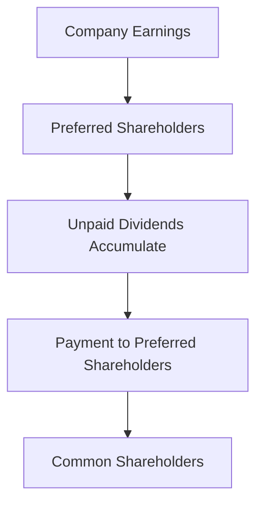

## Glossary for Chapter 8: Equity Securities - Common and Preferred Shares

In Chapter 8 of the CSC® Exam Prep Guide, we delve into the intricacies of equity securities, focusing on common and preferred shares. This glossary serves as a comprehensive reference tool, providing clear definitions and explanations of key terms introduced in the chapter. It is designed to reinforce your understanding and facilitate quick access to complex concepts related to equity securities. Let's explore these terms in detail:

### Arrears
**Definition:** Arrears refer to unpaid dividends that accumulate for cumulative preferred shares. If a company fails to pay dividends in any given period, these unpaid amounts are carried forward and must be paid out before any dividends can be distributed to common shareholders.

**Application:** Understanding arrears is crucial for investors holding cumulative preferred shares, as it affects the timing and certainty of dividend payments.

### Callable Preferred Shares
**Definition:** Callable preferred shares are a type of preferred stock that the issuer can redeem at a predetermined date and price. This feature allows the issuing company to repurchase the shares, typically at a premium, before their maturity.

**Example:** A Canadian bank might issue callable preferred shares to raise capital, with the option to call them back if interest rates decline, allowing the bank to refinance at a lower cost.

### Convertible Preferred Shares
**Definition:** Convertible preferred shares are preferred stocks that can be converted into a set number of common shares, usually at the discretion of the shareholder. This feature provides the potential for capital appreciation if the common stock's price increases.

**Case Study:** Consider a scenario where a Canadian technology company issues convertible preferred shares. If the company's common stock performs well, investors might convert their preferred shares to capitalize on the stock's appreciation.

### Cumulative Preferred Shares
**Definition:** Cumulative preferred shares are preferred stocks that accumulate unpaid dividends. These dividends must be paid out before any dividends are distributed to common shareholders, providing a layer of protection for preferred shareholders.

**Diagram: Cumulative Dividend Flow**

### Dividend
**Definition:** A dividend is a portion of a company's earnings distributed to shareholders. Dividends can be paid in cash or additional shares and are typically declared by the company's board of directors.

**Example:** A Canadian utility company might pay quarterly dividends to its shareholders, providing a steady income stream.

### Dividend Coverage
**Definition:** Dividend coverage is the amount of money a company has available to pay dividends from its after-tax profits. It is an indicator of a company's ability to maintain or increase its dividend payments.

**Formula:** Dividend Coverage Ratio = Net Income / Total Dividends Paid

### Dividend Record Date
**Definition:** The dividend record date is the cutoff date on which a shareholder must be registered to receive the declared dividend. Only shareholders on record as of this date are entitled to the dividend payment.

**Example:** If a Canadian mining company declares a dividend with a record date of March 15, only shareholders who own the stock on that date will receive the dividend.

### Ex-Dividend Date
**Definition:** The ex-dividend date is the date after which new buyers of a stock are not entitled to the declared dividend. It is typically set one business day before the record date.

**Example:** If the ex-dividend date for a Canadian bank's stock is April 10, investors purchasing the stock on or after this date will not receive the upcoming dividend.

### Equity Per Share
**Definition:** Equity per share is the value of a company's assets minus its liabilities, divided by the number of outstanding shares. It represents the book value of a single share of the company's stock.

**Formula:** Equity Per Share = (Total Assets - Total Liabilities) / Outstanding Shares

### Equity Securities
**Definition:** Equity securities are financial instruments representing ownership in a company. They include common and preferred shares, providing shareholders with potential dividends and capital gains.

### Limited Liability
**Definition:** Limited liability is a legal structure that protects shareholders from personal loss beyond their initial investment in a company. Shareholders are not personally responsible for the company's debts or liabilities.

**Example:** In the event of a Canadian company's bankruptcy, shareholders would only lose their investment in the company's shares, not their personal assets.

### Market Capitalization
**Definition:** Market capitalization is the total market value of a company's outstanding shares. It is calculated by multiplying the current share price by the total number of outstanding shares.

**Formula:** Market Capitalization = Share Price x Outstanding Shares

### Marketability
**Definition:** Marketability refers to the ease with which an asset can be bought or sold in the market. Highly marketable securities are those that can be quickly converted to cash without significant price changes.

### Odd Lot
**Definition:** An odd lot is a quantity of shares less than the standard trading unit, typically 100 shares. Odd lots may be subject to different trading rules and fees.

### Participating Dividend
**Definition:** A participating dividend is an additional dividend beyond the fixed payment, contingent on the company's performance. It allows preferred shareholders to share in the company's profits beyond the fixed dividend rate.

### Purchase Fund
**Definition:** A purchase fund is a fund established to support the market price of preferred shares. It is used by companies to buy back shares in the open market, helping to stabilize or increase the share price.

### Preferred Shares
**Definition:** Preferred shares are ownership units with preferential treatment in dividends and asset distribution. They typically offer fixed dividends and have priority over common shares in the event of liquidation.

### Pooled Investment Vehicles
**Definition:** Pooled investment vehicles are investment funds that pool capital from multiple investors to purchase securities. Examples include mutual funds, exchange-traded funds (ETFs), and hedge funds.

### Reverse Stock Split
**Definition:** A reverse stock split is a corporate action that reduces the number of outstanding shares and increases the share price. It is often used to increase the stock's marketability and meet exchange listing requirements.

### Sinking Fund
**Definition:** A sinking fund is a fund established by a company to repurchase its outstanding shares or bonds over time. It ensures that the company can meet its future redemption obligations.

### Straight Preferred Shares
**Definition:** Straight preferred shares are preferred stocks with no additional features beyond normal dividend and asset preferences. They offer fixed dividends but do not have conversion or participation rights.

### Voting Rights
**Definition:** Voting rights are the ability of shareholders to vote on corporate matters such as electing directors and approving significant changes. Common shareholders typically have voting rights, while preferred shareholders may not.

---

This glossary is an essential tool for mastering the concepts covered in Chapter 8 of the CSC® Exam Prep Guide. By familiarizing yourself with these terms, you can enhance your understanding of equity securities and their role in the financial markets. As you progress through the chapter, refer back to this glossary to reinforce your learning and ensure a comprehensive grasp of the material.

## Quiz Time!



### What are arrears in the context of preferred shares?

- [x] Unpaid dividends that accumulate for cumulative preferred shares
- [ ] Dividends paid out to common shareholders
- [ ] A type of preferred share with conversion rights
- [ ] The market value of outstanding shares

> **Explanation:** Arrears refer to unpaid dividends that accumulate for cumulative preferred shares, which must be paid before any dividends to common shareholders.

### What is a callable preferred share?

- [x] A preferred share that the issuer can redeem at a predetermined date and price
- [ ] A preferred share that can be converted into common shares
- [ ] A preferred share with no additional features
- [ ] A preferred share that accumulates unpaid dividends

> **Explanation:** Callable preferred shares can be redeemed by the issuer at a predetermined date and price, allowing the company to repurchase the shares.

### What feature do convertible preferred shares have?

- [x] They can be converted into a set number of common shares
- [ ] They accumulate unpaid dividends
- [ ] They have no voting rights
- [ ] They are redeemable at a predetermined price

> **Explanation:** Convertible preferred shares can be converted into a set number of common shares, providing potential for capital appreciation.

### What does the dividend record date signify?

- [x] The cutoff date on which a shareholder must be registered to receive the declared dividend
- [ ] The date dividends are paid to shareholders
- [ ] The date after which new buyers are not entitled to the dividend
- [ ] The date dividends are declared by the board

> **Explanation:** The dividend record date is the cutoff date for shareholders to be registered to receive the declared dividend.

### What is the ex-dividend date?

- [x] The date after which new buyers of a stock are not entitled to the declared dividend
- [ ] The date dividends are paid to shareholders
- [ ] The date dividends are declared by the board
- [ ] The cutoff date for shareholder registration

> **Explanation:** The ex-dividend date is the date after which new buyers are not entitled to the declared dividend.

### What does equity per share represent?

- [x] The value of a company's assets minus liabilities, divided by the number of outstanding shares
- [ ] The total market value of a company's outstanding shares
- [ ] The ease with which an asset can be bought or sold
- [ ] The amount of dividends paid to shareholders

> **Explanation:** Equity per share represents the book value of a single share, calculated by dividing the company's net assets by outstanding shares.

### What is market capitalization?

- [x] The total market value of a company's outstanding shares
- [ ] The value of a company's assets minus liabilities
- [ ] The ease with which an asset can be bought or sold
- [ ] The amount of dividends paid to shareholders

> **Explanation:** Market capitalization is the total market value of a company's outstanding shares, calculated by multiplying the share price by the number of shares.

### What is a reverse stock split?

- [x] A corporate action that reduces the number of outstanding shares and increases the share price
- [ ] A corporate action that increases the number of outstanding shares and decreases the share price
- [ ] A fund established to repurchase shares
- [ ] A dividend paid beyond the fixed payment

> **Explanation:** A reverse stock split reduces the number of outstanding shares and increases the share price, often to meet exchange requirements.

### What is a sinking fund?

- [x] A fund established by a company to repurchase its outstanding shares or bonds over time
- [ ] A fund used to pay dividends to shareholders
- [ ] A fund established to support the market price of preferred shares
- [ ] A fund used for company expansion

> **Explanation:** A sinking fund is used by a company to repurchase its outstanding shares or bonds over time, ensuring future redemption obligations are met.

### True or False: Preferred shares typically have voting rights.

- [ ] True
- [x] False

> **Explanation:** Preferred shares typically do not have voting rights, unlike common shares, which usually allow shareholders to vote on corporate matters.


