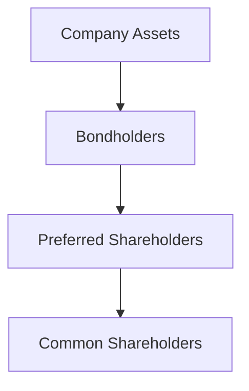

## 8.8 Preferred Shares

Preferred shares, often referred to as preferred stock, are a unique class of equity securities that offer investors a blend of characteristics found in both bonds and common shares. In this section, we will delve into the key features of preferred shares, compare them to common shares and bonds, discuss their benefits and risks, and provide insights into their role within the Canadian financial landscape.

### Key Features of Preferred Shares

Preferred shares are a type of equity security that provides certain privileges over common shares. Here are some of their defining features:

- **Fixed Dividend:** Preferred shares typically come with a fixed dividend, which is a predetermined payment made to shareholders. This dividend is usually expressed as a percentage of the par value of the shares and is paid out before any dividends are distributed to common shareholders.

- **Priority Claim:** In the event of a company's liquidation, preferred shareholders have a higher claim on assets than common shareholders. However, they are subordinate to bondholders and other debt instruments.

- **Non-Voting Rights:** Generally, preferred shares do not carry voting rights, meaning shareholders do not have a say in corporate governance matters unless specific conditions are met, such as the non-payment of dividends.

- **Callable Feature:** Many preferred shares are callable, allowing the issuing company to repurchase them at a predetermined price after a certain date.

- **Convertible Option:** Some preferred shares can be converted into a specified number of common shares, offering potential for capital appreciation.

### Comparison with Common Shares and Bonds

To better understand preferred shares, it's essential to compare them with common shares and bonds:

- **Common Shares:** Unlike preferred shares, common shares represent ownership in a company and typically come with voting rights. Common shareholders benefit from potential capital appreciation and dividends, but they are last in line for asset claims in the event of liquidation.

- **Bonds:** Bonds are debt securities that pay interest to bondholders. They have a fixed maturity date and provide a higher claim on assets than both preferred and common shares. Bonds are generally considered less risky than preferred shares due to their seniority in asset claims.

The following diagram illustrates the hierarchy of claims in the event of a company's liquidation:

### Benefits of Preferred Share Ownership

Preferred shares offer several advantages to investors, making them an attractive option for certain investment strategies:

- **Stable Income:** The fixed dividend feature provides a predictable income stream, which can be appealing to income-focused investors, such as retirees or pension funds.

- **Priority in Dividends and Liquidation:** Preferred shareholders receive dividends before common shareholders and have a higher claim on assets in the event of liquidation, offering a degree of protection.

- **Potential for Capital Appreciation:** Convertible preferred shares provide an opportunity for capital gains if converted into common shares, especially if the company's stock price appreciates.

### Risks Associated with Preferred Shares

Despite their benefits, preferred shares also come with certain risks:

- **Interest Rate Sensitivity:** Preferred shares are sensitive to interest rate changes. When interest rates rise, the fixed dividend becomes less attractive, potentially leading to a decline in the share price.

- **Credit Risk:** The financial health of the issuing company affects the risk level of preferred shares. If the company faces financial difficulties, it may suspend dividend payments, impacting the income stream for investors.

- **Limited Capital Appreciation:** Compared to common shares, preferred shares offer limited potential for capital gains, as they are primarily designed to provide income.

### Practical Examples and Case Studies

To illustrate the role of preferred shares in investment strategies, consider the following examples:

- **Canadian Pension Funds:** Many Canadian pension funds incorporate preferred shares into their portfolios to achieve a balance between income generation and risk management. The fixed dividends provide a steady income stream, while the priority claim offers a degree of safety.

- **Major Canadian Banks:** Institutions like RBC and TD often issue preferred shares as a means of raising capital. These shares appeal to investors seeking stable income and a higher claim on assets compared to common shares.

### Best Practices and Common Pitfalls

When investing in preferred shares, consider the following best practices and potential challenges:

- **Diversification:** Diversify your portfolio to mitigate risks associated with individual issuers. Consider a mix of preferred shares from different sectors and issuers.

- **Interest Rate Environment:** Monitor interest rate trends, as rising rates can negatively impact the value of preferred shares.

- **Issuer Creditworthiness:** Evaluate the financial health of the issuing company to assess the risk of dividend suspension or default.

### Canadian Financial Regulations and Resources

Investors should be aware of the regulatory framework governing preferred shares in Canada. The Canadian Securities Administrators (CSA) and the Investment Industry Regulatory Organization of Canada (IIROC) provide guidelines and oversight for securities markets.

For further exploration, consider the following resources:

- [Investopedia: Preferred Shares](https://www.investopedia.com/terms/p/preferredshare.asp)
- [TMX Group - Preferred Shares](https://www.tmx.com/preferred-shares)

### Conclusion

Preferred shares offer a unique blend of features that can enhance an investment portfolio, particularly for those seeking income and a degree of safety. By understanding their characteristics, benefits, and risks, investors can make informed decisions that align with their financial goals and risk tolerance.

### **Ready to Test Your Knowledge?**

**Practice 10 Essential CSC Exam Questions to Master Your Certification**



### What is a key feature of preferred shares?

- [x] Fixed Dividend
- [ ] Voting Rights
- [ ] No Dividend
- [ ] High Volatility

> **Explanation:** Preferred shares typically offer a fixed dividend, providing a predictable income stream to investors.

### In the event of a company's liquidation, who has the highest claim on assets?

- [ ] Common Shareholders
- [x] Bondholders
- [ ] Preferred Shareholders
- [ ] Employees

> **Explanation:** Bondholders have the highest claim on assets, followed by preferred shareholders, and then common shareholders.

### Which of the following is a benefit of owning preferred shares?

- [x] Priority in Dividends
- [ ] Unlimited Voting Rights
- [ ] High Capital Appreciation
- [ ] No Risk

> **Explanation:** Preferred shareholders receive dividends before common shareholders, providing a priority in income distribution.

### What risk is associated with preferred shares?

- [x] Interest Rate Sensitivity
- [ ] Guaranteed Returns
- [ ] Unlimited Growth Potential
- [ ] No Credit Risk

> **Explanation:** Preferred shares are sensitive to interest rate changes, which can affect their market value.

### Which type of preferred shares can be converted into common shares?

- [x] Convertible Preferred Shares
- [ ] Callable Preferred Shares
- [ ] Non-Convertible Preferred Shares
- [ ] Perpetual Preferred Shares

> **Explanation:** Convertible preferred shares can be converted into a specified number of common shares.

### What is a common feature of preferred shares?

- [x] Non-Voting Rights
- [ ] Guaranteed Voting Rights
- [ ] No Dividend Payments
- [ ] Unlimited Growth

> **Explanation:** Preferred shares generally do not carry voting rights, unlike common shares.

### Which Canadian institution provides guidelines for securities markets?

- [x] Canadian Securities Administrators (CSA)
- [ ] Canada Revenue Agency (CRA)
- [ ] Bank of Canada
- [ ] Statistics Canada

> **Explanation:** The Canadian Securities Administrators (CSA) provide guidelines and oversight for securities markets in Canada.

### What is a potential challenge when investing in preferred shares?

- [x] Credit Risk
- [ ] Guaranteed Returns
- [ ] No Market Risk
- [ ] Unlimited Growth

> **Explanation:** The financial health of the issuing company affects the risk level of preferred shares, posing a credit risk.

### Which feature allows a company to repurchase preferred shares at a predetermined price?

- [x] Callable Feature
- [ ] Convertible Option
- [ ] Non-Callable Feature
- [ ] Perpetual Option

> **Explanation:** The callable feature allows the issuing company to repurchase preferred shares at a predetermined price after a certain date.

### Preferred shares offer a higher claim on assets than common shares.

- [x] True
- [ ] False

> **Explanation:** Preferred shares have a higher claim on assets than common shares, providing a degree of protection in the event of liquidation.


