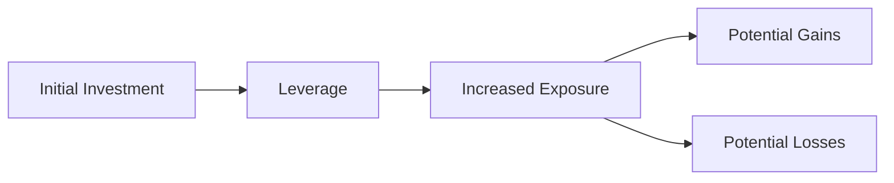

## 9.9 Trading on Margin

Trading on margin is a powerful investment strategy that allows investors to borrow funds from a broker to purchase securities. This approach can amplify potential returns but also increases risk, making it crucial for investors to understand the mechanics and implications of margin trading. In this section, we will delve into the comparative analysis of buying long on margin versus selling short, evaluate margin strategies from an investment perspective, and explore the implications of leverage in investment decisions.

### Understanding Margin Trading

Margin trading involves borrowing money from a broker to purchase securities. The investor pays a portion of the purchase price and borrows the rest. This borrowed portion is known as the margin loan, and the investor's initial payment is the margin. The securities purchased serve as collateral for the loan.

#### Buying Long on Margin

Buying long on margin is a strategy where an investor purchases securities with the expectation that their value will rise. By using margin, the investor can buy more shares than they could with their available capital alone, potentially increasing their returns.

**Example:**

Suppose an investor wants to buy 100 shares of a Canadian company trading at $50 per share. Without margin, the investor would need $5,000. However, by using a 50% margin, the investor only needs to invest $2,500 of their own money, borrowing the remaining $2,500 from the broker.

If the stock price rises to $60, the investor can sell the shares for $6,000. After repaying the $2,500 loan, the investor's profit is $1,500, a 60% return on their initial $2,500 investment.

#### Selling Short on Margin

Selling short involves borrowing shares from a broker to sell them, with the intention of buying them back later at a lower price. This strategy profits from a decline in the stock's price.

**Example:**

Consider an investor who believes a stock currently priced at $50 will decrease in value. The investor borrows 100 shares and sells them, receiving $5,000. If the stock price falls to $40, the investor can buy back the shares for $4,000, return them to the broker, and pocket the $1,000 difference.

### Comparative Analysis: Buying Long vs. Selling Short

Both buying long and selling short on margin involve borrowing, but they cater to different market expectations. Buying long is suitable for bullish markets, while selling short is advantageous in bearish conditions. Each strategy carries unique risks and rewards:

- **Buying Long Risks:** If the stock price falls, the investor incurs losses, which are magnified by the borrowed funds.
- **Selling Short Risks:** If the stock price rises, the investor faces potentially unlimited losses, as there is no cap on how high a stock price can go.

### Evaluating Margin Strategies from an Investment Perspective

When evaluating margin strategies, investors must consider their risk tolerance, market conditions, and investment goals. Margin trading can enhance returns but also increases exposure to market volatility.

#### Leverage: A Double-Edged Sword

Financial leverage, the use of borrowed funds to increase investment exposure, can magnify gains and losses. While leverage can boost returns in favorable markets, it can lead to significant losses in adverse conditions. Investors must carefully assess their ability to manage the risks associated with leverage.

**Mermaid Diagram: Leverage Impact**

### Implications of Leverage in Investment Decisions

Leverage can influence investment decisions by altering the risk-return profile of a portfolio. Investors must weigh the potential for higher returns against the increased risk of loss. Key considerations include:

- **Interest Costs:** Borrowing funds incurs interest, which can erode profits.
- **Margin Calls:** If the value of the securities falls below a certain level, the broker may issue a margin call, requiring the investor to deposit additional funds or sell assets to cover the shortfall.
- **Market Volatility:** Leverage amplifies the impact of market fluctuations, increasing the potential for rapid gains or losses.

### Interactive Online Learning Activity

To assess your understanding of margin strategies, consider the following scenario:

You have $10,000 and are considering using margin to invest in a stock priced at $100 per share. The broker offers a 50% margin. Calculate the potential profit or loss if the stock price rises to $120 or falls to $80.

**Solution:**

- **Stock Price Rises to $120:**
  - Shares Purchased: 200 (using $10,000 + $10,000 borrowed)
  - Total Value: $24,000
  - Loan Repayment: $10,000
  - Profit: $4,000

- **Stock Price Falls to $80:**
  - Total Value: $16,000
  - Loan Repayment: $10,000
  - Loss: $4,000

### Glossary

- **Financial Leverage:** The use of borrowed funds to increase the potential return on investment.
- **Investment Strategy:** A plan or approach to investing that guides decisions based on goals, risk tolerance, and market conditions.

### References and Additional Resources

- [Margin Trading Strategies](https://www.moneycontrol.com/news/business/margin-trading-strategies/)
- Online Course: [Leverage in Investing](https://www.coursera.org/learn/leverage-investing)

### **Ready to Test Your Knowledge?**

**Practice 10 Essential CSC Exam Questions to Master Your Certification**



### What is the primary advantage of buying long on margin?

- [x] Potential for higher returns with less initial capital
- [ ] Guaranteed profits
- [ ] Elimination of investment risk
- [ ] Reduced interest costs

> **Explanation:** Buying long on margin allows investors to purchase more shares than they could with their own funds, potentially increasing returns.

### What is a key risk of selling short on margin?

- [x] Unlimited potential losses
- [ ] Guaranteed profits
- [ ] Reduced market volatility
- [ ] Elimination of interest costs

> **Explanation:** Selling short involves borrowing shares to sell, and if the stock price rises, losses can be unlimited.

### How does leverage affect investment returns?

- [x] It magnifies both gains and losses
- [ ] It guarantees higher returns
- [ ] It reduces investment risk
- [ ] It eliminates market volatility

> **Explanation:** Leverage increases exposure to market movements, amplifying both potential gains and losses.

### What is a margin call?

- [x] A demand by a broker for additional funds or securities
- [ ] A guaranteed profit on an investment
- [ ] A reduction in interest rates
- [ ] An automatic sale of securities

> **Explanation:** A margin call occurs when the value of securities falls below a certain level, requiring the investor to deposit more funds or sell assets.

### Which strategy is suitable for a bearish market?

- [x] Selling short on margin
- [ ] Buying long on margin
- [x] Selling short on margin
- [ ] Buying long on margin

> **Explanation:** Selling short profits from a decline in stock prices, making it suitable for bearish markets.

### What is financial leverage?

- [x] The use of borrowed funds to increase investment exposure
- [ ] A guaranteed profit strategy
- [ ] A method to eliminate investment risk
- [ ] A way to reduce interest costs

> **Explanation:** Financial leverage involves using borrowed funds to increase the potential return on investment.

### What happens if the stock price rises when selling short?

- [x] The investor incurs losses
- [ ] The investor gains profits
- [x] The investor incurs losses
- [ ] The investor gains profits

> **Explanation:** If the stock price rises, the investor must buy back shares at a higher price, resulting in losses.

### What is the impact of interest costs on margin trading?

- [x] They can erode profits
- [ ] They guarantee higher returns
- [ ] They eliminate investment risk
- [ ] They reduce market volatility

> **Explanation:** Interest costs on borrowed funds can reduce the overall profitability of margin trades.

### How does market volatility affect leveraged investments?

- [x] It increases the potential for rapid gains or losses
- [ ] It guarantees stable returns
- [ ] It eliminates investment risk
- [ ] It reduces interest costs

> **Explanation:** Leverage amplifies the impact of market fluctuations, increasing the potential for rapid gains or losses.

### True or False: Leverage always guarantees higher returns.

- [ ] True
- [x] False

> **Explanation:** Leverage increases potential returns but also increases risk, and does not guarantee higher returns.


