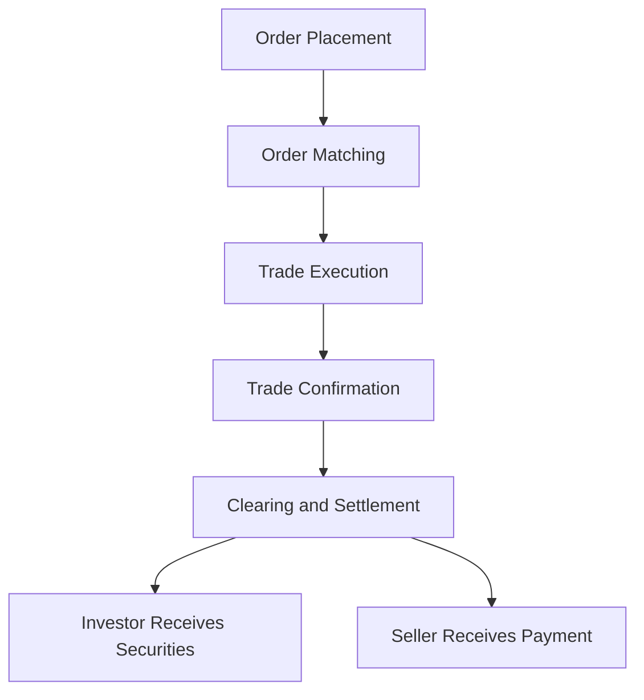

## 9.10 Trading and Settlement Procedures

In the dynamic world of equity markets, understanding trading and settlement procedures is crucial for anyone involved in securities transactions. This section delves into the roles of investment dealers, the step-by-step process of executing trades on exchanges like the Toronto Stock Exchange (TSX), and the critical functions of electronic record-keeping and clearing corporations. By the end of this chapter, you will have a comprehensive understanding of how trades are executed and settled in the Canadian financial landscape.

### Roles of Investment Dealers

Investment dealers play a pivotal role in the trading of securities, acting either as agents or principals. Understanding these roles is essential for grasping how trades are facilitated in the market.

#### As Agents

When acting as agents, investment dealers execute trades on behalf of their clients. In this capacity, they do not own the securities being traded but rather facilitate the transaction between buyers and sellers. Their primary responsibility is to secure the best possible price for their clients, ensuring that the transaction aligns with the client's investment goals.

#### As Principals

Conversely, when acting as principals, investment dealers trade securities for their own accounts. In this role, they buy and sell securities, assuming the risk associated with holding these assets. This can involve market-making activities, where dealers provide liquidity by being ready to buy or sell securities at publicly quoted prices.

### Executing a Retail Securities Transaction on the TSX

The process of executing a retail securities transaction on the TSX involves several key steps, from order placement to trade confirmation and settlement. Let's explore this process in detail.

#### Step 1: Order Placement

The journey begins when an investor places an order with their investment dealer. This order can be a buy or sell order and may include specific instructions such as limit prices or time constraints. The investment dealer then transmits this order to the TSX through electronic trading platforms.

#### Step 2: Order Matching

Once the order reaches the TSX, it enters the order book, where it is matched with a corresponding buy or sell order. The TSX uses sophisticated algorithms to ensure that orders are matched efficiently, prioritizing factors such as price and time of entry.

#### Step 3: Trade Execution

When a match is found, the trade is executed. At this point, the buyer and seller agree on the terms of the transaction, including the price and quantity of securities. The TSX provides immediate confirmation of the trade to both parties.

#### Step 4: Trade Confirmation

Following execution, the investment dealer sends a trade confirmation to the investor. This document outlines the details of the transaction, including the security traded, the price, and any associated fees. It serves as a formal record of the trade.

#### Step 5: Clearing and Settlement

The final step involves the clearing and settlement of the trade. This is where clearing corporations, such as the Canadian Depository for Securities (CDS), play a crucial role. They ensure that the buyer receives the securities and the seller receives payment, typically within two business days (T+2) of the trade date.

### Electronic Record-Keeping and the Role of Clearing Corporations

In today's digital age, electronic record-keeping is vital for the efficient functioning of securities markets. Clearing corporations maintain detailed records of all trades, ensuring accuracy and transparency in the settlement process.

#### The Clearing Process

The clearing process involves the reconciliation of buy and sell orders, ensuring that all parties fulfill their obligations. Clearing corporations act as intermediaries, reducing counterparty risk by guaranteeing the completion of trades. They also manage the transfer of securities and funds, streamlining the settlement process.

### Glossary

- **Settlement Procedures:** The processes involved in finalizing a securities transaction, ensuring that the buyer receives the securities and the seller receives payment.
- **Trade Confirmation:** A document provided to investors detailing the specifics of a trade, including the security, price, and fees.
- **Clearing Process:** The series of steps taken to reconcile and settle securities transactions, typically involving a clearing corporation.

### References and Additional Resources

- [Settlement Procedures Explained](https://www.investopedia.com/terms/s/settlement.asp)
- Tutorial: [How Trades Are Settled](https://www.khanacademy.org/economics-finance-domain/core-finance/investyc/securities-trading/v/security-trading)

### Conclusion

Understanding trading and settlement procedures is fundamental for navigating the Canadian securities market. By grasping the roles of investment dealers, the execution process on the TSX, and the functions of clearing corporations, you are better equipped to engage in informed and effective trading activities. As you continue to explore the world of finance, remember to apply these principles to your own investment strategies, ensuring compliance with regulatory standards and best practices.

### **Ready to Test Your Knowledge?**

**Practice 10 Essential CSC Exam Questions to Master Your Certification**



### What role do investment dealers play when acting as agents?

- [x] They execute trades on behalf of clients.
- [ ] They trade securities for their own accounts.
- [ ] They provide liquidity by market-making.
- [ ] They manage clearing and settlement processes.

> **Explanation:** As agents, investment dealers execute trades on behalf of clients, ensuring the best possible price for them.

### What is the first step in executing a retail securities transaction on the TSX?

- [x] Order Placement
- [ ] Order Matching
- [ ] Trade Execution
- [ ] Trade Confirmation

> **Explanation:** The process begins with the investor placing an order with their investment dealer.

### What document is sent to investors after a trade is executed?

- [x] Trade Confirmation
- [ ] Settlement Notice
- [ ] Clearing Report
- [ ] Order Receipt

> **Explanation:** A trade confirmation is sent to investors, detailing the specifics of the transaction.

### What is the typical settlement period for trades on the TSX?

- [x] T+2
- [ ] T+1
- [ ] T+3
- [ ] T+0

> **Explanation:** Trades on the TSX typically settle within two business days, known as T+2.

### What role do clearing corporations play in the trading process?

- [x] They ensure the completion of trades.
- [ ] They execute trades on behalf of clients.
- [x] They manage the transfer of securities and funds.
- [ ] They provide investment advice.

> **Explanation:** Clearing corporations ensure the completion of trades and manage the transfer of securities and funds.

### What is the purpose of electronic record-keeping in securities markets?

- [x] To ensure accuracy and transparency
- [ ] To increase trading volume
- [ ] To reduce transaction costs
- [ ] To provide investment advice

> **Explanation:** Electronic record-keeping ensures accuracy and transparency in the settlement process.

### What happens during the order matching step on the TSX?

- [x] Orders are matched with corresponding buy or sell orders.
- [ ] Securities are transferred to the buyer.
- [x] The trade is executed.
- [ ] The investor receives a trade confirmation.

> **Explanation:** During order matching, orders are matched with corresponding buy or sell orders, leading to trade execution.

### What is the role of investment dealers when acting as principals?

- [x] They trade securities for their own accounts.
- [ ] They execute trades on behalf of clients.
- [ ] They manage clearing and settlement processes.
- [ ] They provide investment advice.

> **Explanation:** As principals, investment dealers trade securities for their own accounts, assuming the associated risks.

### What is included in a trade confirmation?

- [x] Details of the security traded
- [ ] The investor's account balance
- [ ] The clearing corporation's report
- [ ] A list of potential investment strategies

> **Explanation:** A trade confirmation includes details of the security traded, the price, and any associated fees.

### True or False: Clearing corporations reduce counterparty risk by guaranteeing the completion of trades.

- [x] True
- [ ] False

> **Explanation:** Clearing corporations act as intermediaries, reducing counterparty risk by guaranteeing the completion of trades.


