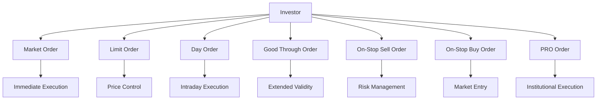

## 9.13 Types of Buy and Sell Orders

In the dynamic world of equity trading, understanding the different types of buy and sell orders is crucial for executing effective investment strategies. This section provides a comprehensive overview of the various order types available to traders, their strategic implications, and practical applications within the Canadian financial market.

### Understanding Order Types

Order types are instructions given to brokers to buy or sell securities on behalf of investors. Each order type serves a specific purpose and can significantly impact the execution and outcome of a trade. The choice of order type depends on the investor's objectives, market conditions, and risk tolerance.

### Market Orders

A **market order** is an instruction to buy or sell a security immediately at the best available current price. Market orders are executed quickly, making them ideal for investors who prioritize speed over price precision. However, the final execution price may differ from the last quoted price due to market fluctuations.

#### Use Case and Strategic Implications

Market orders are suitable for highly liquid stocks where the bid-ask spread is narrow. They are often used when entering or exiting a position quickly is more important than the exact price. For example, an investor looking to purchase shares of a major Canadian bank like RBC might use a market order to ensure the transaction is completed swiftly.

### Limit Orders

A **limit order** specifies the maximum price an investor is willing to pay for a buy order or the minimum price they are willing to accept for a sell order. This order type provides price control but does not guarantee execution.

#### Use Case and Strategic Implications

Limit orders are beneficial in volatile markets or when trading less liquid securities. They allow investors to set a target price, ensuring they do not pay more or sell for less than desired. For instance, if an investor wants to buy shares of a Canadian tech company at a specific price, they might place a limit order to avoid overpaying.

### Day Orders

A **day order** is valid only for the trading day on which it is placed. If the order is not executed by the end of the trading day, it is automatically canceled.

#### Use Case and Strategic Implications

Day orders are useful for short-term traders who want to capitalize on daily market movements. They are often used in conjunction with limit orders to take advantage of intraday price fluctuations without the risk of the order carrying over to the next day.

### Good Through Orders

A **good through order** remains active until a specified date, allowing more flexibility than a day order. This type of order is useful for investors who want to maintain their position over several days without re-entering the order daily.

#### Use Case and Strategic Implications

Good through orders are advantageous for investors who anticipate a price movement over a specific period. For example, an investor expecting a Canadian energy stock to rise within a week might use a good through order to maintain their buy position until the target price is reached.

### On-Stop Orders

**On-stop orders** are conditional orders that become market orders once a specified price, known as the stop price, is reached. There are two main types: on-stop sell orders and on-stop buy orders.

#### On-Stop Sell Order

An **on-stop sell order** is placed below the current market price and is used to limit losses or protect profits on a long position. Once the stop price is reached, the order becomes a market order.

#### On-Stop Buy Order

An **on-stop buy order** is placed above the current market price and is used to enter a position in a rising market. Once the stop price is reached, the order becomes a market order.

#### Use Case and Strategic Implications

On-stop orders are strategic tools for risk management. For example, an investor holding shares of a Canadian mining company might use an on-stop sell order to protect against a sudden drop in commodity prices.

### PRO Orders

A **PRO order** is a professional order used by institutional investors. These orders are typically large and can impact the market price due to their size.

#### Use Case and Strategic Implications

PRO orders are used by large institutions such as pension funds or mutual funds to execute significant trades without causing excessive market disruption. For instance, a Canadian pension fund might use a PRO order to acquire a substantial position in a diversified portfolio of Canadian equities.

### Visual Representation of Order Types

Below is a diagram illustrating the flow and execution of different order types:

### Best Practices and Common Pitfalls

- **Best Practices:**
  - Use market orders for highly liquid stocks to ensure quick execution.
  - Employ limit orders to control the price and manage risk in volatile markets.
  - Utilize on-stop orders for effective risk management and to capitalize on market trends.

- **Common Pitfalls:**
  - Avoid using market orders for illiquid stocks, as they may result in unfavorable prices.
  - Be cautious with limit orders, as they may not execute if the market does not reach the specified price.
  - Ensure on-stop orders are placed at appropriate levels to avoid premature execution.

### References and Additional Resources

For further exploration of order types and their strategic applications, consider the following resources:

- [Types of Stock Orders](https://www.investopedia.com/articles/trading/09/types-of-trade-orders.asp)
- Online Guide: [Mastering Order Types](https://www.tradingacademy.com/blog/mastering-order-types)

### Glossary

- **Market Order:** An order to buy or sell a security immediately at the best available price.
- **Limit Order:** An order to buy or sell a security at a specified price or better.
- **Day Order:** An order valid only for the trading day on which it is placed.
- **Good Through Order:** An order that remains active until a specified date.
- **On-Stop Sell Order:** A sell order that becomes a market order once a specified price is reached.
- **On-Stop Buy Order:** A buy order that becomes a market order once a specified price is reached.
- **PRO Order:** A professional order used by institutional investors.

### **Ready to Test Your Knowledge?**

**Practice 10 Essential CSC Exam Questions to Master Your Certification**



### What is a market order?

- [x] An order to buy or sell a security immediately at the best available price
- [ ] An order to buy or sell a security at a specified price or better
- [ ] An order valid only for the trading day on which it is placed
- [ ] An order that remains active until a specified date

> **Explanation:** A market order is executed immediately at the best available price, prioritizing speed over price precision.

### Which order type provides price control but does not guarantee execution?

- [ ] Market order
- [x] Limit order
- [ ] Day order
- [ ] Good through order

> **Explanation:** A limit order specifies a maximum or minimum price, providing price control but not guaranteeing execution if the market does not reach the specified price.

### What is the primary advantage of a day order?

- [ ] It remains active until a specified date
- [x] It is valid only for the trading day, allowing for intraday execution
- [ ] It becomes a market order once a specified price is reached
- [ ] It is used by institutional investors

> **Explanation:** A day order is valid only for the trading day, making it ideal for short-term traders looking to capitalize on daily market movements.

### What type of order becomes a market order once a specified price is reached?

- [ ] Market order
- [ ] Limit order
- [x] On-stop order
- [ ] PRO order

> **Explanation:** On-stop orders become market orders once the stop price is reached, allowing for strategic entry or exit points.

### Which order type is typically used by institutional investors?

- [ ] Market order
- [ ] Limit order
- [ ] Day order
- [x] PRO order

> **Explanation:** PRO orders are used by institutional investors to execute large trades without causing excessive market disruption.

### What is a good through order?

- [ ] An order valid only for the trading day
- [ ] An order that becomes a market order once a specified price is reached
- [x] An order that remains active until a specified date
- [ ] An order used by institutional investors

> **Explanation:** A good through order remains active until a specified date, providing more flexibility than a day order.

### Which order type is best for highly liquid stocks?

- [x] Market order
- [ ] Limit order
- [ ] On-stop order
- [ ] PRO order

> **Explanation:** Market orders are ideal for highly liquid stocks where quick execution is prioritized over price precision.

### What is the primary use of on-stop sell orders?

- [ ] To enter a position in a rising market
- [x] To limit losses or protect profits on a long position
- [ ] To execute large trades without market disruption
- [ ] To maintain an order over several days

> **Explanation:** On-stop sell orders are used to limit losses or protect profits by becoming market orders once the stop price is reached.

### Which order type allows investors to set a target price?

- [ ] Market order
- [x] Limit order
- [ ] Day order
- [ ] Good through order

> **Explanation:** Limit orders allow investors to set a maximum or minimum price, ensuring they do not pay more or sell for less than desired.

### True or False: A market order guarantees execution at the last quoted price.

- [ ] True
- [x] False

> **Explanation:** A market order guarantees execution but not at the last quoted price, as the final price may vary due to market fluctuations.


