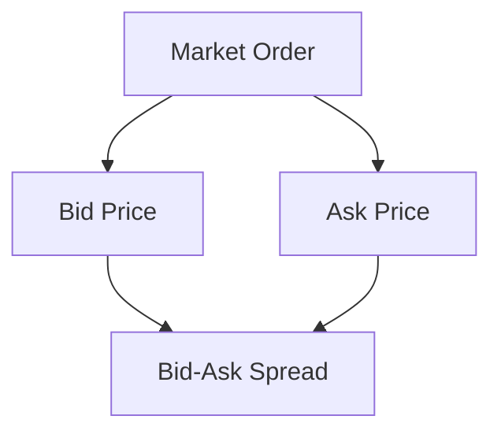

## 9.14 Market Orders

In the dynamic world of equity transactions, understanding the various types of orders is crucial for effective trading. Among these, market orders are one of the most fundamental and widely used. This section delves into the definition, mechanics, and strategic use of market orders, particularly within the Canadian financial landscape.

### Definition and Mechanics of Market Orders

A market order is an instruction to buy or sell a security immediately at the best available current price. Unlike limit orders, which specify a price at which the order must be executed, market orders prioritize speed and execution certainty over price. This makes them a preferred choice for traders who wish to enter or exit positions swiftly.

#### How Market Orders Work

When a market order is placed, it is executed at the current market price, which is determined by the highest bid price for a sell order or the lowest ask price for a buy order. The simplicity of market orders lies in their straightforward nature: they are executed as soon as possible, provided there is sufficient liquidity in the market.

Consider a scenario where an investor wants to purchase shares of a Canadian company, such as Royal Bank of Canada (RBC). By placing a market order, the investor ensures that the order is filled almost instantly, albeit at the prevailing market price, which could fluctuate between the time the order is placed and executed.

### Execution Guarantees and Potential Price Variability

One of the primary advantages of market orders is the guarantee of execution. As long as there are willing buyers and sellers, a market order will be filled. This is particularly beneficial in highly liquid markets where securities are traded frequently, such as the Toronto Stock Exchange (TSX).

However, this execution certainty comes with a trade-off: potential price variability. The final execution price of a market order may differ from the last quoted price due to rapid market movements. This is especially true in volatile markets or for securities with low trading volumes.

#### Example of Price Variability

Imagine an investor places a market order to buy 1,000 shares of a small-cap Canadian technology firm. If the stock is thinly traded, the order might be filled at multiple price points, resulting in an average purchase price that is higher than anticipated. This phenomenon is known as "slippage."

### Optimal Scenarios for Using Market Orders

Market orders are most effective in scenarios where execution speed is more critical than price precision. Here are some optimal situations for using market orders:

1. **Highly Liquid Markets**: In markets with high trading volumes, such as major Canadian banks or energy companies, market orders can be executed quickly with minimal slippage.

2. **Time-Sensitive Trades**: When market conditions are rapidly changing, and immediate execution is necessary, market orders ensure that trades are completed without delay.

3. **Exiting Positions**: Investors looking to quickly exit a position, perhaps due to adverse news affecting a stock, may use market orders to ensure a swift sale.

### Glossary

- **Bid Price**: The highest price a buyer is willing to pay for a security. In the context of a market order, a sell order will be executed at the current bid price.

- **Ask Price**: The lowest price a seller is willing to accept for a security. A buy market order will be executed at the current ask price.

- **Bid-Ask Spread**: The difference between the bid price and the ask price. A narrower spread indicates a more liquid market, which is ideal for executing market orders with minimal slippage.

### Diagrams and Visuals

To better understand the relationship between bid price, ask price, and bid-ask spread, consider the following diagram:

This diagram illustrates how a market order interacts with the bid and ask prices, and how the bid-ask spread can impact the execution of the order.

### Best Practices and Common Pitfalls

**Best Practices:**

- Use market orders in highly liquid markets to minimize slippage.
- Monitor market conditions to determine the best timing for placing market orders.
- Consider using limit orders if price precision is more important than execution speed.

**Common Pitfalls:**

- Avoid using market orders in volatile or illiquid markets where price variability can be significant.
- Be aware of the potential for slippage, especially when trading large volumes or in thinly traded securities.

### References and Additional Resources

For further exploration of market orders and their strategic use, consider the following resources:

- [How Market Orders Work](https://www.khanacademy.org/economics-finance-domain/core-finance/investyc/stock-market-tutorial/v/market-orders)
- Article: *"Pros and Cons of Market Orders"* on investopedia.com.

These resources provide additional insights into the mechanics and strategic considerations of market orders, enhancing your understanding of their role in equity transactions.

### Summary

Market orders are a fundamental tool in the trader's arsenal, offering execution certainty and speed. By understanding their mechanics, optimal usage scenarios, and potential pitfalls, investors can effectively incorporate market orders into their trading strategies, particularly within the Canadian financial markets.

### **Ready to Test Your Knowledge?**

**Practice 10 Essential CSC Exam Questions to Master Your Certification**



### What is a market order?

- [x] An order to buy or sell a security immediately at the best available current price
- [ ] An order to buy or sell a security at a specified price
- [ ] An order to buy or sell a security at the end of the trading day
- [ ] An order to buy or sell a security only if it reaches a certain price

> **Explanation:** A market order is executed immediately at the best available current price, prioritizing speed over price precision.

### What is the primary advantage of a market order?

- [x] Execution certainty
- [ ] Price precision
- [ ] Reduced transaction costs
- [ ] Avoidance of slippage

> **Explanation:** Market orders guarantee execution as long as there is market liquidity, making them advantageous for immediate trades.

### In which scenario is a market order most effective?

- [x] Highly liquid markets
- [ ] Volatile markets
- [ ] Illiquid markets
- [ ] During after-hours trading

> **Explanation:** Market orders are most effective in highly liquid markets where they can be executed quickly with minimal slippage.

### What is the bid price?

- [x] The highest price a buyer is willing to pay for a security
- [ ] The lowest price a seller is willing to accept for a security
- [ ] The average price of a security over a trading day
- [ ] The price at which the last trade occurred

> **Explanation:** The bid price is the highest price a buyer is willing to pay for a security.

### What is the ask price?

- [x] The lowest price a seller is willing to accept for a security
- [ ] The highest price a buyer is willing to pay for a security
- [ ] The average price of a security over a trading day
- [ ] The price at which the last trade occurred

> **Explanation:** The ask price is the lowest price a seller is willing to accept for a security.

### What is the bid-ask spread?

- [x] The difference between the bid price and the ask price
- [ ] The average price of a security over a trading day
- [ ] The total volume of trades for a security
- [ ] The price at which the last trade occurred

> **Explanation:** The bid-ask spread is the difference between the bid price and the ask price, indicating market liquidity.

### What is a potential downside of using a market order?

- [x] Price variability or slippage
- [ ] Execution delay
- [ ] Reduced liquidity
- [ ] Increased transaction costs

> **Explanation:** Market orders can result in price variability or slippage, especially in volatile or illiquid markets.

### When should you avoid using market orders?

- [x] In volatile or illiquid markets
- [ ] In highly liquid markets
- [ ] When immediate execution is needed
- [ ] When trading large-cap stocks

> **Explanation:** Market orders should be avoided in volatile or illiquid markets due to potential price variability.

### What does slippage refer to in the context of market orders?

- [x] The difference between the expected price and the actual execution price
- [ ] The delay in order execution
- [ ] The increase in transaction costs
- [ ] The reduction in market liquidity

> **Explanation:** Slippage refers to the difference between the expected price of a trade and the actual execution price, often occurring in volatile or illiquid markets.

### True or False: Market orders guarantee the price at which a trade will be executed.

- [ ] True
- [x] False

> **Explanation:** Market orders guarantee execution but not the price, as they are filled at the best available current price, which can vary.


