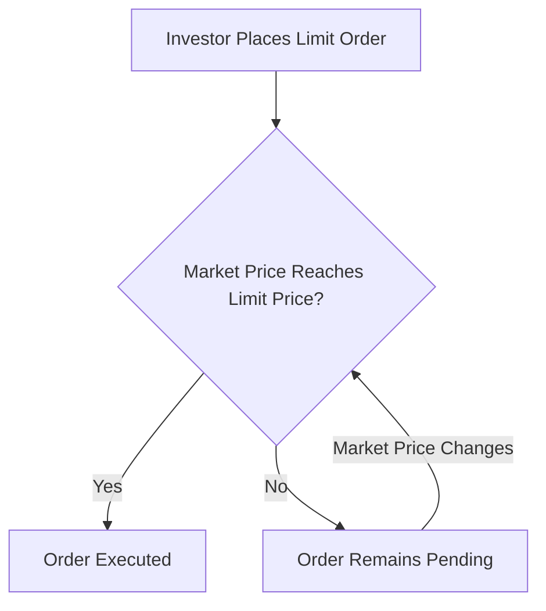

## 9.15 Limit Orders

In the realm of equity transactions, understanding the various types of orders available to investors is crucial for effective trading. Among these, limit orders stand out as a powerful tool for investors seeking to execute trades at specific prices. This section delves into the definition, mechanics, and strategic use of limit orders, particularly within the Canadian financial market.

### Definition and Mechanics of Limit Orders

A limit order is a type of order to buy or sell a security at a specified price or better. For a buy limit order, the order will only be executed at the limit price or lower, while a sell limit order will only be executed at the limit price or higher. This contrasts with a market order, which is executed immediately at the current market price.

**Mechanics of Limit Orders:**

- **Limit Price:** The specified price at which the investor is willing to buy or sell a security. This price acts as a threshold, ensuring that the order is only executed if the market reaches this level.
- **Execution Risk:** The risk that the order may not be executed if the market price does not reach the limit price. This is a trade-off for the price certainty that limit orders provide.

### Benefits of Executing Orders at Desired Prices or Better

Limit orders offer several advantages, particularly for investors who prioritize price over the immediacy of execution:

1. **Price Control:** Investors can set the exact price at which they are willing to buy or sell, providing greater control over their investment strategy.
2. **Protection Against Volatility:** In volatile markets, limit orders can protect investors from executing trades at unfavorable prices.
3. **Strategic Entry and Exit Points:** Investors can use limit orders to strategically enter or exit positions, aligning with their broader investment goals.

### Use in Less Liquid Markets with Wider Bid-Ask Spreads

Limit orders are particularly useful in less liquid markets, where securities may have wider bid-ask spreads. In such markets, the difference between the highest price a buyer is willing to pay (bid) and the lowest price a seller is willing to accept (ask) can be significant. Limit orders allow investors to specify their desired price, potentially bridging the gap between the bid and ask prices.

**Example:**

Consider a scenario involving a Canadian small-cap stock with a bid price of $10.00 and an ask price of $10.50. An investor who believes the stock is worth $10.25 might place a buy limit order at this price. If the market price falls to $10.25 or lower, the order will be executed, allowing the investor to purchase the stock at a favorable price.

### Practical Financial Examples and Case Studies

To illustrate the practical application of limit orders, let's consider a case study involving a major Canadian bank, such as the Royal Bank of Canada (RBC).

**Case Study: RBC Stock Trading**

An investor is interested in purchasing shares of RBC, currently trading at $100.00 per share. However, the investor believes that the stock is slightly overvalued and sets a buy limit order at $98.00. Over the next few days, the stock price fluctuates, and the order is eventually executed when the price dips to $98.00. This strategic use of a limit order allows the investor to acquire shares at a price aligned with their valuation.

### Step-by-Step Guidance for Setting Limit Orders

1. **Determine Your Limit Price:** Assess the security's current market conditions and decide on the price at which you are willing to buy or sell.
2. **Choose the Order Type:** Select a buy or sell limit order based on your investment strategy.
3. **Set the Duration:** Decide how long the order should remain active. Options may include "Day" orders, which expire at the end of the trading day, or "Good 'Til Canceled" (GTC) orders, which remain active until executed or canceled.
4. **Monitor Market Conditions:** Keep an eye on market movements to ensure your limit order remains relevant and adjust if necessary.

### Diagrams and Visual Aids

To better understand the flow of limit orders, consider the following diagram illustrating the execution process:

### Best Practices, Common Pitfalls, and Strategies

**Best Practices:**

- **Set Realistic Limit Prices:** Ensure your limit price reflects realistic market conditions to increase the likelihood of execution.
- **Use Limit Orders in Volatile Markets:** Protect against unfavorable price swings by setting limit orders during periods of high volatility.

**Common Pitfalls:**

- **Execution Risk:** Be aware that limit orders may not be executed if the market does not reach the specified price.
- **Overly Ambitious Pricing:** Setting a limit price too far from the current market price can result in missed trading opportunities.

**Strategies to Overcome Challenges:**

- **Regularly Review and Adjust Orders:** Monitor your limit orders and adjust them as necessary to align with changing market conditions.
- **Combine with Other Order Types:** Use limit orders in conjunction with stop orders to manage risk and optimize trading strategies.

### References and Additional Resources

For further exploration of limit orders and their strategic use, consider the following resources:

- [Understanding Limit Orders](https://www.investopedia.com/articles/trading/09/limit-orders.asp)
- Tutorial: [Setting Effective Limit Orders](https://www.youtube.com/watch?v=E2aM8zk4kF0)

### Glossary

- **Limit Price:** The specific price set by an investor for a limit order, acting as a threshold for execution.
- **Execution Risk:** The risk that a limit order may not be executed if the market price does not reach the specified limit price.

### **Ready to Test Your Knowledge?**

**Practice 10 Essential CSC Exam Questions to Master Your Certification**



### What is a limit order?

- [x] An order to buy or sell a security at a specified price or better
- [ ] An order to buy or sell a security immediately at the current market price
- [ ] An order to buy a security at any available price
- [ ] An order to sell a security at any available price

> **Explanation:** A limit order specifies the price at which an investor is willing to buy or sell, ensuring execution only at that price or better.

### What is the primary benefit of using a limit order?

- [x] Price control
- [ ] Immediate execution
- [ ] Guaranteed execution
- [ ] Reduced transaction fees

> **Explanation:** Limit orders provide price control, allowing investors to specify the exact price at which they are willing to trade.

### In what type of market are limit orders particularly useful?

- [x] Less liquid markets with wider bid-ask spreads
- [ ] Highly liquid markets with narrow bid-ask spreads
- [ ] Markets with high transaction fees
- [ ] Markets with low volatility

> **Explanation:** Limit orders are useful in less liquid markets where bid-ask spreads are wider, allowing investors to specify their desired price.

### What is execution risk in the context of limit orders?

- [x] The risk that the order may not be executed if the market price does not reach the limit price
- [ ] The risk of executing the order at a worse price than desired
- [ ] The risk of incurring higher transaction fees
- [ ] The risk of immediate execution at the current market price

> **Explanation:** Execution risk refers to the possibility that a limit order may not be executed if the market does not reach the specified limit price.

### Which of the following is a common pitfall of using limit orders?

- [x] Setting overly ambitious limit prices
- [ ] Immediate execution at the current market price
- [ ] Guaranteed execution regardless of market conditions
- [ ] Reduced control over the execution price

> **Explanation:** Setting overly ambitious limit prices can result in missed trading opportunities if the market does not reach the specified price.

### How can investors mitigate execution risk with limit orders?

- [x] Regularly review and adjust orders
- [ ] Set limit prices far from the current market price
- [ ] Use only market orders
- [ ] Avoid trading in volatile markets

> **Explanation:** Regularly reviewing and adjusting limit orders can help ensure they remain relevant to current market conditions.

### What is a common strategy for using limit orders in volatile markets?

- [x] Protect against unfavorable price swings
- [ ] Ensure immediate execution
- [ ] Reduce transaction fees
- [ ] Increase execution risk

> **Explanation:** In volatile markets, limit orders can protect against executing trades at unfavorable prices by setting specific price thresholds.

### What is the role of the limit price in a limit order?

- [x] It acts as a threshold for execution
- [ ] It guarantees immediate execution
- [ ] It reduces transaction fees
- [ ] It increases execution risk

> **Explanation:** The limit price is the specified price at which an investor is willing to trade, acting as a threshold for execution.

### What should investors consider when setting a limit price?

- [x] Realistic market conditions
- [ ] Immediate execution
- [ ] Guaranteed execution
- [ ] Reduced transaction fees

> **Explanation:** Investors should set limit prices that reflect realistic market conditions to increase the likelihood of execution.

### True or False: Limit orders guarantee execution at the specified price.

- [ ] True
- [x] False

> **Explanation:** Limit orders do not guarantee execution; they are only executed if the market reaches the specified limit price.


