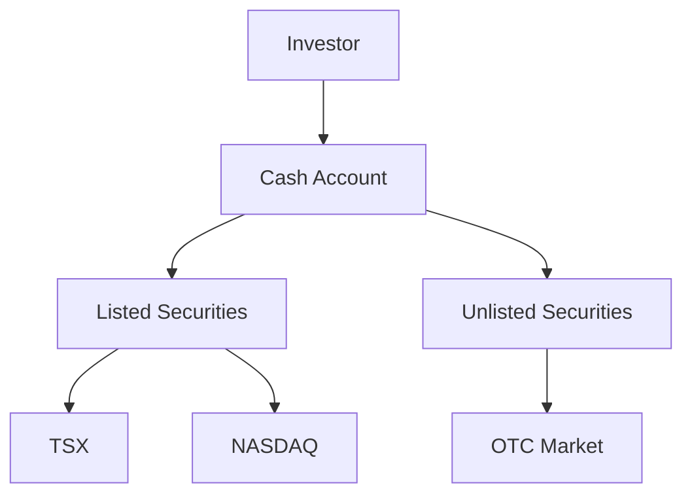

## 9.2.1 Cash Accounts

In the realm of equity transactions, cash accounts serve as a foundational component for investors, particularly those who prefer a straightforward and lower-risk approach to investing. This section delves into the intricacies of cash accounts, highlighting their full payment requirements, simplicity, and the types of securities that can be traded within them. Understanding these elements is crucial for anyone looking to navigate the Canadian securities landscape effectively.

### Full Payment Requirement

One of the defining characteristics of a cash account is the requirement for full payment of securities by the settlement date. This means that investors must have the necessary funds available to cover the entire purchase price of the securities they wish to acquire. The settlement date is the specific date by which the transaction must be completed, typically two business days after the trade date for most securities in Canada, known as T+2.

#### Example: Full Payment in Action

Consider an investor, Jane, who decides to purchase 100 shares of a Canadian company listed on the Toronto Stock Exchange (TSX) at $50 per share. The total cost of this transaction would be $5,000. In a cash account, Jane must ensure that she has the full $5,000 available in her account by the settlement date to complete the purchase. This requirement underscores the importance of liquidity and financial planning in managing a cash account.

### No Borrowing and Interest

Cash accounts do not permit borrowing funds or trading on margin, which distinguishes them from margin accounts. This restriction means that investors cannot leverage their investments by borrowing additional funds to increase their purchasing power. Consequently, cash accounts do not incur interest charges associated with borrowed funds, making them a cost-effective option for investors who prefer to avoid debt.

#### Practical Implications

The absence of borrowing in cash accounts limits investment risk to the amount invested. Investors are not exposed to the potential for margin calls, which occur when the value of securities purchased on margin falls below a certain level, requiring additional funds to maintain the position. This feature makes cash accounts particularly appealing to conservative investors who prioritize capital preservation.

### Simplicity and Lower Risk

The simplicity of cash accounts is one of their most attractive features. By limiting transactions to the available cash balance, investors can easily track their investments and manage their portfolios without the complexities associated with margin trading. This straightforward approach reduces the likelihood of overextending financially and helps investors maintain a clear understanding of their financial position.

#### Risk Management

In a cash account, the risk is confined to the amount invested, as there is no exposure to borrowed funds. This characteristic makes cash accounts an ideal choice for novice investors or those with a low-risk tolerance. By focusing on the cash available, investors can make informed decisions without the pressure of managing debt or interest payments.

### Security Types Traded

Cash accounts offer the flexibility to trade both listed and unlisted securities. Listed securities are those traded on formal exchanges such as the TSX or NASDAQ, providing investors with access to a wide range of established companies. Unlisted securities, on the other hand, are traded over-the-counter (OTC) and are not listed on formal exchanges. These securities can include smaller or emerging companies, offering unique investment opportunities.

#### Diagram: Trading in Cash Accounts

Below is a diagram illustrating the flow of transactions in a cash account, highlighting the types of securities that can be traded.

### Best Practices and Common Pitfalls

**Best Practices:**
- **Maintain Liquidity:** Ensure sufficient funds are available to meet the full payment requirement by the settlement date.
- **Monitor Portfolio:** Regularly review your investments to align with your financial goals and risk tolerance.
- **Diversify Investments:** Consider a mix of listed and unlisted securities to balance risk and potential returns.

**Common Pitfalls:**
- **Overcommitting Funds:** Avoid committing more funds than available, which can lead to missed settlement deadlines.
- **Ignoring Market Trends:** Stay informed about market conditions to make timely and informed investment decisions.

### Conclusion

Cash accounts offer a straightforward and lower-risk approach to investing in equity securities. By requiring full payment and prohibiting borrowing, these accounts help investors manage their portfolios with clarity and discipline. Whether trading listed or unlisted securities, cash accounts provide a solid foundation for building a diversified investment strategy.

For further exploration, consider resources such as the Canadian Securities Administrators (CSA) website for regulatory updates and investment guides. Additionally, books like "The Intelligent Investor" by Benjamin Graham offer timeless insights into value investing principles.

## Quiz Time!



### What is a key characteristic of a cash account?

- [x] Full payment is required by the settlement date.
- [ ] Borrowing is allowed.
- [ ] Interest is charged on borrowed funds.
- [ ] Margin trading is permitted.

> **Explanation:** In a cash account, investors must pay the full purchase price by the settlement date, and borrowing is not allowed.

### What is the typical settlement date for most securities in Canada?

- [ ] T+1
- [x] T+2
- [ ] T+3
- [ ] T+4

> **Explanation:** The typical settlement date for most securities in Canada is T+2, meaning two business days after the trade date.

### Which of the following securities can be traded in a cash account?

- [x] Listed securities
- [x] Unlisted securities
- [ ] Only listed securities
- [ ] Only unlisted securities

> **Explanation:** Both listed and unlisted securities can be traded in a cash account.

### What is a benefit of not allowing borrowing in cash accounts?

- [x] Limits investment risk to the amount invested.
- [ ] Increases potential returns through leverage.
- [ ] Allows for margin calls.
- [ ] Requires interest payments.

> **Explanation:** By not allowing borrowing, cash accounts limit investment risk to the amount invested, avoiding the complexities of leverage and margin calls.

### Why might a conservative investor prefer a cash account?

- [x] Simplicity and lower risk
- [ ] Higher potential returns
- [ ] Ability to trade on margin
- [ ] Access to borrowed funds

> **Explanation:** Conservative investors may prefer cash accounts due to their simplicity and lower risk, as they do not involve borrowing or margin trading.

### What is a common pitfall when managing a cash account?

- [x] Overcommitting funds
- [ ] Diversifying investments
- [ ] Monitoring portfolio regularly
- [ ] Maintaining liquidity

> **Explanation:** Overcommitting funds can lead to missed settlement deadlines, a common pitfall in managing cash accounts.

### Which market do unlisted securities typically trade on?

- [ ] TSX
- [ ] NASDAQ
- [x] OTC Market
- [ ] Formal exchanges

> **Explanation:** Unlisted securities typically trade on the OTC Market, not on formal exchanges like the TSX or NASDAQ.

### What is a best practice for managing a cash account?

- [x] Maintain liquidity
- [ ] Ignore market trends
- [ ] Overcommit funds
- [ ] Focus solely on listed securities

> **Explanation:** Maintaining liquidity is a best practice for managing a cash account, ensuring funds are available for settlement.

### What is the risk level associated with cash accounts?

- [x] Lower risk
- [ ] High risk
- [ ] Moderate risk
- [ ] No risk

> **Explanation:** Cash accounts are associated with lower risk as they do not involve borrowing or margin trading.

### True or False: Cash accounts allow for trading on margin.

- [ ] True
- [x] False

> **Explanation:** False. Cash accounts do not allow for trading on margin, as they require full payment for securities.


