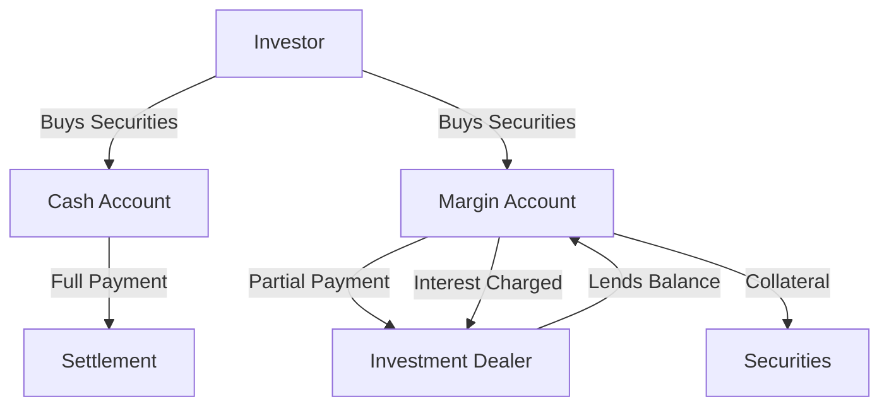

## 9.2 Cash Accounts and Margin Accounts

In the realm of equity transactions, understanding the nuances between cash accounts and margin accounts is crucial for any investor or financial professional. These two types of brokerage accounts offer distinct mechanisms for trading securities, each with its own set of rules, benefits, and risks. This section will delve into the operational mechanics of both account types, highlighting their differences and implications for investors in the Canadian financial market.

### Understanding Cash Accounts

A **cash account** is a type of brokerage account where the investor is required to pay the full amount for the securities purchased by the settlement date. This means that when an investor buys a stock, bond, or other security, they must have sufficient funds in their account to cover the entire purchase price by the time the transaction settles.

#### Operational Mechanics

- **Full Payment Requirement:** In a cash account, investors must pay for their securities in full by the settlement date, which is typically two business days after the trade date (T+2) for most securities in Canada. This ensures that the investor has a clear understanding of their financial commitment and avoids the risks associated with borrowing.

- **Types of Securities:** Cash accounts are commonly used for trading a wide range of securities, including stocks, bonds, mutual funds, and exchange-traded funds (ETFs). These accounts are suitable for investors who prefer to avoid the complexities and risks associated with borrowing.

- **Regulatory Compliance:** Investors using cash accounts must adhere to Canadian regulatory requirements, ensuring that all transactions are settled promptly and in accordance with the rules set by the Canadian Investment Regulatory Organization (CIRO).

### Understanding Margin Accounts

A **margin account** differs significantly from a cash account in that it allows investors to purchase securities on credit. This means that investors can borrow a portion of the purchase price from their investment dealer, using the securities themselves as collateral.

#### Operational Mechanics

- **Buying on Margin:** In a margin account, investors can buy securities by paying only a portion of the purchase price upfront, with the remainder being financed by the investment dealer. This leverage can amplify both gains and losses, making margin accounts a powerful but risky tool.

- **Role of the Investment Dealer:** The investment dealer plays a crucial role in margin accounts by lending the balance of the purchase price to the investor. In return, the dealer charges interest on the borrowed funds, which can vary based on market conditions and the dealer's policies.

- **Collateral and Maintenance Margin:** The securities purchased on margin serve as collateral for the loan. Investors must maintain a minimum level of equity in their account, known as the maintenance margin, to avoid a margin call, where the dealer demands additional funds or securities to cover potential losses.

### Differences Between Cash and Margin Accounts

Understanding the differences between cash and margin accounts is essential for making informed investment decisions. Here are some key distinctions:

#### Features and Benefits

- **Cash Accounts:** 
  - **Simplicity and Safety:** Cash accounts are straightforward, requiring full payment for securities, which minimizes the risk of over-leveraging.
  - **No Interest Charges:** Since there is no borrowing involved, investors do not incur interest charges, making cash accounts cost-effective for long-term investments.

- **Margin Accounts:**
  - **Leverage Opportunities:** Margin accounts offer the potential for higher returns through leverage, allowing investors to control larger positions with less capital.
  - **Flexibility:** Investors can quickly capitalize on market opportunities without needing to liquidate other assets to raise funds.

#### Obligations and Risks

- **Cash Accounts:**
  - **Limited to Available Funds:** Investors can only purchase securities up to the amount of cash available in their account, which may limit investment opportunities.
  - **Lower Risk Exposure:** Without borrowing, investors are less exposed to market volatility and potential losses.

- **Margin Accounts:**
  - **Interest Costs:** Borrowing funds incurs interest charges, which can erode returns if not managed carefully.
  - **Increased Risk:** The use of leverage magnifies both gains and losses, requiring careful risk management and monitoring to avoid margin calls.

### Practical Example: Canadian Pension Funds

Consider a Canadian pension fund that primarily uses cash accounts for its equity investments. By avoiding leverage, the fund minimizes risk and ensures stable returns for its beneficiaries. In contrast, a hedge fund might use margin accounts to amplify returns, accepting higher risk in pursuit of greater profits.

### Diagram: Cash vs. Margin Accounts

Below is a diagram illustrating the flow of funds and securities in cash and margin accounts:

### Best Practices and Common Pitfalls

- **Cash Accounts:** Ensure sufficient funds are available before making trades to avoid settlement issues. Use cash accounts for long-term investments where leverage is unnecessary.

- **Margin Accounts:** Monitor account balances regularly to avoid margin calls. Use stop-loss orders to manage risk and limit potential losses.

### Glossary

- **Cash Account:** A brokerage account where the investor must fully pay for securities purchased by the settlement date.
- **Margin Account:** A brokerage account that allows the investor to borrow funds from the dealer to purchase securities, using the securities as collateral.
- **Settlement Date:** The date on which the buyer must pay for the securities and the seller must deliver them.

### Conclusion

Understanding the differences between cash and margin accounts is vital for making informed investment decisions. Each account type offers unique advantages and risks, and choosing the right one depends on an investor's financial goals, risk tolerance, and market outlook. By mastering the mechanics of these accounts, investors can better navigate the Canadian financial landscape and optimize their investment strategies.

## Quiz Time!



### What is a cash account?

- [x] A brokerage account where the investor must fully pay for securities purchased by the settlement date.
- [ ] A brokerage account that allows borrowing to purchase securities.
- [ ] An account that charges interest on all transactions.
- [ ] An account used exclusively for trading derivatives.

> **Explanation:** A cash account requires full payment for securities by the settlement date, without borrowing.

### What is a margin account?

- [x] A brokerage account that allows the investor to borrow funds from the dealer to purchase securities.
- [ ] An account that requires full payment for securities by the settlement date.
- [ ] An account that does not allow trading of stocks.
- [ ] An account used only for mutual funds.

> **Explanation:** A margin account allows borrowing to purchase securities, using them as collateral.

### What is the settlement date?

- [x] The date on which the buyer must pay for the securities and the seller must deliver them.
- [ ] The date the investor opens the account.
- [ ] The date the investor receives dividends.
- [ ] The date the investor sells the securities.

> **Explanation:** The settlement date is when payment and delivery of securities occur.

### Which account type involves interest charges?

- [x] Margin Account
- [ ] Cash Account
- [ ] Savings Account
- [ ] Retirement Account

> **Explanation:** Margin accounts involve borrowing, which incurs interest charges.

### What is a key benefit of a cash account?

- [x] No interest charges
- [ ] Leverage opportunities
- [ ] Higher risk exposure
- [ ] Immediate liquidity

> **Explanation:** Cash accounts do not involve borrowing, so there are no interest charges.

### What is a key benefit of a margin account?

- [x] Leverage opportunities
- [ ] No risk
- [ ] Guaranteed returns
- [ ] No need for collateral

> **Explanation:** Margin accounts allow investors to leverage their positions, potentially increasing returns.

### What is a common risk associated with margin accounts?

- [x] Margin calls
- [ ] No access to funds
- [ ] Limited trading options
- [ ] No potential for profit

> **Explanation:** Margin accounts can lead to margin calls if the account equity falls below the required level.

### What is a common pitfall of using cash accounts?

- [x] Limited to available funds
- [ ] High interest rates
- [ ] Excessive leverage
- [ ] Frequent margin calls

> **Explanation:** Cash accounts limit purchases to the available cash, which may restrict investment opportunities.

### How can investors manage risk in margin accounts?

- [x] Use stop-loss orders
- [ ] Ignore market trends
- [ ] Avoid diversification
- [ ] Increase borrowing

> **Explanation:** Stop-loss orders help manage risk by limiting potential losses.

### True or False: Cash accounts are more suitable for long-term investments where leverage is unnecessary.

- [x] True
- [ ] False

> **Explanation:** Cash accounts are ideal for long-term investments as they do not involve borrowing or leverage.


