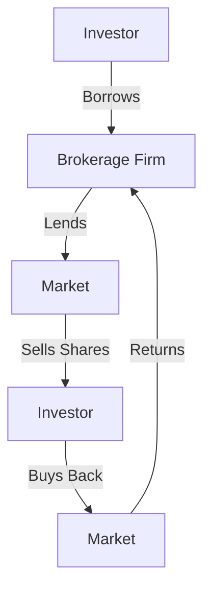

## 9.3.2 Establishing Short Margin Positions

Short selling is a sophisticated investment strategy that involves selling securities that the seller does not own, with the intention of buying them back later at a lower price. This section delves into the mechanics of short selling, the margin requirements involved, how to calculate profits and losses, and the risks associated with this strategy, particularly within the Canadian financial context.

### Mechanics of Short Selling

The process of short selling begins with borrowing securities from a dealer. Here's a step-by-step breakdown:

1. **Borrowing Securities:** The investor contacts their brokerage firm to borrow shares of a particular security. The brokerage firm, acting as an intermediary, lends the securities from its own inventory or from other clients' holdings.

2. **Selling the Borrowed Securities:** Once borrowed, the investor sells the securities in the open market at the current market price. This transaction generates cash proceeds for the investor.

3. **Repurchasing the Securities:** The investor aims to repurchase the same number of shares at a lower price in the future. This is known as "covering" the short position.

4. **Returning the Securities:** After repurchasing, the investor returns the shares to the brokerage firm, completing the transaction.

This process is illustrated in the following diagram:

### Margin Requirements

In Canada, short selling requires a margin account. The margin requirements are determined by the price tier of the security:

- **Securities priced at $2.00 or more:** The minimum margin requirement is typically 150% of the market value of the short position.
- **Securities priced between $1.50 and $1.99:** The requirement is 200% of the market value.
- **Securities priced below $1.50:** Short selling is generally not permitted due to increased risk.

These requirements ensure that the investor maintains sufficient equity in their account to cover potential losses.

### Profit and Loss Calculation

The profitability of a short sale depends on the movement of the security's price:

- **Profit Scenario:** If the security's price declines, the investor can repurchase the shares at a lower price than they were sold, pocketing the difference as profit. For example, if an investor sells borrowed shares at $50 each and later buys them back at $40, the profit per share is $10.

- **Loss Scenario:** Conversely, if the security's price rises, the investor incurs a loss. Continuing the example, if the shares are repurchased at $60, the loss per share is $10.

The following table summarizes the profit and loss scenarios:

| Action                  | Price per Share | Total for 100 Shares |
|-------------------------|-----------------|----------------------|
| Initial Sale            | $50             | $5,000               |
| Repurchase (Profit)     | $40             | $4,000               |
| **Profit**              |                 | **$1,000**           |
| Repurchase (Loss)       | $60             | $6,000               |
| **Loss**                |                 | **$1,000**           |

### Unlimited Risk

One of the most significant risks of short selling is the potential for unlimited losses. Unlike a traditional long position, where the maximum loss is the initial investment, a short position can incur losses that exceed the initial sale price if the security's price rises indefinitely. This is known as **unlimited risk**.

For instance, if a stock sold short at $50 rises to $150, the investor faces a $100 loss per share. Theoretically, since there is no cap on how high a stock's price can go, the potential losses are limitless.

### Best Practices and Risk Management

To mitigate the risks associated with short selling, consider the following best practices:

- **Set Stop-Loss Orders:** Establish automatic buy-back points to limit potential losses.
- **Diversify Short Positions:** Avoid concentrating on a single security or sector.
- **Stay Informed:** Monitor market conditions and news that could impact the security's price.
- **Understand Regulatory Requirements:** Familiarize yourself with CIRO and provincial regulations regarding short selling.

### Conclusion

Short selling can be a powerful tool for investors looking to profit from declining markets. However, it requires a thorough understanding of the mechanics, margin requirements, and risks involved. By adhering to best practices and maintaining a disciplined approach, investors can effectively manage the inherent risks of short selling.

## Quiz Time!



### What is the first step in the short selling process?

- [x] Borrowing securities from the dealer
- [ ] Selling securities in the market
- [ ] Repurchasing securities
- [ ] Returning securities to the dealer

> **Explanation:** The short selling process begins with borrowing securities from the dealer.

### What is the minimum margin requirement for securities priced at $2.00 or more?

- [x] 150% of the market value
- [ ] 100% of the market value
- [ ] 200% of the market value
- [ ] 50% of the market value

> **Explanation:** For securities priced at $2.00 or more, the minimum margin requirement is typically 150% of the market value.

### How is profit calculated in a short sale?

- [x] By subtracting the repurchase price from the initial sale price
- [ ] By adding the repurchase price to the initial sale price
- [ ] By multiplying the repurchase price by the initial sale price
- [ ] By dividing the repurchase price by the initial sale price

> **Explanation:** Profit in a short sale is calculated by subtracting the repurchase price from the initial sale price.

### What is the main risk associated with short selling?

- [x] Unlimited risk due to potential price increases
- [ ] Limited risk due to price decreases
- [ ] No risk involved
- [ ] Guaranteed profit

> **Explanation:** The main risk in short selling is unlimited risk due to the potential for the security's price to rise indefinitely.

### Which of the following is a best practice for managing short selling risk?

- [x] Set stop-loss orders
- [ ] Concentrate on a single security
- [x] Diversify short positions
- [ ] Ignore market conditions

> **Explanation:** Setting stop-loss orders and diversifying short positions are best practices for managing risk in short selling.

### What happens if the security's price rises after a short sale?

- [x] The investor incurs a loss
- [ ] The investor makes a profit
- [ ] The investor breaks even
- [ ] The investor's position is unaffected

> **Explanation:** If the security's price rises after a short sale, the investor incurs a loss.

### What is the purpose of a margin account in short selling?

- [x] To ensure sufficient equity to cover potential losses
- [ ] To eliminate the need for borrowing securities
- [x] To meet regulatory requirements
- [ ] To guarantee profits

> **Explanation:** A margin account ensures that the investor has sufficient equity to cover potential losses and meets regulatory requirements.

### What is the potential loss in a short sale if the stock price rises indefinitely?

- [x] Unlimited
- [ ] Limited to the initial sale price
- [ ] Zero
- [ ] Equal to the initial investment

> **Explanation:** The potential loss in a short sale is unlimited if the stock price rises indefinitely.

### What is the role of the brokerage firm in short selling?

- [x] Lending securities to the investor
- [ ] Buying securities for the investor
- [ ] Selling securities for the investor
- [ ] Setting the market price

> **Explanation:** The brokerage firm lends securities to the investor for short selling.

### True or False: Short selling is risk-free if the investor sets stop-loss orders.

- [ ] True
- [x] False

> **Explanation:** While stop-loss orders can help manage risk, short selling is not risk-free due to the potential for unlimited losses.


