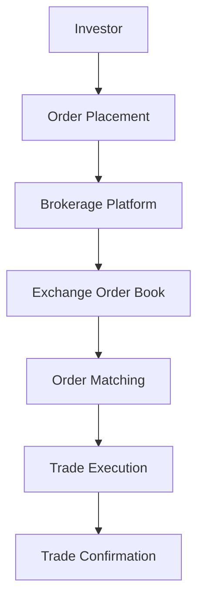

## 9.6.1 Trade Execution Process

The trade execution process is a critical component of equity transactions, ensuring that buy and sell orders are efficiently processed in the financial markets. Understanding this process is essential for anyone involved in trading securities, from individual investors to institutional traders. This section will guide you through the key stages of trade execution, focusing on the Canadian financial market, and provide practical insights and examples to enhance your understanding.

### Order Placement

The trade execution process begins with order placement. Investors, whether individuals or institutions, initiate trades by placing buy or sell orders through their investment advisors or brokerage platforms. In Canada, this often involves using online trading platforms provided by major banks such as RBC or TD, or independent brokers like Questrade.

**Steps in Order Placement:**

1. **Selection of Security:** The investor decides on the security they wish to buy or sell, such as shares of a Canadian company listed on the Toronto Stock Exchange (TSX).

2. **Order Type Specification:** The investor specifies the type of order, which could be a market order (executed immediately at the current market price) or a limit order (executed only at a specified price or better).

3. **Quantity Determination:** The investor indicates the number of shares they wish to trade.

4. **Order Submission:** The order is submitted through the brokerage platform, where it is transmitted to the market for execution.

**Example:** An investor wants to purchase 100 shares of Shopify Inc. They log into their brokerage account, select Shopify Inc. from the list of available securities, choose a market order, and specify 100 shares. The order is then submitted for execution.

### Price Quotation

Once an order is placed, the next step involves understanding the current market prices, which are communicated through bid and ask prices. These prices are crucial for investors to make informed decisions.

- **Bid Price:** The highest price a buyer is willing to pay for a security.
- **Ask Price:** The lowest price a seller is willing to accept for a security.
- **Bid-Ask Spread:** The difference between the bid and ask prices, representing the transaction cost for the investor.

**Example:** Suppose the bid price for Shopify Inc. is $1,500, and the ask price is $1,505. The bid-ask spread is $5. This spread can vary based on market conditions and the liquidity of the security.

### Order Matching

Order matching is the core of the trade execution process, where buy and sell orders are paired to facilitate a trade. This process occurs on the exchange, such as the TSX, using sophisticated algorithms to ensure efficient and fair matching.

**Steps in Order Matching:**

1. **Order Book Entry:** Once an order is placed, it enters the exchange's order book, where it is queued based on price and time priority.

2. **Matching Algorithm:** The exchange's matching engine pairs buy and sell orders based on the best available prices. Market orders are matched first, followed by limit orders.

3. **Execution:** Once a match is found, the trade is executed at the prevailing market price.

**Example:** If an investor places a market order to buy 100 shares of Shopify Inc., and there is a corresponding sell order at the ask price of $1,505, the trade is executed at this price.

### Trade Confirmation

After a trade is executed, the final step is trade confirmation. This involves providing the investor with a detailed record of the transaction, ensuring transparency and accuracy.

**Components of Trade Confirmation:**

- **Trade Date and Time:** The exact date and time when the trade was executed.
- **Security Details:** Information about the security traded, including the name and ticker symbol.
- **Price and Quantity:** The price at which the trade was executed and the number of shares involved.
- **Transaction Fees:** Any fees or commissions charged by the brokerage for executing the trade.

**Example:** After purchasing 100 shares of Shopify Inc. at $1,505 per share, the investor receives a trade confirmation detailing the transaction, including the total cost, which includes any applicable fees.

### Practical Insights and Best Practices

- **Understand Order Types:** Familiarize yourself with different order types and their implications on trade execution. Market orders ensure immediate execution, while limit orders provide price control.

- **Monitor Bid-Ask Spreads:** Pay attention to bid-ask spreads, as wider spreads can increase transaction costs. This is particularly important for less liquid securities.

- **Use Reliable Platforms:** Choose a reputable brokerage platform that offers real-time data and efficient order execution.

- **Review Trade Confirmations:** Always review trade confirmations for accuracy and report any discrepancies to your broker immediately.

### Common Challenges and Solutions

- **Market Volatility:** High volatility can lead to rapid price changes, affecting order execution. Consider using limit orders to manage price risk.

- **Order Execution Delays:** Delays can occur due to technical issues or market congestion. Ensure your brokerage platform is reliable and has robust infrastructure.

- **Inaccurate Price Quotes:** Real-time data is essential for accurate price quotes. Use platforms that provide up-to-date market information.

### Diagrams and Visual Aids

To further illustrate the trade execution process, consider the following diagram:

This diagram represents the flow of a trade from the investor's order placement to the final trade confirmation.

### Conclusion

The trade execution process is a fundamental aspect of equity transactions, involving multiple steps from order placement to trade confirmation. By understanding each stage and the associated best practices, investors can navigate the Canadian financial markets more effectively. As you continue to explore equity trading, consider how these principles apply to your investment strategies and portfolio management.

## Quiz Time!



### What is the first step in the trade execution process?

- [x] Order Placement
- [ ] Price Quotation
- [ ] Order Matching
- [ ] Trade Confirmation

> **Explanation:** The trade execution process begins with order placement, where investors initiate trades by placing buy or sell orders.

### What is the bid price?

- [x] The highest price a buyer is willing to pay for a security.
- [ ] The lowest price a seller is willing to accept for a security.
- [ ] The difference between the bid and ask prices.
- [ ] The price at which a trade is executed.

> **Explanation:** The bid price is the highest price a buyer is willing to pay for a security.

### What does the bid-ask spread represent?

- [x] The difference between the bid and ask prices of a security.
- [ ] The total transaction cost for a trade.
- [ ] The price at which a trade is executed.
- [ ] The highest price a buyer is willing to pay.

> **Explanation:** The bid-ask spread is the difference between the bid and ask prices, representing the transaction cost.

### What type of order is executed immediately at the current market price?

- [x] Market Order
- [ ] Limit Order
- [ ] Stop Order
- [ ] Conditional Order

> **Explanation:** A market order is executed immediately at the current market price.

### What information is included in a trade confirmation?

- [x] Trade Date and Time
- [x] Security Details
- [ ] Order Book Entry
- [ ] Matching Algorithm

> **Explanation:** Trade confirmations include the trade date and time, security details, price, quantity, and transaction fees.

### What is the role of the exchange's matching engine?

- [x] To pair buy and sell orders based on the best available prices.
- [ ] To provide real-time price quotes to investors.
- [ ] To confirm trades with investors.
- [ ] To calculate transaction fees.

> **Explanation:** The exchange's matching engine pairs buy and sell orders based on the best available prices.

### What should investors do if they notice discrepancies in their trade confirmations?

- [x] Report them to their broker immediately.
- [ ] Ignore them as they are usually minor.
- [ ] Wait for the next trading day to see if they resolve.
- [ ] Adjust their portfolio accordingly.

> **Explanation:** Investors should report any discrepancies in trade confirmations to their broker immediately.

### What is a common challenge during high market volatility?

- [x] Rapid price changes affecting order execution.
- [ ] Increased transaction fees.
- [ ] Delayed trade confirmations.
- [ ] Wider bid-ask spreads.

> **Explanation:** High market volatility can lead to rapid price changes, affecting order execution.

### How can investors manage price risk during volatile markets?

- [x] Use limit orders.
- [ ] Use market orders.
- [ ] Increase order quantities.
- [ ] Decrease order quantities.

> **Explanation:** Limit orders provide price control and can help manage price risk during volatile markets.

### True or False: The bid-ask spread is irrelevant to the transaction cost.

- [ ] True
- [x] False

> **Explanation:** The bid-ask spread is relevant to the transaction cost as it represents the difference between the bid and ask prices.


