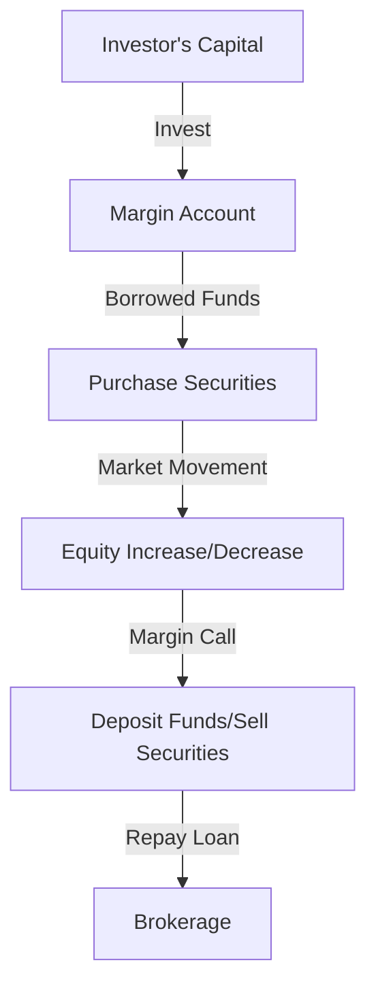

## 9.5 Margin Risks

Investing on margin can be a double-edged sword, offering the potential for amplified returns but also exposing investors to significant risks. In this section, we will delve into the intricacies of margin risks, focusing on the obligations and potential pitfalls associated with borrowing funds to invest. We will also explore strategies to mitigate these risks, ensuring that investors can make informed decisions when considering margin accounts.

### Understanding Margin Risk

**Margin risk** refers to the potential for financial loss when investing with borrowed funds. In a margin account, investors can purchase more securities than they could with their own capital alone, using financial leverage to amplify potential returns. However, this leverage also magnifies losses, making margin trading inherently riskier than investing with cash.

#### Financial Leverage and Its Implications

**Financial leverage** is the use of borrowed funds to increase the potential return on investment. While leverage can enhance gains, it also increases the potential for losses. For example, if an investor uses a 50% margin to purchase $10,000 worth of stock, they only need to invest $5,000 of their own money, borrowing the remaining $5,000. If the stock's value increases by 10%, the investor's return on their own capital is 20%. Conversely, if the stock's value decreases by 10%, the investor's loss is also 20%.

### Obligations and Risks of Margin Accounts

When investing on margin, investors are obligated to repay the borrowed funds regardless of the performance of the securities purchased. This obligation can lead to several risks:

1. **Margin Calls:** If the value of the securities in a margin account falls below a certain level, the brokerage may issue a margin call, requiring the investor to deposit additional funds or sell securities to cover the shortfall. Failing to meet a margin call can result in the brokerage selling the investor's securities, potentially at a loss.

2. **Interest Costs:** Borrowing funds incurs interest, which can erode investment returns. Investors must consider these costs when calculating potential profits.

3. **Market Volatility:** Sudden market movements can quickly deplete the equity in a margin account, triggering margin calls and forcing the sale of securities at unfavorable prices.

### Strategies to Mitigate Margin-Related Risks

To manage the risks associated with margin trading, investors can employ several strategies:

1. **Maintain Adequate Margin Levels:** Keeping a buffer of additional funds in the margin account can help avoid margin calls. This buffer acts as a cushion against market volatility.

2. **Avoid Trading Near Price Limits:** Trading securities that are close to their price limits increases the risk of margin calls. Investors should be cautious and avoid over-leveraging in volatile markets.

3. **Diversify Investments:** Diversification can reduce the impact of a single security's poor performance on the overall portfolio, helping to manage risk.

4. **Regularly Monitor Accounts:** Frequent monitoring of margin accounts allows investors to react quickly to market changes, adjusting their positions as needed to maintain adequate margin levels.

5. **Set Stop-Loss Orders:** Implementing stop-loss orders can automatically sell securities if they fall to a certain price, limiting potential losses.

### Practical Example: Margin Trading in the Canadian Market

Consider a Canadian investor using a margin account to purchase shares of a major Canadian bank, such as RBC. Suppose the investor buys $20,000 worth of RBC shares with $10,000 of their own money and $10,000 borrowed on margin. If RBC's stock price increases by 10%, the investor's equity grows by 20%, excluding interest costs. However, if the stock price falls by 10%, the investor faces a 20% loss on their equity, plus interest expenses.

In a volatile market, the investor might receive a margin call if RBC's stock price drops significantly. To meet the margin call, the investor could either deposit additional funds or sell some of the RBC shares, potentially at a loss. By maintaining a diversified portfolio and monitoring the account closely, the investor can better manage these risks.

### Visualizing Margin Risks

Below is a diagram illustrating the flow of funds in a margin account and the potential impact of market movements on the investor's equity.

### Glossary

- **Margin Risk:** The potential for financial loss when investing with borrowed funds.
- **Financial Leverage:** The use of borrowed funds to increase the potential return on investment.

### References and Additional Resources

- Article: *"Risks of Trading on Margin"* on NASDAQ.
- Book: *"Margin of Safety"* by Seth Klarman.

By understanding and managing margin risks, investors can make more informed decisions and potentially enhance their investment returns while minimizing potential losses. Always consider the implications of borrowing and the inherent risks involved in margin trading.

### **Ready to Test Your Knowledge?**

**Practice 10 Essential CSC Exam Questions to Master Your Certification**



### What is margin risk?

- [x] The potential for financial loss when investing with borrowed funds.
- [ ] The guaranteed profit from investing in securities.
- [ ] The risk-free rate of return on investments.
- [ ] The interest rate charged on loans.

> **Explanation:** Margin risk involves the potential for financial loss when using borrowed funds to invest, as leverage can amplify both gains and losses.

### What is financial leverage?

- [x] The use of borrowed funds to increase potential returns.
- [ ] The guaranteed profit from investing in securities.
- [ ] The risk-free rate of return on investments.
- [ ] The interest rate charged on loans.

> **Explanation:** Financial leverage refers to using borrowed funds to potentially increase returns on investment, which also increases risk.

### What happens if an investor fails to meet a margin call?

- [x] The brokerage may sell the investor's securities.
- [ ] The investor receives a bonus.
- [ ] The investor's account is closed without any consequences.
- [ ] The investor's debt is forgiven.

> **Explanation:** If an investor fails to meet a margin call, the brokerage may sell the investor's securities to cover the shortfall.

### How can investors mitigate margin-related risks?

- [x] Maintain adequate margin levels.
- [ ] Ignore market volatility.
- [ ] Invest all funds in a single security.
- [ ] Avoid monitoring their accounts.

> **Explanation:** Maintaining adequate margin levels helps avoid margin calls and manage risks associated with market volatility.

### What is a margin call?

- [x] A demand by a brokerage for an investor to deposit additional funds or sell securities.
- [ ] A request for a loan from the bank.
- [ ] A notification of a profit in the account.
- [ ] An automatic increase in the investor's credit limit.

> **Explanation:** A margin call occurs when the value of securities in a margin account falls below a certain level, requiring additional funds or securities to cover the shortfall.

### What is the impact of interest costs on margin trading?

- [x] Interest costs can erode investment returns.
- [ ] Interest costs guarantee higher returns.
- [ ] Interest costs have no impact on returns.
- [ ] Interest costs are always negligible.

> **Explanation:** Interest costs from borrowing funds can reduce the overall returns on investment, making it important to consider these costs.

### Why is diversification important in margin trading?

- [x] It reduces the impact of a single security's poor performance.
- [ ] It guarantees profits in all market conditions.
- [ ] It eliminates all risks associated with margin trading.
- [ ] It increases the likelihood of margin calls.

> **Explanation:** Diversification helps manage risk by spreading investments across different securities, reducing the impact of any single security's poor performance.

### What is the purpose of a stop-loss order?

- [x] To automatically sell securities if they fall to a certain price.
- [ ] To guarantee profits on all trades.
- [ ] To increase the investor's credit limit.
- [ ] To eliminate interest costs.

> **Explanation:** A stop-loss order is used to limit potential losses by automatically selling securities if they fall to a predetermined price.

### What should investors do to manage margin accounts effectively?

- [x] Regularly monitor accounts and adjust positions as needed.
- [ ] Ignore market changes and hold positions indefinitely.
- [ ] Invest all funds in a single security.
- [ ] Avoid setting stop-loss orders.

> **Explanation:** Regularly monitoring accounts and adjusting positions helps investors manage risks and respond to market changes effectively.

### True or False: Borrowing funds to invest always guarantees higher returns.

- [ ] True
- [x] False

> **Explanation:** Borrowing funds to invest increases potential returns but also amplifies potential losses, so it does not guarantee higher returns.


