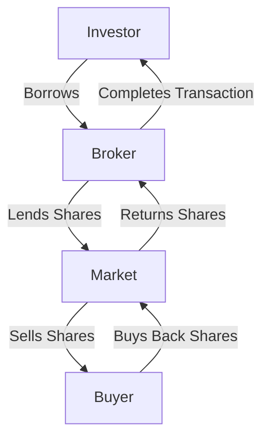

## 9.6 Short Margin Accounts

In the world of finance, short margin accounts play a crucial role for investors looking to capitalize on declining stock prices. This section delves into the mechanics of short selling within margin accounts, the steps involved in executing a short sale, and the inherent risks, including the potential for unlimited losses. We will also explore practical examples to illustrate these concepts in action.

### Understanding Short Selling in Margin Accounts

A **short margin account** is a type of brokerage account that allows investors to sell securities they do not own, with the expectation that the price will decline. This strategy, known as **short selling**, involves borrowing securities from a broker and selling them on the open market. The goal is to repurchase the securities at a lower price, return them to the lender, and pocket the difference as profit.

#### Mechanics of Short Selling

1. **Borrowing Securities**: The investor borrows shares from a broker. These shares are typically held in the broker's inventory or borrowed from another client's account.
2. **Selling Borrowed Securities**: The borrowed shares are sold in the market at the current market price.
3. **Repurchasing Securities**: The investor aims to buy back the same number of shares at a lower price.
4. **Returning Securities**: The repurchased shares are returned to the broker, completing the transaction.

This process is illustrated in the following diagram:

### Steps Involved in Executing a Short Sale

Executing a short sale involves several key steps:

1. **Open a Short Margin Account**: Investors must have a margin account with their brokerage, which requires meeting specific margin requirements set by the broker and regulatory bodies like the Canadian Investment Regulatory Organization (CIRO).

2. **Identify a Security to Short**: The investor identifies a security they believe will decrease in value.

3. **Borrow the Security**: The broker facilitates the borrowing of the security, often requiring the investor to maintain a minimum margin level.

4. **Sell the Security**: The borrowed security is sold at the current market price.

5. **Monitor the Position**: The investor must closely monitor the market to determine the optimal time to repurchase the security.

6. **Repurchase and Return**: Once the price has declined sufficiently, the investor buys back the security and returns it to the broker.

### Potential for Unlimited Losses

One of the most significant risks associated with short selling is the potential for unlimited losses. Unlike traditional investing, where the maximum loss is limited to the initial investment, short selling can result in losses that exceed the initial sale price. This occurs because there is no cap on how high a stock's price can rise, potentially forcing the investor to buy back the shares at a much higher price than they sold them for.

### Example of a Short Margin Account Transaction

Consider an investor who believes that the stock of a Canadian technology company, currently trading at $100 per share, will decline in value. The investor decides to short 100 shares.

1. **Borrow and Sell**: The investor borrows 100 shares and sells them for $10,000 (100 shares x $100).

2. **Price Decline**: The stock price falls to $80 per share.

3. **Repurchase**: The investor buys back the 100 shares for $8,000 (100 shares x $80).

4. **Profit**: The investor returns the shares to the broker and realizes a profit of $2,000 ($10,000 - $8,000).

However, if the stock price had risen to $120 instead, the investor would face a loss of $2,000 ($12,000 - $10,000).

### Glossary

- **Short Margin Account**: A brokerage account that allows investors to borrow and sell securities they do not own, with the expectation of buying them back at a lower price.
- **Short Selling**: The practice of selling borrowed securities with the intention of repurchasing them at a lower price to make a profit.
- **Borrowed Securities**: Securities that are borrowed from a broker to facilitate a short sale.

### References and Additional Resources

For further reading and exploration of short selling, consider the following resources:

- [Short Selling Risks and Rewards](https://www.sec.gov/fast-answers/answersshorthtm.html)
- Online Course Module: [Advanced Short Selling Techniques](https://www.edx.org/course/short-selling)

These resources provide deeper insights into the risks and strategies associated with short selling, helping investors make informed decisions.

### **Ready to Test Your Knowledge?**

**Practice 10 Essential CSC Exam Questions to Master Your Certification**



### What is a short margin account?

- [x] A brokerage account that allows investors to sell securities they do not own.
- [ ] A savings account with a high interest rate.
- [ ] An account used for long-term investments.
- [ ] A type of retirement account.

> **Explanation:** A short margin account is specifically designed for short selling, where investors sell securities they do not own, aiming to buy them back at a lower price.

### What is the first step in executing a short sale?

- [x] Open a short margin account.
- [ ] Identify a security to short.
- [ ] Borrow the security.
- [ ] Sell the security.

> **Explanation:** Before any short selling can occur, an investor must open a short margin account with their brokerage.

### What is the primary risk associated with short selling?

- [x] Unlimited losses.
- [ ] Limited gains.
- [ ] High transaction fees.
- [ ] Low liquidity.

> **Explanation:** The primary risk of short selling is the potential for unlimited losses, as there is no limit to how high a stock's price can rise.

### In a short sale, what happens after the investor sells the borrowed securities?

- [x] The investor monitors the position to determine when to repurchase.
- [ ] The investor immediately buys back the securities.
- [ ] The investor holds the securities indefinitely.
- [ ] The investor returns the securities to the broker.

> **Explanation:** After selling the borrowed securities, the investor must monitor the market to decide the best time to repurchase them at a lower price.

### Which of the following is NOT a step in executing a short sale?

- [ ] Open a short margin account.
- [ ] Borrow the security.
- [x] Deposit the security in a savings account.
- [ ] Sell the security.

> **Explanation:** Depositing the security in a savings account is not part of the short selling process.

### What is the goal of short selling?

- [x] To profit from a decline in the security's price.
- [ ] To earn dividends from the security.
- [ ] To hold the security for long-term growth.
- [ ] To increase the security's market price.

> **Explanation:** The goal of short selling is to profit from a decline in the security's price by selling high and buying low.

### How does an investor profit from a short sale?

- [x] By repurchasing the security at a lower price than it was sold.
- [ ] By holding the security until it pays dividends.
- [ ] By selling the security at a higher price than it was bought.
- [ ] By earning interest on the borrowed securities.

> **Explanation:** Profit in short selling is made by repurchasing the security at a lower price than it was initially sold.

### What happens if the stock price rises after a short sale?

- [x] The investor may incur losses.
- [ ] The investor automatically profits.
- [ ] The investor's position is unaffected.
- [ ] The investor receives dividends.

> **Explanation:** If the stock price rises, the investor may incur losses, as they will have to buy back the shares at a higher price.

### What is meant by "borrowed securities"?

- [x] Securities borrowed from a broker to facilitate a short sale.
- [ ] Securities purchased on margin.
- [ ] Securities held in a savings account.
- [ ] Securities owned outright by the investor.

> **Explanation:** Borrowed securities are those borrowed from a broker to facilitate a short sale, with the intention of buying them back later.

### True or False: Short selling can result in losses greater than the initial sale price.

- [x] True
- [ ] False

> **Explanation:** True. Short selling can result in losses greater than the initial sale price because there is no limit to how high the stock price can rise.


