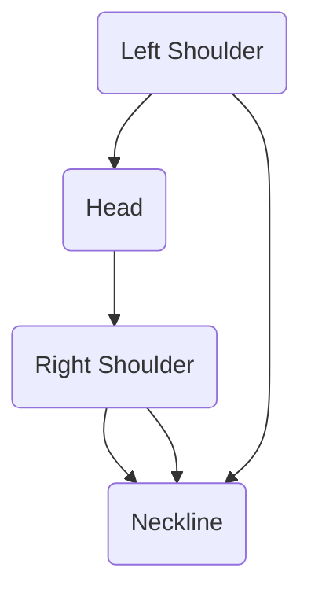

## 13.1.2 Technical Analysis

Technical analysis is a method of evaluating securities by analyzing statistics generated by market activity, such as past prices and volume. Unlike fundamental analysis, which attempts to evaluate a security's intrinsic value, technical analysis focuses on patterns of price movements, trading signals, and various other analytical charting tools to forecast future price movements.

### Definition and Purpose

Technical analysis operates on the belief that all market information is already reflected in the price of securities. By examining historical price data, trading volumes, and chart patterns, technical analysts aim to predict future price movements. This approach is grounded in the idea that price movements follow identifiable trends, which can be leveraged to make informed trading decisions.

### Key Assumptions

Technical analysis is built on several key assumptions:

- **Market Efficiency:** The assumption here is that all known information is already priced into the market. This means that price changes are a reflection of new information and investor reactions to it.

- **Price Trends:** Prices are believed to move in persistent trends. These trends can be upward, downward, or sideways, and they tend to continue until a reversal occurs.

- **Repetition of the Past:** Historical price patterns are expected to repeat due to investor psychology and behavioral biases. This repetition allows analysts to predict future movements based on past patterns.

### Common Tools and Techniques

Technical analysts use a variety of tools and techniques to interpret market data and predict future movements. Some of the most common include:

#### Chart Patterns

Chart patterns are formations created by the price movements of a security on a chart. These patterns can signal potential trend reversals or continuations. Common chart patterns include:

- **Head-and-Shoulders:** This pattern indicates a potential reversal in trend. It consists of three peaks: a higher peak (head) between two lower peaks (shoulders).

- **Triangles:** These patterns can be ascending, descending, or symmetrical, and they often indicate a continuation of the current trend.

- **Flags and Pennants:** These are short-term continuation patterns that indicate a brief consolidation before the previous trend resumes.

#### Moving Averages

Moving averages smooth out price data to identify the direction of the trend. They are used to generate buy or sell signals. Common types include:

- **Simple Moving Average (SMA):** The average price over a specific number of periods.

- **Exponential Moving Average (EMA):** Gives more weight to recent prices, making it more responsive to new information.

#### Sentiment Indicators

Sentiment indicators gauge investor sentiment to determine potential market overreactions. These indicators can help identify when a market is overbought or oversold, signaling potential reversals.

#### Cycle Analysis

Cycle analysis involves recognizing cyclical patterns in price movements to time market entries and exits effectively. This technique is based on the idea that markets move in cycles, influenced by economic, political, and psychological factors.

### Comparing to Fundamental Analysis

While technical analysis focuses on the "what" by analyzing price actions and trends, fundamental analysis looks at the "why" behind price movements. Fundamental analysis evaluates a security's intrinsic value based on financial statements, economic indicators, and industry conditions. Both methods can complement each other, providing a comprehensive view of market dynamics.

### Practical Example: Canadian Market Scenario

Consider a scenario involving a major Canadian bank, such as RBC. A technical analyst might examine RBC's stock price chart to identify a head-and-shoulders pattern, suggesting a potential trend reversal. By combining this with sentiment indicators showing an overbought market, the analyst might predict a price decline. Meanwhile, a fundamental analyst might look at RBC's financial health, economic conditions, and industry trends to assess its intrinsic value. Together, these analyses provide a well-rounded view of RBC's stock potential.

### Diagrams and Visuals

Below is a simple diagram illustrating a head-and-shoulders pattern:

This diagram shows the typical structure of a head-and-shoulders pattern, with the neckline acting as a potential support level.

### Best Practices and Common Pitfalls

- **Best Practices:**
  - Use multiple indicators to confirm signals.
  - Combine technical analysis with fundamental analysis for a holistic approach.
  - Stay updated with market news and events that could impact price movements.

- **Common Pitfalls:**
  - Over-reliance on a single indicator can lead to false signals.
  - Ignoring broader market trends and economic conditions.
  - Failing to adapt to changing market dynamics.

### Conclusion

Technical analysis is a powerful tool for predicting market trends and making informed trading decisions. By understanding its key assumptions, tools, and techniques, investors can enhance their ability to navigate the financial markets. However, it is essential to combine technical analysis with other forms of analysis and remain aware of market conditions to maximize its effectiveness.

## Quiz Time!



### What is the primary focus of technical analysis?

- [x] Analyzing historical price data and chart patterns
- [ ] Evaluating a company's intrinsic value
- [ ] Assessing economic indicators
- [ ] Analyzing financial statements

> **Explanation:** Technical analysis focuses on analyzing historical price data and chart patterns to predict future price movements.

### Which of the following is a key assumption of technical analysis?

- [x] Prices move in persistent trends
- [ ] Markets are always rational
- [ ] Intrinsic value determines price
- [ ] Economic indicators are irrelevant

> **Explanation:** Technical analysis assumes that prices move in persistent trends that tend to continue until a reversal occurs.

### What does a head-and-shoulders pattern indicate?

- [x] A potential trend reversal
- [ ] A continuation of the current trend
- [ ] Market stability
- [ ] Increased volatility

> **Explanation:** A head-and-shoulders pattern typically indicates a potential trend reversal.

### How does a simple moving average (SMA) differ from an exponential moving average (EMA)?

- [x] SMA gives equal weight to all prices, while EMA gives more weight to recent prices
- [ ] SMA is more responsive to new information than EMA
- [ ] SMA is used for short-term trends, while EMA is for long-term trends
- [ ] SMA is calculated using volume data, while EMA uses price data

> **Explanation:** A simple moving average (SMA) gives equal weight to all prices, whereas an exponential moving average (EMA) gives more weight to recent prices, making it more responsive to new information.

### What is the purpose of sentiment indicators in technical analysis?

- [x] To gauge investor sentiment and identify potential market overreactions
- [ ] To calculate a security's intrinsic value
- [ ] To determine economic conditions
- [ ] To analyze financial statements

> **Explanation:** Sentiment indicators gauge investor sentiment to determine potential market overreactions, helping identify when a market is overbought or oversold.

### Which of the following is NOT a common chart pattern used in technical analysis?

- [ ] Head-and-shoulders
- [ ] Triangles
- [ ] Flags
- [x] Balance sheets

> **Explanation:** Balance sheets are not a chart pattern; they are a financial statement used in fundamental analysis.

### What is the relationship between technical and fundamental analysis?

- [x] They can complement each other by providing a comprehensive view of market dynamics
- [ ] They are mutually exclusive and cannot be used together
- [ ] Technical analysis is superior to fundamental analysis
- [ ] Fundamental analysis is superior to technical analysis

> **Explanation:** Technical and fundamental analysis can complement each other by providing a comprehensive view of market dynamics.

### What does cycle analysis in technical analysis focus on?

- [x] Recognizing cyclical patterns to time market entries and exits
- [ ] Evaluating a company's financial health
- [ ] Assessing economic indicators
- [ ] Analyzing investor sentiment

> **Explanation:** Cycle analysis focuses on recognizing cyclical patterns in price movements to time market entries and exits effectively.

### Why is it important to use multiple indicators in technical analysis?

- [x] To confirm signals and reduce the risk of false signals
- [ ] To simplify the analysis process
- [ ] To focus on a single market aspect
- [ ] To avoid overcomplicating the analysis

> **Explanation:** Using multiple indicators helps confirm signals and reduce the risk of false signals, providing a more reliable analysis.

### True or False: Technical analysis assumes that all known information is already priced into the market.

- [x] True
- [ ] False

> **Explanation:** True. Technical analysis assumes that all known information is already priced into the market, reflecting in the price movements.


