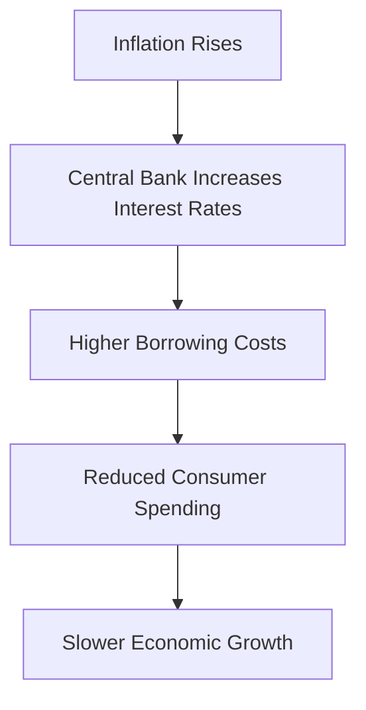
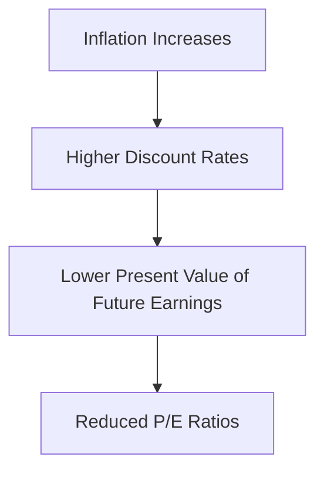

## 13.10 Impact of Inflation

Inflation is a critical economic indicator that can significantly influence financial markets, investor behavior, and corporate performance. Understanding the impact of inflation is essential for investors, financial analysts, and policymakers, especially within the Canadian context. This section delves into how inflation affects investor confidence, interest rates, corporate profits, and price-earnings multiples, providing practical examples and insights for navigating these challenges.

### Inflation and Investor Confidence

Investor confidence is a vital component of market stability and growth. Inflation can erode this confidence by creating uncertainty about future economic conditions. When inflation rises, the purchasing power of money decreases, leading investors to question the real value of their returns. This uncertainty can result in increased market volatility as investors adjust their portfolios to hedge against inflation risks.

#### Case Study: Canadian Pension Funds

Consider Canadian pension funds, which manage large pools of assets to meet future liabilities. Rising inflation can lead these funds to shift their asset allocations towards inflation-protected securities, such as Real Return Bonds, to preserve purchasing power. This shift can influence broader market trends and investor sentiment.

### Inflation and Interest Rates

Interest rates are closely tied to inflation. Central banks, such as the Bank of Canada, often adjust interest rates to control inflation. When inflation is high, central banks may increase interest rates to cool down the economy. Higher interest rates can lead to higher borrowing costs for consumers and businesses, potentially slowing economic growth.

#### Diagram: Inflation and Interest Rate Relationship

### Inflation and Corporate Profits

Inflation can have a mixed impact on corporate profits. On one hand, companies may pass higher costs onto consumers through increased prices, potentially maintaining profit margins. On the other hand, if inflation outpaces wage growth, consumer purchasing power declines, leading to reduced demand for goods and services.

#### Example: Canadian Retail Sector

In the Canadian retail sector, companies like Loblaw Companies Limited may face higher input costs due to inflation. While they might increase prices to maintain margins, persistent inflation could lead to decreased consumer spending, ultimately affecting sales volumes and profits.

### Inflation and Price-Earnings Multiples

The price-earnings (P/E) ratio is a key metric for valuing stocks. Inflation can inversely affect P/E ratios. As inflation rises, future earnings are discounted at higher rates, reducing the present value of those earnings. This can lead to lower P/E ratios, making stocks appear less attractive.

#### Glossary: Price-Earnings Ratio (P/E Ratio)

- **Price-Earnings Ratio (P/E Ratio):** A valuation ratio of a company's current share price compared to its per-share earnings.

#### Diagram: Inverse Relationship Between Inflation and P/E Ratios

### Transmission Mechanism of Inflation

Inflation affects stock prices through a transmission mechanism involving higher costs. As companies face increased costs for raw materials, labor, and other inputs, they may raise prices to maintain profitability. However, if price increases are not matched by wage growth, consumer demand may decline, negatively impacting stock prices.

#### Example: Canadian Manufacturing Industry

In the Canadian manufacturing industry, companies like Magna International Inc. may experience rising costs for materials and labor. While they might increase product prices, sustained inflation could lead to reduced demand, affecting stock performance.

### Studies on Inflation's Impact on Equities

Numerous studies have explored the relationship between inflation and equities. Research from the Canadian Inflation Bureau indicates that moderate inflation can support equity markets by signaling economic growth. However, high inflation often leads to increased volatility and lower equity returns.

### Best Practices and Strategies

Investors can adopt several strategies to mitigate the impact of inflation:

1. **Diversification:** Spread investments across asset classes, including equities, bonds, and real assets like real estate, to hedge against inflation.
2. **Inflation-Protected Securities:** Consider investing in inflation-linked bonds, such as Canadian Real Return Bonds, which adjust payouts based on inflation.
3. **Focus on Quality Stocks:** Invest in companies with strong pricing power and the ability to pass on costs to consumers.

### Common Pitfalls and Challenges

- **Overreacting to Short-Term Inflation:** Investors may overreact to short-term inflation spikes, leading to unnecessary portfolio adjustments.
- **Ignoring Long-Term Trends:** Focusing solely on short-term inflation can cause investors to overlook long-term growth opportunities.

### Conclusion

Inflation is a multifaceted economic force that influences investor confidence, interest rates, corporate profits, and stock valuations. By understanding these dynamics and employing strategic investment approaches, investors can navigate inflationary environments effectively. As the Canadian financial landscape evolves, staying informed about inflation trends and their implications remains crucial for achieving long-term financial goals.

### **Ready to Test Your Knowledge?**

**Practice 10 Essential CSC Exam Questions to Master Your Certification**



### How does inflation typically affect investor confidence?

- [x] It creates uncertainty, leading to increased market volatility.
- [ ] It boosts investor confidence by increasing purchasing power.
- [ ] It has no impact on investor confidence.
- [ ] It always leads to higher stock prices.

> **Explanation:** Inflation creates uncertainty about future economic conditions, leading to increased market volatility as investors adjust their portfolios.

### What action might the Bank of Canada take in response to rising inflation?

- [x] Increase interest rates
- [ ] Decrease interest rates
- [ ] Maintain current interest rates
- [ ] Implement quantitative easing

> **Explanation:** The Bank of Canada may increase interest rates to control rising inflation and cool down the economy.

### How can inflation impact corporate profits?

- [x] Companies may pass higher costs onto consumers, but reduced demand can affect profits.
- [ ] Inflation always increases corporate profits.
- [ ] Inflation has no impact on corporate profits.
- [ ] Inflation decreases corporate profits by reducing costs.

> **Explanation:** Companies may pass higher costs onto consumers, but if inflation outpaces wage growth, reduced demand can affect profits.

### What is the relationship between inflation and P/E ratios?

- [x] Inverse relationship
- [ ] Direct relationship
- [ ] No relationship
- [ ] P/E ratios increase with inflation

> **Explanation:** Inflation can inversely affect P/E ratios, as higher discount rates reduce the present value of future earnings.

### Which of the following is a strategy to mitigate the impact of inflation?

- [x] Diversification
- [ ] Concentrating investments in one sector
- [ ] Ignoring inflation trends
- [ ] Investing only in fixed-income securities

> **Explanation:** Diversification across asset classes can help hedge against inflation.

### What is a potential pitfall when reacting to inflation?

- [x] Overreacting to short-term inflation spikes
- [ ] Ignoring inflation entirely
- [ ] Investing in inflation-protected securities
- [ ] Diversifying investments

> **Explanation:** Overreacting to short-term inflation spikes can lead to unnecessary portfolio adjustments.

### What type of bonds can help protect against inflation?

- [x] Inflation-linked bonds
- [ ] Corporate bonds
- [ ] Junk bonds
- [ ] Convertible bonds

> **Explanation:** Inflation-linked bonds, such as Canadian Real Return Bonds, adjust payouts based on inflation.

### How does inflation affect stock prices through the transmission mechanism?

- [x] Higher costs lead to price increases, potentially reducing demand and impacting stock prices.
- [ ] Inflation always increases stock prices.
- [ ] Inflation has no impact on stock prices.
- [ ] Inflation decreases stock prices by reducing costs.

> **Explanation:** Higher costs lead to price increases, but if not matched by wage growth, reduced demand can impact stock prices.

### What is a common challenge when dealing with inflation?

- [x] Ignoring long-term trends
- [ ] Overreacting to short-term inflation
- [ ] Investing in quality stocks
- [ ] Diversifying investments

> **Explanation:** Focusing solely on short-term inflation can cause investors to overlook long-term growth opportunities.

### True or False: High inflation often leads to increased volatility and lower equity returns.

- [x] True
- [ ] False

> **Explanation:** High inflation often leads to increased volatility and lower equity returns, as indicated by studies from the Canadian Inflation Bureau.


