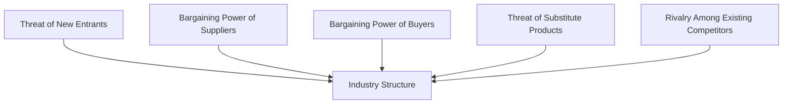

## 13.11 Fundamental Industry Analysis

In the realm of investment and securities, understanding the nuances of fundamental industry analysis is crucial for making informed decisions. This section delves into the importance of industry structure, strategies for achieving sustainable competitive advantages, and the influence of pricing strategies and cost structures on growth and earnings volatility. We will also reference Michael Porter's seminal work on competitive strategy and industry analysis to provide a robust framework for understanding these concepts.

### The Importance of Industry Structure

**Industry Structure** refers to the competitive environment in which companies operate. It encompasses the number of competitors, the nature of competition, and the overall market dynamics. Understanding industry structure is vital because it directly impacts a company's profitability and stock valuation. 

#### Key Components of Industry Structure

1. **Number of Competitors:** A market with few competitors often leads to higher profitability due to less price competition. Conversely, a saturated market can drive prices down, affecting margins.

2. **Nature of Competition:** This includes factors such as product differentiation, brand loyalty, and the presence of substitute products. Companies in highly competitive industries must innovate continuously to maintain their market position.

3. **Barriers to Entry:** High barriers to entry can protect existing companies from new competitors, thereby sustaining profitability. These barriers can include high capital requirements, regulatory constraints, and strong brand identities.

4. **Supplier and Buyer Power:** The bargaining power of suppliers and buyers can influence pricing and cost structures. Industries where suppliers or buyers have significant power may experience squeezed margins.

#### Michael Porter's Five Forces Model

Michael Porter's Five Forces Model is a powerful tool for analyzing industry structure. It examines five critical forces that shape competition within an industry:

- **Threat of New Entrants:** The ease with which new competitors can enter the market.
- **Bargaining Power of Suppliers:** The influence suppliers have on the price of inputs.
- **Bargaining Power of Buyers:** The impact customers have on pricing and terms.
- **Threat of Substitute Products or Services:** The likelihood of customers finding alternative solutions.
- **Rivalry Among Existing Competitors:** The intensity of competition among current players.

Understanding these forces helps investors assess the attractiveness of an industry and the potential for long-term profitability.

### Strategies for Sustainable Competitive Advantages

Achieving a sustainable competitive advantage is essential for companies aiming to outperform their peers. Here are some strategies companies employ:

1. **Cost Leadership:** Companies strive to become the lowest-cost producers in their industry. This strategy allows them to offer lower prices or maintain higher margins. Canadian retailer Dollarama exemplifies this by maintaining low operational costs and offering competitive pricing.

2. **Differentiation:** Companies differentiate their products or services to create unique value for customers. This can be achieved through innovation, superior quality, or exceptional customer service. For instance, Lululemon Athletica differentiates itself through high-quality athletic apparel and a strong brand image.

3. **Focus Strategy:** Companies target a specific market niche, tailoring their offerings to meet the unique needs of that segment. This approach can lead to strong customer loyalty and reduced competition. An example is Shopify, which focuses on providing e-commerce solutions for small to medium-sized businesses.

4. **Innovation and Technology:** Investing in research and development can lead to innovative products and processes, providing a competitive edge. Companies like BlackBerry have historically leveraged technology to differentiate themselves in the tech industry.

### Pricing Strategies and Cost Structures

Pricing strategies and cost structures significantly influence a company's growth prospects and earnings volatility. Here's how:

#### Pricing Strategies

- **Penetration Pricing:** Setting low prices to gain market share quickly. This strategy can lead to rapid growth but may also result in initial losses.
- **Skimming Pricing:** Setting high prices initially and lowering them over time. This approach can maximize profits from early adopters but may limit market penetration.
- **Dynamic Pricing:** Adjusting prices based on demand and market conditions. This strategy can optimize revenue but requires sophisticated data analysis.

#### Cost Structures

- **Fixed vs. Variable Costs:** Companies with high fixed costs may experience greater earnings volatility as they must cover these costs regardless of sales volume. Conversely, businesses with higher variable costs can adjust more easily to changes in demand.
- **Economies of Scale:** Achieving lower per-unit costs through increased production can enhance profitability. Large Canadian banks like RBC and TD benefit from economies of scale in their operations.

### Practical Examples and Case Studies

To illustrate these concepts, consider the following Canadian examples:

- **Canadian Pension Funds:** These funds often analyze industry structures to allocate assets effectively. By understanding competitive dynamics, they can invest in industries with favorable long-term prospects.

- **RBC and TD Bank:** These major Canadian banks leverage economies of scale and differentiation strategies to maintain their competitive positions. Their extensive branch networks and diverse financial products cater to a wide range of customer needs.

### Diagrams and Visual Aids

Below is a diagram illustrating Porter's Five Forces Model:

This diagram visually represents the interconnected forces that shape industry structure, providing a clear framework for analysis.

### Best Practices and Common Pitfalls

**Best Practices:**

- Conduct thorough industry analysis using Porter's Five Forces to understand competitive dynamics.
- Continuously innovate and adapt to changing market conditions to maintain a competitive advantage.
- Monitor cost structures and pricing strategies to optimize profitability.

**Common Pitfalls:**

- Failing to recognize shifts in industry structure, such as new entrants or substitute products.
- Over-relying on a single competitive strategy without adapting to market changes.
- Ignoring the impact of external factors, such as regulatory changes or economic downturns.

### Conclusion

Fundamental industry analysis is a cornerstone of effective investment strategy. By understanding industry structure, competitive strategies, and the impact of pricing and cost structures, investors can make informed decisions that enhance portfolio performance. As you apply these principles, consider the unique dynamics of the Canadian market and leverage tools like Porter's Five Forces to guide your analysis.

### **Ready to Test Your Knowledge?**

**Practice 10 Essential CSC Exam Questions to Master Your Certification**



### What is the primary purpose of understanding industry structure in fundamental analysis?

- [x] To assess company profitability and stock valuation
- [ ] To determine the best marketing strategy
- [ ] To identify potential mergers and acquisitions
- [ ] To evaluate employee satisfaction

> **Explanation:** Understanding industry structure helps assess company profitability and stock valuation by analyzing competitive dynamics.

### Which of the following is NOT one of Porter's Five Forces?

- [ ] Threat of New Entrants
- [ ] Bargaining Power of Suppliers
- [ ] Bargaining Power of Buyers
- [x] Technological Advancement

> **Explanation:** Technological Advancement is not one of Porter's Five Forces, which focus on competitive dynamics.

### What strategy involves becoming the lowest-cost producer in an industry?

- [x] Cost Leadership
- [ ] Differentiation
- [ ] Focus Strategy
- [ ] Innovation

> **Explanation:** Cost Leadership involves becoming the lowest-cost producer to offer competitive pricing or maintain higher margins.

### How do high barriers to entry affect existing companies?

- [x] They protect existing companies from new competitors
- [ ] They increase competition among existing companies
- [ ] They reduce profitability for existing companies
- [ ] They lead to higher customer turnover

> **Explanation:** High barriers to entry protect existing companies by preventing new competitors from easily entering the market.

### Which pricing strategy involves setting high prices initially and lowering them over time?

- [x] Skimming Pricing
- [ ] Penetration Pricing
- [ ] Dynamic Pricing
- [ ] Cost-Plus Pricing

> **Explanation:** Skimming Pricing involves setting high prices initially to maximize profits from early adopters before lowering them.

### What is a common pitfall in competitive strategy?

- [x] Failing to recognize shifts in industry structure
- [ ] Continuously innovating
- [ ] Monitoring cost structures
- [ ] Adapting to market changes

> **Explanation:** Failing to recognize shifts in industry structure can lead to strategic missteps and reduced competitiveness.

### Which Canadian company is known for its focus strategy in e-commerce?

- [x] Shopify
- [ ] RBC
- [ ] Lululemon
- [ ] Dollarama

> **Explanation:** Shopify focuses on providing e-commerce solutions for small to medium-sized businesses, exemplifying a focus strategy.

### How do economies of scale benefit companies?

- [x] By reducing per-unit costs through increased production
- [ ] By increasing marketing expenses
- [ ] By diversifying product lines
- [ ] By reducing employee turnover

> **Explanation:** Economies of scale reduce per-unit costs through increased production, enhancing profitability.

### What is the impact of high fixed costs on earnings volatility?

- [x] Greater earnings volatility
- [ ] Reduced earnings volatility
- [ ] No impact on earnings volatility
- [ ] Increased market share

> **Explanation:** High fixed costs lead to greater earnings volatility as companies must cover these costs regardless of sales volume.

### True or False: Differentiation strategy focuses on cost reduction.

- [ ] True
- [x] False

> **Explanation:** Differentiation strategy focuses on creating unique value through innovation, quality, or service, not cost reduction.


