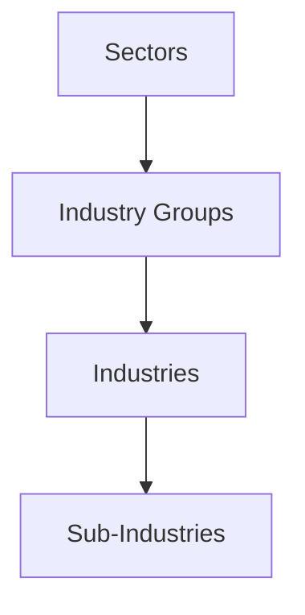

## 13.12 Classifying Industries by Product or Service

In the realm of finance and investment, understanding how industries are classified is crucial for analyzing market trends, making informed investment decisions, and constructing diversified portfolios. One of the most widely used frameworks for industry classification is the Global Industry Classification Standard (GICS), developed by S&P Dow Jones Indices and MSCI. This section delves into the intricacies of classifying industries by the products or services they offer, with a particular focus on the GICS framework.

### Understanding Industry Classification

Industry classification involves categorizing companies based on the primary products or services they provide. This classification helps investors and analysts compare companies within the same industry, assess industry performance, and identify trends. By grouping companies with similar business activities, industry classification systems facilitate a structured approach to market analysis.

### Introduction to the Global Industry Classification Standard (GICS)

The Global Industry Classification Standard (GICS) is a comprehensive, standardized classification system used globally to categorize companies into sectors and industries. Developed by S&P Dow Jones Indices and MSCI, GICS is widely adopted by financial professionals, including portfolio managers, analysts, and researchers, to streamline the investment process.

#### Key Features of GICS

- **Standardization:** GICS provides a consistent framework for classifying companies, enabling comparability across different markets and regions.
- **Hierarchical Structure:** GICS organizes companies into a four-tiered hierarchy: sectors, industry groups, industries, and sub-industries.
- **Global Applicability:** GICS is used by financial markets worldwide, making it a universal language for industry classification.

### The Hierarchical Structure of GICS

The GICS framework is structured hierarchically, allowing for detailed analysis at various levels of granularity. This structure consists of four levels:

1. **Sectors:** The broadest level, consisting of 11 sectors that represent major areas of the economy. Examples include Information Technology, Healthcare, and Financials.

2. **Industry Groups:** Each sector is divided into industry groups, which provide a more specific categorization. For instance, the Financials sector includes industry groups such as Banks and Insurance.

3. **Industries:** Industry groups are further divided into industries, offering even more specificity. Within the Banks industry group, for example, there are industries like Diversified Banks and Regional Banks.

4. **Sub-Industries:** The most granular level, sub-industries, allows for detailed analysis of specific business activities. For example, within the Diversified Banks industry, there might be sub-industries focusing on different banking services.

#### Visual Representation of GICS Hierarchy

Below is a diagram illustrating the hierarchical structure of GICS:

### Practical Application of GICS in Investment

GICS is instrumental in portfolio management and investment analysis. By classifying companies into sectors and industries, investors can:

- **Diversify Portfolios:** Allocate investments across different sectors to mitigate risk.
- **Conduct Sector Analysis:** Evaluate the performance of specific sectors to identify growth opportunities.
- **Benchmark Performance:** Compare a company's performance against its industry peers.

#### Example: Canadian Pension Funds

Canadian pension funds, such as the Canada Pension Plan Investment Board (CPPIB), utilize GICS to diversify their investments across various sectors. By analyzing sector performance, these funds can adjust their asset allocation to optimize returns while managing risk.

### References to Official Documentation

For detailed definitions and updates on GICS sectors and industries, refer to the official documentation provided by S&P Dow Jones Indices and MSCI. These resources offer comprehensive insights into the classification criteria and methodologies used in GICS.

- [S&P Dow Jones Indices - GICS](https://www.spglobal.com/spdji/en/landing/topic/gics/)
- [MSCI - GICS](https://www.msci.com/gics)

### Glossary

- **Global Industry Classification Standard (GICS):** A standardized classification system for categorizing companies into sectors and industries, developed by S&P Dow Jones Indices and MSCI.

### Conclusion

Understanding how industries are classified by product or service is essential for effective investment analysis and decision-making. The Global Industry Classification Standard (GICS) provides a robust framework for categorizing companies, enabling investors to conduct detailed sector and industry analysis. By leveraging GICS, financial professionals can enhance their investment strategies, optimize portfolio diversification, and gain deeper insights into market dynamics.

### **Ready to Test Your Knowledge?**

**Practice 10 Essential CSC Exam Questions to Master Your Certification**



### What is the primary purpose of industry classification?

- [x] To categorize companies based on their primary products or services
- [ ] To determine a company's financial health
- [ ] To assess a company's market share
- [ ] To evaluate a company's management team

> **Explanation:** Industry classification categorizes companies based on their primary products or services, facilitating comparison and analysis.

### Which organizations developed the Global Industry Classification Standard (GICS)?

- [x] S&P Dow Jones Indices and MSCI
- [ ] The World Bank and IMF
- [ ] NASDAQ and NYSE
- [ ] The Federal Reserve and Bank of Canada

> **Explanation:** GICS was developed by S&P Dow Jones Indices and MSCI to provide a standardized classification system.

### How many sectors are there in the GICS framework?

- [x] 11
- [ ] 9
- [ ] 15
- [ ] 20

> **Explanation:** The GICS framework consists of 11 sectors, representing major areas of the economy.

### What is the most granular level in the GICS hierarchy?

- [x] Sub-Industries
- [ ] Industries
- [ ] Industry Groups
- [ ] Sectors

> **Explanation:** Sub-Industries are the most granular level in the GICS hierarchy, allowing for detailed analysis of specific business activities.

### Which of the following is NOT a sector in the GICS framework?

- [ ] Information Technology
- [ ] Healthcare
- [x] Real Estate
- [ ] Financials

> **Explanation:** Real Estate is a sector in the GICS framework, along with Information Technology, Healthcare, and Financials.

### How does GICS help in portfolio management?

- [x] By enabling diversification across sectors
- [ ] By predicting stock prices
- [ ] By ensuring high returns
- [ ] By eliminating risk

> **Explanation:** GICS helps in portfolio management by enabling diversification across different sectors, which can mitigate risk.

### What is the role of industry groups in the GICS hierarchy?

- [x] To provide a more specific categorization within sectors
- [ ] To define the overall market trends
- [ ] To assess company profitability
- [ ] To determine stock prices

> **Explanation:** Industry groups provide a more specific categorization within sectors, allowing for detailed analysis.

### Why is GICS considered a global standard?

- [x] It is used by financial markets worldwide
- [ ] It is mandated by international law
- [ ] It guarantees investment success
- [ ] It is the only classification system available

> **Explanation:** GICS is considered a global standard because it is used by financial markets worldwide, providing a universal language for industry classification.

### Which Canadian financial institution is known for using GICS for investment diversification?

- [x] Canada Pension Plan Investment Board (CPPIB)
- [ ] Bank of Canada
- [ ] Toronto Stock Exchange
- [ ] Canadian Imperial Bank of Commerce (CIBC)

> **Explanation:** The Canada Pension Plan Investment Board (CPPIB) uses GICS for investment diversification across various sectors.

### True or False: GICS is only applicable to the Canadian market.

- [ ] True
- [x] False

> **Explanation:** GICS is a global classification standard used by financial markets worldwide, not limited to the Canadian market.


