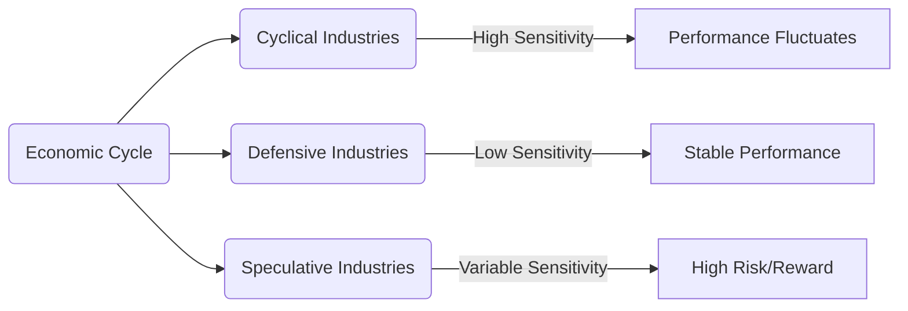

---

linkTitle: "13.15 Classifying Industries by Reaction to the Economic Cycle"
title: "Classifying Industries by Reaction to the Economic Cycle: Understanding Cyclical, Defensive, and Speculative Industries"
description: "Explore how different industries react to economic cycles, focusing on cyclical, defensive, and speculative sectors within the Canadian market."
categories:
- Finance
- Investment
- Economic Analysis
tags:
- Economic Cycle
- Cyclical Industries
- Defensive Industries
- Speculative Industries
- Canadian Market
date: 2024-10-25
type: docs
nav_weight: 250000
canonical: "https://securitiesexamsmastery.ca/14/1/15"
license: "© 2023 Tokenizer Inc. CC BY-NC-SA 4.0"
---

## 13.15 Classifying Industries by Reaction to the Economic Cycle

Understanding how different industries react to economic cycles is crucial for investors and financial analysts. This section delves into the classification of industries based on their sensitivity to economic changes, focusing on cyclical, defensive, and speculative industries. We will explore examples within the Canadian market, analyze how economic conditions influence these sectors, and provide historical performance data to illustrate these concepts.

### Cyclical Industries

**Definition:** Cyclical industries are sectors whose performance is closely tied to the economic cycle. These industries tend to perform well during periods of economic expansion and struggle during recessions.

#### Characteristics of Cyclical Industries

- **High Sensitivity to Economic Changes:** Cyclical industries are highly sensitive to changes in the economy. When the economy grows, these industries typically see increased demand for their products and services, leading to higher revenues and profits.
- **Examples in the Canadian Market:** Key examples of cyclical industries in Canada include the automotive, construction, and manufacturing sectors. For instance, the Canadian automotive industry, which includes major players like Magna International, often sees increased sales during economic booms as consumers are more willing to purchase new vehicles.
- **Historical Performance:** During the 2008 financial crisis, cyclical industries in Canada experienced significant downturns. However, they rebounded strongly during the subsequent recovery period, highlighting their sensitivity to economic cycles.

#### Economic Influence on Cyclical Industries

Economic conditions have a profound impact on cyclical industries. During periods of economic growth, increased consumer confidence and spending drive demand for goods and services, benefiting these industries. Conversely, during economic downturns, reduced consumer spending and investment lead to declines in these sectors.

### Defensive Industries

**Definition:** Defensive industries are sectors that remain relatively stable regardless of economic conditions. These industries provide essential goods and services that are always in demand, such as utilities and healthcare.

#### Characteristics of Defensive Industries

- **Stability Across Economic Cycles:** Defensive industries tend to maintain stable revenues and profits even during economic downturns. This stability makes them attractive to risk-averse investors seeking consistent returns.
- **Examples in the Canadian Market:** In Canada, the utilities sector, including companies like Fortis Inc., and the healthcare sector, featuring firms such as Bausch Health Companies, are prime examples of defensive industries. These sectors provide essential services that consumers continue to use regardless of economic conditions.
- **Historical Performance:** During the 2008 financial crisis, defensive industries in Canada demonstrated resilience, with relatively stable performance compared to more volatile sectors.

#### Economic Influence on Defensive Industries

Defensive industries are less affected by economic fluctuations due to the essential nature of their products and services. Even during recessions, consumers continue to require utilities and healthcare, ensuring steady demand for these industries.

### Speculative Industries

**Definition:** Speculative industries are sectors characterized by high risk and high potential returns. These industries often involve emerging technologies or innovative products that have uncertain futures.

#### Characteristics of Speculative Industries

- **High Risk and Reward:** Speculative industries offer the potential for significant returns, but they also come with substantial risk. Investors in these sectors must be prepared for volatility and the possibility of losses.
- **Examples in the Canadian Market:** The technology sector, including companies like Shopify, and the cannabis industry, featuring firms such as Canopy Growth, are examples of speculative industries in Canada. These sectors are driven by innovation and changing consumer preferences, leading to unpredictable performance.
- **Historical Performance:** The Canadian cannabis industry experienced rapid growth following legalization in 2018, but it also faced significant volatility as the market adjusted to regulatory changes and shifting consumer demand.

#### Economic Influence on Speculative Industries

Speculative industries are influenced by a variety of factors, including technological advancements, regulatory changes, and consumer trends. While economic conditions can impact these sectors, their performance is often more closely tied to industry-specific developments.

### Visualizing Industry Sensitivity to Economic Cycles

To better understand how these industries react to economic cycles, consider the following diagram illustrating their sensitivity:

### Best Practices and Strategies

- **Diversification:** Investors should consider diversifying their portfolios across cyclical, defensive, and speculative industries to balance risk and reward.
- **Economic Analysis:** Regularly analyze economic indicators and trends to anticipate how different industries may perform in various economic conditions.
- **Risk Management:** For speculative investments, implement risk management strategies such as stop-loss orders to protect against significant losses.

### Conclusion

Classifying industries by their reaction to the economic cycle provides valuable insights for investors and financial analysts. By understanding the characteristics and historical performance of cyclical, defensive, and speculative industries, individuals can make informed investment decisions that align with their risk tolerance and financial goals.

### **Ready to Test Your Knowledge?**

**Practice 10 Essential CSC Exam Questions to Master Your Certification**



### Which of the following best describes cyclical industries?

- [x] Sectors whose performance is closely tied to the economic cycle.
- [ ] Sectors that remain stable regardless of economic conditions.
- [ ] Sectors characterized by high risk and high potential returns.
- [ ] Sectors that are unaffected by consumer trends.

> **Explanation:** Cyclical industries are those whose performance is closely tied to the economic cycle, performing well during expansions and poorly during recessions.

### What is a key characteristic of defensive industries?

- [x] Stability across economic cycles.
- [ ] High sensitivity to economic changes.
- [ ] High risk and high potential returns.
- [ ] Dependence on technological advancements.

> **Explanation:** Defensive industries maintain stable revenues and profits across economic cycles due to the essential nature of their products and services.

### Which Canadian industry is an example of a speculative sector?

- [x] Cannabis industry
- [ ] Utilities sector
- [ ] Automotive industry
- [ ] Healthcare sector

> **Explanation:** The cannabis industry in Canada is considered speculative due to its high risk and potential for significant returns.

### How do economic conditions influence cyclical industries?

- [x] Economic growth increases demand, while downturns reduce demand.
- [ ] Economic conditions have no impact on cyclical industries.
- [ ] Cyclical industries perform better during economic downturns.
- [ ] Economic conditions only affect speculative industries.

> **Explanation:** Cyclical industries are influenced by economic conditions, with growth increasing demand and downturns reducing it.

### Which of the following is a defensive industry in Canada?

- [x] Utilities sector
- [ ] Technology sector
- [ ] Automotive industry
- [ ] Cannabis industry

> **Explanation:** The utilities sector in Canada is a defensive industry, providing essential services that remain in demand regardless of economic conditions.

### What is a common strategy for investing in speculative industries?

- [x] Implementing risk management strategies
- [ ] Avoiding diversification
- [ ] Ignoring economic indicators
- [ ] Focusing solely on defensive industries

> **Explanation:** Implementing risk management strategies, such as stop-loss orders, is crucial when investing in speculative industries due to their high risk.

### During which period did cyclical industries in Canada experience significant downturns?

- [x] 2008 financial crisis
- [ ] 2018 cannabis legalization
- [ ] 2020 pandemic recovery
- [ ] 2015 oil price collapse

> **Explanation:** Cyclical industries in Canada experienced significant downturns during the 2008 financial crisis due to reduced consumer spending and investment.

### What is a benefit of investing in defensive industries?

- [x] Consistent returns during economic downturns
- [ ] High potential for rapid growth
- [ ] Dependence on technological advancements
- [ ] High sensitivity to economic changes

> **Explanation:** Defensive industries provide consistent returns during economic downturns due to the essential nature of their products and services.

### Which industry is likely to perform well during economic expansions?

- [x] Cyclical industries
- [ ] Defensive industries
- [ ] Speculative industries
- [ ] All industries equally

> **Explanation:** Cyclical industries are likely to perform well during economic expansions as increased consumer confidence and spending drive demand.

### True or False: Speculative industries are unaffected by economic conditions.

- [ ] True
- [x] False

> **Explanation:** Speculative industries are influenced by economic conditions, but their performance is often more closely tied to industry-specific developments.


