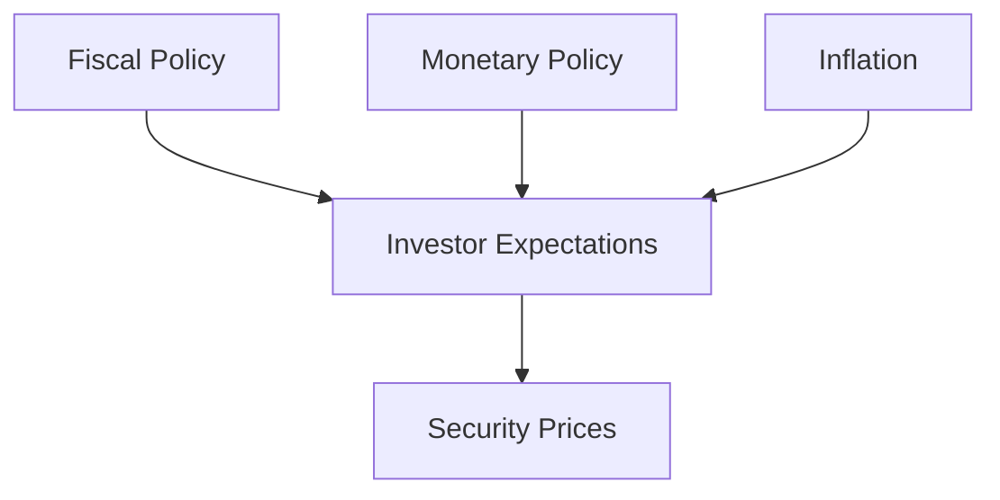

## 13.2 Learning Objectives

In this section, we delve into the essential learning objectives of Chapter 13, which focuses on the critical aspects of fundamental and technical analysis in investment. Understanding these concepts is vital for anyone looking to excel in the Canadian financial markets. This chapter aims to equip you with the knowledge to make informed investment decisions by analyzing various economic indicators and market trends.

### Key Learning Goals

#### 1. Compare and Contrast Fundamental and Technical Analysis

**Fundamental Analysis** involves evaluating a security's intrinsic value by examining related economic, financial, and other qualitative and quantitative factors. It considers everything from the overall economy and industry conditions to the financial condition and management of companies. This analysis is crucial for long-term investment strategies as it helps investors determine whether a security is undervalued or overvalued.

**Technical Analysis**, on the other hand, focuses on statistical trends gathered from trading activity, such as price movement and volume. It is used to forecast the direction of prices through the study of past market data, primarily price and volume. Technical analysis is often used for short-term trading strategies.

**Importance:** Understanding the differences between these two approaches allows investors to choose the right strategy based on their investment goals and risk tolerance. By comparing and contrasting these methods, investors can develop a more comprehensive view of the market.

#### 2. Describe How Fiscal Policy, Monetary Policy, and Inflation Affect Investor Expectations and Security Prices

**Fiscal Policy** refers to government spending and tax policies that influence macroeconomic conditions. In Canada, the Department of Finance Canada plays a pivotal role in shaping fiscal policy. Changes in fiscal policy can affect investor expectations by altering disposable income, consumer spending, and overall economic growth.

**Monetary Policy** is managed by the Bank of Canada and involves controlling the money supply and interest rates to achieve economic objectives. Monetary policy can influence inflation rates, currency strength, and economic growth, all of which impact investor expectations and security prices.

**Inflation** is the rate at which the general level of prices for goods and services rises, eroding purchasing power. Inflation affects interest rates, consumer spending, and investment returns. Understanding inflation trends is crucial for investors to protect their portfolios against inflationary pressures.

**Importance:** Grasping how these economic policies and inflation affect the market helps investors anticipate changes in security prices and adjust their portfolios accordingly.

#### 3. Explain Industry Classifications and Their Impact on Stock Valuation

Industry classifications categorize companies into sectors based on their primary business activities. Common classification systems include the Global Industry Classification Standard (GICS) and the North American Industry Classification System (NAICS).

**Impact on Stock Valuation:** Different industries have unique characteristics and risks that affect stock valuation. For example, technology stocks may be valued based on growth potential, while utility stocks might be valued for their stability and dividends. Understanding industry classifications helps investors assess the risk and return profiles of different sectors and make informed decisions about asset allocation.

**Importance:** Recognizing how industry classifications influence stock valuation enables investors to diversify their portfolios and manage risk effectively.

#### 4. Describe the Tools Used in Technical Analysis

Technical analysis employs various tools and indicators to analyze market trends and predict future price movements. Some common tools include:

- **Moving Averages:** Used to smooth out price data and identify trends over time.
- **Relative Strength Index (RSI):** A momentum oscillator that measures the speed and change of price movements.
- **Bollinger Bands:** A volatility indicator that consists of a middle band (simple moving average) and two outer bands (standard deviations).
- **Candlestick Patterns:** Visual representations of price movements that help identify potential market reversals.

**Importance:** Mastering these tools allows investors to interpret market signals and make timely trading decisions.

### Practical Examples and Case Studies

To illustrate these concepts, consider the following examples:

- **Canadian Pension Funds:** Many Canadian pension funds use a combination of fundamental and technical analysis to manage their portfolios. For instance, they might use fundamental analysis to select undervalued stocks for long-term growth and technical analysis to optimize entry and exit points.

- **Major Canadian Banks:** Banks like RBC and TD often analyze fiscal and monetary policies to adjust their lending rates and investment strategies. Understanding these policies helps them anticipate changes in the economic environment and manage risk effectively.

### Diagrams and Visual Aids

Below is a diagram illustrating the relationship between fiscal policy, monetary policy, inflation, and security prices:

### Best Practices and Common Pitfalls

- **Best Practices:** Combine both fundamental and technical analysis for a holistic view of the market. Stay informed about economic policies and industry trends to make data-driven investment decisions.

- **Common Pitfalls:** Relying solely on one type of analysis can lead to biased decisions. Avoid ignoring macroeconomic indicators that can significantly impact market conditions.

### Additional Resources

For further exploration, consider the following resources:

- **Bank of Canada:** [Monetary Policy](https://www.bankofcanada.ca/core-functions/monetary-policy/)
- **Department of Finance Canada:** [Fiscal Policy](https://www.canada.ca/en/department-finance.html)
- **Investopedia:** Articles on [Fundamental Analysis](https://www.investopedia.com/terms/f/fundamentalanalysis.asp) and [Technical Analysis](https://www.investopedia.com/terms/t/technicalanalysis.asp)

### Conclusion

By mastering the learning objectives outlined in this chapter, you will be well-equipped to analyze and interpret market trends, make informed investment decisions, and effectively manage your portfolio in the Canadian financial landscape. Remember to continuously apply these principles and strategies to enhance your investment acumen.

### **Ready to Test Your Knowledge?**

**Practice 10 Essential CSC Exam Questions to Master Your Certification**



### Which analysis method focuses on evaluating a security's intrinsic value?

- [x] Fundamental Analysis
- [ ] Technical Analysis
- [ ] Quantitative Analysis
- [ ] Sentiment Analysis

> **Explanation:** Fundamental analysis evaluates a security's intrinsic value by examining economic, financial, and other qualitative and quantitative factors.

### What is the primary focus of technical analysis?

- [ ] Evaluating a company's financial statements
- [x] Analyzing statistical trends from trading activity
- [ ] Assessing macroeconomic conditions
- [ ] Studying industry classifications

> **Explanation:** Technical analysis focuses on statistical trends gathered from trading activity, such as price movement and volume.

### Which institution manages monetary policy in Canada?

- [ ] Department of Finance Canada
- [x] Bank of Canada
- [ ] Canadian Securities Administrators
- [ ] Financial Consumer Agency of Canada

> **Explanation:** The Bank of Canada manages monetary policy, controlling the money supply and interest rates.

### How does inflation affect investor expectations?

- [x] It erodes purchasing power and affects interest rates.
- [ ] It stabilizes currency strength.
- [ ] It decreases consumer spending.
- [ ] It has no impact on investment returns.

> **Explanation:** Inflation erodes purchasing power, affects interest rates, and can impact investment returns.

### What is the purpose of industry classifications?

- [x] To categorize companies based on business activities
- [ ] To determine fiscal policy
- [x] To assess stock valuation
- [ ] To manage monetary policy

> **Explanation:** Industry classifications categorize companies based on their primary business activities and help assess stock valuation.

### Which tool is used in technical analysis to identify trends over time?

- [x] Moving Averages
- [ ] Income Statements
- [ ] Fiscal Reports
- [ ] Industry Classifications

> **Explanation:** Moving averages are used in technical analysis to smooth out price data and identify trends over time.

### What does the Relative Strength Index (RSI) measure?

- [x] Momentum and price movement speed
- [ ] Company profitability
- [x] Market volatility
- [ ] Economic growth

> **Explanation:** The RSI is a momentum oscillator that measures the speed and change of price movements.

### What is a common pitfall in investment analysis?

- [x] Relying solely on one type of analysis
- [ ] Combining fundamental and technical analysis
- [ ] Staying informed about economic policies
- [ ] Diversifying portfolios

> **Explanation:** Relying solely on one type of analysis can lead to biased decisions and is a common pitfall.

### Which Canadian resource provides insights into fiscal policy?

- [ ] Bank of Canada
- [x] Department of Finance Canada
- [ ] Canadian Securities Administrators
- [ ] Financial Consumer Agency of Canada

> **Explanation:** The Department of Finance Canada provides insights into fiscal policy.

### True or False: Technical analysis is primarily used for long-term investment strategies.

- [ ] True
- [x] False

> **Explanation:** Technical analysis is often used for short-term trading strategies, focusing on statistical trends and market signals.


