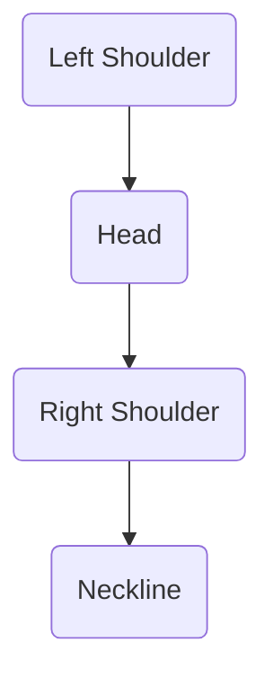
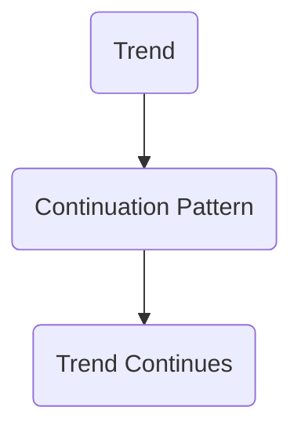
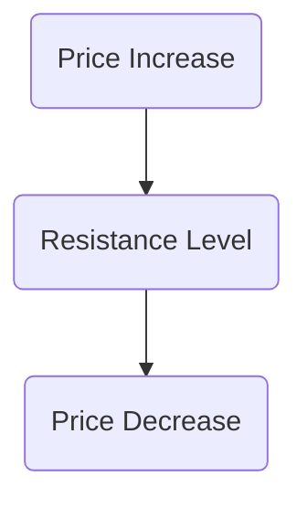
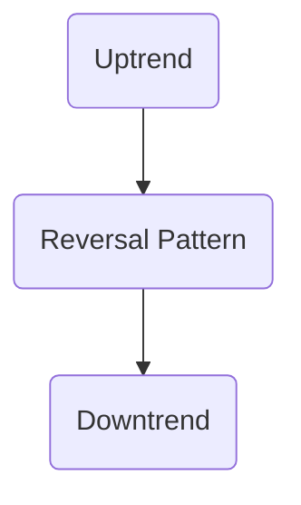
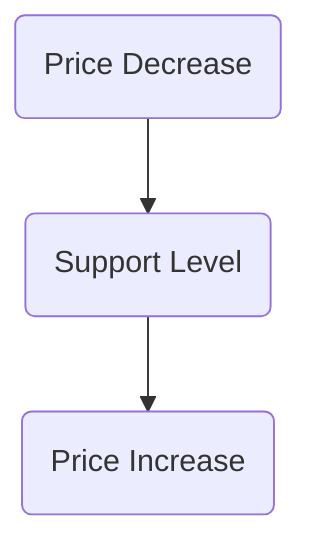

## Glossary for Chapter 13: Fundamental and Technical Analysis

In Chapter 13, we delve into the intricate world of fundamental and technical analysis, two pivotal methodologies used by investors to evaluate securities and make informed investment decisions. This glossary provides a comprehensive overview of key terms and concepts essential for mastering these analytical approaches, particularly within the Canadian financial landscape.

### Blue-Chip

**Definition:** Blue-chip stocks are shares of top investment-quality companies known for their reliability, stability, and consistent earnings and dividends. These companies typically have a long-standing reputation for financial strength and are leaders in their respective industries.

**Example:** In Canada, companies like Royal Bank of Canada (RBC) and Toronto-Dominion Bank (TD) are considered blue-chip stocks due to their robust financial performance and market leadership.

### Head-and-Shoulders Formation

**Definition:** A head-and-shoulders formation is a chart pattern that signals a reversal in the trend of a security's price. It consists of three peaks: a higher peak (head) between two lower peaks (shoulders). This pattern can indicate a shift from bullish to bearish trends or vice versa.

**Diagram:**

**Application:** Traders use this pattern to anticipate potential reversals and adjust their strategies accordingly.

### Chart Analysis

**Definition:** Chart analysis involves studying price and volume charts to identify patterns and trends in the market. This technique is fundamental to technical analysis and helps investors predict future price movements.

**Practical Use:** By analyzing historical price data, investors can identify support and resistance levels, trend lines, and chart patterns to make informed trading decisions.

### Mature Industries

**Definition:** Mature industries are characterized by stable growth, established market positions, and slower sales and earnings growth. These industries typically have a high degree of competition and limited opportunities for expansion.

**Example:** The Canadian telecommunications industry is considered mature, with major players like Bell Canada and Rogers Communications dominating the market.

### Continuation Pattern

**Definition:** Continuation patterns are chart formations that indicate a pause in the existing trend before it continues in the same direction. Common continuation patterns include flags, pennants, and triangles.

**Diagram:**

**Application:** Traders use continuation patterns to confirm that the current trend is likely to persist, allowing them to maintain or adjust their positions.

### Moving Average

**Definition:** A moving average is a statistical tool that smooths out price data to identify the direction of the trend. It is calculated by averaging a security's price over a specific number of periods.

**Types:** Common types include simple moving averages (SMA) and exponential moving averages (EMA).

**Example:** A 50-day moving average can help investors identify the medium-term trend of a stock's price.

### Contrarian Investors

**Definition:** Contrarian investors go against prevailing market trends by buying when others are selling and selling when others are buying. They believe that crowd behavior often leads to mispriced securities.

**Example:** During market downturns, contrarian investors might purchase undervalued stocks, anticipating a future rebound.

### Neckline

**Definition:** In a head-and-shoulders chart pattern, the neckline is a support or resistance level that confirms the reversal when broken. It connects the lows of the two shoulders.

**Diagram:**

**Application:** Breaking the neckline signals a potential trend reversal, prompting traders to take action.

### Cycle Analysis

**Definition:** Cycle analysis involves studying recurring market cycles to predict future price movements and market turning points. It considers economic, seasonal, and market cycles.

**Example:** Investors might analyze the business cycle to anticipate changes in economic conditions and adjust their portfolios accordingly.

### Quantitative Analysis

**Definition:** Quantitative analysis uses statistical and mathematical models to analyze market data and inform trading decisions. It often involves complex algorithms and data analysis techniques.

**Application:** Quantitative analysts, or "quants," develop models to identify trading opportunities and manage risk.

### Cyclical Industry

**Definition:** Cyclical industries are highly sensitive to economic cycles, experiencing significant earnings fluctuations during expansions and recessions. These industries often include sectors like automotive and construction.

**Example:** The Canadian mining industry is cyclical, with performance closely tied to global economic conditions and commodity prices.

### Random Walk Theory

**Definition:** The random walk theory posits that stock price changes are random and unpredictable, making it impossible to consistently outperform the market. This theory challenges the effectiveness of technical analysis.

**Implication:** According to this theory, investors cannot predict future price movements based on past data.

### Declining Industries

**Definition:** Declining industries experience a decrease in demand and profitability due to factors like technological changes or shifting consumer preferences. These industries face challenges in maintaining growth and competitiveness.

**Example:** The traditional print media industry is declining as digital media gains popularity.

### Rational Expectations Hypothesis

**Definition:** The rational expectations hypothesis assumes that individuals make logical and informed decisions based on all available information. It suggests that markets are efficient and reflect all known information.

**Implication:** Investors are expected to anticipate future events accurately, leading to market equilibrium.

### Defensive Industries

**Definition:** Defensive industries perform relatively well during economic downturns due to consistent demand for their products or services. These industries often include utilities and consumer staples.

**Example:** The Canadian healthcare industry is considered defensive, as demand for medical services remains stable regardless of economic conditions.

### Resistance Levels

**Definition:** Resistance levels are price levels at which selling pressure is strong enough to prevent the price from rising further. These levels act as a ceiling for the price movement.

**Diagram:**

**Application:** Traders use resistance levels to identify potential selling opportunities.

### Economies of Scale

**Definition:** Economies of scale refer to cost advantages gained by increasing production levels, leading to lower per-unit costs. Larger companies often benefit from economies of scale, enhancing their competitiveness.

**Example:** A Canadian manufacturing company may achieve economies of scale by expanding its production facilities and reducing costs.

### Reversal Pattern

**Definition:** Reversal patterns are chart formations that indicate a change in the direction of the prevailing trend. Common reversal patterns include double tops, double bottoms, and head-and-shoulders.

**Diagram:**

**Application:** Identifying reversal patterns helps traders anticipate trend changes and adjust their strategies.

### Efficient Market Hypothesis

**Definition:** The efficient market hypothesis (EMH) asserts that stock prices fully reflect all available information, making it impossible to consistently achieve higher returns without taking on additional risk.

**Implication:** According to EMH, active management strategies are unlikely to outperform passive index investing.

### Sentiment Indicators

**Definition:** Sentiment indicators measure investor confidence and emotions to gauge the overall market mood. These indicators can provide insights into potential market turning points.

**Example:** The Canadian Investor Sentiment Index tracks investor optimism and pessimism in the Canadian market.

### Emerging Growth Industries

**Definition:** Emerging growth industries are new industries characterized by rapid innovation, high growth potential, and often initial unprofitability. These industries offer significant opportunities for investors willing to take on higher risk.

**Example:** The Canadian technology sector, particularly in areas like artificial intelligence and clean energy, represents emerging growth industries.

### Speculative Industry

**Definition:** Speculative industries or companies involve high risk and uncertainty, often due to a lack of definitive information or volatile market conditions. Investments in these industries can lead to substantial gains or losses.

**Example:** The cannabis industry in Canada is considered speculative due to regulatory uncertainties and market volatility.

### Fundamental Analysis

**Definition:** Fundamental analysis evaluates a security's intrinsic value by examining related economic, financial, and other qualitative and quantitative factors. It involves analyzing financial statements, industry conditions, and macroeconomic trends.

**Application:** Investors use fundamental analysis to assess a company's financial health and growth prospects, guiding long-term investment decisions.

### Support Levels

**Definition:** Support levels are price levels at which buying pressure is strong enough to prevent the price from falling further. These levels act as a floor for the price movement.

**Diagram:**

**Application:** Traders use support levels to identify potential buying opportunities.

### Growth Industry

**Definition:** Growth industries experience consistent sales and earnings expansion at a faster rate than most other industries. These industries often benefit from innovation and favorable market conditions.

**Example:** The Canadian renewable energy sector is a growth industry, driven by increasing demand for sustainable energy solutions.

### Technical Analysis

**Definition:** Technical analysis studies past market data, primarily price and volume, to forecast future price movements. It relies on chart patterns, indicators, and statistical tools to identify trading opportunities.

**Application:** Technical analysts use various tools and techniques to analyze market trends and make short-term trading decisions.

---

By understanding these key terms and concepts, investors can enhance their analytical skills and make more informed decisions in the Canadian securities market. Whether employing fundamental or technical analysis, a solid grasp of these principles is essential for success in the financial industry.

## Quiz Time!



### What is a blue-chip stock?

- [x] Shares of top investment-quality companies with reliable earnings and dividends
- [ ] Shares of small, high-growth companies
- [ ] Shares of speculative companies with high risk
- [ ] Shares of companies in declining industries

> **Explanation:** Blue-chip stocks are shares of top investment-quality companies known for their reliability and consistent earnings.

### What does a head-and-shoulders formation indicate?

- [x] A reversal in the trend
- [ ] A continuation of the trend
- [ ] A period of consolidation
- [ ] A breakout

> **Explanation:** A head-and-shoulders formation signals a reversal in the trend, either from bullish to bearish or vice versa.

### What is the purpose of chart analysis?

- [x] To identify patterns and trends in the market
- [ ] To evaluate a company's financial statements
- [ ] To assess economic conditions
- [ ] To determine investor sentiment

> **Explanation:** Chart analysis involves studying price and volume charts to identify patterns and trends in the market.

### What characterizes mature industries?

- [x] Stable growth and slower sales and earnings growth
- [ ] Rapid innovation and high growth potential
- [ ] High risk and uncertainty
- [ ] Declining demand and profitability

> **Explanation:** Mature industries are characterized by stable growth, established market positions, and slower sales and earnings growth.

### What is a continuation pattern?

- [x] A chart formation indicating a pause before the trend continues
- [ ] A chart formation indicating a trend reversal
- [ ] A chart formation indicating a breakout
- [ ] A chart formation indicating consolidation

> **Explanation:** Continuation patterns indicate a pause in the existing trend before it continues in the same direction.

### What is the role of a moving average?

- [x] To smooth out price data and identify the trend direction
- [ ] To predict future economic conditions
- [ ] To evaluate a company's intrinsic value
- [ ] To measure investor sentiment

> **Explanation:** A moving average is a statistical tool that smooths out price data to identify the direction of the trend.

### Who are contrarian investors?

- [x] Investors who go against prevailing market trends
- [ ] Investors who follow market trends
- [ ] Investors who focus on emerging industries
- [ ] Investors who avoid high-risk investments

> **Explanation:** Contrarian investors go against prevailing market trends by buying when others are selling and selling when others are buying.

### What does the neckline in a head-and-shoulders pattern represent?

- [x] A support or resistance level confirming the reversal
- [ ] A trend continuation signal
- [ ] A breakout point
- [ ] A consolidation area

> **Explanation:** The neckline is a support or resistance level in a head-and-shoulders chart pattern that confirms the reversal when broken.

### What is the efficient market hypothesis?

- [x] The theory that stock prices fully reflect all available information
- [ ] The theory that stock prices are random and unpredictable
- [ ] The theory that markets are always rational
- [ ] The theory that markets are driven by investor sentiment

> **Explanation:** The efficient market hypothesis asserts that stock prices fully reflect all available information, making it impossible to consistently achieve higher returns without additional risk.

### True or False: Technical analysis relies on past market data to forecast future price movements.

- [x] True
- [ ] False

> **Explanation:** Technical analysis studies past market data, primarily price and volume, to forecast future price movements.


