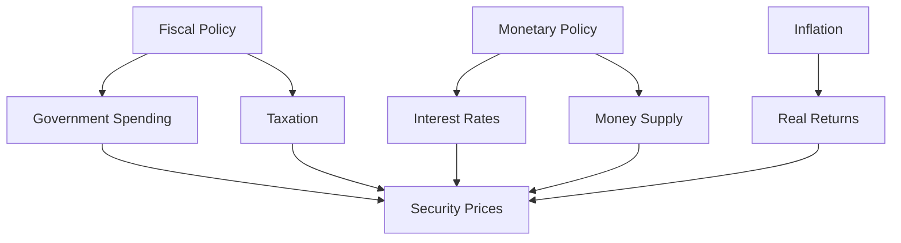

## 13.7 Fundamental Macroeconomic Analysis

Understanding the macroeconomic environment is crucial for investors and financial professionals as it provides the context within which financial markets operate. This section delves into three primary macroeconomic factors—fiscal policy, monetary policy, and inflation—and examines their influence on investor expectations and security prices. Additionally, we will explore how unpredictable events can impact the economy and securities, providing a comprehensive view of the macroeconomic landscape.

### Macroeconomic Factors

Macroeconomic factors are large-scale economic variables that affect the economy as a whole. These include GDP growth, unemployment rates, and inflation, among others. For investors, understanding these factors is essential for making informed decisions about asset allocation and risk management.

### Fiscal Policy

Fiscal policy refers to the government's use of taxation and spending to influence the economy. In Canada, fiscal policy is determined by the federal government and involves decisions about government spending levels and tax policies.

#### Impact on Investor Expectations and Security Prices

1. **Government Spending:** Increased government spending can stimulate economic growth by boosting demand for goods and services. This can lead to higher corporate earnings and, consequently, higher stock prices. Conversely, reduced spending can slow economic growth and negatively impact security prices.

2. **Taxation:** Changes in tax policy can directly affect disposable income for consumers and profitability for businesses. For example, a reduction in corporate taxes can increase after-tax profits, making stocks more attractive to investors.

3. **Budget Deficits and Surpluses:** A budget deficit, where government spending exceeds revenue, can lead to increased borrowing and higher interest rates, potentially dampening investment. A surplus, on the other hand, might lead to lower interest rates and increased investment activity.

### Monetary Policy

Monetary policy involves the management of interest rates and the money supply by a central bank. In Canada, the Bank of Canada is responsible for setting monetary policy, with the primary goal of maintaining price stability and supporting economic growth.

#### Impact on Investor Expectations and Security Prices

1. **Interest Rates:** The Bank of Canada influences interest rates through its policy rate. Lower interest rates reduce the cost of borrowing, encouraging investment and consumption, which can drive up stock prices. Higher rates have the opposite effect, potentially leading to lower stock prices.

2. **Money Supply:** By controlling the money supply, the Bank of Canada can influence inflation and economic growth. An increase in the money supply can lead to lower interest rates and higher asset prices, while a decrease can have the opposite effect.

3. **Exchange Rates:** Monetary policy can also affect exchange rates, impacting the competitiveness of Canadian exports and the profitability of companies with international operations.

### Inflation

Inflation is the rate at which the general level of prices for goods and services rises, eroding purchasing power. It is a critical factor for investors as it affects real returns on investments.

#### Impact on Investor Expectations and Security Prices

1. **Real Returns:** Inflation reduces the real return on investments. For example, if an investment yields a 5% return but inflation is 3%, the real return is only 2%.

2. **Interest Rates:** Central banks, including the Bank of Canada, may raise interest rates to combat high inflation, which can lead to higher borrowing costs and lower stock prices.

3. **Asset Prices:** Inflation can lead to higher asset prices, particularly in real assets like real estate and commodities, which are often seen as hedges against inflation.

### Unpredictable Events and Their Impact

Unpredictable events, such as geopolitical tensions, natural disasters, or pandemics, can have significant impacts on the economy and securities. These events can lead to sudden shifts in investor sentiment and market volatility.

1. **Geopolitical Events:** Conflicts or political instability can disrupt markets, leading to increased risk premiums and lower asset prices.

2. **Natural Disasters:** Events like earthquakes or floods can disrupt supply chains and economic activity, impacting corporate earnings and stock prices.

3. **Pandemics:** As seen with COVID-19, pandemics can lead to widespread economic disruption, affecting everything from consumer behavior to global trade.

### Practical Examples and Case Studies

#### Canadian Pension Funds

Canadian pension funds, such as the Canada Pension Plan Investment Board (CPPIB), often adjust their asset allocations based on macroeconomic conditions. For instance, during periods of low interest rates, they may increase their exposure to equities and alternative investments to achieve desired returns.

#### Major Canadian Banks

Banks like RBC and TD closely monitor macroeconomic indicators to manage their lending portfolios and investment strategies. For example, in a low-interest-rate environment, banks may focus on fee-based services to maintain profitability.

### Diagrams and Visual Aids

Below is a diagram illustrating the relationship between fiscal policy, monetary policy, and inflation, and their collective impact on security prices.

### Best Practices and Common Pitfalls

- **Stay Informed:** Regularly review reports from the Bank of Canada and Statistics Canada for up-to-date macroeconomic data.
- **Diversify Investments:** Diversification can help mitigate risks associated with macroeconomic volatility.
- **Monitor Policy Changes:** Be aware of potential changes in fiscal and monetary policy that could impact your investments.

### References and Further Reading

- Bank of Canada: [Monetary Policy Reports](https://www.bankofcanada.ca/publications/mpr/)
- Statistics Canada: [Economic Indicators](https://www.statcan.gc.ca/en/subjects-start/economic_indicators)
- Books: "Macroeconomics for Professionals" by Leslie Lipschitz and Susan Schadler

### Summary

Understanding fundamental macroeconomic analysis is essential for navigating the complexities of financial markets. By analyzing fiscal policy, monetary policy, and inflation, investors can make more informed decisions and better anticipate market movements. Additionally, being aware of unpredictable events and their potential impacts can help investors manage risk effectively.

### **Ready to Test Your Knowledge?**

**Practice 10 Essential CSC Exam Questions to Master Your Certification**



### Which of the following is a component of fiscal policy?

- [x] Government Spending
- [ ] Interest Rates
- [ ] Money Supply
- [ ] Inflation

> **Explanation:** Fiscal policy involves government spending and taxation decisions, not interest rates or money supply, which are part of monetary policy.

### What is the primary goal of the Bank of Canada's monetary policy?

- [x] Maintaining price stability
- [ ] Increasing government revenue
- [ ] Reducing unemployment
- [ ] Controlling fiscal deficits

> **Explanation:** The Bank of Canada's primary goal is to maintain price stability, which involves controlling inflation and supporting economic growth.

### How does inflation affect real returns on investments?

- [x] It reduces real returns
- [ ] It increases real returns
- [ ] It has no effect on real returns
- [ ] It doubles real returns

> **Explanation:** Inflation erodes purchasing power, thereby reducing the real returns on investments.

### Which macroeconomic factor is directly influenced by the Bank of Canada?

- [x] Interest Rates
- [ ] Taxation
- [ ] Government Spending
- [ ] Exchange Rates

> **Explanation:** The Bank of Canada directly influences interest rates through its monetary policy.

### What can cause sudden shifts in investor sentiment and market volatility?

- [x] Unpredictable events
- [ ] Stable inflation rates
- [ ] Consistent fiscal policy
- [ ] Predictable monetary policy

> **Explanation:** Unpredictable events, such as geopolitical tensions or natural disasters, can lead to sudden shifts in investor sentiment and market volatility.

### How can investors mitigate risks associated with macroeconomic volatility?

- [x] Diversification
- [ ] Concentrating investments
- [ ] Ignoring economic indicators
- [ ] Relying solely on historical data

> **Explanation:** Diversification helps spread risk and can mitigate the impact of macroeconomic volatility on a portfolio.

### What is a potential effect of a budget deficit on the economy?

- [x] Increased borrowing and higher interest rates
- [ ] Lower interest rates
- [ ] Decreased borrowing
- [ ] Reduced government spending

> **Explanation:** A budget deficit can lead to increased borrowing by the government, which may result in higher interest rates.

### How does the Bank of Canada influence the money supply?

- [x] Through monetary policy
- [ ] Through fiscal policy
- [ ] By setting tax rates
- [ ] By controlling government spending

> **Explanation:** The Bank of Canada influences the money supply through its monetary policy actions.

### What is a common hedge against inflation?

- [x] Real assets like real estate
- [ ] Fixed-income securities
- [ ] Cash holdings
- [ ] High-interest savings accounts

> **Explanation:** Real assets, such as real estate, are often used as hedges against inflation because their value tends to rise with inflation.

### True or False: Fiscal policy is determined by the Bank of Canada.

- [ ] True
- [x] False

> **Explanation:** Fiscal policy is determined by the federal government, not the Bank of Canada, which is responsible for monetary policy.


