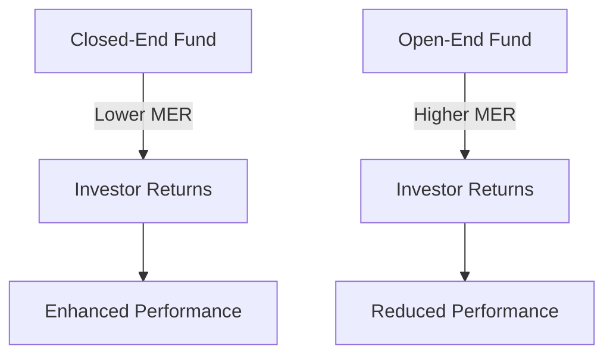

## 22.10 Advantages of Closed-End Funds

Closed-end funds (CEFs) offer a unique investment vehicle that can provide several advantages over their open-end counterparts. Understanding these benefits is crucial for investors looking to diversify their portfolios and capitalize on opportunities within the Canadian financial landscape. This section delves into the key advantages of closed-end funds, including potential for capital gains, access to exclusive investment strategies, and lower management expense ratios (MERs).

### Potential for Capital Gains Through Discounts to NAVPS

One of the most compelling advantages of closed-end funds is the potential for capital gains through discounts to Net Asset Value Per Share (NAVPS). Unlike open-end funds, which are priced at their NAV, closed-end funds trade on the stock exchange at market prices that can be above or below their NAV. This discrepancy creates opportunities for investors to purchase shares at a discount, potentially leading to capital gains if the market price converges with the NAV over time.

#### Example: Canadian Closed-End Fund Discount

Consider a Canadian closed-end fund trading at a 10% discount to its NAV. If the NAV is $20 per share, the market price might be $18. An investor purchasing at this discount could realize a capital gain if the market price rises to match the NAV, assuming the NAV remains stable or increases.

### Access to Investment Strategies Not Available in Open-End Funds

Closed-end funds offer access to a broader range of investment strategies that are not typically available in open-end mutual funds. This includes the ability to engage in short selling, leverage, and investing in less liquid assets. These strategies can enhance returns and provide diversification benefits, making closed-end funds an attractive option for sophisticated investors.

#### Case Study: Short Selling in Closed-End Funds

A closed-end fund focused on Canadian equities might employ short selling to hedge against market downturns or capitalize on overvalued stocks. This strategy can provide a buffer during volatile market conditions, potentially enhancing the fund's performance compared to traditional mutual funds that do not engage in short selling.

### Lower Management Expense Ratios (MERs)

Closed-end funds often have lower Management Expense Ratios (MERs) compared to similar mutual funds. This is primarily due to their fixed share structure, which eliminates the need for continuous share issuance and redemption. Lower MERs mean that a greater portion of the fund's returns is passed on to investors, enhancing overall investment performance.

#### Diagram: Comparison of MERs

Below is a diagram illustrating the difference in MERs between closed-end funds and open-end mutual funds.

### Glossary

- **Capital Gain:** The profit earned when selling an investment at a higher price than its purchase price.
- **Management Expense Ratio (MER):** The total annual fund operating expenses as a percentage of the fund's average assets under management.

### Best Practices and Considerations

- **Research and Analysis:** Investors should conduct thorough research to identify closed-end funds trading at attractive discounts and evaluate the fund manager's track record.
- **Market Conditions:** Consider the impact of market conditions on the fund's strategies, particularly for those employing leverage or short selling.
- **Long-Term Perspective:** Closed-end funds can be volatile in the short term; a long-term investment horizon may help mitigate risks and capitalize on potential gains.

### Common Pitfalls and Challenges

- **Liquidity Risks:** Some closed-end funds invest in illiquid assets, which can pose risks during market downturns.
- **Discount Volatility:** The discount to NAV can fluctuate, impacting potential capital gains.
- **Complex Strategies:** Investors should ensure they understand the fund's strategies and associated risks.

### Resources for Further Exploration

- **Book:** *Investment Opportunities with Closed-End Funds* by John Davis
- **Article:** [Benefits of Closed-End Funds](https://www.investopedia.com/terms/c/closedendfund.asp)

### Encouragement for Application

Investors are encouraged to explore closed-end funds as part of a diversified investment strategy. By understanding the unique advantages and potential risks, investors can make informed decisions that align with their financial goals and risk tolerance.

### **Ready to Test Your Knowledge?**

**Practice 10 Essential CSC Exam Questions to Master Your Certification**



### Which of the following is a key advantage of closed-end funds?

- [x] Potential for capital gains through discounts to NAVPS
- [ ] Guaranteed returns
- [ ] Daily liquidity
- [ ] No management fees

> **Explanation:** Closed-end funds can trade at a discount to their NAVPS, offering potential for capital gains if the market price converges with the NAV.

### What investment strategy is typically available in closed-end funds but not in open-end funds?

- [x] Short selling
- [ ] Dollar-cost averaging
- [ ] Buy and hold
- [ ] Index tracking

> **Explanation:** Closed-end funds can engage in short selling, a strategy not commonly available in open-end mutual funds.

### How do closed-end funds typically achieve lower MERs compared to open-end funds?

- [x] Fixed share structure
- [ ] Higher trading volume
- [ ] Government subsidies
- [ ] Lower investment returns

> **Explanation:** The fixed share structure of closed-end funds eliminates the need for continuous share issuance and redemption, resulting in lower MERs.

### What does NAVPS stand for?

- [x] Net Asset Value Per Share
- [ ] Net Annual Value Per Share
- [ ] New Asset Value Per Share
- [ ] None of the above

> **Explanation:** NAVPS stands for Net Asset Value Per Share, which is a measure of a fund's per-share value.

### Which of the following is a potential risk of investing in closed-end funds?

- [x] Liquidity risks
- [ ] Guaranteed losses
- [ ] No potential for capital gains
- [ ] Fixed returns

> **Explanation:** Some closed-end funds invest in illiquid assets, which can pose risks during market downturns.

### What is a common characteristic of closed-end funds?

- [x] They trade on stock exchanges
- [ ] They offer daily redemption
- [ ] They have no management fees
- [ ] They guarantee returns

> **Explanation:** Closed-end funds are listed and traded on stock exchanges, similar to stocks.

### What is the primary benefit of lower MERs in closed-end funds?

- [x] Enhanced investor returns
- [ ] Increased fund expenses
- [ ] Reduced investment performance
- [ ] Higher management fees

> **Explanation:** Lower MERs mean that a greater portion of the fund's returns is passed on to investors, enhancing overall investment performance.

### Which of the following is NOT typically a feature of closed-end funds?

- [x] Daily liquidity
- [ ] Fixed share structure
- [ ] Potential for discounts to NAVPS
- [ ] Access to leverage

> **Explanation:** Closed-end funds do not offer daily liquidity; they are traded on exchanges like stocks.

### What should investors consider when investing in closed-end funds?

- [x] Market conditions and fund strategies
- [ ] Only the fund's past performance
- [ ] The fund's name
- [ ] The fund's advertising

> **Explanation:** Investors should consider market conditions and the fund's strategies, particularly those employing leverage or short selling.

### True or False: Closed-end funds can provide access to investment strategies not available in open-end funds.

- [x] True
- [ ] False

> **Explanation:** Closed-end funds can engage in strategies like short selling and leverage, which are not typically available in open-end funds.


