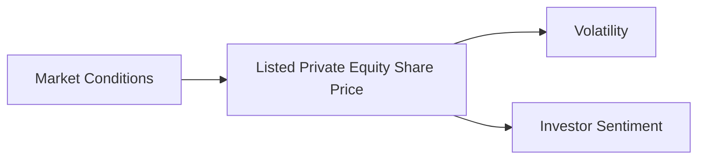

## 22.19 Disadvantages of Listed Private Equity

Listed private equity (LPE) offers investors an opportunity to gain exposure to private equity investments through publicly traded vehicles. While this can provide access to a traditionally illiquid asset class, it also comes with its own set of disadvantages. Understanding these drawbacks is crucial for investors, particularly within the Canadian financial landscape, where market dynamics and regulatory frameworks can influence investment outcomes.

### Illiquidity and Long Holding Periods

Despite being publicly traded, listed private equity can still suffer from illiquidity. Illiquidity refers to the difficulty in selling an investment quickly without affecting its price. In the context of LPE, this can manifest in several ways:

- **Limited Trading Volume:** LPE shares may not trade as frequently as other public equities, leading to wider bid-ask spreads and potential challenges in executing large transactions without impacting the market price.
  
- **Long Investment Horizons:** Private equity investments typically require long holding periods to realize value, as they involve restructuring or growing businesses over time. This characteristic is inherited by LPEs, meaning investors may need to commit to holding their shares for extended periods to achieve desired returns.

#### Practical Example

Consider a Canadian pension fund investing in a listed private equity firm that focuses on technology startups. While the fund can buy and sell shares on the Toronto Stock Exchange, the underlying investments in startups may take years to mature, limiting liquidity and requiring patience from investors.

### Dependence on Managerial Expertise and Key Personnel

The success of listed private equity investments heavily relies on the expertise and decision-making abilities of the management team. This dependence introduces several risks:

- **Key Person Risk:** The departure of key personnel can significantly impact the performance of the investment. Skilled managers are crucial for identifying opportunities, executing strategies, and navigating complex market environments.

- **Managerial Performance:** The effectiveness of the management team in executing the private equity strategy directly affects returns. Poor decisions or mismanagement can lead to suboptimal outcomes.

#### Case Study: Canadian Bank Involvement

A major Canadian bank, such as RBC, may invest in a listed private equity firm with a strong management team known for its expertise in the energy sector. If key team members leave, the bank's investment could suffer due to a loss of strategic direction and industry knowledge.

### Volatility and Market Risk

Listed private equity shares are subject to the same market risks and volatility as other publicly traded securities. This can lead to fluctuations in share prices that may not reflect the underlying value of the private equity investments:

- **Market Sentiment:** Share prices can be influenced by broader market trends and investor sentiment, leading to volatility unrelated to the performance of the underlying assets.

- **Economic Conditions:** Changes in economic conditions, such as interest rates or geopolitical events, can impact the valuation of listed private equity shares.

#### Diagram: Market Risk Impact on LPE

### Potential for Concentration Risk

Listed private equity investments may be concentrated in specific sectors or types of investments, leading to concentration risk. This risk arises when a portfolio lacks diversification, making it vulnerable to adverse developments in a particular area:

- **Sector Focus:** LPE firms often specialize in certain industries, such as technology or healthcare. A downturn in these sectors can disproportionately affect the investment's performance.

- **Geographic Concentration:** Investments may also be concentrated in specific regions, exposing them to localized economic or political risks.

#### Example: Sector Concentration

A listed private equity firm with a focus on Canadian natural resources may face significant risks if commodity prices decline, impacting the firm's overall performance and share price.

### Glossary

- **Illiquidity:** Difficulty in selling an investment quickly without affecting its price.

### Resources for Further Exploration

- Article: [Risks of Listed Private Equity](https://www.investopedia.com/articles/fundamental-analysis/02/privateequity.asp)
- Book: *Private Equity: History, Governance, and Operations* by Harry Cendrowski

### Conclusion

While listed private equity provides a unique avenue for investors to access private equity markets, it is not without its challenges. Understanding the disadvantages, such as illiquidity, dependence on managerial expertise, volatility, and concentration risk, is essential for making informed investment decisions. By considering these factors and leveraging resources for further exploration, investors can better navigate the complexities of listed private equity within the Canadian financial landscape.

### **Ready to Test Your Knowledge?**

**Practice 10 Essential CSC Exam Questions to Master Your Certification**



### What is a primary disadvantage of listed private equity despite being publicly traded?

- [x] Illiquidity
- [ ] High liquidity
- [ ] Guaranteed returns
- [ ] Low management fees

> **Explanation:** Listed private equity can still suffer from illiquidity due to limited trading volume and long investment horizons.

### What is key person risk in the context of listed private equity?

- [x] The impact of the departure of key personnel on investment performance
- [ ] The risk of investing in key industries
- [ ] The risk of losing key investors
- [ ] The risk of key economic changes

> **Explanation:** Key person risk refers to the potential negative impact on investment performance due to the departure of key personnel.

### How can market sentiment affect listed private equity shares?

- [x] It can lead to volatility unrelated to the underlying assets
- [ ] It guarantees stable returns
- [ ] It eliminates market risk
- [ ] It ensures consistent growth

> **Explanation:** Market sentiment can cause fluctuations in share prices that may not reflect the actual performance of the underlying private equity investments.

### What is concentration risk in listed private equity?

- [x] Risk due to lack of diversification in sectors or regions
- [ ] Risk due to high diversification
- [ ] Risk due to low management fees
- [ ] Risk due to high liquidity

> **Explanation:** Concentration risk arises when investments are focused in specific sectors or regions, making them vulnerable to adverse developments.

### Which of the following is a factor contributing to the volatility of listed private equity shares?

- [x] Economic conditions
- [ ] Guaranteed dividends
- [ ] Fixed interest rates
- [ ] Stable market trends

> **Explanation:** Economic conditions, such as changes in interest rates or geopolitical events, can impact the valuation of listed private equity shares.

### What is a common characteristic of private equity investments that affects listed private equity?

- [x] Long holding periods
- [ ] Short holding periods
- [ ] High liquidity
- [ ] Guaranteed returns

> **Explanation:** Private equity investments typically require long holding periods to realize value, a characteristic inherited by listed private equity.

### Why is managerial expertise crucial in listed private equity?

- [x] It directly affects investment returns
- [ ] It guarantees high liquidity
- [ ] It eliminates market risk
- [ ] It ensures low fees

> **Explanation:** The effectiveness of the management team in executing the private equity strategy directly affects investment returns.

### What can cause share price fluctuations in listed private equity?

- [x] Market sentiment
- [ ] Guaranteed dividends
- [ ] Fixed interest rates
- [ ] Stable market trends

> **Explanation:** Market sentiment can lead to share price fluctuations that may not reflect the underlying value of the private equity investments.

### How does sector focus contribute to concentration risk in listed private equity?

- [x] By making investments vulnerable to sector-specific downturns
- [ ] By ensuring diversification across sectors
- [ ] By eliminating market risk
- [ ] By guaranteeing stable returns

> **Explanation:** Sector focus can lead to concentration risk, making investments vulnerable to downturns in specific industries.

### True or False: Listed private equity shares are immune to market volatility.

- [ ] True
- [x] False

> **Explanation:** Listed private equity shares are subject to the same market risks and volatility as other publicly traded securities.


