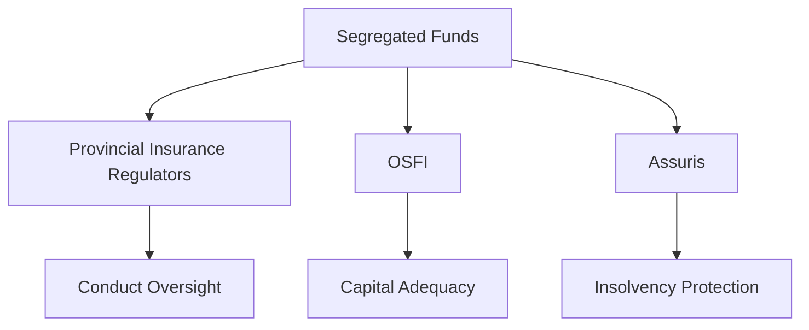

---

linkTitle: "22.2 Regulation of Segregated Funds"
title: "Regulation of Segregated Funds: Understanding Canadian Regulatory Frameworks"
description: "Explore the regulation of segregated funds in Canada, including the roles of provincial insurance regulators, Assuris, and OSFI. Learn the differences between segregated and mutual fund regulations, and how Assuris protects policyholders."
categories:
- Finance
- Canadian Securities
- Investment
tags:
- Segregated Funds
- Canadian Regulation
- OSFI
- Assuris
- Insurance
date: 2024-10-25
type: docs
nav_weight: 1030000
canonical: "https://securitiesexamsmastery.ca/14/10/3"
license: "© 2023 Tokenizer Inc. CC BY-NC-SA 4.0"
---

## 22.2 Regulation of Segregated Funds

Segregated funds are unique investment products offered by insurance companies, combining elements of both insurance and investment. Understanding their regulation is crucial for financial professionals navigating the Canadian market. This section delves into the regulatory framework governing segregated funds, highlighting the roles of key regulatory bodies, the differences from mutual fund regulations, and the protective role of Assuris.

### Regulatory Bodies Overseeing Segregated Funds

In Canada, segregated funds are primarily regulated by provincial insurance regulators, the Office of the Superintendent of Financial Institutions (OSFI), and Assuris. Each plays a distinct role in ensuring the stability and integrity of these financial products.

#### Provincial Insurance Regulators

Provincial insurance regulators are responsible for overseeing the conduct of insurance companies within their respective jurisdictions. They ensure that companies comply with provincial laws and regulations, which include maintaining adequate reserves and adhering to consumer protection standards. These regulators also oversee the marketing and distribution of segregated funds, ensuring transparency and fairness in the information provided to consumers.

#### Office of the Superintendent of Financial Institutions (OSFI)

The OSFI is a federal agency responsible for the regulation and supervision of insurance companies operating in Canada. Its mandate is to protect the rights and interests of policyholders while maintaining the financial stability of the insurance sector. OSFI sets out guidelines and standards for capital adequacy, risk management, and corporate governance, which insurance companies must adhere to when offering segregated funds.

#### Assuris

Assuris is a not-for-profit organization that provides protection to policyholders in the event of an insurance company’s insolvency. It acts as a safety net, ensuring that policyholders receive a portion of their benefits even if their insurer fails. Assuris guarantees a minimum level of protection, which includes covering up to 85% of the segregated fund’s value or $60,000, whichever is higher. This protection is crucial in maintaining consumer confidence in segregated funds as a secure investment option.

### Differences Between Segregated Funds and Mutual Funds Regulation

While segregated funds and mutual funds may appear similar, they are regulated under different frameworks due to their distinct nature and characteristics.

#### Legal Structure

Segregated funds are structured as insurance contracts, which means they fall under the jurisdiction of insurance regulators. In contrast, mutual funds are investment products regulated by securities regulators, such as the Canadian Securities Administrators (CSA).

#### Consumer Protection

Segregated funds offer unique consumer protection features, such as maturity and death benefit guarantees. These guarantees are backed by the insurance company and are subject to the regulatory oversight of insurance bodies. Mutual funds, however, do not offer such guarantees, and their regulation focuses more on disclosure and investor protection through securities laws.

#### Tax Treatment

The tax treatment of segregated funds differs from that of mutual funds. Segregated funds can offer certain tax advantages, such as the ability to bypass probate fees upon the policyholder’s death, due to their classification as insurance products. Mutual funds, on the other hand, are subject to capital gains taxes and other investment-related taxes.

### Role of Assuris in Providing Protection Against Insurer Insolvency

Assuris plays a pivotal role in safeguarding policyholders’ interests in the event of an insurer’s insolvency. By providing a financial safety net, Assuris helps maintain trust in the insurance industry and ensures that policyholders are not left without recourse if their insurer fails. This protection is particularly important for segregated funds, as it reinforces the guarantees offered by these products and provides peace of mind to investors.

### Practical Example: Segregated Funds in Action

Consider a Canadian investor, Jane, who invests in a segregated fund offered by a major insurance company like Manulife. Jane is attracted to the fund’s death benefit guarantee, which ensures that her beneficiaries will receive at least the original investment amount, regardless of market performance. This feature provides Jane with a sense of security, knowing that her investment is protected.

In the unlikely event that Manulife becomes insolvent, Assuris steps in to protect Jane’s investment. Assuris guarantees that Jane will receive at least 85% of her fund’s value or $60,000, whichever is higher. This assurance allows Jane to invest with confidence, knowing that her financial interests are safeguarded.

### Diagram: Regulatory Framework for Segregated Funds

Below is a diagram illustrating the regulatory framework for segregated funds in Canada, highlighting the roles of provincial regulators, OSFI, and Assuris.

### Best Practices and Common Pitfalls

#### Best Practices

1. **Understand the Guarantees:** Financial professionals should thoroughly understand the guarantees offered by segregated funds and communicate these effectively to clients.
2. **Stay Informed on Regulations:** Keeping up-to-date with regulatory changes is crucial for compliance and providing accurate advice.
3. **Assess Insurer Stability:** Evaluate the financial health of the insurance company offering the segregated fund to ensure long-term security for clients.

#### Common Pitfalls

1. **Overlooking Fees:** Segregated funds often come with higher fees than mutual funds due to their insurance features. It’s important to weigh these costs against the benefits.
2. **Misunderstanding Tax Implications:** Misinterpreting the tax advantages of segregated funds can lead to suboptimal investment decisions.
3. **Ignoring Insolvency Risks:** While Assuris provides protection, it’s essential to consider the financial stability of the insurer to minimize risks.

### Resources for Further Exploration

- [OSFI - Insurance](https://www.osfi-bsif.gc.ca/Eng/insurance)
- Book: *Canadian Insurance Law* by James Chartres

### Glossary

- **OSFI:** Office of the Superintendent of Financial Institutions, responsible for federal regulation of insurance companies.
- **Assuris:** Insurance industry’s self-financing organization that protects policyholders’ interests if their insurance company fails.

### Summary

Understanding the regulation of segregated funds is essential for financial professionals in Canada. By recognizing the roles of provincial regulators, OSFI, and Assuris, and differentiating between segregated and mutual fund regulations, professionals can better serve their clients. The protective role of Assuris further enhances the appeal of segregated funds, offering peace of mind to investors. By adhering to best practices and avoiding common pitfalls, financial professionals can effectively navigate the complexities of segregated fund investments.

### **Ready to Test Your Knowledge?**

**Practice 10 Essential CSC Exam Questions to Master Your Certification**



### Which regulatory body is responsible for overseeing the conduct of insurance companies within their respective jurisdictions?

- [x] Provincial Insurance Regulators
- [ ] OSFI
- [ ] Assuris
- [ ] Canadian Securities Administrators

> **Explanation:** Provincial insurance regulators oversee the conduct of insurance companies within their respective jurisdictions.

### What is the primary role of OSFI in the regulation of segregated funds?

- [x] Ensuring financial stability and protecting policyholders
- [ ] Providing insolvency protection
- [ ] Overseeing marketing and distribution
- [ ] Setting investment guidelines

> **Explanation:** OSFI ensures financial stability and protects policyholders by setting guidelines and standards for insurance companies.

### How does Assuris protect policyholders in the event of an insurer's insolvency?

- [x] By guaranteeing a minimum level of protection
- [ ] By providing investment advice
- [ ] By regulating insurance companies
- [ ] By offering tax benefits

> **Explanation:** Assuris guarantees a minimum level of protection to policyholders in the event of an insurer's insolvency.

### What is a key difference between segregated funds and mutual funds?

- [x] Segregated funds offer maturity and death benefit guarantees
- [ ] Mutual funds are regulated by provincial insurance regulators
- [ ] Segregated funds are tax-free
- [ ] Mutual funds offer insolvency protection

> **Explanation:** Segregated funds offer maturity and death benefit guarantees, unlike mutual funds.

### Which organization provides a financial safety net for policyholders in Canada?

- [x] Assuris
- [ ] OSFI
- [ ] Provincial Insurance Regulators
- [ ] Canadian Securities Administrators

> **Explanation:** Assuris provides a financial safety net for policyholders in the event of an insurer's insolvency.

### What is a common pitfall when investing in segregated funds?

- [x] Overlooking fees
- [ ] Ignoring tax advantages
- [ ] Misunderstanding investment strategies
- [ ] Overestimating market performance

> **Explanation:** Overlooking fees is a common pitfall due to the higher costs associated with segregated funds.

### Which of the following is a best practice for financial professionals dealing with segregated funds?

- [x] Assessing insurer stability
- [ ] Ignoring regulatory changes
- [ ] Focusing solely on tax benefits
- [ ] Prioritizing short-term gains

> **Explanation:** Assessing insurer stability is crucial to ensure long-term security for clients.

### What is the role of provincial insurance regulators in the context of segregated funds?

- [x] Conduct oversight and ensure compliance with provincial laws
- [ ] Provide insolvency protection
- [ ] Set capital adequacy standards
- [ ] Offer investment advice

> **Explanation:** Provincial insurance regulators conduct oversight and ensure compliance with provincial laws.

### How does the tax treatment of segregated funds differ from mutual funds?

- [x] Segregated funds can bypass probate fees
- [ ] Mutual funds are tax-free
- [ ] Segregated funds are subject to capital gains taxes
- [ ] Mutual funds offer tax deferral

> **Explanation:** Segregated funds can bypass probate fees due to their classification as insurance products.

### True or False: Assuris guarantees 100% protection of segregated fund values in the event of insurer insolvency.

- [ ] True
- [x] False

> **Explanation:** Assuris guarantees up to 85% of the segregated fund's value or $60,000, whichever is higher, not 100%.


