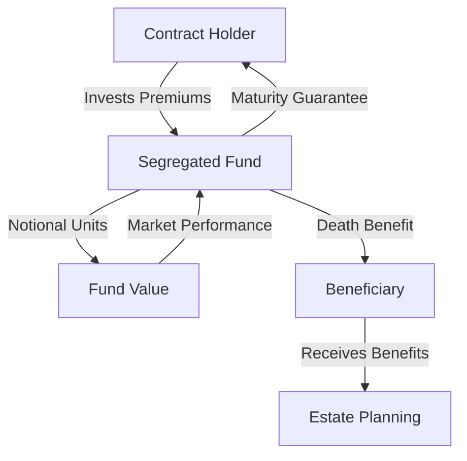

## 22.3 Structure of Segregated Funds

Segregated funds, a unique investment vehicle in the Canadian financial landscape, are structured as Individual Variable Insurance Contracts (IVICs). These funds combine the growth potential of mutual funds with the security features of insurance products, offering a distinctive blend of investment and protection. In this section, we will delve into the legal structure of segregated funds, the key parties involved, the concept of notional units, and the differences between holding these funds within and outside registered plans.

### Legal Structure: Individual Variable Insurance Contracts

At their core, segregated funds are insurance products. They are legally structured as Individual Variable Insurance Contracts, which means they are governed by insurance legislation rather than securities legislation. This distinction is crucial as it influences the regulatory framework, tax implications, and the guarantees offered by these products.

The insurance component of segregated funds provides a death benefit guarantee, typically ranging from 75% to 100% of the original investment, and sometimes a maturity guarantee. This feature is particularly attractive to risk-averse investors seeking downside protection while still participating in market growth.

### Key Parties Involved

Understanding the key parties involved in segregated funds is essential for comprehending their structure and function:

- **Contract Holder:** The individual or entity that owns the segregated fund contract. The contract holder is responsible for making investment decisions and paying premiums.

- **Annuitant:** The person whose life is insured under the segregated fund contract. The annuitant's age and life expectancy can influence the terms of the contract. In many cases, the contract holder and the annuitant are the same person.

- **Beneficiary:** The person(s) designated to receive the benefits upon the death of the annuitant. The beneficiary can be a family member, a trust, or any other entity chosen by the contract holder. This designation allows for the bypassing of probate, providing a potential estate planning advantage.

### Notional Units and Their Role

Segregated funds use notional units to measure an investor's participation in the fund. Unlike mutual funds, where investors own actual units, segregated fund investors own notional units. These units represent a share of the fund's value but do not confer ownership of the underlying assets.

The value of notional units fluctuates with the performance of the fund's investments. This structure allows for the calculation of the fund's value and the determination of guarantees, such as the death benefit and maturity guarantees.

### Differences Between Segregated Funds Held Within and Outside Registered Plans

Segregated funds can be held within registered plans, such as Registered Retirement Savings Plans (RRSPs) and Tax-Free Savings Accounts (TFSAs), or outside these plans. The choice between these options affects the tax treatment and estate planning benefits of the investment.

- **Within Registered Plans:** When held within registered plans, segregated funds benefit from the tax advantages associated with these accounts. Contributions to RRSPs, for example, are tax-deductible, and the investment grows tax-deferred until withdrawal. TFSAs offer tax-free growth and withdrawals. The insurance guarantees of segregated funds can enhance the appeal of these registered plans by providing additional security.

- **Outside Registered Plans:** Holding segregated funds outside registered plans allows for the bypassing of probate through the beneficiary designation. This feature can be particularly advantageous for estate planning, as it ensures a smooth and timely transfer of assets to beneficiaries. However, the investment growth is subject to taxation, unlike the tax-deferred or tax-free growth within registered plans.

### Practical Example: Segregated Funds in Action

Consider a Canadian investor, Jane, who is 55 years old and planning for retirement. She is risk-averse and concerned about market volatility but wants to ensure her investments grow over time. Jane decides to invest in a segregated fund with a 100% death benefit guarantee and an 85% maturity guarantee over a 10-year term.

Jane holds her segregated fund within her RRSP, allowing her to benefit from tax-deferred growth. The insurance guarantees provide her with peace of mind, knowing that her initial investment is protected to a significant extent, regardless of market fluctuations. Upon maturity, if the market value of her investment is lower than the guaranteed amount, the insurer will top up the difference.

### Diagram: Structure of a Segregated Fund

Below is a diagram illustrating the structure of a segregated fund, highlighting the relationship between the contract holder, annuitant, and beneficiary, as well as the flow of funds and guarantees.

### Best Practices and Common Pitfalls

**Best Practices:**
- **Understand the Guarantees:** Fully comprehend the death and maturity guarantees offered by segregated funds and how they align with your financial goals.
- **Consider Estate Planning:** Utilize the beneficiary designation to streamline estate planning and avoid probate.
- **Evaluate Costs:** Be aware of the fees associated with segregated funds, which can be higher than those of mutual funds due to the insurance component.

**Common Pitfalls:**
- **Overlooking Fees:** High management fees can erode returns, so it's essential to weigh the costs against the benefits of guarantees.
- **Ignoring Tax Implications:** Understand the tax treatment of segregated funds within and outside registered plans to optimize your investment strategy.

### Resources for Further Exploration

To deepen your understanding of segregated funds and their structure, consider exploring the following resources:

- Article: [How Segregated Funds Work](https://www.investopedia.com/articles/mutualfund/09/segregated-funds.asp)
- Book: *Understanding Insurance Contracts* by David Manning

These resources provide additional insights into the intricacies of segregated funds and their role in financial planning.

### **Ready to Test Your Knowledge?**

**Practice 10 Essential CSC Exam Questions to Master Your Certification**



### What is the legal structure of segregated funds?

- [x] Individual Variable Insurance Contracts
- [ ] Mutual Fund Trusts
- [ ] Exchange-Traded Funds
- [ ] Corporate Bonds

> **Explanation:** Segregated funds are structured as Individual Variable Insurance Contracts, which distinguishes them from other investment vehicles.

### Who is the person whose life is insured under a segregated fund contract?

- [ ] Contract Holder
- [x] Annuitant
- [ ] Beneficiary
- [ ] Trustee

> **Explanation:** The annuitant is the person whose life is insured under the segregated fund contract.

### What do notional units represent in a segregated fund?

- [x] A share of the fund's value
- [ ] Actual ownership of the underlying assets
- [ ] A fixed interest rate
- [ ] A guaranteed return

> **Explanation:** Notional units represent a share of the fund's value but do not confer ownership of the underlying assets.

### What is a key benefit of holding segregated funds within registered plans?

- [x] Tax advantages
- [ ] Higher returns
- [ ] Lower fees
- [ ] Guaranteed dividends

> **Explanation:** Holding segregated funds within registered plans offers tax advantages, such as tax-deferred or tax-free growth.

### Which of the following is a common pitfall when investing in segregated funds?

- [x] Overlooking fees
- [ ] Maximizing tax benefits
- [x] Ignoring tax implications
- [ ] Understanding guarantees

> **Explanation:** Investors may overlook the higher fees associated with segregated funds and ignore the tax implications, which can impact overall returns.

### What is the role of the beneficiary in a segregated fund?

- [x] Receives benefits upon the annuitant's death
- [ ] Manages the fund's investments
- [ ] Pays the premiums
- [ ] Determines the fund's guarantees

> **Explanation:** The beneficiary is designated to receive the benefits upon the death of the annuitant, providing estate planning advantages.

### How can segregated funds benefit estate planning?

- [x] Bypassing probate
- [ ] Reducing investment risk
- [x] Providing a death benefit guarantee
- [ ] Offering tax-free withdrawals

> **Explanation:** Segregated funds can bypass probate through beneficiary designations and provide a death benefit guarantee, aiding in estate planning.

### What is a maturity guarantee in a segregated fund?

- [x] A guarantee of a minimum value at the end of the contract term
- [ ] A fixed interest rate for the duration of the contract
- [ ] A guaranteed dividend payment
- [ ] A promise of tax-free growth

> **Explanation:** A maturity guarantee ensures a minimum value of the investment at the end of the contract term, providing downside protection.

### What is a key feature that distinguishes segregated funds from mutual funds?

- [x] Insurance guarantees
- [ ] Lower management fees
- [ ] Direct ownership of assets
- [ ] Fixed returns

> **Explanation:** Segregated funds offer insurance guarantees, such as death and maturity guarantees, which distinguish them from mutual funds.

### Segregated funds are governed by insurance legislation rather than securities legislation.

- [x] True
- [ ] False

> **Explanation:** Segregated funds are governed by insurance legislation, which affects their regulatory framework and guarantees.


