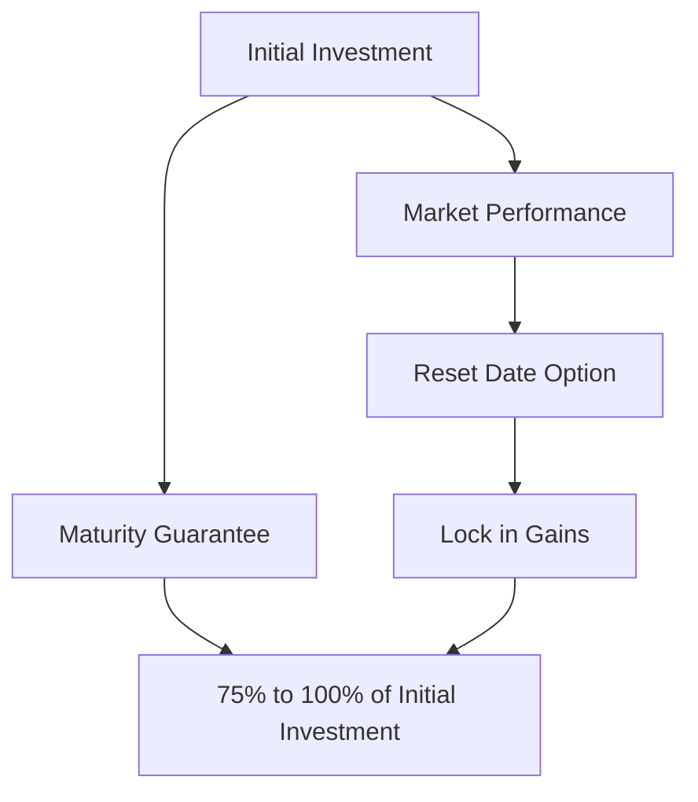

## 22.4 Features of Segregated Funds

Segregated funds are a unique investment vehicle available in Canada, combining elements of insurance and mutual funds. They offer distinct features such as maturity guarantees, death benefits, and creditor protection, making them an attractive option for certain investors. This section delves into these features, providing a comprehensive understanding of how they operate and their implications for investors.

### Maturity Guarantees

One of the hallmark features of segregated funds is the maturity guarantee. This guarantee ensures that the investor will receive at least a minimum percentage of their original investment back at the end of a specified term, typically 10 years. The standard maturity guarantee is often set at 75% to 100% of the initial investment, depending on the specific fund and the terms set by the insurance company.

#### Minimum Requirements

The minimum requirements for maturity guarantees are regulated to ensure investor protection. In Canada, these guarantees are typically backed by the insurance company offering the segregated fund, providing a layer of security not found in traditional mutual funds. This feature is particularly appealing during volatile market conditions, as it offers a safety net against market downturns.

#### Practical Example

Consider an investor who places $100,000 into a segregated fund with a 10-year maturity guarantee of 75%. Regardless of market performance, the investor is assured of receiving at least $75,000 at the end of the term. This guarantee provides peace of mind, particularly for risk-averse investors or those nearing retirement.

### Death Benefits

Segregated funds also offer death benefits, which ensure that beneficiaries receive a guaranteed amount upon the investor's death. This feature is similar to life insurance and can be a crucial component of estate planning.

#### How Death Benefits Operate

The death benefit typically guarantees that the beneficiaries will receive the greater of the market value of the fund or a pre-determined percentage of the original investment, often 75% to 100%. This ensures that the investor's heirs are protected from market volatility, preserving the intended legacy.

#### Case Study: Canadian Pension Fund

A Canadian pension fund might use segregated funds as part of its strategy to ensure that beneficiaries receive a stable payout, regardless of market conditions. By incorporating segregated funds with robust death benefits, the fund can provide a reliable income stream to retirees and their families.

### Creditor Protection

One of the most compelling features of segregated funds is creditor protection. This protection shields the investor's assets from being claimed by creditors in the event of bankruptcy, provided certain conditions are met.

#### Mechanisms of Creditor Protection

Creditor protection is afforded because segregated funds are considered insurance products. As such, they are governed by insurance legislation, which offers protection not available to traditional investment products. To qualify for creditor protection, the beneficiary designation must be irrevocable or fall under a specific class, such as a spouse, child, grandchild, or parent.

#### Real-World Application

For business owners or professionals at risk of litigation, segregated funds offer a strategic way to safeguard personal assets. By investing in segregated funds, these individuals can protect their wealth from potential creditors, ensuring financial stability even in adverse circumstances.

### Age Restrictions and Reset Dates

Segregated funds often come with age restrictions and reset dates, which can impact the guarantees offered.

#### Age Restrictions

Age restrictions may apply to certain features of segregated funds, such as the availability of maturity guarantees or death benefits. These restrictions are typically set by the insurance company and can vary between products.

#### Reset Dates

Reset dates allow investors to lock in gains by resetting the maturity guarantee to a higher value. This feature can be particularly beneficial in rising markets, as it enables investors to secure a higher guaranteed amount for the future.

### Best Practices and Common Pitfalls

When investing in segregated funds, it's essential to understand the terms and conditions of the guarantees and benefits. Here are some best practices and common pitfalls to consider:

- **Best Practices:**
  - Thoroughly review the fund's prospectus to understand the specific terms of the maturity guarantees and death benefits.
  - Consider the financial strength and reputation of the insurance company offering the segregated fund.
  - Regularly review and update beneficiary designations to ensure they align with your estate planning goals.

- **Common Pitfalls:**
  - Failing to understand the impact of fees on the overall return of the segregated fund.
  - Overlooking the importance of the reset date feature, which can significantly enhance the value of the maturity guarantee.
  - Assuming creditor protection applies in all situations without verifying the specific conditions required.

### Resources for Further Exploration

For those interested in exploring segregated funds further, consider the following resources:

- [Assuris - FAQs on Segregated Funds](https://www.assuris.ca/en/segregated-funds/)
- Book: *Managing Your Retirement with Segregated Funds* by Peter Shrimpton

These resources provide additional insights into the nuances of segregated funds and can help investors make informed decisions.

### **Ready to Test Your Knowledge?**

**Practice 10 Essential CSC Exam Questions to Master Your Certification**



### What is the standard maturity guarantee percentage for segregated funds?

- [x] 75% to 100%
- [ ] 50% to 75%
- [ ] 60% to 90%
- [ ] 80% to 95%

> **Explanation:** The standard maturity guarantee for segregated funds is typically between 75% to 100% of the initial investment.

### How do death benefits in segregated funds operate?

- [x] They guarantee the greater of the market value or a pre-determined percentage of the original investment.
- [ ] They provide a fixed payout regardless of market conditions.
- [ ] They only apply if the market value is below the initial investment.
- [ ] They are not applicable to segregated funds.

> **Explanation:** Death benefits ensure beneficiaries receive the greater of the market value or a pre-determined percentage of the original investment.

### What is a key feature of creditor protection in segregated funds?

- [x] Assets are shielded from creditors in bankruptcy.
- [ ] Assets are taxed at a lower rate.
- [ ] Assets are automatically transferred to beneficiaries.
- [ ] Assets are invested in government bonds.

> **Explanation:** Creditor protection shields segregated fund assets from being claimed by creditors in bankruptcy.

### What is the purpose of reset dates in segregated funds?

- [x] To lock in gains by resetting the maturity guarantee to a higher value.
- [ ] To reduce the maturity guarantee.
- [ ] To eliminate the death benefit.
- [ ] To increase the fund's fees.

> **Explanation:** Reset dates allow investors to lock in gains by resetting the maturity guarantee to a higher value.

### What is a common pitfall when investing in segregated funds?

- [x] Failing to understand the impact of fees on returns.
- [ ] Investing in too many funds.
- [ ] Not diversifying enough.
- [ ] Ignoring market trends.

> **Explanation:** A common pitfall is failing to understand how fees can impact the overall return of the segregated fund.

### Which of the following is a best practice when investing in segregated funds?

- [x] Regularly review and update beneficiary designations.
- [ ] Ignore the fund's prospectus.
- [ ] Avoid considering the insurance company's reputation.
- [ ] Never reset the maturity guarantee.

> **Explanation:** Regularly reviewing and updating beneficiary designations ensures they align with estate planning goals.

### What is a benefit of the maturity guarantee in segregated funds?

- [x] It provides a safety net against market downturns.
- [ ] It guarantees a fixed return.
- [ ] It eliminates all investment risk.
- [ ] It increases the fund's liquidity.

> **Explanation:** The maturity guarantee provides a safety net against market downturns by ensuring a minimum return.

### What is the role of age restrictions in segregated funds?

- [x] They may impact the availability of certain features like maturity guarantees.
- [ ] They determine the fund's investment strategy.
- [ ] They set the minimum investment amount.
- [ ] They dictate the fund's fee structure.

> **Explanation:** Age restrictions may impact the availability of features such as maturity guarantees and death benefits.

### How can segregated funds benefit business owners?

- [x] By providing creditor protection for personal assets.
- [ ] By offering higher returns than mutual funds.
- [ ] By eliminating tax liabilities.
- [ ] By ensuring guaranteed profits.

> **Explanation:** Segregated funds provide creditor protection, which can safeguard personal assets for business owners.

### True or False: Segregated funds are considered insurance products.

- [x] True
- [ ] False

> **Explanation:** Segregated funds are considered insurance products, which is why they offer features like creditor protection.


