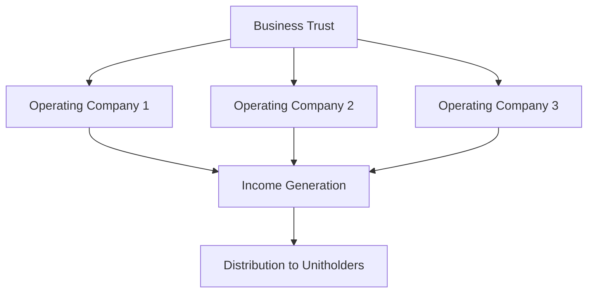

## 22.8.2 Business Trusts

Business trusts are a unique and versatile investment vehicle that provide investors with access to a wide array of operating businesses through pooled investments. These trusts are structured to hold interests in various companies, distributing the income generated from their operations to unitholders. In this section, we will delve into the intricacies of business trusts, exploring their structure, management, income generation, advantages, risks, and taxation, with a focus on the Canadian financial landscape.

### Definition and Purpose

A business trust is a type of income trust that holds and operates businesses across diverse industries. Unlike traditional corporations, business trusts allow investors to pool their resources to gain exposure to the operational performance of underlying businesses. This structure enables investors to benefit from the income generated by these businesses without directly owning or managing them.

Business trusts cover a broad spectrum of sectors, including natural gas processing, restaurants, manufacturing, and more. This diversity allows investors to access industries that may otherwise be challenging to invest in directly, offering a unique opportunity for portfolio diversification.

### Structure and Management

Business trusts are typically structured as legal entities that hold interests in various operating companies. These trusts are managed by professional teams responsible for overseeing the operations and performance of the underlying businesses. The management team plays a crucial role in ensuring that the businesses operate efficiently and generate income for distribution to unitholders.

The structure of a business trust can be visualized as follows:

In this diagram, the business trust holds interests in multiple operating companies, each contributing to the overall income generation. The income is then distributed to unitholders, providing them with a share of the profits.

### Income Generation and Distribution

Business trusts generate income through the operations of their underlying assets. This income is primarily derived from the profits of the businesses held within the trust. The generated income is then distributed to unitholders, typically on a regular basis, such as monthly or quarterly.

The income distribution mechanisms of business trusts can be compared to those of closed-end funds and Real Estate Investment Trusts (REITs). While closed-end funds and REITs also distribute income to investors, business trusts offer the added benefit of direct exposure to operating businesses, which can lead to higher income potential due to the operational performance of these businesses.

### Advantages of Business Trusts

Business trusts offer several advantages that make them an attractive investment option:

#### Diversification

One of the key benefits of business trusts is their ability to provide exposure to multiple industries and sectors. By investing in a business trust, investors can diversify their portfolios, reducing the risk associated with investing in a single industry or company. For example, a business trust may hold interests in natural gas processing, restaurants, and manufacturing, offering a balanced mix of industries.

#### Income Potential

Business trusts are known for their high income distributions, which result from the operational performance of the underlying businesses. Investors can benefit from regular income payouts, which can be particularly appealing in a low-interest-rate environment.

#### Liquidity

Unlike direct business investments, business trust units can be traded on stock exchanges, offering greater liquidity. This means investors can buy or sell units more easily, providing flexibility in managing their investment portfolios.

### Risks of Business Trusts

While business trusts offer numerous advantages, they also come with certain risks:

#### Market and Economic Risks

The performance of business trusts is closely tied to the operational success of the underlying businesses and overall market conditions. Economic downturns or industry-specific challenges can impact the income generated by the trust, affecting distributions to unitholders.

#### Trading Price Divergence

Business trust units may trade at discounts or premiums to their net asset value (NAV), impacting investor returns. This trading price divergence can occur due to market sentiment, changes in interest rates, or other external factors.

#### Operational Dependence

The success of a business trust largely depends on the effectiveness of its management team. Poor management decisions or operational inefficiencies can negatively affect the performance and income generation of the underlying assets.

### Taxation of Business Trusts

In Canada, the tax treatment of business trusts is similar to that of taxable Canadian corporations. Income distributions from business trusts are generally taxed in the hands of the unitholders. However, the specific tax implications can vary based on the nature of the income and the investor's tax situation. It is important for investors to consult with tax professionals to understand the tax consequences of investing in business trusts.

### Examples

To illustrate the concept of business trusts, let's consider a few case studies:

#### Case Study 1: Natural Gas Processing Trust

A business trust focused on natural gas processing may hold interests in several processing facilities across Canada. The trust generates income by processing natural gas and distributing the profits to unitholders. This trust provides investors with exposure to the energy sector, benefiting from the operational efficiency of the processing facilities.

#### Case Study 2: Restaurant Chain Trust

Another example is a business trust that holds interests in a chain of restaurants. The trust generates income from the restaurant operations, distributing the profits to unitholders. This trust offers investors exposure to the consumer discretionary sector, with income potential tied to the performance of the restaurant chain.

### Glossary

- **Business Trust:** A trust that holds and operates businesses across various industries, distributing income to investors similar to closed-end funds.
- **Trading Price Divergence:** The phenomenon where trading prices deviate from the net asset value of the underlying assets.
- **Diversification:** The practice of spreading investments across various assets to reduce risk.
- **Liquidity:** The ease with which an asset can be bought or sold in the market without significantly affecting its price.
- **Income Distribution:** The regular payout of income generated by the trust’s underlying assets to unitholders.
- **Tax Efficiency:** The ability to minimize tax liabilities through strategic investment selections and account placements.

### Conclusion

Business trusts offer a compelling investment opportunity for those seeking exposure to diverse industries and high income potential. By understanding their structure, advantages, risks, and taxation, investors can make informed decisions about incorporating business trusts into their portfolios. As with any investment, it is crucial to conduct thorough research and consider individual financial goals and risk tolerance.

## Quiz Time!



### What is a business trust?

- [x] A trust that holds and operates businesses across various industries, distributing income to investors.
- [ ] A type of mutual fund that invests in real estate properties.
- [ ] A government bond issued to finance public projects.
- [ ] A savings account with a fixed interest rate.

> **Explanation:** A business trust is a trust that holds and operates businesses across various industries, distributing income to investors similar to closed-end funds.

### Which of the following sectors can business trusts cover?

- [x] Natural gas processing
- [x] Restaurants
- [x] Manufacturing
- [ ] Only technology companies

> **Explanation:** Business trusts can cover a wide range of sectors, including natural gas processing, restaurants, and manufacturing, among others.

### How do business trusts generate income?

- [x] Through the operations of their underlying assets
- [ ] By issuing new units to investors
- [ ] By selling off their assets
- [ ] Through government subsidies

> **Explanation:** Business trusts generate income through the operations of their underlying assets, which is then distributed to unitholders.

### What is a key advantage of business trusts?

- [x] Diversification
- [ ] Guaranteed returns
- [ ] No market risk
- [ ] Fixed interest rates

> **Explanation:** A key advantage of business trusts is diversification, as they offer exposure to multiple industries and sectors.

### What is a risk associated with business trusts?

- [x] Trading price divergence
- [x] Market and economic risks
- [ ] Guaranteed income
- [ ] No management required

> **Explanation:** Risks associated with business trusts include trading price divergence and market and economic risks.

### How are business trust units traded?

- [x] On stock exchanges
- [ ] Directly between investors
- [ ] Through government auctions
- [ ] Only within private networks

> **Explanation:** Business trust units are traded on stock exchanges, offering greater liquidity than direct business investments.

### What is the tax treatment of business trusts in Canada?

- [x] Similar to taxable Canadian corporations
- [ ] Tax-free
- [ ] Subject to double taxation
- [ ] Only taxed at the trust level

> **Explanation:** In Canada, the tax treatment of business trusts is similar to that of taxable Canadian corporations, with income distributions taxed in the hands of unitholders.

### What role does the management team play in a business trust?

- [x] Overseeing operations and performance of underlying businesses
- [ ] Setting fixed interest rates
- [ ] Guaranteeing investor returns
- [ ] Eliminating all investment risks

> **Explanation:** The management team is responsible for overseeing the operations and performance of the underlying businesses in a business trust.

### What is trading price divergence?

- [x] When trading prices deviate from the net asset value of the underlying assets
- [ ] When all units are sold at the same price
- [ ] When prices are fixed by the government
- [ ] When prices are unaffected by market conditions

> **Explanation:** Trading price divergence occurs when trading prices deviate from the net asset value of the underlying assets.

### Business trusts offer exposure to multiple industries and sectors.

- [x] True
- [ ] False

> **Explanation:** True. Business trusts provide exposure to multiple industries and sectors, enhancing portfolio diversification.


