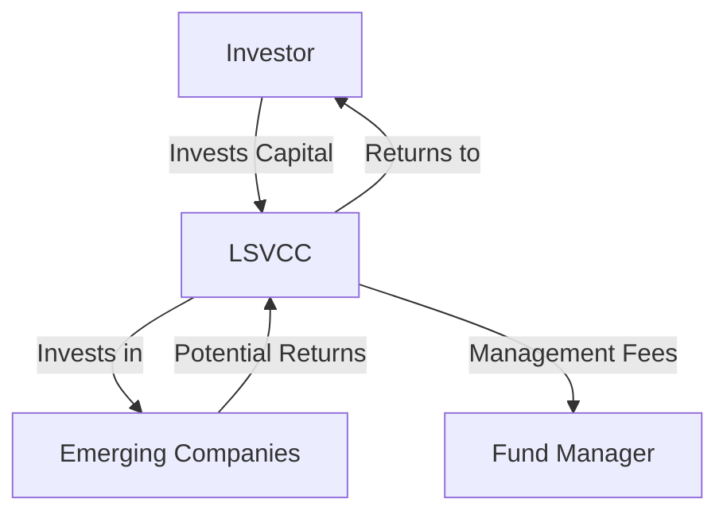

---

linkTitle: "22.7 Disadvantages of LSVCCs"
title: "Disadvantages of Labour-Sponsored Venture Capital Corporations (LSVCCs)"
description: "Explore the disadvantages of investing in Labour-Sponsored Venture Capital Corporations (LSVCCs), including high-risk investments, complex redemption rules, and higher management expense ratios."
categories:
- Finance
- Investment
- Canadian Securities
tags:
- LSVCCs
- Investment Risks
- Redemption Rules
- Management Expense Ratio
- Canadian Finance
date: 2024-10-25
type: docs
nav_weight: 10800

canonical: "https://securitiesexamsmastery.ca/14/10/8"
license: "© 2023 Tokenizer Inc. CC BY-NC-SA 4.0"
---

## 22.7 Disadvantages of LSVCCs

Labour-Sponsored Venture Capital Corporations (LSVCCs) are investment vehicles designed to encourage investment in small to medium-sized enterprises (SMEs) and emerging companies. While they offer potential tax benefits and the opportunity to support local businesses, they also come with several disadvantages that investors must carefully consider. This section delves into the high-risk nature of LSVCC investments, the complexity of redemption rules and tax implications, and the higher management expense ratios (MERs) compared to conventional mutual funds.

### High-Risk Nature of Investments

LSVCCs primarily invest in new and emerging companies, which inherently carry a higher risk compared to established firms. These companies often operate in volatile industries or are in the early stages of development, where the probability of failure is significant. The high-risk nature of these investments can lead to substantial losses for investors if the companies do not perform as expected.

#### Example: High-Risk Investment Scenario

Consider an LSVCC that invests in a tech startup aiming to develop a new software platform. While the potential for high returns exists if the company succeeds, the startup faces numerous challenges, such as market competition, technological hurdles, and funding constraints. If the startup fails to gain traction, the investment could result in a total loss.

### Complexity of Redemption Rules and Tax Implications

One of the significant drawbacks of LSVCCs is the complexity surrounding redemption rules and the associated tax implications. Investors are often subject to strict redemption restrictions, which limit when and how they can redeem their shares. These restrictions are typically in place to ensure that the invested capital remains available to support the underlying businesses for a minimum period.

#### Redemption Restriction

Redemption restrictions can vary but often require investors to hold their shares for a minimum of eight years to avoid penalties. This long holding period can be a disadvantage for investors seeking liquidity or those who need to access their funds sooner.

#### Tax Implications

While LSVCCs offer tax credits as an incentive, the tax implications can be complex. If investors redeem their shares before the specified holding period, they may be required to repay the tax credits received, leading to unexpected tax liabilities.

### Higher Management Expense Ratios (MERs)

LSVCCs typically have higher management expense ratios compared to conventional mutual funds. The MER is the fee charged by the fund to cover management costs, and it is expressed as a percentage of the fund's average net assets. Higher MERs can erode investment returns over time, making LSVCCs less attractive from a cost perspective.

#### Comparison with Conventional Mutual Funds

| Fund Type             | Average MER (%) |
|-----------------------|-----------------|
| LSVCCs                | 3.0 - 5.0       |
| Conventional Mutual Funds | 1.0 - 2.5   |

The higher MERs in LSVCCs are often justified by the active management required to support high-risk investments in emerging companies. However, investors must weigh these costs against the potential returns and the risks involved.

### Best Practices and Considerations

Investors considering LSVCCs should conduct thorough due diligence and assess their risk tolerance. It is crucial to understand the specific redemption rules and tax implications associated with these investments. Consulting with a financial advisor can provide valuable insights and help investors make informed decisions.

### Common Pitfalls and Challenges

- **Underestimating Risk:** Investors may underestimate the high-risk nature of LSVCC investments, leading to potential losses.
- **Ignoring Redemption Restrictions:** Failing to understand redemption restrictions can result in unexpected penalties and tax liabilities.
- **Overlooking Costs:** Higher MERs can significantly impact returns, and investors should consider these costs when evaluating LSVCCs.

### Strategies to Overcome Challenges

- **Diversification:** Diversifying investments across different asset classes can help mitigate the risks associated with LSVCCs.
- **Long-Term Perspective:** Adopting a long-term investment perspective can align with the holding period requirements and reduce the impact of redemption restrictions.
- **Cost-Benefit Analysis:** Conducting a cost-benefit analysis can help investors determine if the potential returns justify the higher MERs.

### Diagram: LSVCC Investment Flow

### Resources for Further Exploration

- **Article:** [Risks of Investing in LSVCCs](https://www.investopedia.com/terms/l/laboursponsoredventurecapital.asp)
- **Book:** *The Risks and Rewards of Venture Capital* by Sarah Palmer

### Summary

Investing in LSVCCs offers the potential for significant returns and tax benefits, but it also involves considerable risks and complexities. Understanding the high-risk nature of these investments, the intricacies of redemption rules, and the impact of higher MERs is crucial for making informed decisions. By considering best practices and strategies to overcome common challenges, investors can better navigate the disadvantages of LSVCCs and align their investment strategies with their financial goals.

### **Ready to Test Your Knowledge?**

**Practice 10 Essential CSC Exam Questions to Master Your Certification**



### What is a primary disadvantage of investing in LSVCCs?

- [x] High-risk nature of investments
- [ ] Guaranteed returns
- [ ] Low management fees
- [ ] High liquidity

> **Explanation:** LSVCCs are known for their high-risk nature due to investments in new and emerging companies.

### What does MER stand for in the context of LSVCCs?

- [x] Management Expense Ratio
- [ ] Mutual Equity Return
- [ ] Market Exchange Rate
- [ ] Minimum Earnings Requirement

> **Explanation:** MER stands for Management Expense Ratio, which is the fee charged by the fund to cover management costs.

### What is a common redemption restriction for LSVCCs?

- [x] Minimum holding period of eight years
- [ ] No redemption allowed
- [ ] Immediate redemption available
- [ ] Redemption only after one year

> **Explanation:** LSVCCs often require a minimum holding period of eight years to avoid penalties.

### How do higher MERs affect LSVCC investments?

- [x] They can erode investment returns over time
- [ ] They guarantee higher returns
- [ ] They reduce investment risk
- [ ] They increase liquidity

> **Explanation:** Higher MERs can erode investment returns over time, making LSVCCs less attractive from a cost perspective.

### Which strategy can help mitigate the risks associated with LSVCCs?

- [x] Diversification
- [ ] Investing only in LSVCCs
- [ ] Ignoring redemption rules
- [ ] Focusing solely on tax benefits

> **Explanation:** Diversification can help mitigate the risks associated with LSVCCs by spreading investments across different asset classes.

### What is a potential tax implication of redeeming LSVCC shares early?

- [x] Repayment of tax credits
- [ ] Additional tax credits
- [ ] No tax implications
- [ ] Guaranteed tax refund

> **Explanation:** Redeeming LSVCC shares early may require repayment of tax credits received, leading to unexpected tax liabilities.

### Why might LSVCCs have higher MERs than conventional mutual funds?

- [x] Due to active management required for high-risk investments
- [ ] Because they are less risky
- [ ] Due to lower management costs
- [ ] Because they guarantee returns

> **Explanation:** LSVCCs often have higher MERs due to the active management required to support high-risk investments in emerging companies.

### What is a common pitfall for investors in LSVCCs?

- [x] Underestimating the high-risk nature of investments
- [ ] Overestimating liquidity
- [ ] Ignoring tax benefits
- [ ] Focusing on long-term gains

> **Explanation:** A common pitfall is underestimating the high-risk nature of LSVCC investments, which can lead to potential losses.

### What should investors consider when evaluating LSVCCs?

- [x] Cost-benefit analysis
- [ ] Immediate returns
- [ ] Guaranteed liquidity
- [ ] Short-term gains

> **Explanation:** Conducting a cost-benefit analysis can help investors determine if the potential returns justify the higher MERs.

### True or False: LSVCCs are suitable for investors seeking high liquidity.

- [ ] True
- [x] False

> **Explanation:** LSVCCs are not suitable for investors seeking high liquidity due to strict redemption restrictions and long holding periods.


