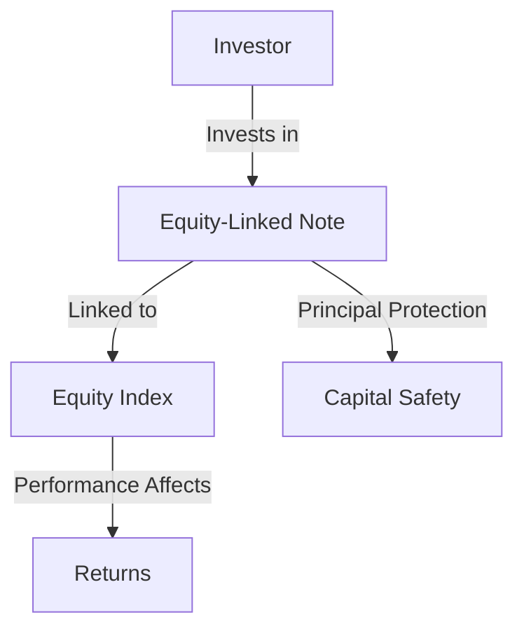

## 23.1 Chapter Overview

Structured products are innovative financial instruments that combine traditional securities such as bonds and equities with derivatives to offer customized risk-return profiles. This chapter delves into the multifaceted world of structured products, providing a comprehensive understanding of their benefits, risks, structures, and tax implications, particularly within the Canadian financial context.

### Main Topics Covered

1. **Introduction to Structured Products**: This section provides a foundational understanding of what structured products are, their purpose, and how they fit into the broader financial market landscape.

2. **Types of Structured Products**: Explore various types of structured products, including equity-linked notes, principal-protected notes, and market-linked GICs, each offering unique features and benefits.

3. **Benefits of Structured Products**: Understand the advantages of investing in structured products, such as potential for enhanced returns, capital protection, and diversification.

4. **Risks Associated with Structured Products**: A critical examination of the risks involved, including market risk, credit risk, and liquidity risk, and how they can impact investors.

5. **Structures of Structured Products**: Detailed analysis of how structured products are constructed, including the use of derivatives and the role of underlying assets.

6. **Tax Implications**: Insight into the tax treatment of structured products in Canada, including how different structures can affect tax liabilities.

7. **Regulatory Considerations**: Overview of the regulatory framework governing structured products in Canada, ensuring compliance and investor protection.

8. **Case Studies and Real-World Examples**: Practical examples and case studies illustrating the application of structured products in real-world scenarios, including strategies employed by Canadian financial institutions.

9. **Glossary of Essential Terminology**: A comprehensive glossary to clarify key terms and concepts related to structured products.

### Benefits and Risks of Structured Products

Structured products offer several benefits, making them attractive to a wide range of investors:

- **Potential for Enhanced Returns**: By combining traditional securities with derivatives, structured products can offer higher returns compared to conventional investments.
- **Capital Protection**: Many structured products are designed to protect the principal investment, appealing to risk-averse investors.
- **Diversification**: Structured products can provide exposure to different asset classes and markets, enhancing portfolio diversification.

However, these benefits come with inherent risks:

- **Market Risk**: The performance of structured products is often linked to market indices or other underlying assets, exposing investors to market fluctuations.
- **Credit Risk**: Investors are subject to the creditworthiness of the issuer, which can affect the product's performance.
- **Liquidity Risk**: Some structured products may have limited liquidity, making it difficult for investors to sell them before maturity.

### Structures of Various Structured Products

Structured products can be tailored to meet specific investment goals and risk appetites. Common structures include:

- **Equity-Linked Notes (ELNs)**: These products are tied to the performance of a specific stock or equity index, offering potential upside with a degree of capital protection.
- **Principal-Protected Notes (PPNs)**: Designed to return the principal amount at maturity, regardless of market conditions, while providing exposure to potential market gains.
- **Market-Linked Guaranteed Investment Certificates (GICs)**: These GICs offer returns linked to the performance of a market index, combining the safety of a GIC with the potential for higher returns.

### Tax Implications

The tax treatment of structured products in Canada can be complex, depending on the product's structure and the investor's circumstances. Key considerations include:

- **Interest Income vs. Capital Gains**: The returns from structured products may be classified as interest income or capital gains, each with different tax implications.
- **Tax Deferral**: Some structured products offer tax deferral benefits, allowing investors to delay tax liabilities until maturity.
- **Registered Accounts**: Investing in structured products through registered accounts like RRSPs or TFSAs can provide tax advantages.

### Practical Examples and Case Studies

To illustrate the application of structured products, consider the following case study:

**Case Study: Canadian Pension Fund Strategy**

A Canadian pension fund seeks to enhance returns while maintaining capital protection. By investing in principal-protected notes linked to a diversified equity index, the fund can achieve its objectives. The notes provide exposure to potential equity market gains while ensuring the principal is safeguarded, aligning with the fund's risk management strategy.

### Diagrams and Visual Aids

To further enhance understanding, the following diagram illustrates the structure of a typical equity-linked note:

### Conclusion

Structured products offer a versatile investment option, combining the potential for enhanced returns with capital protection and diversification. However, they also carry risks that investors must carefully consider. Understanding the structures, benefits, risks, and tax implications of structured products is crucial for making informed investment decisions.

For further exploration, refer to the glossary for essential terminology and consult additional resources on Canadian financial regulations and investment strategies.

## Quiz Time!



### What is a primary benefit of structured products?

- [x] Potential for enhanced returns
- [ ] Guaranteed high returns
- [ ] No associated risks
- [ ] Unlimited liquidity

> **Explanation:** Structured products can offer higher returns compared to traditional investments by combining securities with derivatives.

### Which of the following is a risk associated with structured products?

- [x] Credit risk
- [ ] Guaranteed loss
- [ ] No market exposure
- [ ] Unlimited liquidity

> **Explanation:** Credit risk refers to the risk of the issuer defaulting, which can affect the performance of structured products.

### What is a common feature of principal-protected notes?

- [x] Return of principal at maturity
- [ ] Guaranteed high returns
- [ ] Unlimited liquidity
- [ ] No market exposure

> **Explanation:** Principal-protected notes are designed to return the principal amount at maturity, regardless of market conditions.

### How are returns from structured products typically classified for tax purposes?

- [x] Interest income or capital gains
- [ ] Only as capital gains
- [ ] Only as interest income
- [ ] Tax-free

> **Explanation:** Returns from structured products can be classified as either interest income or capital gains, each with different tax implications.

### What is a key advantage of investing in structured products through registered accounts?

- [x] Tax advantages
- [ ] Guaranteed high returns
- [ ] No associated risks
- [ ] Unlimited liquidity

> **Explanation:** Investing in structured products through registered accounts like RRSPs or TFSAs can provide tax advantages.

### Which structured product is linked to the performance of a specific stock or equity index?

- [x] Equity-Linked Notes (ELNs)
- [ ] Principal-Protected Notes (PPNs)
- [ ] Market-Linked GICs
- [ ] Bonds

> **Explanation:** Equity-Linked Notes are tied to the performance of a specific stock or equity index.

### What is a potential downside of structured products in terms of liquidity?

- [x] Limited liquidity
- [ ] Unlimited liquidity
- [ ] Guaranteed liquidity
- [ ] No liquidity issues

> **Explanation:** Some structured products may have limited liquidity, making it difficult to sell them before maturity.

### What is a common structure of a market-linked GIC?

- [x] Returns linked to a market index
- [ ] Guaranteed high returns
- [ ] No market exposure
- [ ] Unlimited liquidity

> **Explanation:** Market-linked GICs offer returns linked to the performance of a market index.

### What is the role of derivatives in structured products?

- [x] To customize risk-return profiles
- [ ] To eliminate all risks
- [ ] To guarantee high returns
- [ ] To provide unlimited liquidity

> **Explanation:** Derivatives are used in structured products to customize risk-return profiles according to investor preferences.

### True or False: Structured products are risk-free investments.

- [ ] True
- [x] False

> **Explanation:** Structured products are not risk-free; they carry various risks, including market, credit, and liquidity risks.


