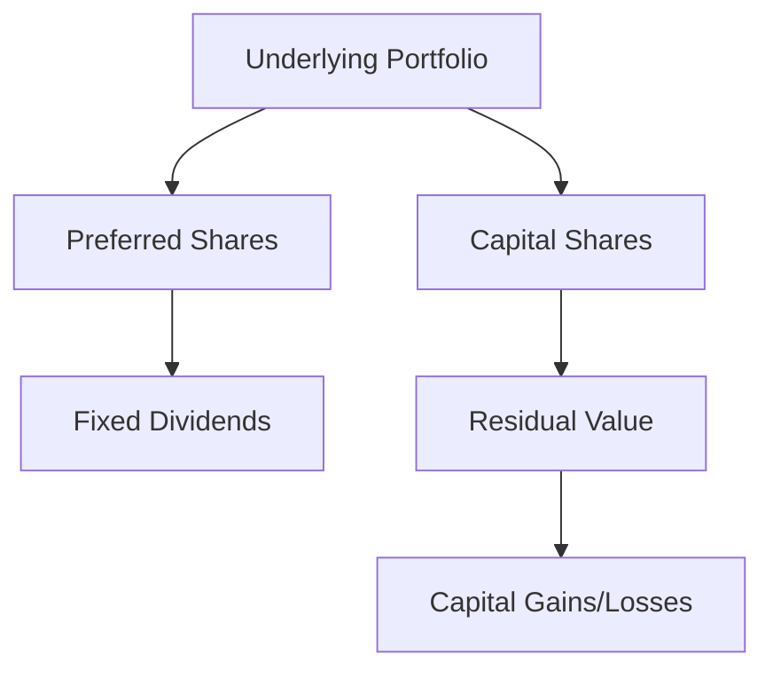

## 23.10.1 Structure and Examples of Split Shares

Split shares are a unique type of structured product that divides the investment characteristics of a single pool of underlying securities into two distinct classes: preferred shares and capital shares. This structure allows investors to choose between income-focused or growth-oriented investment strategies, depending on their risk tolerance and financial goals. In this section, we will delve into the specific structure of split shares, provide detailed examples, and explore the leveraged position of capital shares compared to common shares. Additionally, we will discuss the term structure and redemption process of split shares.

### Structure of Split Shares

Split shares are created by a split share corporation, which holds a portfolio of common shares from one or more companies. This corporation then issues two types of shares:

1. **Preferred Shares**: These shares are designed to provide a stable income stream. Preferred shareholders receive fixed, cumulative dividends, which are paid before any distributions to capital shareholders. The dividends are typically funded by the dividends received from the underlying portfolio of common shares. Preferred shares are generally less volatile and carry lower risk compared to capital shares.

2. **Capital Shares**: These shares are geared towards investors seeking capital appreciation. Capital shareholders receive the residual value of the portfolio after the preferred shareholders have been paid their dividends. This means that capital shares are more volatile and carry higher risk, as they are directly exposed to the price movements of the underlying common shares.

The split share structure effectively separates the income and growth components of the underlying securities, allowing investors to tailor their investment strategy to their specific needs.

### Examples of Split Shares

To illustrate how split shares operate, let's consider a hypothetical example involving a split share corporation that holds a portfolio of common shares from major Canadian banks, such as RBC and TD.

#### Example 1: Preferred Shares

Suppose the split share corporation issues preferred shares with a fixed annual dividend of 5%. If the underlying portfolio generates sufficient dividend income from the bank stocks, preferred shareholders will receive their 5% dividend regardless of the portfolio's market performance. This makes preferred shares an attractive option for income-focused investors who prioritize stability and predictability.

#### Example 2: Capital Shares

In contrast, capital shares in the same split share corporation do not receive fixed dividends. Instead, their value is tied to the appreciation of the underlying bank stocks. If the value of the portfolio increases by 10% over a year, capital shareholders benefit from this growth, potentially realizing significant capital gains. However, if the portfolio's value declines, capital shareholders bear the brunt of the loss, highlighting the higher risk associated with these shares.

### Leveraged Position of Capital Shares

Capital shares offer a leveraged position compared to common shares. This leverage arises because capital shareholders are entitled to the residual value of the portfolio after preferred shareholders have been paid. As a result, any increase in the portfolio's value disproportionately benefits capital shareholders, amplifying their potential returns. Conversely, any decrease in value also disproportionately affects them, increasing their potential losses.

This leverage can be visualized in the following diagram:

### Term Structure and Redemption Process

Split shares typically have a defined term, often ranging from five to ten years. At the end of the term, the split share corporation redeems the shares, distributing the net asset value of the portfolio to shareholders. The redemption process involves:

1. **Payment to Preferred Shareholders**: Preferred shareholders are paid the redemption value of their shares, which is usually the original issue price plus any accrued dividends.

2. **Distribution to Capital Shareholders**: After preferred shareholders have been paid, the remaining portfolio value is distributed to capital shareholders. This distribution reflects the portfolio's performance over the term, with capital shareholders receiving any capital gains or bearing any losses.

### Conclusion

Split shares offer a flexible investment option for Canadian investors, allowing them to choose between income stability and growth potential. By understanding the structure and mechanics of split shares, investors can make informed decisions that align with their financial objectives. Whether opting for the steady income of preferred shares or the growth potential of capital shares, split shares provide a unique opportunity to tailor investment strategies to individual needs.

For further exploration, consider reviewing the glossary for definitions of key terms such as "preferred shares," "capital shares," and "leveraged position." Additionally, consult official Canadian financial regulations and resources for more in-depth information on structured products.

## Quiz Time!



### What are the two types of shares issued by a split share corporation?

- [x] Preferred Shares and Capital Shares
- [ ] Common Shares and Preferred Shares
- [ ] Growth Shares and Income Shares
- [ ] Equity Shares and Debt Shares

> **Explanation:** Split share corporations issue preferred shares for income stability and capital shares for growth potential.

### Which type of split share is designed to provide a stable income stream?

- [x] Preferred Shares
- [ ] Capital Shares
- [ ] Common Shares
- [ ] Growth Shares

> **Explanation:** Preferred shares offer fixed, cumulative dividends, providing a stable income stream.

### What is the main risk associated with capital shares?

- [x] Higher volatility and potential for loss
- [ ] Fixed dividend payments
- [ ] Limited growth potential
- [ ] Guaranteed returns

> **Explanation:** Capital shares are exposed to the price movements of the underlying portfolio, leading to higher volatility and risk.

### How does the leverage of capital shares affect potential returns?

- [x] Amplifies both potential gains and losses
- [ ] Guarantees higher returns
- [ ] Reduces risk
- [ ] Stabilizes income

> **Explanation:** The leveraged position of capital shares amplifies both potential gains and losses.

### What happens at the end of the term for split shares?

- [x] Shares are redeemed, and net asset value is distributed
- [ ] Shares are converted to common shares
- [ ] Dividends are increased
- [ ] Shares are automatically renewed

> **Explanation:** At the end of the term, split shares are redeemed, and the net asset value is distributed to shareholders.

### Which type of investor might prefer preferred shares?

- [x] Income-focused investors
- [ ] Growth-oriented investors
- [ ] Speculative traders
- [ ] Short-term investors

> **Explanation:** Preferred shares are suitable for income-focused investors seeking stability.

### What is the typical term length for split shares?

- [x] Five to ten years
- [ ] One to two years
- [ ] Twenty years
- [ ] Indefinite

> **Explanation:** Split shares usually have a defined term ranging from five to ten years.

### How are preferred shareholders paid during the redemption process?

- [x] Original issue price plus accrued dividends
- [ ] Only the original issue price
- [ ] Only accrued dividends
- [ ] Market value of shares

> **Explanation:** Preferred shareholders receive the original issue price plus any accrued dividends during redemption.

### What is the primary benefit of capital shares?

- [x] Potential for significant capital gains
- [ ] Guaranteed income
- [ ] Fixed dividends
- [ ] Low risk

> **Explanation:** Capital shares offer the potential for significant capital gains due to their exposure to portfolio growth.

### True or False: Split shares allow investors to separate income and growth components of an investment.

- [x] True
- [ ] False

> **Explanation:** Split shares separate the income and growth components, allowing investors to tailor their strategies.


