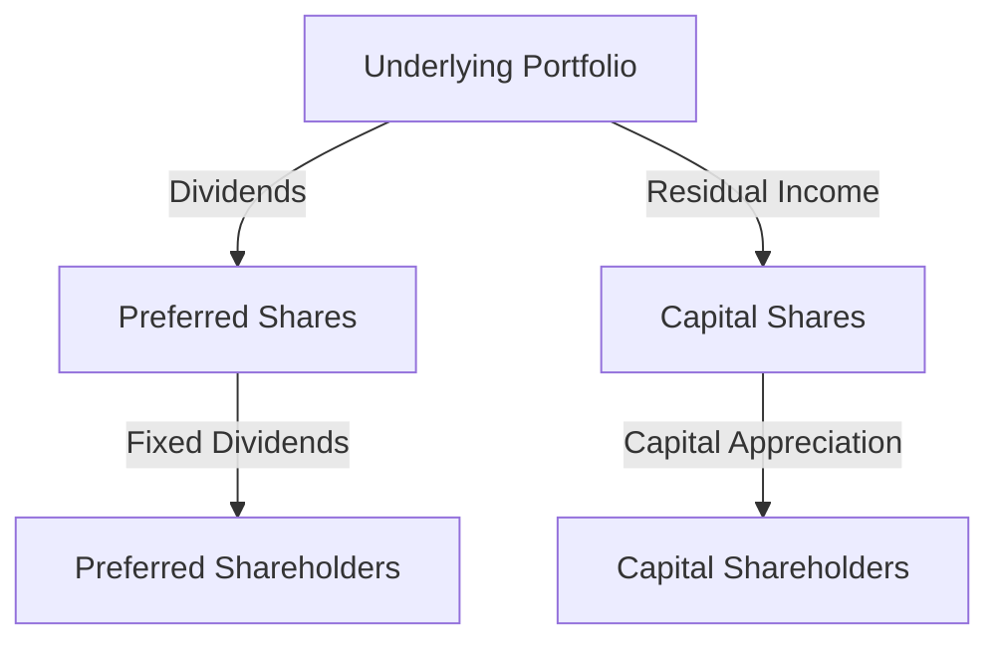

## 23.10.2 Risks Associated with Split Shares

Split shares are a unique type of structured product that divides the investment returns of a single underlying asset, typically a portfolio of dividend-paying stocks, into two distinct types of shares: capital shares and preferred shares. While these financial instruments offer tailored investment opportunities, they also come with specific risks that investors must understand. This section delves into the financial and management risks impacting both preferred and capital shares, the inherent leverage and volatility of capital shares, and the reinforcement and credit risks associated with preferred shares. Additionally, we will explore the implications of early redemption and tax changes on split shares.

### Financial and Management Risks

#### Capital Shares

Capital shares are designed to provide investors with the potential for capital appreciation. However, this potential comes with significant risks:

1. **Leverage and Volatility**: Capital shares are inherently leveraged. This means that any changes in the value of the underlying portfolio can lead to amplified gains or losses for capital shareholders. The leverage effect can increase the volatility of returns, making capital shares a high-risk investment. For example, if the underlying portfolio experiences a 10% decline, the value of capital shares might decrease by a much larger percentage due to leverage.

2. **Dividend Cuts**: Capital shareholders are typically entitled to the residual income after preferred shareholders have received their fixed dividends. If the underlying companies reduce or eliminate dividends, capital shareholders may receive little to no income. This risk is particularly pronounced during economic downturns when companies may cut dividends to preserve cash.

#### Preferred Shares

Preferred shares in a split share structure are designed to provide stable, fixed-income returns. However, they are not without risks:

1. **Reinforcement Risk**: This risk arises when the underlying portfolio's value declines significantly, threatening the ability to meet the fixed dividend obligations to preferred shareholders. In such scenarios, the issuer may need to reinforce the portfolio by selling assets or raising additional capital, which can impact the overall return.

2. **Credit Risk**: Preferred shareholders face credit risk if the issuer of the split share corporation encounters financial difficulties. This risk is akin to the risk faced by bondholders, where the issuer might default on its dividend payments.

### Implications of Early Redemption

Early redemption is a feature that allows the issuer to redeem the shares before the maturity date. This can have several implications for investors:

- **For Capital Shareholders**: Early redemption can limit the potential upside if the underlying portfolio performs well. Investors may receive their capital back sooner than expected, potentially missing out on future gains.

- **For Preferred Shareholders**: Early redemption can disrupt the expected income stream, as investors may need to reinvest the redeemed capital at potentially lower interest rates, especially in a declining interest rate environment.

### Tax Changes and Their Impact

Tax changes can significantly affect the returns on split shares. For instance, changes in the taxation of dividends or capital gains can alter the after-tax returns for both capital and preferred shareholders. Investors should stay informed about tax legislation changes and consider consulting with a tax advisor to understand the implications on their investments.

### Practical Example: Canadian Pension Funds and Split Shares

Consider a Canadian pension fund that invests in split shares to balance its portfolio. The fund allocates a portion to capital shares for growth potential and preferred shares for stable income. During a market downturn, the capital shares experience significant volatility, impacting the fund's overall performance. Meanwhile, the preferred shares continue to provide steady income, albeit with increased reinforcement risk due to declining asset values. This example illustrates the importance of understanding the distinct risks associated with each type of split share.

### Diagram: Split Share Structure

Below is a diagram illustrating the structure of a split share corporation, highlighting the flow of dividends and capital between the underlying portfolio, capital shares, and preferred shares.

### Best Practices and Common Pitfalls

- **Diversification**: Investors should diversify their holdings to mitigate the risks associated with split shares. Relying too heavily on capital shares can expose investors to excessive volatility, while over-reliance on preferred shares can limit growth potential.

- **Monitoring Economic Indicators**: Keeping an eye on economic indicators and corporate earnings can help investors anticipate dividend cuts and manage reinforcement risks.

- **Understanding Tax Implications**: Investors should be aware of how tax changes can impact their returns and consider tax-efficient investment strategies.

### Conclusion

Split shares offer a unique investment opportunity by separating the income and capital appreciation components of a portfolio. However, they come with distinct risks that investors must carefully consider. By understanding the financial and management risks associated with both capital and preferred shares, investors can make informed decisions and effectively manage their portfolios. As always, staying informed about market conditions and regulatory changes is crucial for successful investing.

## Quiz Time!



### What is a primary risk associated with capital shares in split share structures?

- [x] Leverage and volatility
- [ ] Fixed income risk
- [ ] Credit risk
- [ ] Tax risk

> **Explanation:** Capital shares are inherently leveraged, leading to increased volatility in returns.

### What risk do preferred shareholders face if the issuer encounters financial difficulties?

- [x] Credit risk
- [ ] Leverage risk
- [ ] Volatility risk
- [ ] Tax risk

> **Explanation:** Preferred shareholders face credit risk if the issuer defaults on dividend payments.

### How can early redemption affect capital shareholders?

- [x] Limits potential upside
- [ ] Increases dividend income
- [ ] Reduces leverage
- [ ] Eliminates credit risk

> **Explanation:** Early redemption can limit the potential upside for capital shareholders by returning their capital sooner than expected.

### What is reinforcement risk?

- [x] The risk of not meeting fixed dividend obligations
- [ ] The risk of increased leverage
- [ ] The risk of early redemption
- [ ] The risk of tax changes

> **Explanation:** Reinforcement risk arises when the underlying portfolio's value declines, threatening the ability to meet fixed dividend obligations.

### How can tax changes impact split shares?

- [x] Alter after-tax returns
- [ ] Increase leverage
- [ ] Reduce volatility
- [ ] Eliminate credit risk

> **Explanation:** Tax changes can alter the after-tax returns for both capital and preferred shareholders.

### What is a common pitfall for investors in split shares?

- [x] Lack of diversification
- [ ] Excessive tax planning
- [ ] Over-reliance on fixed income
- [ ] Ignoring credit ratings

> **Explanation:** Lack of diversification can expose investors to excessive risks associated with split shares.

### Why is monitoring economic indicators important for split share investors?

- [x] To anticipate dividend cuts
- [ ] To increase leverage
- [ ] To reduce tax liability
- [ ] To eliminate credit risk

> **Explanation:** Monitoring economic indicators helps investors anticipate dividend cuts and manage reinforcement risks.

### What is the role of preferred shares in a split share structure?

- [x] Provide stable, fixed-income returns
- [ ] Offer capital appreciation
- [ ] Increase leverage
- [ ] Reduce tax liability

> **Explanation:** Preferred shares are designed to provide stable, fixed-income returns.

### How does leverage affect capital shares?

- [x] Amplifies gains and losses
- [ ] Reduces volatility
- [ ] Increases fixed income
- [ ] Eliminates credit risk

> **Explanation:** Leverage amplifies both gains and losses for capital shares, increasing volatility.

### True or False: Split shares are risk-free investments.

- [ ] True
- [x] False

> **Explanation:** Split shares are not risk-free; they come with specific risks such as leverage, volatility, and credit risk.


