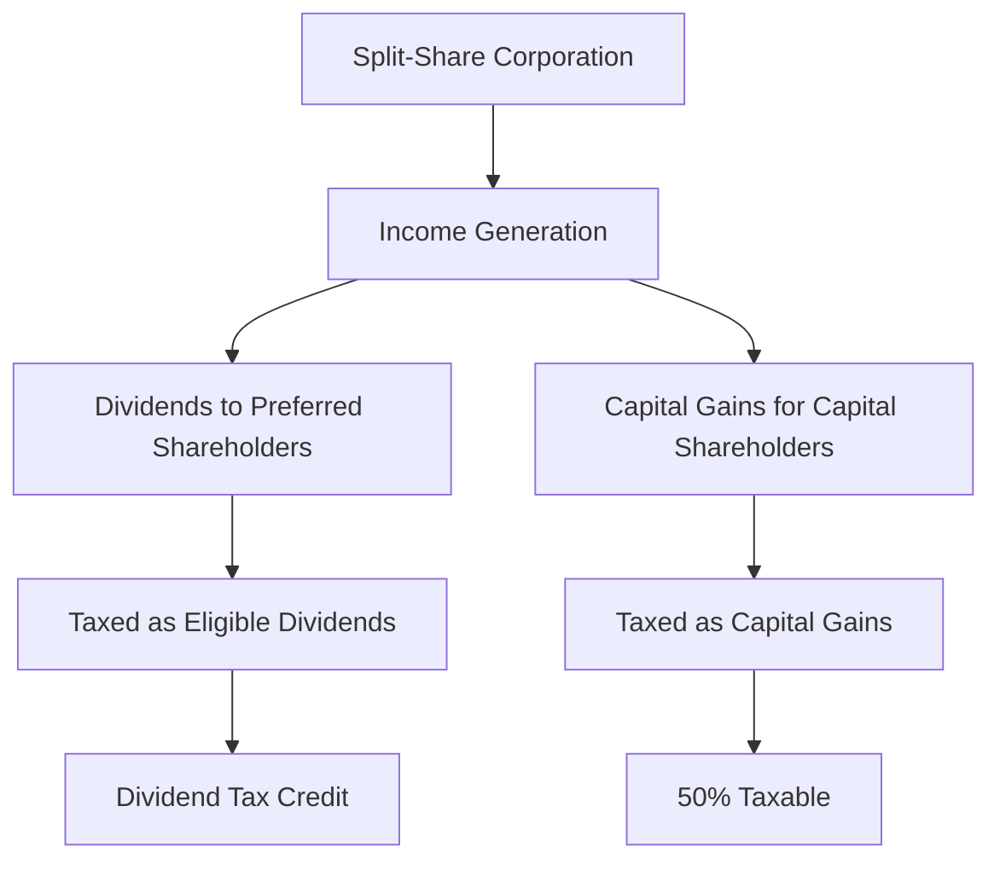

## 23.10.3 Tax Implications of Split Shares

Split shares represent a unique investment vehicle within the Canadian financial landscape, offering investors the opportunity to tailor their exposure to income and capital gains. Understanding the tax implications of split shares is crucial for investors seeking to optimize their portfolios while complying with Canadian tax regulations. This section delves into the taxation of split-share corporations, the process of income distribution to shareholders, and the potential tax liabilities for capital shareholders.

### Taxation of Split-Share Corporations

Split-share corporations are structured as closed-end funds, which means they are publicly traded investment funds with a fixed number of shares. These corporations are subject to specific tax rules under Canadian law. As closed-end funds, split-share corporations are taxed on their income, but they can pass through most of their income to shareholders, thereby reducing their taxable income.

#### Tax Treatment as Closed-End Funds

Closed-end funds, including split-share corporations, are generally taxed on their net income, which includes interest, dividends, and capital gains. However, these funds can distribute income to shareholders in the form of dividends or capital gains distributions. By doing so, they can effectively reduce their taxable income, as the income distributed is taxed at the shareholder level rather than at the corporate level.

### Income Distribution to Shareholders

The income generated by split-share corporations is typically distributed to shareholders in two forms: dividends and capital gains. The taxation of these distributions depends on the type of share held—whether they are preferred shares (income shares) or capital shares.

#### Preferred Shares (Income Shares)

Holders of preferred shares, often referred to as income shares, receive regular dividend payments. These dividends are typically eligible dividends, which are taxed at a lower rate due to the dividend tax credit available to Canadian residents. This tax credit reduces the effective tax rate on eligible dividends, making income shares an attractive option for investors seeking tax-efficient income.

#### Capital Shares

Capital shareholders, on the other hand, do not receive regular income distributions. Instead, they benefit from the capital appreciation of the underlying assets. When capital shares are sold, the shareholder may realize a capital gain or loss. In Canada, only 50% of capital gains are taxable, which can be advantageous for investors looking to minimize their tax liabilities.

### Tax Liabilities for Capital Shareholders

Capital shareholders may incur tax liabilities when they sell their shares or when the split-share corporation is wound up. The key tax consideration for capital shareholders is the realization of capital gains.

#### Realization of Capital Gains

When capital shares are sold, the difference between the sale price and the adjusted cost base (ACB) of the shares is considered a capital gain or loss. The ACB is the original purchase price of the shares, adjusted for any distributions or returns of capital. Capital gains are taxed at a favorable rate, as only 50% of the gain is included in taxable income.

#### Winding Up of Split-Share Corporations

In the event that a split-share corporation is wound up, capital shareholders may receive a distribution of the remaining assets. This distribution is treated as a capital gain and is subject to the same tax treatment as the sale of shares.

### Tax Considerations for Investors

Investors holding split shares should be mindful of several tax considerations to optimize their investment strategy and ensure compliance with Canadian tax laws.

#### Holding Period and Timing

The timing of the sale of capital shares can significantly impact the tax liability. Holding shares for more than one year can qualify the investor for long-term capital gains treatment, which is taxed more favorably than short-term gains.

#### Tax-Advantaged Accounts

Investors can hold split shares within tax-advantaged accounts such as Registered Retirement Savings Plans (RRSPs) or Tax-Free Savings Accounts (TFSAs). In an RRSP, investment income and capital gains are tax-deferred until withdrawal, while in a TFSA, they are tax-free. Utilizing these accounts can enhance the tax efficiency of split-share investments.

#### Record-Keeping and Reporting

Accurate record-keeping is essential for investors to track the adjusted cost base of their shares and report capital gains or losses accurately. Investors should maintain detailed records of all transactions, including purchase prices, distributions, and any returns of capital.

### Practical Example: Tax Implications for a Canadian Investor

Consider a Canadian investor, Jane, who holds both preferred and capital shares in a split-share corporation. Jane receives eligible dividends from her preferred shares, which are taxed at a lower rate due to the dividend tax credit. She decides to sell her capital shares after holding them for two years, realizing a capital gain. Since only 50% of the capital gain is taxable, Jane benefits from a reduced tax liability compared to ordinary income.

### Diagram: Tax Flow in Split-Share Corporations

Below is a diagram illustrating the tax flow in split-share corporations, highlighting the distribution of income and capital gains to shareholders.

### Best Practices and Common Pitfalls

- **Best Practices:**
  - Utilize tax-advantaged accounts to maximize tax efficiency.
  - Maintain accurate records of all transactions and distributions.
  - Consider the timing of sales to benefit from favorable tax treatment.

- **Common Pitfalls:**
  - Failing to track the adjusted cost base accurately, leading to incorrect capital gains reporting.
  - Overlooking the benefits of the dividend tax credit for eligible dividends.
  - Neglecting to consider the impact of tax on overall investment returns.

### Conclusion

Understanding the tax implications of split shares is essential for Canadian investors seeking to optimize their investment strategies. By leveraging the favorable tax treatment of dividends and capital gains, investors can enhance their after-tax returns. It is crucial to stay informed about tax regulations and to consider the use of tax-advantaged accounts to maximize the benefits of investing in split shares.

## Quiz Time!



### How are split-share corporations taxed in Canada?

- [x] As closed-end funds
- [ ] As open-end funds
- [ ] As mutual funds
- [ ] As exchange-traded funds

> **Explanation:** Split-share corporations are taxed as closed-end funds, which allows them to distribute income to shareholders and reduce their taxable income.

### What type of income do preferred shareholders in split-share corporations typically receive?

- [x] Eligible dividends
- [ ] Interest income
- [ ] Capital gains
- [ ] Rental income

> **Explanation:** Preferred shareholders typically receive eligible dividends, which are taxed at a lower rate due to the dividend tax credit.

### What is the tax treatment for capital gains realized by capital shareholders?

- [x] 50% of capital gains are taxable
- [ ] 100% of capital gains are taxable
- [ ] Capital gains are tax-free
- [ ] Capital gains are taxed as ordinary income

> **Explanation:** In Canada, only 50% of capital gains are included in taxable income, providing a tax advantage for capital shareholders.

### What is the adjusted cost base (ACB)?

- [x] The original purchase price of shares, adjusted for distributions
- [ ] The market value of shares at the time of sale
- [ ] The highest price paid for shares
- [ ] The lowest price paid for shares

> **Explanation:** The adjusted cost base (ACB) is the original purchase price of shares, adjusted for any distributions or returns of capital, used to calculate capital gains or losses.

### How can investors enhance the tax efficiency of split-share investments?

- [x] By holding shares in RRSPs or TFSAs
- [ ] By selling shares frequently
- [ ] By avoiding dividend-paying shares
- [ ] By investing only in foreign markets

> **Explanation:** Holding split shares in tax-advantaged accounts like RRSPs or TFSAs can enhance tax efficiency by deferring or eliminating taxes on investment income and gains.

### What is a common pitfall for investors in split shares?

- [x] Failing to track the adjusted cost base accurately
- [ ] Investing in dividend-paying shares
- [ ] Holding shares for more than one year
- [ ] Utilizing tax-advantaged accounts

> **Explanation:** A common pitfall is failing to track the adjusted cost base accurately, which can lead to incorrect reporting of capital gains or losses.

### What is the benefit of the dividend tax credit for Canadian investors?

- [x] It reduces the effective tax rate on eligible dividends
- [ ] It eliminates taxes on all dividends
- [ ] It increases the tax rate on foreign dividends
- [ ] It applies only to capital gains

> **Explanation:** The dividend tax credit reduces the effective tax rate on eligible dividends, making them more tax-efficient for Canadian investors.

### What happens when a split-share corporation is wound up?

- [x] Capital shareholders may receive a distribution treated as a capital gain
- [ ] Preferred shareholders receive all remaining assets
- [ ] No taxes are incurred by shareholders
- [ ] The corporation's assets are transferred to a new fund

> **Explanation:** When a split-share corporation is wound up, capital shareholders may receive a distribution of remaining assets, which is treated as a capital gain.

### What is a key tax consideration for capital shareholders?

- [x] Realization of capital gains
- [ ] Receipt of interest income
- [ ] Eligibility for the dividend tax credit
- [ ] Taxation of rental income

> **Explanation:** A key tax consideration for capital shareholders is the realization of capital gains, which are taxed at a favorable rate.

### True or False: Only 50% of capital gains are taxable in Canada.

- [x] True
- [ ] False

> **Explanation:** True. In Canada, only 50% of capital gains are included in taxable income, providing a tax advantage for investors.


