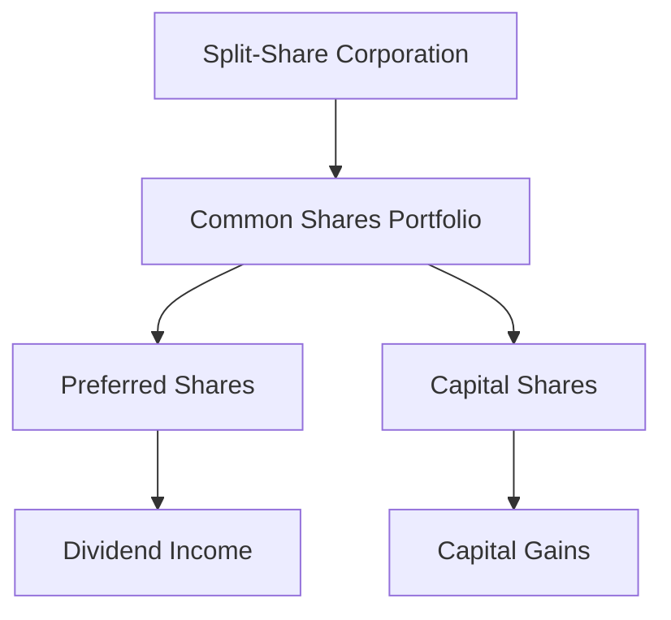

## 23.10 Split Shares

Split shares are a unique type of structured financial product that allow investors to tailor their investment exposure to specific attributes of a company's equity. They are particularly popular in the Canadian market for their ability to cater to different investor needs, such as income generation or capital appreciation.

### Understanding Split Shares

Split shares are created when a split-share corporation issues two types of shares: preferred shares and capital shares. This division allows investors to choose between income-focused and growth-focused investment strategies.

#### Purpose in Investment Strategies

The primary purpose of split shares is to separate the investment attributes of a company's common shares into two distinct components:

1. **Preferred Shares**: These shares are designed to provide a steady income stream. They typically offer fixed dividend payments and have a priority claim on the company's assets in the event of liquidation.

2. **Capital Shares**: These shares are geared towards capital appreciation. They do not offer fixed dividends but instead provide the potential for higher returns through capital gains, as they are linked to the performance of the underlying common shares.

### How Split Shares Work

To understand how split shares function, it's essential to look at the mechanics behind their creation and issuance.

#### Creation and Issuance Process

Split shares are issued by split-share corporations, which are specially created entities. Here's a step-by-step breakdown of the process:

1. **Formation of a Split-Share Corporation**: A financial institution or investment firm establishes a split-share corporation. This entity is responsible for issuing the split shares.

2. **Acquisition of Common Shares**: The split-share corporation purchases a portfolio of common shares from a publicly traded company. These shares form the underlying asset base.

3. **Issuance of Split Shares**: The corporation then issues two types of shares—preferred and capital shares—to investors. The proceeds from the sale of these shares are used to purchase the common shares.

4. **Management of the Portfolio**: The split-share corporation manages the portfolio of common shares, ensuring that the investment objectives for both preferred and capital shares are met.

5. **Distribution of Returns**: Income generated from the common shares (e.g., dividends) is distributed to preferred shareholders, while capital gains are allocated to capital shareholders.

### Benefits and Structural Features

Split shares offer several benefits and unique structural features that make them attractive to different types of investors.

#### Benefits

- **Income Generation**: Preferred shares provide a reliable income stream, making them suitable for income-focused investors, such as retirees or conservative investors seeking stability.

- **Potential for Capital Gains**: Capital shares offer the potential for significant capital appreciation, appealing to growth-oriented investors willing to accept higher risk for potentially higher returns.

- **Tax Efficiency**: In Canada, dividends received from preferred shares may be eligible for the dividend tax credit, enhancing their tax efficiency compared to interest income.

- **Customization**: Investors can tailor their portfolios by choosing the type of split share that aligns with their investment goals, whether it's income, growth, or a combination of both.

#### Structural Features

- **Fixed Term**: Split shares are typically issued for a fixed term, after which the underlying assets are sold, and the proceeds are distributed to shareholders.

- **Leverage**: Capital shares often exhibit leveraged exposure to the underlying common shares, amplifying both potential gains and losses.

- **Priority Claims**: In the event of liquidation, preferred shareholders have a priority claim over capital shareholders, providing an additional layer of security.

### Practical Example: Canadian Financial Institutions

To illustrate the practical application of split shares, consider a scenario involving a major Canadian bank, such as the Royal Bank of Canada (RBC).

#### Case Study: RBC Split Shares

1. **Formation**: A split-share corporation is established to acquire a significant number of RBC common shares.

2. **Issuance**: The corporation issues preferred shares with a fixed dividend and capital shares linked to the performance of RBC's stock.

3. **Investor Choice**: Income-focused investors purchase the preferred shares for their steady dividends, while growth-oriented investors opt for the capital shares, seeking capital gains from RBC's stock appreciation.

4. **Outcome**: Over the term, preferred shareholders receive regular dividend payments, while capital shareholders benefit from any increase in RBC's stock price.

### Diagrams and Visual Aids

To further clarify the concept of split shares, consider the following diagram illustrating the flow of investments and returns in a split-share structure:

### Best Practices and Common Pitfalls

#### Best Practices

- **Diversification**: Investors should diversify their holdings across different split-share corporations to mitigate risk.

- **Understanding Terms**: Carefully review the terms and conditions of the split shares, including the fixed term and distribution policies.

- **Tax Considerations**: Consult with a tax advisor to understand the implications of dividend income and capital gains.

#### Common Pitfalls

- **Market Volatility**: Capital shares can be highly volatile, and investors should be prepared for potential losses.

- **Interest Rate Risk**: Preferred shares may be sensitive to changes in interest rates, affecting their market value.

- **Liquidity Concerns**: Some split shares may have limited liquidity, making it challenging to sell them quickly.

### Conclusion

Split shares are a versatile investment vehicle that allows investors to customize their exposure to income and growth. By understanding their structure and benefits, investors can make informed decisions that align with their financial goals. As with any investment, it's crucial to conduct thorough research and consider the associated risks.

For further exploration, consider reviewing the glossary for key terminology related to split shares and structured products. Additionally, resources such as the Canadian Securities Administrators (CSA) and the Investment Industry Regulatory Organization of Canada (IIROC) provide valuable insights into regulatory frameworks and market practices.

## Quiz Time!



### What are split shares primarily designed to do?

- [x] Separate investment attributes into income and growth components
- [ ] Provide only capital appreciation
- [ ] Offer only fixed income
- [ ] Eliminate investment risk

> **Explanation:** Split shares are designed to separate investment attributes into preferred shares for income and capital shares for growth.

### Which type of split share is focused on providing a steady income stream?

- [x] Preferred Shares
- [ ] Capital Shares
- [ ] Common Shares
- [ ] Convertible Shares

> **Explanation:** Preferred shares are designed to provide a steady income stream through fixed dividend payments.

### What is the role of a split-share corporation?

- [x] To issue split shares and manage the underlying portfolio
- [ ] To trade shares on the stock exchange
- [ ] To provide financial advice to investors
- [ ] To merge with other corporations

> **Explanation:** A split-share corporation is responsible for issuing split shares and managing the portfolio of underlying common shares.

### How do capital shares typically generate returns?

- [x] Through capital gains linked to the performance of underlying common shares
- [ ] Through fixed interest payments
- [ ] Through guaranteed dividends
- [ ] Through currency exchange rates

> **Explanation:** Capital shares generate returns through capital gains linked to the performance of the underlying common shares.

### What is a common risk associated with capital shares?

- [x] Market Volatility
- [ ] Guaranteed Losses
- [ ] Fixed Income
- [ ] Currency Risk

> **Explanation:** Capital shares can be highly volatile, and investors should be prepared for potential losses due to market fluctuations.

### What is a benefit of preferred shares in a split-share structure?

- [x] Priority claim on assets in liquidation
- [ ] Higher risk and higher return
- [ ] No dividend payments
- [ ] Unlimited growth potential

> **Explanation:** Preferred shares have a priority claim on the company's assets in the event of liquidation, providing additional security.

### What is a potential tax advantage of preferred shares in Canada?

- [x] Eligibility for the dividend tax credit
- [ ] Exemption from capital gains tax
- [ ] No tax on interest income
- [ ] Tax-free withdrawals

> **Explanation:** Dividends from preferred shares may be eligible for the dividend tax credit, enhancing their tax efficiency.

### What structural feature of split shares can amplify both gains and losses?

- [x] Leverage
- [ ] Fixed Term
- [ ] Priority Claims
- [ ] Tax Efficiency

> **Explanation:** Capital shares often exhibit leveraged exposure to the underlying common shares, amplifying both potential gains and losses.

### What should investors consider when investing in split shares?

- [x] Diversification and understanding terms
- [ ] Only the potential returns
- [ ] The issuing company's logo
- [ ] The color of the share certificate

> **Explanation:** Investors should diversify their holdings and carefully review the terms and conditions of the split shares.

### True or False: Split shares eliminate all investment risks.

- [ ] True
- [x] False

> **Explanation:** Split shares do not eliminate investment risks; they separate investment attributes into income and growth components, each with its own risks.


