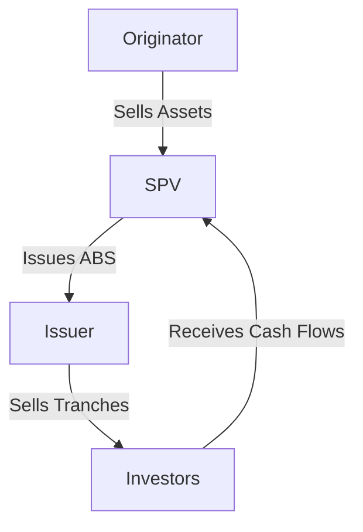

## 23.9 Securitization Process for Asset-Backed Securities

Securitization is a pivotal process in the financial world, transforming illiquid assets into marketable securities. This process is particularly significant in the creation of Asset-Backed Securities (ABS), which are financial instruments backed by a pool of assets. In this section, we will delve into the securitization process, focusing on the roles of originators, Special Purpose Vehicles (SPVs), and issuers, and the critical role of tranching in managing risk.

### Understanding the Securitization Process

The securitization process for Asset-Backed Securities involves three primary steps:

1. **Asset Origination and Pooling**
2. **Creation and Management by SPVs**
3. **Issuance of ABS Tranches**

Each step plays a crucial role in transforming assets into securities that can be sold to investors.

### Step 1: Asset Origination and Pooling

The securitization process begins with the **originator**, an entity that creates and sells the assets to be securitized. Originators can be banks, financial institutions, or corporations that hold a portfolio of assets such as mortgages, car loans, or credit card receivables. 

#### Grouping Assets into a Reference Portfolio

The originator groups these assets into a reference portfolio. This portfolio serves as the foundation for the securitization process. The assets are selected based on their cash flow potential and risk characteristics. For example, a Canadian bank might pool a set of residential mortgages to form a reference portfolio for a Mortgage-Backed Security (MBS).

### Step 2: Creation and Management by SPVs

Once the reference portfolio is established, the next step involves a **Special Purpose Vehicle (SPV)**. An SPV is a separate legal entity created to isolate financial risk. It purchases the pooled assets from the originator and manages them to create Asset-Backed Securities.

#### Role of SPVs

The SPV's primary role is to hold the assets and manage the cash flows generated by them. By doing so, the SPV ensures that the assets are legally separated from the originator's balance sheet, providing protection to investors in case of the originator's bankruptcy. This separation is crucial for maintaining the integrity and creditworthiness of the ABS.

### Step 3: Issuance of ABS Tranches

The final step in the securitization process involves the **issuer**, the entity responsible for issuing the ABS to investors. The issuer finances the SPV by issuing securities in the form of tranches.

#### Importance of Tranching

Tranching is a technique used to divide the ABS into different segments, each with specific risk and return characteristics. This allows the issuer to cater to different investor appetites. For instance, a Canadian pension fund might prefer a senior tranche with lower risk and steady returns, while a hedge fund might opt for a junior tranche with higher risk and potential for greater returns.

Tranching is essential for managing risk. By structuring the ABS into tranches, the issuer can offer securities that appeal to a broad range of investors, from risk-averse to risk-seeking.

### Diagram: Securitization Process Flow

To better understand the securitization process, let's visualize it with a diagram:

### Canadian Context and Regulatory Considerations

In Canada, the securitization process is governed by regulations set forth by the Canadian Securities Administrators (CSA) and other provincial regulatory bodies. These regulations ensure transparency and protect investors by requiring detailed disclosures about the underlying assets and the structure of the ABS.

### Practical Example: Canadian Mortgage-Backed Securities

Consider a Canadian bank like RBC, which originates a pool of residential mortgages. These mortgages are sold to an SPV, which then issues Mortgage-Backed Securities (MBS) to investors. The MBS are divided into tranches, with senior tranches offering lower risk and junior tranches offering higher returns. This structure allows RBC to raise capital while providing investors with a range of investment options.

### Best Practices and Common Challenges

**Best Practices:**
- **Due Diligence:** Conduct thorough due diligence on the underlying assets to ensure their quality and cash flow potential.
- **Risk Management:** Use tranching effectively to manage risk and appeal to diverse investor profiles.
- **Regulatory Compliance:** Adhere to Canadian regulatory requirements to maintain transparency and investor confidence.

**Common Challenges:**
- **Asset Quality:** Ensuring the quality of the underlying assets is crucial for the success of the securitization.
- **Market Conditions:** Fluctuating market conditions can impact the demand for ABS and the pricing of tranches.

### Additional Resources

For those interested in exploring securitization further, consider the following resources:

- **Books:**
  - *"Principles of Structured Finance"* by Moira Weichselbaum

- **Online Resources:**
  - **Investopedia:** [Securitization Process](https://www.investopedia.com/terms/s/securitization.asp)

### Conclusion

The securitization process for Asset-Backed Securities is a complex yet essential mechanism in modern finance. By understanding the roles of originators, SPVs, and issuers, and the importance of tranching, investors and financial professionals can better navigate this landscape. As you continue to explore structured products, consider how these principles apply to your investment strategies and financial planning.

### **Ready to Test Your Knowledge?**

**Practice 10 Essential CSC Exam Questions to Master Your Certification**



### What is the first step in the securitization process?

- [x] Asset Origination and Pooling
- [ ] Issuance of ABS Tranches
- [ ] Creation and Management by SPVs
- [ ] Risk Assessment

> **Explanation:** The first step involves the originator grouping assets into a reference portfolio.

### What role does an SPV play in securitization?

- [x] Purchases and manages assets
- [ ] Issues ABS to investors
- [ ] Provides credit ratings
- [ ] Conducts market analysis

> **Explanation:** An SPV purchases the pooled assets from the originator and manages them to create ABS.

### What is a tranche in the context of ABS?

- [x] A segment of an ABS with specific risk and return characteristics
- [ ] A type of financial derivative
- [ ] A regulatory requirement
- [ ] A credit rating

> **Explanation:** A tranche is a segment of an ABS designed to cater to different investor risk appetites.

### Why is tranching important in securitization?

- [x] It manages risk and caters to different investor appetites
- [ ] It increases the overall risk of the ABS
- [ ] It simplifies the securitization process
- [ ] It reduces regulatory requirements

> **Explanation:** Tranching allows issuers to offer securities with varying risk and return profiles, appealing to a broad range of investors.

### Which entity is responsible for issuing ABS to investors?

- [x] Issuer
- [ ] Originator
- [ ] SPV
- [ ] Credit Rating Agency

> **Explanation:** The issuer is responsible for issuing ABS to investors.

### What is the primary benefit of using an SPV in securitization?

- [x] Isolates financial risk from the originator
- [ ] Increases asset liquidity
- [ ] Enhances asset quality
- [ ] Reduces transaction costs

> **Explanation:** An SPV isolates the assets from the originator's balance sheet, protecting investors.

### What type of assets can be included in a reference portfolio?

- [x] Mortgages, car loans, credit card receivables
- [ ] Only government bonds
- [ ] Only corporate stocks
- [ ] Only real estate properties

> **Explanation:** A reference portfolio can include various types of assets like mortgages, car loans, and credit card receivables.

### How does tranching affect investor risk?

- [x] It allows investors to choose their preferred risk level
- [ ] It increases the risk for all investors
- [ ] It eliminates risk entirely
- [ ] It standardizes risk across all tranches

> **Explanation:** Tranching offers different risk levels, allowing investors to select their preferred risk-return profile.

### What is the role of the originator in securitization?

- [x] Creates and sells the assets to be securitized
- [ ] Manages the cash flows from the assets
- [ ] Issues ABS to investors
- [ ] Provides credit enhancements

> **Explanation:** The originator is responsible for creating and selling the assets that form the reference portfolio.

### True or False: Tranching is used to simplify the securitization process.

- [ ] True
- [x] False

> **Explanation:** Tranching is used to manage risk and cater to different investor appetites, not to simplify the process.


