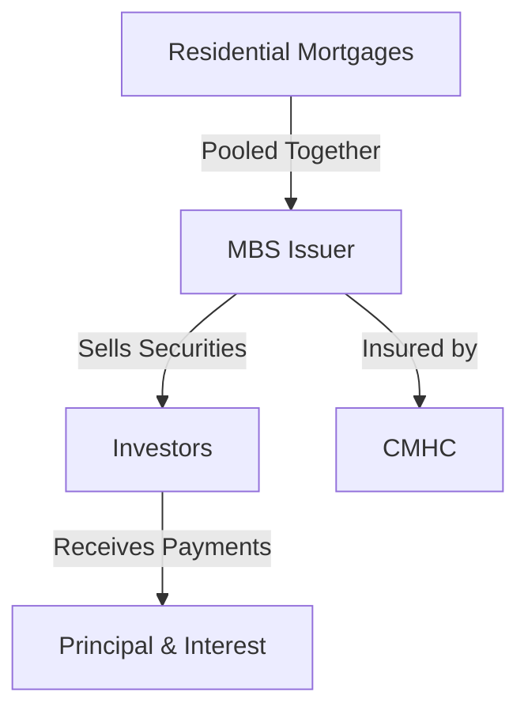

## 23.11.3.1 Structure and Benefits of MBS

Mortgage-Backed Securities (MBS) are a type of asset-backed security that is secured by a collection of mortgages. In the Canadian context, these securities are often backed by residential properties and insured by the Canada Mortgage and Housing Corporation (CMHC), providing a layer of security and assurance to investors. This section delves into the structure of MBS, the distinction between open and closed mortgage pools, the composition of their income streams, and the benefits they offer to investors.

### Structure of Mortgage-Backed Securities

MBS are created by pooling together a group of mortgages, which are then sold to investors as securities. The cash flows from the underlying mortgages—comprising both principal and interest payments—are passed through to the investors. In Canada, the CMHC plays a crucial role by insuring these securities, which mitigates the risk of default and enhances their attractiveness to investors.

#### Role of CMHC

The CMHC provides insurance for MBS, ensuring that even if a borrower defaults on their mortgage, the investors will still receive their payments. This insurance is a significant factor in the stability and reliability of MBS, making them a popular choice among risk-averse investors.

### Open vs. Closed Mortgage Pools

A critical distinction in the structure of MBS is between open (prepayable) and closed (non-prepayable) mortgage pools.

#### Open (Prepayable) Mortgage Pools

Open mortgage pools allow borrowers to prepay their mortgages without penalties. This flexibility can lead to variability in the cash flow to investors, as borrowers may choose to pay off their mortgages early, especially in a declining interest rate environment. While this can lead to reinvestment risk for investors, it also offers the potential for higher returns if the prepaid funds are reinvested at favorable rates.

#### Closed (Non-Prepayable) Mortgage Pools

Closed mortgage pools, on the other hand, do not allow for prepayment without penalties. This structure provides a more predictable cash flow to investors, as the payments are scheduled and fixed over the life of the mortgage. This predictability can be advantageous for investors seeking stable and consistent returns.

### Income Stream Composition

The income stream from MBS is composed of both interest and principal payments from the underlying mortgages. These payments are distributed to investors on a monthly basis, providing a steady income stream. The interest component is typically higher in the early years of the mortgage, while the principal component increases over time as the mortgage is paid down.

### Benefits of Mortgage-Backed Securities

MBS offer several benefits to investors, making them an attractive option in the fixed-income market.

#### Guaranteed Monthly Payments

One of the primary benefits of MBS is the guarantee of monthly payments. Due to the backing by CMHC, investors can rely on receiving regular payments, which is particularly appealing for those seeking a steady income stream.

#### Liquidity

MBS are generally considered to be liquid investments, meaning they can be easily bought and sold in the market. This liquidity is enhanced by the standardization and transparency of the securities, as well as the backing by CMHC, which increases investor confidence.

#### Diversification

Investing in MBS allows for diversification within a portfolio. As they are backed by a pool of mortgages, the risk is spread across multiple borrowers and properties, reducing the impact of any single default.

#### Competitive Returns

MBS can offer competitive returns compared to other fixed-income securities, particularly when considering the risk-adjusted returns. The combination of regular income, CMHC insurance, and potential for capital appreciation makes them a compelling choice for many investors.

### Practical Example: Canadian Pension Funds

Canadian pension funds often include MBS in their portfolios due to the securities' stable income and low risk. For instance, a pension fund might allocate a portion of its fixed-income investments to MBS to achieve a balance between risk and return, leveraging the CMHC insurance to ensure the security of the investment.

### Diagram: Structure of MBS

Below is a simplified diagram illustrating the structure of MBS:

### Conclusion

Mortgage-Backed Securities offer a unique blend of security, income, and liquidity, making them a valuable component of a diversified investment portfolio. By understanding the structure and benefits of MBS, investors can make informed decisions that align with their financial goals and risk tolerance.

For further exploration, consider reviewing the glossary for definitions of key terms such as "prepayment risk," "CMHC," and "liquidity." Additionally, resources such as the CMHC website and financial courses on structured products can provide deeper insights into the workings of MBS.

## Quiz Time!



### What role does the CMHC play in the structure of MBS?

- [x] Provides insurance to mitigate default risk
- [ ] Sets interest rates for MBS
- [ ] Issues MBS directly to investors
- [ ] Manages the underlying mortgage properties

> **Explanation:** The CMHC provides insurance for MBS, ensuring that investors receive payments even if borrowers default.

### What is a key feature of open (prepayable) mortgage pools?

- [x] Borrowers can prepay without penalties
- [ ] Fixed interest rates for investors
- [ ] Guaranteed principal repayment
- [ ] Higher default risk

> **Explanation:** Open mortgage pools allow borrowers to prepay their mortgages without penalties, affecting cash flow predictability.

### How do closed (non-prepayable) mortgage pools benefit investors?

- [x] Provide predictable cash flows
- [ ] Offer higher interest rates
- [ ] Allow for early repayment by borrowers
- [ ] Increase liquidity

> **Explanation:** Closed mortgage pools provide predictable cash flows as they do not allow prepayment without penalties.

### What components make up the income stream of MBS?

- [x] Interest and principal payments
- [ ] Only interest payments
- [ ] Only principal payments
- [ ] Dividends and capital gains

> **Explanation:** The income stream of MBS consists of both interest and principal payments from the underlying mortgages.

### Why are MBS considered liquid investments?

- [x] They can be easily bought and sold in the market
- [ ] They have high interest rates
- [x] They are backed by CMHC
- [ ] They are only available to institutional investors

> **Explanation:** MBS are liquid because they can be easily traded, and CMHC backing increases investor confidence.

### What is a primary benefit of investing in MBS?

- [x] Guaranteed monthly payments
- [ ] High-risk, high-reward potential
- [ ] Tax-free income
- [ ] Unlimited growth potential

> **Explanation:** MBS offer guaranteed monthly payments, making them attractive for income-seeking investors.

### How do MBS contribute to portfolio diversification?

- [x] Spread risk across multiple borrowers and properties
- [ ] Focus on a single high-value property
- [x] Include various types of securities
- [ ] Limit exposure to interest rate changes

> **Explanation:** MBS diversify risk by pooling multiple mortgages, reducing the impact of any single default.

### What type of investor might be particularly interested in MBS?

- [x] Risk-averse investors seeking steady income
- [ ] Speculative investors seeking high returns
- [ ] Investors looking for tax shelters
- [ ] Short-term traders

> **Explanation:** Risk-averse investors value the steady income and security provided by MBS.

### What is a potential risk associated with open mortgage pools?

- [x] Reinvestment risk due to prepayments
- [ ] Lack of liquidity
- [ ] High default rates
- [ ] Fixed cash flows

> **Explanation:** Open mortgage pools can lead to reinvestment risk if borrowers prepay their mortgages early.

### True or False: MBS are only backed by commercial properties.

- [ ] True
- [x] False

> **Explanation:** MBS are typically backed by residential properties, not just commercial ones.


