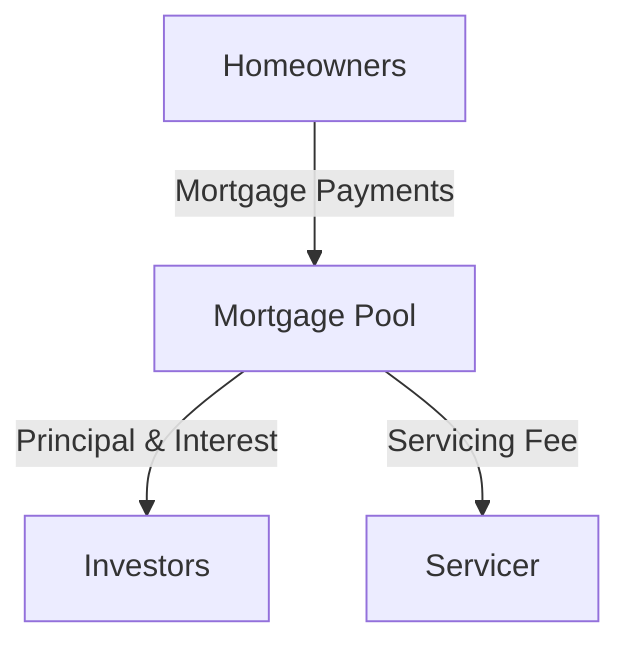

---

linkTitle: "23.11.3 Mortgage-Backed Securities (MBS)"
title: "Mortgage-Backed Securities (MBS): Understanding Structure, Risks, and Benefits"
description: "Explore the intricacies of Mortgage-Backed Securities (MBS), their structure, benefits, risks, and role in the Canadian financial market."
categories:
- Finance
- Investment
- Canadian Securities
tags:
- Mortgage-Backed Securities
- MBS
- Investment Strategies
- Canadian Finance
- Structured Products
date: 2024-10-25
type: docs
nav_weight: 1213000
---

## 23.11.3 Mortgage-Backed Securities (MBS)

Mortgage-Backed Securities (MBS) are a type of asset-backed security that is secured by a collection of mortgages. These financial instruments play a crucial role in providing liquidity to the mortgage market, allowing lenders to free up capital to issue more loans. In this section, we will delve into the structure, benefits, and risks associated with MBS, particularly within the Canadian context.

### Understanding Mortgage-Backed Securities

MBS are created when a financial institution bundles together a group of mortgages and sells them as a security to investors. This process is known as securitization. By purchasing an MBS, investors essentially buy the right to receive the principal and interest payments made by the homeowners on the underlying mortgages.

#### Function in Providing Liquidity

The primary function of MBS is to provide liquidity to the mortgage market. By converting illiquid mortgage loans into liquid securities, lenders can sell these securities to investors, thereby replenishing their capital reserves. This process enables lenders to issue new mortgages, facilitating home ownership and stimulating economic growth.

### Structure of Mortgage-Backed Securities

The structure of MBS can vary, but they generally fall into two categories: pass-through securities and collateralized mortgage obligations (CMOs).

- **Pass-Through Securities**: These are the simplest form of MBS, where the principal and interest payments from the mortgage pool are passed through to investors, minus a servicing fee.

- **Collateralized Mortgage Obligations (CMOs)**: These are more complex structures that divide the mortgage pool into different tranches, each with varying levels of risk and return. CMOs allow investors to choose tranches that match their risk tolerance and investment goals.

#### Prepayment Risk

One of the key risks associated with MBS is prepayment risk. This occurs when homeowners pay off their mortgages early, typically through refinancing or selling their homes. Prepayment can affect the cash flow of MBS, as investors receive their principal back sooner than expected, potentially at a lower interest rate environment.

#### Government Guarantees

In Canada, many MBS are backed by government guarantees, such as those provided by the Canada Mortgage and Housing Corporation (CMHC). These guarantees enhance the credit quality of MBS, making them more attractive to investors by reducing default risk.

### Open vs. Closed Mortgage Pools

MBS can be structured as either open or closed mortgage pools:

- **Open Mortgage Pools**: These pools allow for the addition of new mortgages over time. This flexibility can lead to variability in the cash flows and risk profile of the MBS.

- **Closed Mortgage Pools**: These pools consist of a fixed set of mortgages, with no new additions. This structure provides more predictable cash flows and risk characteristics, making them appealing to risk-averse investors.

### Benefits and Risks of Investing in MBS

#### Benefits

1. **Diversification**: MBS offer diversification benefits by providing exposure to the real estate market without direct property ownership.

2. **Income Generation**: MBS can provide a steady stream of income through interest payments, appealing to income-focused investors.

3. **Government Guarantees**: In Canada, government-backed MBS offer enhanced security, reducing the risk of default.

#### Risks

1. **Prepayment Risk**: As mentioned earlier, prepayment risk can lead to uncertainty in cash flows and reinvestment risk.

2. **Interest Rate Risk**: Changes in interest rates can affect the value of MBS, as rising rates may lead to lower prepayment rates and vice versa.

3. **Credit Risk**: Although government guarantees mitigate credit risk, non-guaranteed MBS carry the risk of borrower default.

### Practical Example: Canadian Pension Funds

Canadian pension funds often invest in MBS as part of their fixed-income portfolios. For instance, a pension fund might allocate a portion of its assets to CMHC-backed MBS to achieve a balance of income generation and capital preservation. By doing so, the fund can benefit from the steady cash flows and reduced credit risk associated with government-backed securities.

### Visualizing MBS Structure

Below is a simplified diagram illustrating the flow of payments in a pass-through MBS:

### Best Practices and Common Pitfalls

- **Best Practices**: Investors should assess the credit quality of the underlying mortgages, the structure of the MBS, and the presence of government guarantees before investing.

- **Common Pitfalls**: Failing to account for prepayment risk and interest rate fluctuations can lead to unexpected changes in cash flows and investment returns.

### Conclusion

Mortgage-Backed Securities are a vital component of the financial markets, offering liquidity, diversification, and income opportunities. However, they also come with risks that require careful consideration. By understanding the structure and dynamics of MBS, investors can make informed decisions that align with their financial goals.

For further exploration, consider reviewing the glossary for key terminology related to MBS and exploring additional resources such as the CMHC website for insights into government-backed securities.

## Quiz Time!



### What is the primary function of Mortgage-Backed Securities (MBS)?

- [x] To provide liquidity to the mortgage market
- [ ] To increase interest rates
- [ ] To decrease home ownership
- [ ] To eliminate prepayment risk

> **Explanation:** MBS provide liquidity by converting illiquid mortgage loans into liquid securities, allowing lenders to issue more loans.

### Which type of MBS structure divides the mortgage pool into different tranches?

- [ ] Pass-Through Securities
- [x] Collateralized Mortgage Obligations (CMOs)
- [ ] Government Bonds
- [ ] Equity Securities

> **Explanation:** CMOs divide the mortgage pool into tranches with varying risk and return profiles.

### What is prepayment risk in the context of MBS?

- [x] The risk of homeowners paying off their mortgages early
- [ ] The risk of interest rates increasing
- [ ] The risk of government intervention
- [ ] The risk of currency fluctuations

> **Explanation:** Prepayment risk occurs when homeowners pay off their mortgages early, affecting cash flows.

### What is a key benefit of government-backed MBS in Canada?

- [x] Enhanced credit quality due to government guarantees
- [ ] Higher interest rates
- [ ] Increased prepayment risk
- [ ] Greater market volatility

> **Explanation:** Government-backed MBS have enhanced credit quality, reducing default risk.

### Which type of mortgage pool allows for the addition of new mortgages over time?

- [x] Open Mortgage Pools
- [ ] Closed Mortgage Pools
- [ ] Fixed Mortgage Pools
- [ ] Variable Mortgage Pools

> **Explanation:** Open mortgage pools allow for new mortgages to be added, affecting cash flows and risk.

### What is a common risk associated with investing in MBS?

- [x] Interest Rate Risk
- [ ] Currency Risk
- [ ] Political Risk
- [ ] Technological Risk

> **Explanation:** Interest rate changes can affect the value and cash flows of MBS.

### How can MBS provide diversification benefits?

- [x] By offering exposure to the real estate market
- [ ] By eliminating all investment risks
- [ ] By guaranteeing high returns
- [ ] By focusing solely on equities

> **Explanation:** MBS provide exposure to real estate without direct property ownership, aiding diversification.

### What is a potential pitfall when investing in MBS?

- [x] Failing to account for prepayment risk
- [ ] Overestimating government guarantees
- [ ] Ignoring currency fluctuations
- [ ] Relying solely on equity markets

> **Explanation:** Not accounting for prepayment risk can lead to unexpected cash flow changes.

### True or False: Closed mortgage pools provide more predictable cash flows than open pools.

- [x] True
- [ ] False

> **Explanation:** Closed pools have a fixed set of mortgages, offering more predictable cash flows.

### True or False: Canadian pension funds typically avoid investing in MBS.

- [ ] True
- [x] False

> **Explanation:** Canadian pension funds often invest in MBS for income and diversification.


