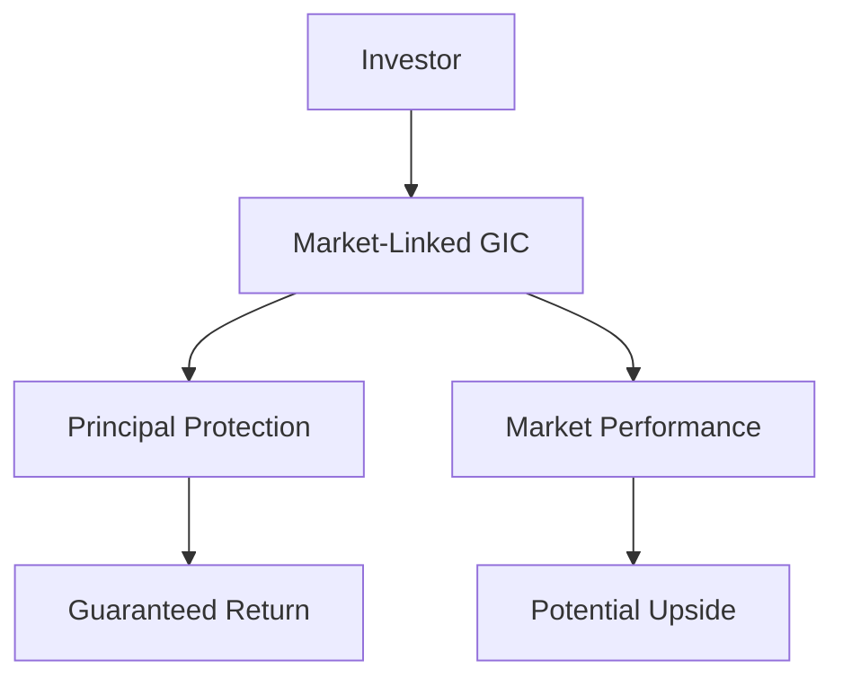

## Chapter 23: Structured Products

### 23.1 Overview of Structured Products

Structured products are innovative financial instruments designed to meet specific investment needs that traditional financial products may not address. They are created by combining features from mutual funds and individual securities, offering a tailored investment solution that can provide unique risk-return profiles. This section delves into the nature of structured products, their regulatory environment in Canada, and the role of financial institutions in their issuance.

### What Are Structured Products?

Structured products are pre-packaged investment strategies based on derivatives, such as options, swaps, or other financial instruments. They are typically created by financial institutions to offer customized exposure to various asset classes, including equities, commodities, interest rates, or currencies. These products are designed to achieve specific investment objectives, such as capital protection, enhanced returns, or diversification.

#### Creation of Structured Products

The creation of structured products involves a combination of traditional securities, such as bonds or equities, with derivatives. This combination allows for the customization of risk and return characteristics. For example, a structured product might combine a bond with an option on a stock index to provide a guaranteed return of principal with the potential for additional upside linked to the performance of the index.

### Combining Features from Mutual Funds and Individual Securities

Structured products blend characteristics from both mutual funds and individual securities. Like mutual funds, they can offer diversification and professional management. However, unlike mutual funds, structured products can be tailored to meet specific investment goals and risk tolerances, similar to individual securities.

#### Example: Principal-Protected Notes (PPNs)

A common type of structured product is the Principal-Protected Note (PPN), which guarantees the return of the initial investment at maturity while providing exposure to the performance of an underlying asset. This feature makes PPNs attractive to risk-averse investors seeking exposure to potentially higher returns without risking their principal.

### Regulatory Framework in Canada

In Canada, structured products are subject to specific regulatory frameworks to ensure investor protection and market integrity. The primary regulations governing these products are National Instrument 81-102 (NI 81-102) and National Instrument 81-104 (NI 81-104).

#### National Instrument 81-102 (NI 81-102)

NI 81-102 is a Canadian securities regulation that governs mutual funds and principal-protected notes. It sets out rules regarding the distribution, management, and operation of these investment products, ensuring transparency and fairness in the market.

#### National Instrument 81-104 (NI 81-104)

NI 81-104 addresses funds that use commodities and derivatives, providing a regulatory framework for alternative mutual funds. This regulation ensures that funds using complex financial instruments adhere to specific standards, protecting investors from undue risk.

### Role of Financial Institutions

Financial institutions, such as banks, play a crucial role in the issuance and distribution of structured products. They leverage their expertise in financial engineering to design products that meet the specific needs of their clients. Canadian banks like RBC and TD are prominent issuers of structured products, offering a range of solutions tailored to different investment strategies.

#### Case Study: RBC's Market-Linked GICs

RBC offers Market-Linked Guaranteed Investment Certificates (GICs), a type of structured product that combines the safety of a traditional GIC with the potential for higher returns linked to the performance of a specific market index. This product exemplifies how structured products can provide both security and growth potential.

### Practical Examples and Real-World Scenarios

To illustrate the application of structured products, consider a Canadian pension fund seeking to enhance its portfolio's yield while maintaining a conservative risk profile. By investing in a structured product that combines a bond with an equity option, the fund can achieve a balance between income generation and capital appreciation.

#### Diagram: Structure of a Market-Linked GIC

### Best Practices and Common Pitfalls

When investing in structured products, it is essential to understand the underlying components and the associated risks. Investors should:

- **Conduct thorough due diligence** on the issuer and the product's structure.
- **Understand the terms and conditions**, including any fees or penalties.
- **Consider the liquidity** of the product, as some structured products may have limited secondary markets.

Common pitfalls include overestimating the potential returns or underestimating the complexity of the product. Investors should seek professional advice to ensure the product aligns with their investment objectives and risk tolerance.

### Additional Resources

For those interested in exploring structured products further, consider the following resources:

- **Books:**
  - *"Financial Engineering and Structured Products Handbook"* by Edward I. Altman and Mark J. Kaminski

- **Online Resources:**
  - **CSA:** [Structured Products Regulations](https://www.securities-administrators.ca)
  - **IIROC:** [Regulation of Structured Products](https://www.iiroc.ca/regulation-and-licensing/etfs)

### Glossary

- **National Instrument 81-102 (NI 81-102):** Canadian securities regulation governing mutual funds and principal-protected notes.
- **National Instrument 81-104 (NI 81-104):** Regulation addressing funds that use commodities and derivatives.
- **Derivatives:** Financial instruments whose value is derived from an underlying asset, index, or rate.
- **Guaranteed Investment Certificate (GIC):** A Canadian investment that offers a guaranteed return of principal and interest.

### Conclusion

Structured products offer a versatile investment option for those seeking tailored solutions to meet specific financial goals. By understanding their structure, regulatory environment, and the role of financial institutions, investors can make informed decisions that align with their investment strategies. As with any financial instrument, due diligence and professional guidance are key to navigating the complexities of structured products.

### **Ready to Test Your Knowledge?**

**Practice 10 Essential CSC Exam Questions to Master Your Certification**



### What are structured products primarily based on?

- [x] Derivatives
- [ ] Real estate
- [ ] Commodities
- [ ] Fixed income securities

> **Explanation:** Structured products are primarily based on derivatives, which allow for the customization of risk and return profiles.

### Which regulation governs mutual funds and principal-protected notes in Canada?

- [x] NI 81-102
- [ ] NI 81-104
- [ ] NI 31-103
- [ ] NI 45-106

> **Explanation:** NI 81-102 is the Canadian securities regulation that governs mutual funds and principal-protected notes.

### What is a key feature of Principal-Protected Notes (PPNs)?

- [x] Guaranteed return of principal
- [ ] High liquidity
- [ ] Fixed interest rate
- [ ] Unlimited upside potential

> **Explanation:** PPNs guarantee the return of the initial investment at maturity, making them attractive to risk-averse investors.

### Which Canadian financial institution is known for issuing Market-Linked GICs?

- [x] RBC
- [ ] Scotiabank
- [ ] BMO
- [ ] CIBC

> **Explanation:** RBC offers Market-Linked GICs, which combine the safety of a traditional GIC with potential market-linked returns.

### What is the primary purpose of NI 81-104?

- [x] Regulate funds using commodities and derivatives
- [ ] Govern mutual funds
- [ ] Oversee insurance products
- [ ] Manage real estate investments

> **Explanation:** NI 81-104 addresses funds that use commodities and derivatives, ensuring they adhere to specific standards.

### What should investors consider when investing in structured products?

- [x] Liquidity and fees
- [ ] Only the potential returns
- [ ] The issuer's marketing materials
- [ ] The product's name

> **Explanation:** Investors should consider liquidity, fees, and the product's structure to ensure it aligns with their investment goals.

### How do structured products differ from mutual funds?

- [x] They offer tailored risk-return profiles
- [ ] They are more liquid
- [ ] They have lower fees
- [ ] They are only available to institutional investors

> **Explanation:** Structured products offer tailored risk-return profiles, unlike mutual funds, which are more standardized.

### What is a common pitfall when investing in structured products?

- [x] Overestimating potential returns
- [ ] Underestimating liquidity
- [ ] Ignoring the issuer's reputation
- [ ] Focusing solely on fees

> **Explanation:** A common pitfall is overestimating potential returns without fully understanding the product's complexity.

### What is a derivative?

- [x] A financial instrument derived from an underlying asset
- [ ] A type of mutual fund
- [ ] A real estate investment
- [ ] A fixed income security

> **Explanation:** A derivative is a financial instrument whose value is derived from an underlying asset, index, or rate.

### True or False: Structured products can only be issued by banks.

- [ ] True
- [x] False

> **Explanation:** While banks are major issuers, other financial institutions can also issue structured products.


