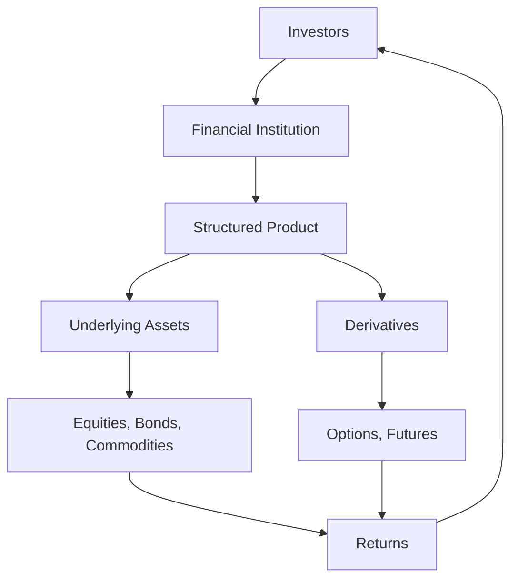

## 23.2 Advantages of Structured Products

Structured products have become an integral part of the investment landscape, offering a blend of traditional securities with derivatives to meet specific investor needs. In the Canadian context, these products provide unique advantages that can enhance a portfolio's performance while managing risk. This section delves into the key benefits of structured products, emphasizing their role in professional management, diversification, enhanced yields, and capital protection.

### Professional Management and Economies of Scale

One of the primary advantages of structured products is the access they provide to professional management. These products are typically designed and managed by financial experts who leverage their expertise to create investment solutions tailored to specific market conditions and investor goals. This professional oversight ensures that the products are continuously monitored and adjusted to optimize performance.

**Economies of Scale** play a crucial role in structured products. By pooling resources from multiple investors, structured products can achieve cost efficiencies that individual investors might not be able to realize on their own. This pooling effect reduces transaction costs and allows for more sophisticated investment strategies, ultimately benefiting all investors involved.

### Diversification and Tailored Risk-Return Profiles

**Diversification** is a fundamental principle in investment management, aimed at reducing risk by spreading investments across various assets. Structured products excel in this area by offering exposure to a wide range of asset classes, including equities, bonds, commodities, and currencies. This diversification helps mitigate the impact of poor performance in any single asset class, thereby enhancing the overall stability of the investment portfolio.

Moreover, structured products can be tailored to meet specific risk-return profiles. Investors can choose products that align with their risk tolerance and investment objectives, whether they seek conservative capital protection or aggressive growth opportunities. This customization allows investors to participate in market upside while managing downside risks effectively.

### Enhanced Yields and Capital Protection

Structured products often offer the potential for **enhanced yields** compared to traditional fixed-income investments. By incorporating derivatives, these products can provide higher returns through strategic exposure to market movements. For instance, a structured product linked to the performance of a Canadian equity index might offer a higher yield than a standard bond, while still providing some level of capital protection.

**Capital protection** is another significant advantage of structured products. Many of these products are designed to safeguard the initial investment, ensuring that investors do not suffer significant losses even in volatile market conditions. This feature is particularly appealing to risk-averse investors who seek to preserve their capital while still participating in potential market gains.

### Flexibility in Structuring Products

The flexibility inherent in structured products allows them to be tailored to meet specific investment objectives. Financial institutions can design products with varying maturities, underlying assets, and payout structures to cater to diverse investor needs. This adaptability makes structured products suitable for a wide range of investment strategies, from income generation to growth and capital preservation.

For example, a Canadian investor looking to benefit from the growth of the technology sector without direct exposure to individual stocks might choose a structured product linked to a technology index. This product could offer participation in the index's upside while limiting downside risk through capital protection features.

### Practical Example: Canadian Pension Funds

Canadian pension funds often utilize structured products to achieve their investment goals. By incorporating these products into their portfolios, pension funds can enhance returns while managing risk effectively. For instance, a pension fund might invest in a structured product that provides exposure to global equities with a capital protection feature, ensuring that the fund's liabilities are met even in adverse market conditions.

### Diagram: Structured Product Flow

Below is a diagram illustrating the flow of a typical structured product, highlighting the interaction between investors, financial institutions, and the underlying assets.

### Best Practices and Common Pitfalls

When considering structured products, investors should be aware of best practices and potential challenges:

- **Best Practices:**
  - Conduct thorough due diligence on the financial institution offering the product.
  - Understand the underlying assets and derivatives involved.
  - Align the product with your investment goals and risk tolerance.

- **Common Pitfalls:**
  - Overlooking the complexity and potential risks of derivatives.
  - Failing to consider the impact of fees and costs on returns.
  - Ignoring the credit risk of the issuing institution.

### References and Further Exploration

For those interested in exploring structured products further, consider the following resources:

- **Books:**
  - *"Structured Products and Derivatives"* by Richard E. Rosett

- **Online Resources:**
  - **Investopedia:** [Advantages of Structured Products](https://www.investopedia.com/terms/s/structuredproduct.asp)

- **Canadian Financial Institutions:**
  - Explore offerings from major Canadian banks such as RBC and TD, which provide a range of structured products tailored to different investor needs.

### Conclusion

Structured products offer a versatile and powerful tool for Canadian investors seeking to enhance their portfolios. By leveraging professional management, diversification, enhanced yields, and capital protection, these products can help investors achieve their financial goals while managing risk effectively. As with any investment, it is crucial to conduct thorough research and align structured products with your overall investment strategy.

### **Ready to Test Your Knowledge?**

**Practice 10 Essential CSC Exam Questions to Master Your Certification**



### What is one of the primary advantages of structured products?

- [x] Access to professional management
- [ ] Guaranteed high returns
- [ ] No risk involved
- [ ] Unlimited liquidity

> **Explanation:** Structured products provide access to professional management, ensuring that investments are optimized for performance.

### How do structured products achieve economies of scale?

- [x] By pooling resources from multiple investors
- [ ] By investing in only one asset class
- [ ] By reducing the number of investors
- [ ] By eliminating transaction costs

> **Explanation:** Structured products achieve economies of scale by pooling resources from multiple investors, reducing costs and enhancing investment strategies.

### What is diversification in the context of structured products?

- [x] Spreading investments across various assets to reduce risk
- [ ] Investing in a single asset to maximize returns
- [ ] Avoiding all types of risk
- [ ] Focusing only on high-risk investments

> **Explanation:** Diversification involves spreading investments across various assets to reduce exposure to any single asset or risk.

### What feature of structured products is particularly appealing to risk-averse investors?

- [x] Capital protection
- [ ] High volatility
- [ ] Unlimited growth potential
- [ ] Lack of professional management

> **Explanation:** Capital protection is appealing to risk-averse investors as it safeguards the initial investment from significant losses.

### How can structured products offer enhanced yields?

- [x] By incorporating derivatives for strategic market exposure
- [ ] By investing only in government bonds
- [ ] By avoiding all types of risk
- [ ] By focusing solely on short-term investments

> **Explanation:** Structured products can offer enhanced yields by incorporating derivatives, providing strategic exposure to market movements.

### What flexibility do structured products offer?

- [x] They can be tailored to meet specific investment objectives.
- [ ] They guarantee returns regardless of market conditions.
- [ ] They eliminate all investment risks.
- [ ] They are only available for short-term investments.

> **Explanation:** Structured products offer flexibility by being tailored to meet specific investment objectives, such as varying maturities and payout structures.

### Which Canadian financial institution might offer structured products?

- [x] RBC
- [ ] The Bank of England
- [ ] The Federal Reserve
- [ ] The European Central Bank

> **Explanation:** RBC, a major Canadian bank, offers structured products tailored to different investor needs.

### What should investors consider when choosing structured products?

- [x] Aligning the product with their investment goals and risk tolerance
- [ ] Only the potential returns
- [ ] The popularity of the product
- [ ] The number of investors involved

> **Explanation:** Investors should align structured products with their investment goals and risk tolerance to ensure suitability.

### What is a common pitfall when investing in structured products?

- [x] Overlooking the complexity and potential risks of derivatives
- [ ] Investing in multiple asset classes
- [ ] Conducting thorough research
- [ ] Aligning with investment goals

> **Explanation:** A common pitfall is overlooking the complexity and potential risks associated with derivatives in structured products.

### True or False: Structured products can only be used for conservative investment strategies.

- [ ] True
- [x] False

> **Explanation:** False. Structured products can be tailored for both conservative and aggressive investment strategies, depending on the investor's goals.


