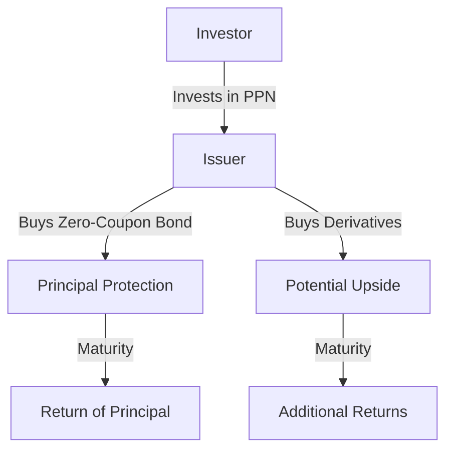

## 23.4 Principal-Protected Notes

Principal-Protected Notes (PPNs) are a unique class of structured financial products that combine the safety of debt instruments with the potential for higher returns linked to the performance of underlying assets. In this section, we will delve into the structure, benefits, and risks associated with PPNs, focusing on their role within the Canadian financial market.

### Structure of Principal-Protected Notes

PPNs are debt instruments typically issued by banks and other financial institutions. They are designed to protect the investor's principal while providing the opportunity for additional returns based on the performance of specified underlying assets, such as equity indices, commodities, or currencies.

#### Key Components of PPNs

1. **Principal Protection**: The core feature of PPNs is the guarantee of the return of the initial investment amount at maturity. This is achieved through the use of a zero-coupon bond structure, where the issuer invests a portion of the proceeds in a zero-coupon bond that matures at the same time as the PPN, ensuring the principal is returned.

2. **Potential for Upside**: The remaining portion of the investment is used to purchase options or other derivatives linked to the performance of the underlying assets. These derivatives provide the potential for additional returns if the underlying assets perform well.

3. **Maturity Terms**: PPNs typically have a fixed term to maturity, often ranging from 3 to 10 years. The specific term is determined by the issuer and is outlined in the product's offering documents.

4. **Absence of CDIC Insurance**: Unlike Guaranteed Investment Certificates (GICs), PPNs are not insured by the Canada Deposit Insurance Corporation (CDIC). This means that while the principal is protected by the issuer's guarantee, it is not covered by government insurance.

### Roles of Issuers

Issuers of PPNs play multiple roles, including:

- **Guarantors**: They guarantee the return of the principal at maturity, assuming the credit risk associated with the zero-coupon bond component.
- **Manufacturers**: They design and structure the PPNs, determining the underlying assets and the specific terms of the product.
- **Distributors**: They market and sell the PPNs to investors, often through financial advisors or brokerage firms.

### Benefits and Risks of PPNs

#### Benefits

- **Capital Preservation**: The primary benefit of PPNs is the protection of the principal investment, making them an attractive option for risk-averse investors.
- **Potential for Higher Returns**: By linking returns to the performance of underlying assets, PPNs offer the possibility of higher returns compared to traditional fixed-income investments.
- **Diversification**: PPNs can provide exposure to a wide range of asset classes, enhancing portfolio diversification.

#### Risks

- **Credit Risk**: The principal protection is only as strong as the issuer's creditworthiness. If the issuer defaults, investors may lose their principal.
- **Limited Liquidity**: PPNs are often less liquid than other investments, making it difficult to sell them before maturity without incurring a loss.
- **Complexity**: The structure of PPNs can be complex, and understanding the specific terms and conditions is crucial for investors.

### Practical Example: Canadian Pension Fund Strategy

Consider a Canadian pension fund looking to balance its portfolio with a mix of secure and growth-oriented investments. By allocating a portion of its assets to PPNs, the fund can ensure capital preservation while participating in potential equity market gains. This strategy aligns with the fund's objective of maintaining a stable financial base while seeking opportunities for growth.

### Diagram: Structure of a Principal-Protected Note

Below is a simplified diagram illustrating the structure of a PPN:

### Regulatory Considerations

PPNs are subject to regulations by Canadian financial authorities, including the Canadian Securities Administrators (CSA). Investors should review the offering documents and consult with financial advisors to understand the regulatory framework and ensure compliance with investment guidelines.

### Additional Resources

For further exploration of PPNs and structured products, consider the following resources:

- **Books**: *"The Structured Products Handbook"* by Richard A. Ferri provides an in-depth look at the design and use of structured products.
- **Online Resources**: Investopedia offers a comprehensive overview of [Principal-Protected Notes](https://www.investopedia.com/terms/p/principalprotectednote.asp).

### Conclusion

Principal-Protected Notes offer a compelling investment option for those seeking capital preservation with the potential for additional returns. By understanding their structure, benefits, and risks, investors can make informed decisions that align with their financial goals and risk tolerance. As with any investment, due diligence and consultation with financial professionals are essential to navigate the complexities of PPNs.

### **Ready to Test Your Knowledge?**

**Practice 10 Essential CSC Exam Questions to Master Your Certification**



### What is a Principal-Protected Note (PPN)?

- [x] An investment that guarantees the return of the initial investment amount at maturity, with potential upside based on underlying asset performance.
- [ ] A bond that pays periodic interest and is issued at face value.
- [ ] A Canadian investment that offers a guaranteed return of principal and interest.
- [ ] A high-risk investment with no principal protection.

> **Explanation:** A PPN guarantees the return of the initial investment at maturity, with potential additional returns based on the performance of underlying assets.

### How do PPNs guarantee the return of principal at maturity?

- [x] By investing in a zero-coupon bond that matures at the same time as the PPN.
- [ ] By purchasing insurance from the CDIC.
- [ ] By investing in high-yield bonds.
- [ ] By using a diversified portfolio of stocks.

> **Explanation:** PPNs use a zero-coupon bond structure to ensure the principal is returned at maturity.

### What is a key risk associated with PPNs?

- [x] Credit risk of the issuer.
- [ ] High inflation risk.
- [ ] Guaranteed loss of principal.
- [ ] High liquidity risk.

> **Explanation:** The principal protection is dependent on the issuer's creditworthiness, posing a credit risk.

### What role does the issuer play in PPNs?

- [x] Guarantor, manufacturer, and distributor.
- [ ] Only a guarantor.
- [ ] Only a distributor.
- [ ] Only a manufacturer.

> **Explanation:** Issuers of PPNs act as guarantors, manufacturers, and distributors.

### Are PPNs covered by CDIC insurance?

- [ ] Yes, they are fully insured.
- [x] No, they are not covered by CDIC insurance.
- [ ] Only partially insured.
- [ ] Insured only for amounts over $100,000.

> **Explanation:** PPNs are not insured by the CDIC, unlike GICs.

### What is a zero-coupon bond?

- [x] A bond that does not pay periodic interest but is issued at a discount and redeemed at face value at maturity.
- [ ] A bond that pays monthly interest.
- [ ] A bond that is issued at face value and pays annual interest.
- [ ] A bond that pays interest only at maturity.

> **Explanation:** Zero-coupon bonds are issued at a discount and redeemed at face value at maturity, without periodic interest payments.

### What is a Guaranteed Investment Certificate (GIC)?

- [x] A Canadian investment that offers a guaranteed return of principal and interest.
- [ ] A high-risk investment with potential for high returns.
- [ ] An investment that guarantees only the principal.
- [ ] An investment that offers no guarantees.

> **Explanation:** GICs are Canadian investments that guarantee both principal and interest returns.

### What is a typical term to maturity for PPNs?

- [x] 3 to 10 years.
- [ ] 1 to 2 years.
- [ ] 10 to 20 years.
- [ ] Less than 1 year.

> **Explanation:** PPNs typically have a maturity term ranging from 3 to 10 years.

### What is a benefit of investing in PPNs?

- [x] Capital preservation with potential for higher returns.
- [ ] Guaranteed high returns.
- [ ] High liquidity.
- [ ] No credit risk.

> **Explanation:** PPNs offer capital preservation with the potential for higher returns linked to underlying asset performance.

### True or False: PPNs are a simple investment product.

- [ ] True
- [x] False

> **Explanation:** PPNs are complex financial products that require careful understanding of their structure and terms.


