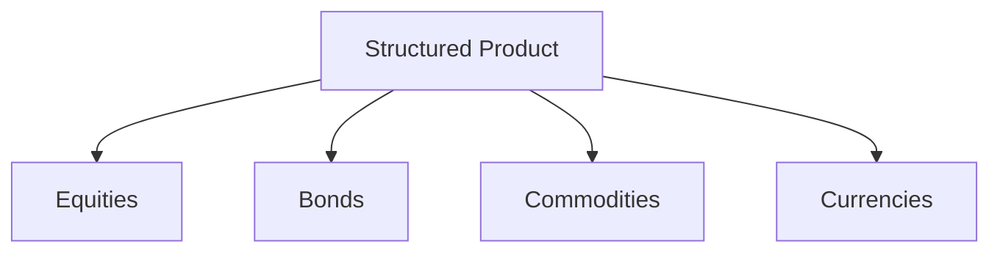

## 23.5 Advantages of Structured Products

Structured products have become an increasingly popular investment vehicle in the Canadian financial landscape, offering a unique blend of features that cater to both conservative and aggressive investors. This section delves into the advantages of structured products, highlighting their role in professional management, diversification, potential for higher yields, and the likelihood of principal return at maturity. By understanding these benefits, investors can make informed decisions that align with their financial goals.

### Professional Management and Economies of Scale

One of the primary advantages of structured products is the access they provide to professional management. These products are typically designed and managed by financial institutions with expertise in market analysis and investment strategies. This professional oversight ensures that the structured product is aligned with market conditions and investor objectives.

**Economies of Scale**: Structured products often pool resources from multiple investors, allowing them to benefit from economies of scale. This means that the costs associated with managing the investment are spread across a larger asset base, reducing the per-unit cost for each investor. This can lead to more efficient management and potentially higher returns.

**Example**: Consider a structured product offered by a major Canadian bank like RBC. By pooling funds from numerous investors, RBC can leverage its extensive research and trading capabilities to optimize the product's performance, offering investors access to sophisticated strategies that might otherwise be unavailable to individual investors.

### Diversification

Diversification is a cornerstone of sound investment strategy, and structured products offer a unique avenue for achieving it. These products can be tailored to include a variety of asset classes, such as equities, bonds, commodities, and currencies, which helps spread risk across different market segments.

**Mermaid Diagram: Diversification in Structured Products**

```mermaid
graph TD;
    A[Structured Product] --> B[Equities]
    A --> C[Bonds]
    A --> D[Commodities]
    A --> E[Currencies]
```

By incorporating multiple asset classes, structured products can mitigate the impact of poor performance in any single area, enhancing the overall stability of the investment.

**Case Study**: A Canadian pension fund might invest in a structured product that includes a mix of domestic equities, international bonds, and commodity futures. This diversified approach helps protect the fund from volatility in any one market, ensuring more consistent returns over time.

### Potential for Higher Yields

Structured products are designed to offer the potential for higher yields compared to conventional fixed-income instruments like bonds or GICs. This is achieved through the use of derivatives and other financial instruments that can enhance returns.

**Example**: A structured note linked to the performance of the S&P/TSX Composite Index might offer a higher yield than a traditional bond, as it allows investors to participate in the upside potential of the equity market while still providing some level of capital protection.

**Practical Insight**: Investors should carefully assess the risk-return profile of structured products, as the potential for higher yields often comes with increased risk. Understanding the underlying assets and market conditions is crucial for making informed investment decisions.

### Likelihood of Principal Return at Maturity

Many structured products are designed with a principal protection feature, ensuring that investors receive their initial investment back at maturity, provided certain conditions are met. This feature makes structured products appealing to risk-averse investors seeking exposure to higher-yielding assets without sacrificing capital security.

**Example**: A principal-protected note might guarantee the return of the initial investment after five years, regardless of market performance, while still offering the opportunity to earn returns based on the performance of a linked index.

**Regulatory Note**: It's important to understand the terms and conditions of principal protection, as they can vary between products. Investors should refer to the prospectus and consult with financial advisors to ensure they fully comprehend the product's structure and risks.

### Conclusion

Structured products offer a compelling combination of professional management, diversification, potential for higher yields, and principal protection, making them a versatile tool in the Canadian investment landscape. By leveraging these advantages, investors can enhance their portfolios and achieve their financial objectives.

### Best Practices and Considerations

- **Understand the Product**: Before investing, thoroughly review the structured product's terms, including its underlying assets, risk factors, and potential returns.
- **Consult Professionals**: Work with financial advisors to ensure the product aligns with your investment goals and risk tolerance.
- **Stay Informed**: Keep abreast of market conditions and regulatory changes that may impact the performance of structured products.

For further exploration, consider resources such as the Canadian Securities Administrators (CSA) website for regulatory updates and the Investment Industry Regulatory Organization of Canada (IIROC) for industry insights.

## Quiz Time!



### What is one of the primary advantages of structured products?

- [x] Access to professional management
- [ ] Guaranteed high returns
- [ ] No risk involved
- [ ] Unlimited liquidity

> **Explanation:** Structured products provide access to professional management, leveraging the expertise of financial institutions to optimize investment strategies.

### How do structured products achieve diversification?

- [x] By including a variety of asset classes
- [ ] By focusing on a single market
- [ ] By investing solely in equities
- [ ] By avoiding bonds

> **Explanation:** Structured products achieve diversification by incorporating multiple asset classes, spreading risk across different market segments.

### What is a potential benefit of economies of scale in structured products?

- [x] Reduced per-unit cost for investors
- [ ] Increased individual management fees
- [ ] Limited access to markets
- [ ] Higher risk exposure

> **Explanation:** Economies of scale reduce the per-unit cost for investors by spreading management costs across a larger asset base.

### What feature makes structured products appealing to risk-averse investors?

- [x] Principal protection at maturity
- [ ] Guaranteed high returns
- [ ] Unlimited liquidity
- [ ] No market exposure

> **Explanation:** Principal protection at maturity ensures that investors receive their initial investment back, appealing to risk-averse individuals.

### Which Canadian financial institution might offer structured products?

- [x] RBC
- [ ] Amazon
- [ ] Google
- [ ] Tesla

> **Explanation:** RBC, a major Canadian bank, is an example of a financial institution that might offer structured products.

### What should investors do before investing in structured products?

- [x] Review the product's terms and consult financial advisors
- [ ] Invest without any research
- [ ] Ignore market conditions
- [ ] Avoid consulting professionals

> **Explanation:** Investors should review the product's terms and consult financial advisors to ensure alignment with their goals and risk tolerance.

### What is a potential risk associated with structured products?

- [x] Increased risk for higher yields
- [ ] Guaranteed losses
- [ ] No potential for returns
- [ ] Unlimited liquidity

> **Explanation:** Structured products may involve increased risk for the potential of higher yields, requiring careful assessment by investors.

### How can structured products offer higher yields?

- [x] Through the use of derivatives and financial instruments
- [ ] By avoiding market exposure
- [ ] By focusing solely on bonds
- [ ] By eliminating risk

> **Explanation:** Structured products can offer higher yields through the use of derivatives and financial instruments that enhance returns.

### What is a key consideration for principal protection in structured products?

- [x] Understanding the terms and conditions
- [ ] Ignoring the prospectus
- [ ] Assuming all products are the same
- [ ] Avoiding consultation with advisors

> **Explanation:** Understanding the terms and conditions of principal protection is crucial, as they can vary between products.

### True or False: Structured products can only include equities.

- [ ] True
- [x] False

> **Explanation:** Structured products can include a variety of asset classes, such as equities, bonds, commodities, and currencies, to achieve diversification.


