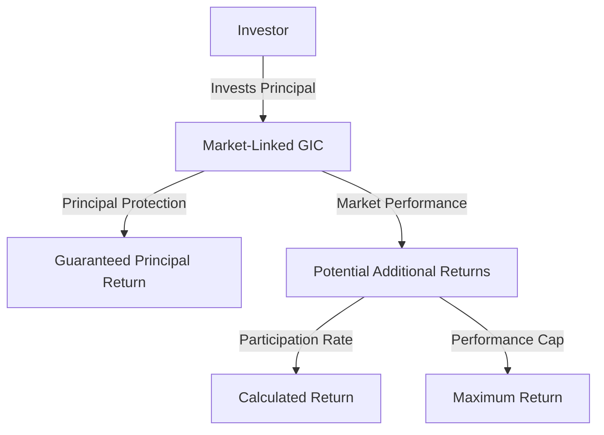

---

linkTitle: "23.5 Market-Linked Guaranteed Investment Certificates"
title: "Market-Linked Guaranteed Investment Certificates: Structure, Benefits, and Risks"
description: "Explore the structure, benefits, and risks of Market-Linked Guaranteed Investment Certificates (GICs) in Canada, including tax implications and practical examples."
categories:
- Finance
- Investment
- Canadian Securities
tags:
- Market-Linked GICs
- Principal Protection
- Participation Rate
- Performance Cap
- Canadian Investment
date: 2024-10-25
type: docs
nav_weight: 1160000
canonical: "https://securitiesexamsmastery.ca/14/11/6"
license: "© 2023 Tokenizer Inc. CC BY-NC-SA 4.0"
---

## 23.5 Market-Linked Guaranteed Investment Certificates

Market-Linked Guaranteed Investment Certificates (GICs) are innovative financial products that combine the safety of principal protection with the potential for higher returns linked to the performance of a specific market index or asset. These products are particularly appealing to conservative investors who wish to gain exposure to market growth without risking their initial investment. In this section, we will delve into the structure, benefits, risks, and tax implications of Market-Linked GICs, providing a comprehensive understanding for investors in the Canadian financial landscape.

### Structure of Market-Linked GICs

Market-Linked GICs are structured to offer a guaranteed return of the principal at maturity, while the potential for additional returns is tied to the performance of an underlying market index, such as the S&P/TSX Composite Index. The key components of these GICs include:

- **Principal Protection:** The initial investment is fully protected, ensuring that investors do not lose their principal amount, regardless of market performance.
- **Market-Linked Returns:** Returns are calculated based on the performance of a specified market index or asset. This linkage allows investors to benefit from positive market movements.
- **Participation Rate:** This is the percentage of the index’s return that is credited to the investor. For example, if the participation rate is 70% and the index gains 10%, the investor receives a 7% return.
- **Performance Cap:** A limit on the maximum return an investor can earn. Even if the index performs exceptionally well, the return is capped at a predetermined rate.

#### Diagram: Structure of a Market-Linked GIC

### Calculating Returns

The returns on Market-Linked GICs are calculated using the participation rate and performance cap. Here’s a step-by-step guide to understanding this calculation:

1. **Determine the Index Performance:** Calculate the percentage change in the underlying index over the investment period.
2. **Apply the Participation Rate:** Multiply the index performance by the participation rate to determine the investor’s share of the returns.
3. **Check Against the Performance Cap:** If the calculated return exceeds the performance cap, the return is limited to the cap.

**Example:** Suppose an investor purchases a Market-Linked GIC with a participation rate of 80% and a performance cap of 15%. If the underlying index gains 20% over the investment period, the investor’s return would be calculated as follows:

- Index Performance: 20%
- Participation Rate: 80%
- Calculated Return: 20% * 80% = 16%
- Performance Cap: 15%

Since the calculated return (16%) exceeds the performance cap, the investor receives a 15% return.

### Benefits for Conservative Investors

Market-Linked GICs offer several benefits, particularly for conservative investors:

- **Principal Safety:** The guarantee of principal return provides peace of mind, making these products suitable for risk-averse investors.
- **Market Exposure:** Investors can participate in market growth without directly investing in equities, which can be volatile.
- **Diversification:** These GICs can be a valuable addition to a diversified portfolio, balancing risk and return.

### Risks and Considerations

While Market-Linked GICs offer principal protection, they are not without risks:

- **Market Volatility:** Returns are dependent on market performance, which can be unpredictable.
- **Credit Risk:** The safety of the principal is contingent on the issuer’s ability to meet its obligations. Investors should consider the creditworthiness of the issuing institution.
- **Limited Liquidity:** These GICs typically have a fixed term, and early withdrawal may not be possible or may incur penalties.

### Tax Implications

The interest income from Market-Linked GICs is taxable as ordinary income in Canada. It is important for investors to understand the tax treatment of these products to optimize their investment strategy. The interest is typically reported on a T5 slip and must be included in the investor’s annual tax return.

### Regulatory Framework and Resources

Market-Linked GICs are subject to Canadian financial regulations, ensuring transparency and investor protection. Investors can explore additional resources for further understanding:

- **BMO Wealth Management:** [Market-Linked GICs](https://www.bmo.com/main/en/personal/investments/gic-market-linked-gics)
- **Books:** *"Fixed Income Securities"* by Bruce Tuckman and Angel Serrat

### Conclusion

Market-Linked GICs offer a compelling blend of safety and potential returns, making them an attractive option for conservative investors seeking market exposure. By understanding their structure, benefits, and risks, investors can make informed decisions that align with their financial goals.

### **Ready to Test Your Knowledge?**

**Practice 10 Essential CSC Exam Questions to Master Your Certification**



### What is a Market-Linked GIC?

- [x] A GIC that provides returns based on the performance of an underlying market index or asset.
- [ ] A GIC that guarantees a fixed interest rate.
- [ ] A GIC that is linked to foreign currency exchange rates.
- [ ] A GIC that offers no principal protection.

> **Explanation:** A Market-Linked GIC provides returns based on the performance of a market index or asset, while ensuring principal protection.

### How is the return on a Market-Linked GIC calculated?

- [x] By applying the participation rate to the index performance and checking against the performance cap.
- [ ] By multiplying the index performance by the performance cap.
- [ ] By adding the participation rate to the index performance.
- [ ] By subtracting the performance cap from the index performance.

> **Explanation:** The return is calculated by applying the participation rate to the index performance and ensuring it does not exceed the performance cap.

### What is the primary benefit of a Market-Linked GIC for conservative investors?

- [x] Principal protection with potential market-linked returns.
- [ ] High liquidity and flexibility.
- [ ] Guaranteed high returns.
- [ ] Tax-free income.

> **Explanation:** The primary benefit is the combination of principal protection with the potential for market-linked returns.

### What is a participation rate in the context of Market-Linked GICs?

- [x] The percentage of the market index’s return that is credited to the investor.
- [ ] The maximum return an investor can earn.
- [ ] The interest rate guaranteed by the GIC.
- [ ] The fee charged by the issuer.

> **Explanation:** The participation rate is the percentage of the index's return that the investor receives.

### What is a performance cap?

- [x] The maximum return that an investor can earn from the GIC, regardless of the underlying index’s performance.
- [ ] The minimum return guaranteed by the GIC.
- [ ] The interest rate paid annually.
- [ ] The fee for early withdrawal.

> **Explanation:** The performance cap limits the maximum return an investor can earn, even if the index performs exceptionally well.

### What is a potential risk of investing in Market-Linked GICs?

- [x] Market volatility affecting returns.
- [ ] Loss of principal.
- [ ] Guaranteed high returns.
- [ ] Tax-free income.

> **Explanation:** Market volatility can affect the returns, although the principal is protected.

### How is interest income from Market-Linked GICs taxed in Canada?

- [x] As ordinary income.
- [ ] As capital gains.
- [ ] As tax-free income.
- [ ] As dividend income.

> **Explanation:** Interest income from Market-Linked GICs is taxed as ordinary income in Canada.

### What should investors consider about the issuer of a Market-Linked GIC?

- [x] The creditworthiness of the issuer.
- [ ] The issuer's stock price.
- [ ] The issuer's location.
- [ ] The issuer's marketing strategy.

> **Explanation:** Investors should consider the creditworthiness of the issuer to ensure the safety of their principal.

### Can Market-Linked GICs be withdrawn early without penalties?

- [x] False
- [ ] True

> **Explanation:** Market-Linked GICs typically have a fixed term, and early withdrawal may incur penalties or not be possible.

### Are Market-Linked GICs suitable for risk-averse investors?

- [x] True
- [ ] False

> **Explanation:** Market-Linked GICs are suitable for risk-averse investors due to their principal protection feature.


