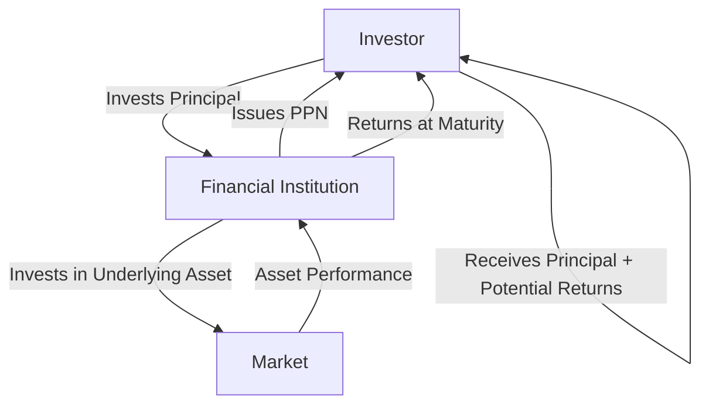

## 23.8.1 Features, Risks, Benefits, and Tax Implications of PPNs

Principal-Protected Notes (PPNs) are structured financial products that offer investors a unique combination of security and potential growth. They are particularly appealing to risk-averse investors who wish to participate in the financial markets without risking their initial investment. This section delves into the features, risks, benefits, and tax implications of PPNs, providing a comprehensive understanding for Canadian investors.

### Key Features of Principal-Protected Notes

PPNs are designed to protect the principal amount invested while offering the potential for returns linked to the performance of an underlying asset or index. Here are the key features that make PPNs attractive:

1. **Principal Protection**: The most significant feature of PPNs is the guarantee of the principal amount at maturity. This means that regardless of the performance of the underlying asset, the investor will receive at least the original investment back.

2. **Linked to Underlying Assets**: PPNs are often tied to the performance of various underlying assets, such as stock indices, commodities, or currencies. This linkage provides the potential for higher returns compared to traditional fixed-income investments.

3. **Fixed Maturity Date**: PPNs have a predetermined maturity date, typically ranging from 3 to 10 years. The principal protection is only applicable if the note is held to maturity.

4. **Issuer's Creditworthiness**: The principal protection is contingent on the creditworthiness of the issuer, usually a financial institution. This makes the issuer's credit rating an important consideration for investors.

5. **No Direct Ownership**: Investors in PPNs do not own the underlying assets directly. Instead, they hold a note issued by a financial institution that promises to pay a return based on the asset's performance.

### Benefits of Investing in PPNs

PPNs offer several benefits that make them an attractive option for certain investors:

1. **Capital Preservation**: The principal protection feature ensures that investors do not lose their initial investment, making PPNs suitable for conservative investors.

2. **Potential for Enhanced Returns**: By linking returns to the performance of an underlying asset, PPNs offer the possibility of earning more than traditional fixed-income securities.

3. **Diversification**: PPNs can provide exposure to a variety of asset classes, contributing to a diversified investment portfolio.

4. **Customizable Structures**: Issuers can tailor PPNs to meet specific investor needs, such as linking returns to multiple indices or incorporating features like caps and floors on returns.

### Risks Associated with PPNs

While PPNs offer principal protection, they are not without risks. Investors should be aware of the following:

1. **Credit Risk**: The principal protection is only as strong as the issuer's ability to pay. If the issuer defaults, investors may lose their principal.

2. **Liquidity Risk**: PPNs are not as liquid as other securities. Selling a PPN before maturity may result in a loss, as the secondary market for these products is often limited.

3. **Market Risk**: Although the principal is protected, the returns are not guaranteed. If the underlying asset performs poorly, the investor may receive little or no return beyond the principal.

4. **Complexity**: The structure of PPNs can be complex, making it difficult for investors to fully understand the potential outcomes and risks.

### Tax Implications of PPNs

The tax treatment of PPNs in Canada is an important consideration for investors. Returns from PPNs are typically taxed as interest income, which is subject to the investor's marginal tax rate. Here are some key points regarding the tax implications:

1. **Interest Income**: Any return received from a PPN is generally considered interest income for tax purposes. This means it is fully taxable at the investor's marginal tax rate.

2. **Tax Deferral**: Since PPNs are often held to maturity, investors may benefit from deferring taxes on the returns until the note matures.

3. **Tax Reporting**: Investors must report the interest income from PPNs on their tax returns in the year it is received or accrued.

### Practical Example: Canadian Pension Fund Strategy

Consider a Canadian pension fund that invests in PPNs to balance its portfolio. The fund seeks to protect its capital while gaining exposure to the equity market. By investing in a PPN linked to the S&P/TSX Composite Index, the fund can participate in potential market gains without risking its principal. This strategy aligns with the fund's objective of capital preservation and growth.

### Diagram: PPN Structure and Cash Flow

Below is a simplified diagram illustrating the structure and cash flow of a PPN:

### Best Practices and Common Pitfalls

**Best Practices:**
- **Assess Issuer's Creditworthiness**: Always evaluate the financial strength and credit rating of the issuer before investing in a PPN.
- **Understand the Terms**: Carefully review the terms and conditions of the PPN, including the underlying asset and potential return scenarios.
- **Consider Tax Implications**: Be aware of how PPN returns will be taxed and plan accordingly.

**Common Pitfalls:**
- **Ignoring Liquidity Needs**: Avoid investing in PPNs if you may need access to your capital before maturity.
- **Overlooking Complexity**: Ensure you fully understand the product's structure and risks before investing.

### Conclusion

Principal-Protected Notes offer a compelling investment option for those seeking capital preservation with the potential for market-linked returns. However, investors must carefully consider the associated risks, particularly credit and liquidity risks, and understand the tax implications of their returns. By doing so, they can effectively incorporate PPNs into their investment strategy, aligning with their financial goals and risk tolerance.

## Quiz Time!



### Which feature of PPNs ensures that investors receive their initial investment back at maturity?

- [x] Principal Protection
- [ ] Interest Rate Guarantee
- [ ] Dividend Yield
- [ ] Capital Appreciation

> **Explanation:** Principal protection is the key feature of PPNs that guarantees the return of the initial investment at maturity.

### What is a significant risk associated with PPNs?

- [x] Credit Risk
- [ ] Inflation Risk
- [ ] Currency Risk
- [ ] Political Risk

> **Explanation:** Credit risk is significant because the principal protection depends on the issuer's creditworthiness.

### How are returns from PPNs typically taxed in Canada?

- [x] As Interest Income
- [ ] As Capital Gains
- [ ] As Dividend Income
- [ ] As Foreign Income

> **Explanation:** Returns from PPNs are generally taxed as interest income, which is fully taxable at the investor's marginal tax rate.

### What is a common pitfall when investing in PPNs?

- [x] Ignoring Liquidity Needs
- [ ] Overestimating Returns
- [ ] Underestimating Inflation
- [ ] Misjudging Market Trends

> **Explanation:** Ignoring liquidity needs is a common pitfall because PPNs are not easily sold before maturity.

### Which of the following is NOT a benefit of PPNs?

- [ ] Capital Preservation
- [ ] Potential for Enhanced Returns
- [ ] Diversification
- [x] Guaranteed High Returns

> **Explanation:** PPNs do not guarantee high returns; they offer potential returns based on asset performance.

### What should investors assess before investing in a PPN?

- [x] Issuer's Creditworthiness
- [ ] Market Volatility
- [ ] Historical Returns
- [ ] Currency Exchange Rates

> **Explanation:** Assessing the issuer's creditworthiness is crucial as it affects the reliability of principal protection.

### What is the typical maturity range for PPNs?

- [x] 3 to 10 years
- [ ] 1 to 2 years
- [ ] 11 to 15 years
- [ ] Over 20 years

> **Explanation:** PPNs typically have a maturity range of 3 to 10 years.

### How can PPNs contribute to a diversified investment portfolio?

- [x] By providing exposure to various asset classes
- [ ] By offering fixed returns
- [ ] By minimizing all risks
- [ ] By guaranteeing capital gains

> **Explanation:** PPNs provide exposure to various asset classes, contributing to portfolio diversification.

### What is the primary reason investors choose PPNs?

- [x] Capital Preservation
- [ ] High Liquidity
- [ ] Tax Benefits
- [ ] Guaranteed Returns

> **Explanation:** Capital preservation is the primary reason investors choose PPNs, as they protect the initial investment.

### True or False: PPNs offer direct ownership of the underlying assets.

- [ ] True
- [x] False

> **Explanation:** False. Investors in PPNs do not have direct ownership of the underlying assets; they hold a note issued by a financial institution.


